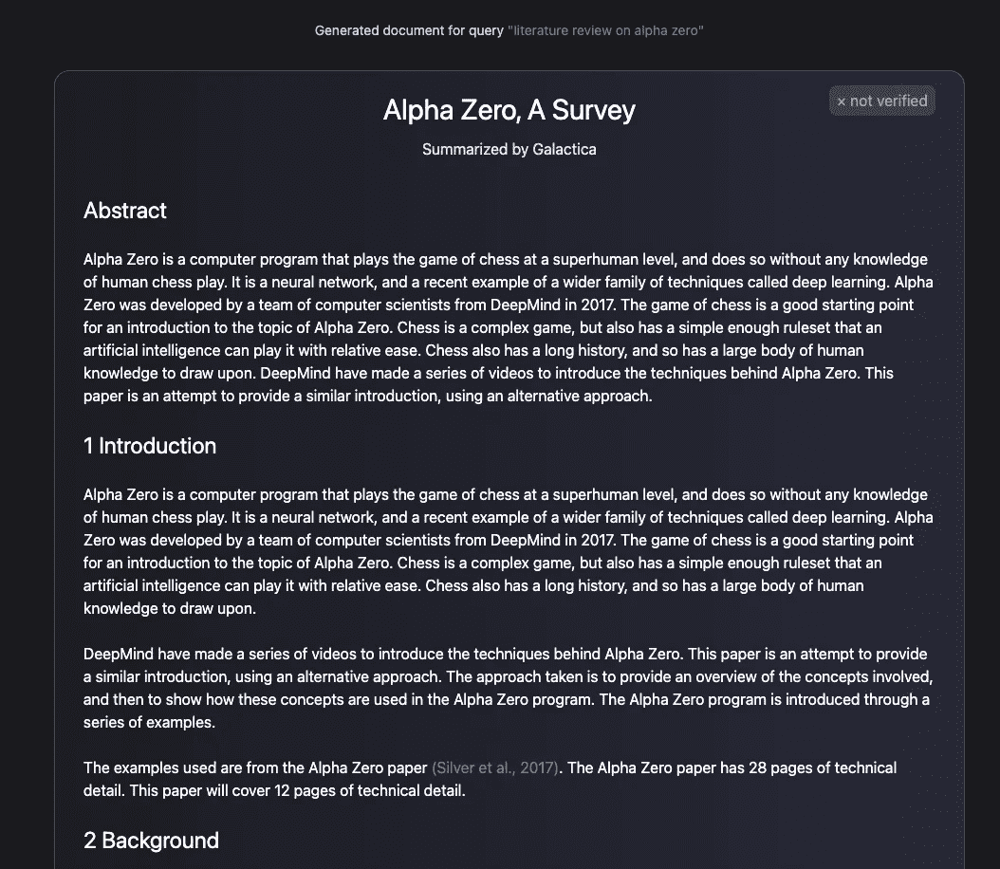
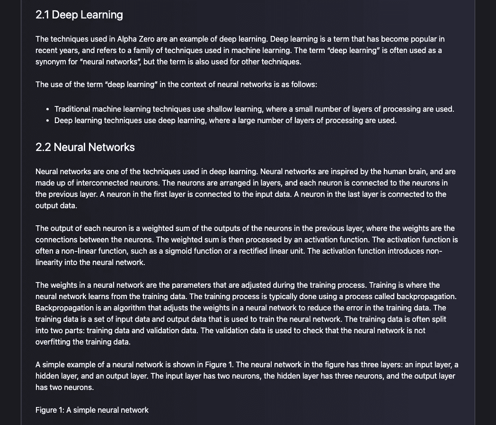
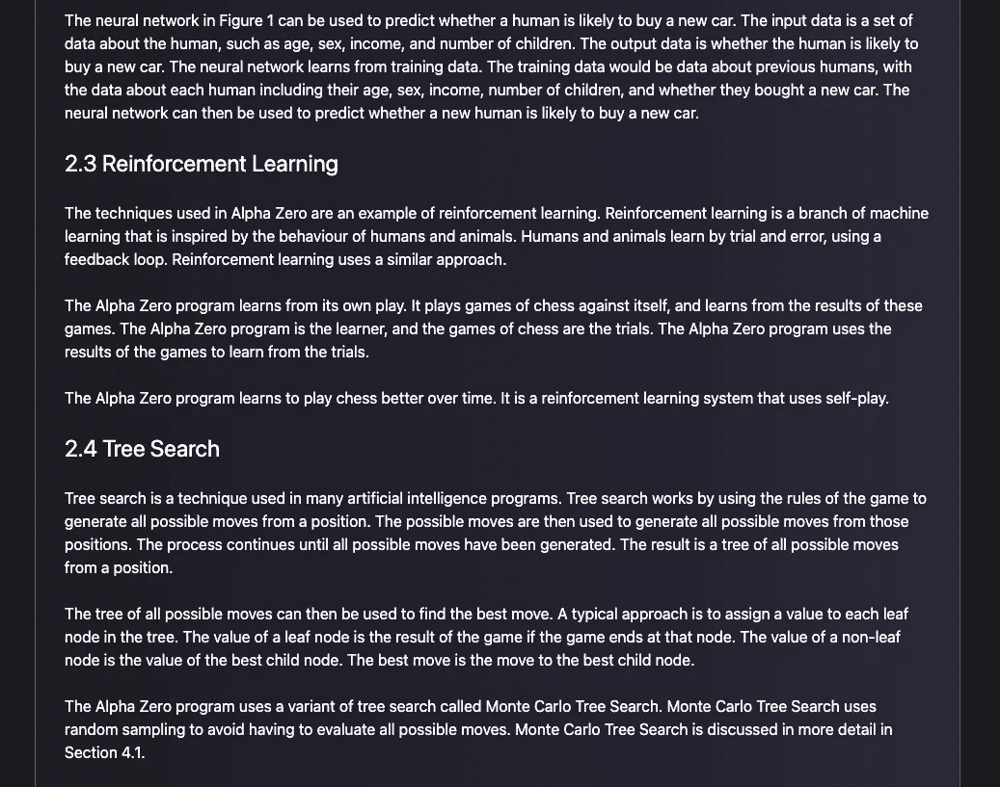
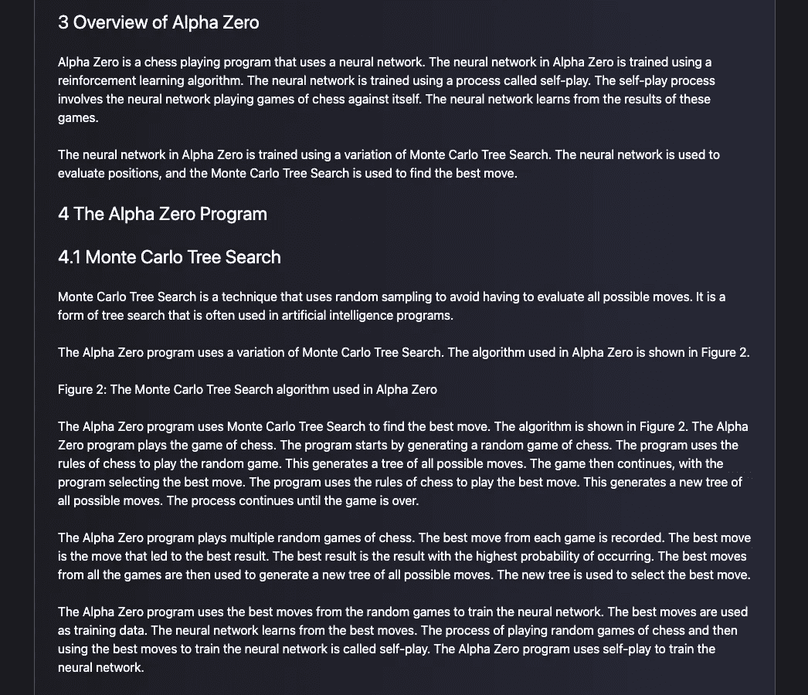
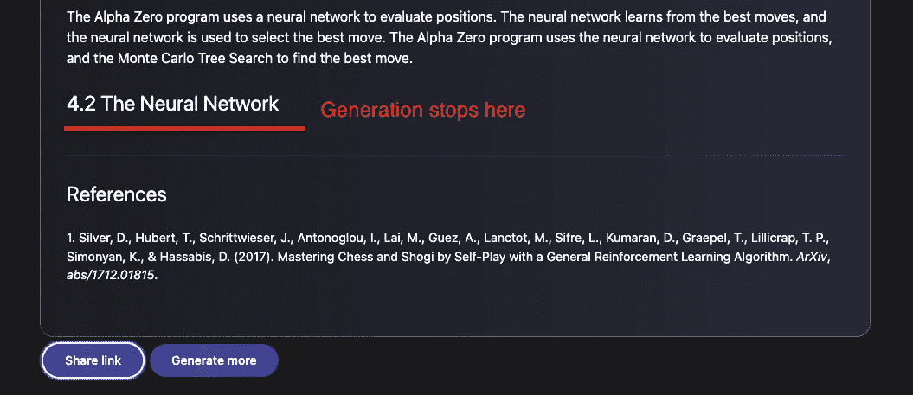

# 卡拉狄加

> 原文：<https://medium.com/mlearning-ai/galactica-d0c36ce18337?source=collection_archive---------4----------------------->

[Galactica](https://galactica.org/) 是 Meta AI 和 paperwithcode 发布的大型语言模型(LLM)。它旨在解决科学中的信息过载问题。

给定一行生成文章，博客帖子，jupyter 笔记本，维基文章。简而言之，它旨在给你一个很好的主题图片。

我已经试用了托管工具，看看它是如何工作的。以下是我的初步发现:

1.  我输入了提示——阿尔法零号的文献综述。它始于一个摘要。
2.  模型预测在一次迭代中有 3400 个最大令牌。我们必须不断点击“生成更多”来继续生成文章。
3.  模型为模型生成良好的摘要，每个子部分都有相关的部分和适当的内容。
4.  模型以任何研究论文的通常风格添加论文的参考文献。
5.  模型试图添加图像，但文章中没有出现图像。
6.  这将是很好的，如果模型添加代词，而不是在每一个句子重复它们。
7.  当模型完成生成时，无法判断它是否无法进一步生成。它试图生成并最终只有一个令牌。我在下面附上截图，你可以看到模型停止生成的最后一张图片。
8.  UI 很好用。

想看我生成的，可以参考这个链接:【https://galactica.org/?max_new_tokens=3400】T2&提示=文学+评论+上+阿尔法+零

想看我生成的文章的人，可以去看看下面的截图:

 [## Mlearning.ai 提交建议

### 如何成为 Mlearning.ai 上的作家

medium.com](/mlearning-ai/mlearning-ai-submission-suggestions-b51e2b130bfb)