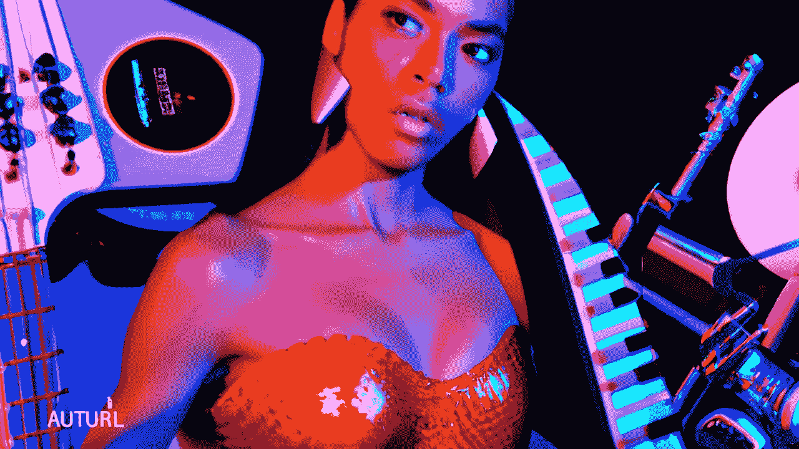

# 基于 GAN 的音频生成模型

> 原文：<https://medium.com/mlearning-ai/gan-based-models-for-audio-generation-5a3edc639b90?source=collection_archive---------2----------------------->

## [机器学习艺术](https://mlearning.substack.com)

人工智能生成的音乐循环— [代码](#bd19)

[How are Realistic Virtual Humans made?](https://mlearning.substack.com/p/how-are-realistic-virtual-humans?r=z7zu8&s=w&utm_campaign=post&utm_medium=web)

## [甘适用于音频吗？](/mlearning-ai/remove-noise-from-audio-files-ceca3c37dcdbv)

GANs 的研究在语音和[音频](/mlearning-ai/remove-noise-from-audio-files-ceca3c37dcdb)处理领域备受关注。应用包括语音转换、语音增强和文本到语音合成。最困难也是最有趣的领域之一…