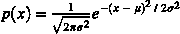
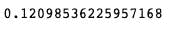
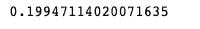

# 高斯计算

> 原文：<https://medium.com/mlearning-ai/gaussian-calculation-d583b6308c3?source=collection_archive---------3----------------------->

高斯函数是一个跨越数学和统计学的函数。它也用于计算机视觉的信号处理。

此函数是一种显示实值随机变量的连续概率分布的函数。这个函数的特征是一个代表正态分布的“钟形曲线”图。

**其中:**

μ =平均值

σ =方差，通常写为其平方值。

# 背景:

来表示自动驾驶车辆的估计位置的不确定性。

# 计算:

导入所需的库后，我使用上面的等式设置高斯函数，并考虑指数和系数。运行示例函数。

# 可视化:

在定义参数后，我绘制了一个图表来显示 x 值范围内的高斯分布。

最后，我通过设置μ和σ相等来最大化高斯。

# 结论:

这是一个简短的教程，展示如何计算高斯函数，你可以通过改变参数更进一步。这来自我的 Udacity 课程。代码可以在[我的回购](https://github.com/Nwosu-Ihueze/CV_Nanodegree/blob/main/object_tracking/kalman_filters/1.%20Gaussian%20Calculations.ipynb)中找到，你可以在 [LinkedIn](https://www.linkedin.com/in/rosemary-nwosu-ihueze/) 上与我联系。感谢您的阅读。