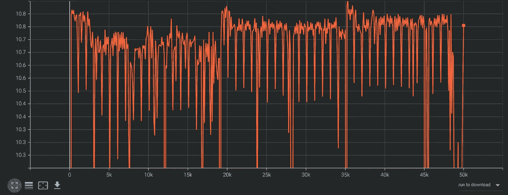
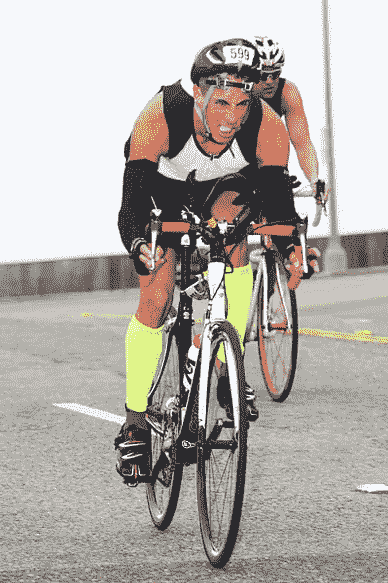
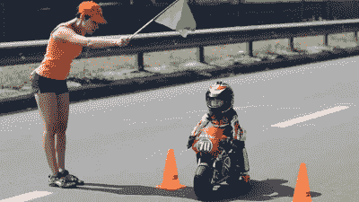
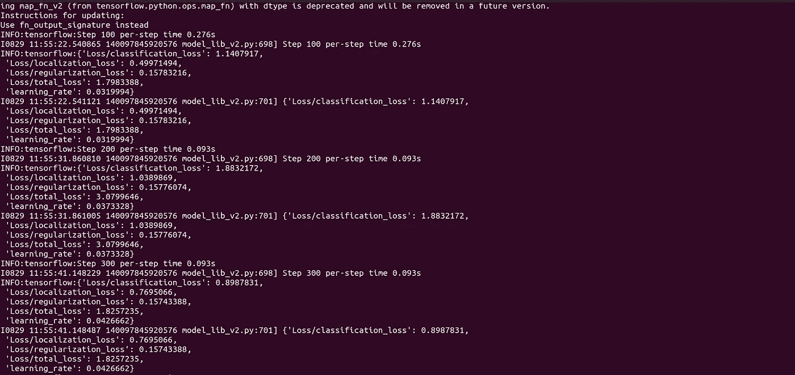
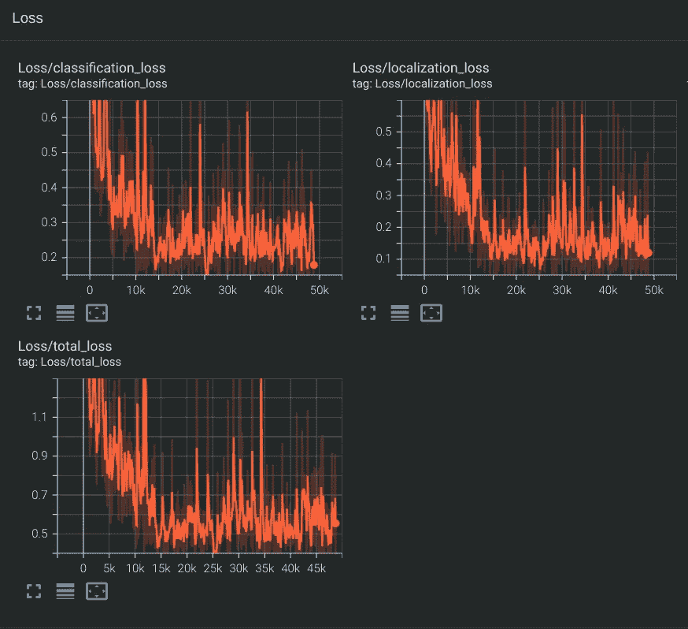

# Tensorflow 2 中自定义对象检测的一般方法

> 原文：<https://medium.com/mlearning-ai/general-approach-for-custom-object-detection-with-tensorflow-2-61593a67a02d?source=collection_archive---------2----------------------->



在这篇博客中，我将带您了解如何使用 Tensorflow 2 训练您自己的自定义对象检测器。这不是做某种类型检测的教程，而是一种我们可以用来检测任何东西的通用方法。

要使用 Tensorflow 对象检测 API 训练自定义对象检测模型，您需要完成以下步骤:

*   下载 Tensorflow 对象检测 API
*   检索数据
*   为 OD API 准备数据
*   超参数调谐
*   火车模型
*   保存模型
*   试验模型

# 装置

您可以使用 Python 包安装程序(pip)或 [Docker](https://www.docker.com/) 安装 TensorFlow 对象检测 API，后者是一个用于部署和管理容器化应用程序的开源平台。要在本地运行 Tensorflow 对象检测 API，建议使用 Docker。如果您不熟悉 Docker，使用 pip 安装可能会更容易。

首先克隆 Tensorflow 模型存储库的主分支:

```
git clone [https://github.com/tensorflow/models.git](https://github.com/tensorflow/models.git)
```

# 码头设备

```
# From the root of the git repository (inside the models directory)
docker build -f research/object_detection/dockerfiles/tf2/Dockerfile -t od .
docker run -it od
```

# Python 包安装

```
cd models/research
# Compile protos.
protoc object_detection/protos/*.proto --python_out=.
# Install TensorFlow Object Detection API.
cp object_detection/packages/tf2/setup.py .
python -m pip install .import os
import sys
args = sys.argv
directory = args[1]
protoc_path = args[2]
for file in os.listdir(directory):
    if file.endswith(".proto"):
        os.system(protoc_path+" "+directory+"/"+file+" --python_out=.")python use_protobuf.py <path to directory> <path to protoc file>
```

要测试安装运行:

```
python object_detection/builders/model_builder_tf2_test.py
```

如果一切安装正确，您应该看到如下内容:

```
...
[       OK ] ModelBuilderTF2Test.test_create_ssd_models_from_config
[ RUN      ] ModelBuilderTF2Test.test_invalid_faster_rcnn_batchnorm_update
[       OK ] ModelBuilderTF2Test.test_invalid_faster_rcnn_batchnorm_update
[ RUN      ] ModelBuilderTF2Test.test_invalid_first_stage_nms_iou_threshold
[       OK ] ModelBuilderTF2Test.test_invalid_first_stage_nms_iou_threshold
[ RUN      ] ModelBuilderTF2Test.test_invalid_model_config_proto
[       OK ] ModelBuilderTF2Test.test_invalid_model_config_proto
[ RUN      ] ModelBuilderTF2Test.test_invalid_second_stage_batch_size
[       OK ] ModelBuilderTF2Test.test_invalid_second_stage_batch_size
[ RUN      ] ModelBuilderTF2Test.test_session
[  SKIPPED ] ModelBuilderTF2Test.test_session
[ RUN      ] ModelBuilderTF2Test.test_unknown_faster_rcnn_feature_extractor
[       OK ] ModelBuilderTF2Test.test_unknown_faster_rcnn_feature_extractor
[ RUN      ] ModelBuilderTF2Test.test_unknown_meta_architecture
[       OK ] ModelBuilderTF2Test.test_unknown_meta_architecture
[ RUN      ] ModelBuilderTF2Test.test_unknown_ssd_feature_extractor
[       OK ] ModelBuilderTF2Test.test_unknown_ssd_feature_extractor
----------------------------------------------------------------------
Ran 20 tests in 91.767sOK (skipped=1)
```

# 获取数据

在开始构建对象检测器之前，您需要一些数据。如果您已经有一个带标签的数据集，您可以跳过这一节，直接为 Tensorflow OD API 准备数据。

# 公共数据集

如果您对构建和使用对象检测模型的过程更感兴趣，那么利用已经标记的公共数据集是一个好主意。

*   [卡格尔](https://gilberttanner.com/)
*   开源代码库

# 收集数据

如果你想创建自己的数据集，你首先需要得到一些图片。为了训练一个健壮的模型，图片应该尽可能多样化。所以它们应该有不同的背景，不同的视角，不同的光照条件，以及不相关的随机物体。

你可以自己拍照，也可以从网上下载图片。对于我的头盔探测器，我使用 kaggle 数据集



在你有了所有的图像之后，将大约 90%移动到 object_detection/images/train 目录，另外 10%移动到 object_detection/images/test 目录。确保两个目录中的图像都有很多种类。

# 标签数据

如果您使用自己的数据集，您需要标记图像。有许多免费的开源标签工具可以帮助你。

首先，我推荐使用 [LabelImg](https://github.com/tzutalin/labelImg) ，因为它可以很容易地下载和使用，但还有许多其他伟大的工具，包括 [VGG 图像注释工具](http://www.robots.ox.ac.uk/~vgg/software/via/)和 [VoTT(视觉对象标记工具)](https://github.com/microsoft/VoTT)。

# 为对象检测 API 准备数据

数据被标记后，是时候将其转换为 Tensorflow 可以使用的格式了。该 API 处理 [TFRecod 格式](https://www.tensorflow.org/tutorials/load_data/tfrecord)的文件，这是一种存储二进制记录序列的简单格式。

对于不同的标签格式，将数据转换为 TFRecord 格式的过程会有所不同。在本文中，我将向您展示如何使用 Pascal VOC 格式，这是 LabelImg 生产的格式。您可以在[object _ detection/dataset _ tools 目录](https://github.com/tensorflow/models/tree/master/research/object_detection/dataset_tools)中找到用于转换其他数据格式的文件。

对于 Pascal VOC 格式，首先使用我的 Github 中的 [xml_to_csv.py](https://github.com/TannerGilbert/Tensorflow-Object-Detection-API-Train-Model/blob/master/xml_to_csv.py) 文件将所有 xml 文件转换成一个 csv 文件。

```
python xml_to_csv.py
```

接下来，下载并打开 [generate_tfrecord.py](https://github.com/TannerGilbert/Tensorflow-Object-Detection-API-Train-Model/blob/master/generate_tfrecord.py) 文件，用自己的标签映射替换 class_text_to_int 方法中的 labelmap。

对于我的数据集，class_text_to_int 方法如下所示:

```
def class_text_to_int(row_label):
    if row_label == 'With Helmet':
        return 1
    elif row_label == 'Without Helmet':
        return 2
    else:
        return None
```

现在，可以通过键入以下命令来生成 TFRecords:

```
python generate_tfrecord.py --csv_input=images/train_labels.csv --image_dir=images/train --output_path=train.record
python generate_tfrecord.py --csv_input=images/test_labels.csv --image_dir=images/test --output_path=test.record
```

执行上述命令后，object_detection 文件夹中应该有一个 train.record 和 test.record 文件。

# 配置培训

在训练之前，您需要做的最后一件事是创建一个标签映射和一个训练配置文件。

# Labelmap

标签映射将 id 映射到名称。我的探测器的标签图可以在下面看到。

```
item {
    id: 1
    name: 'With Helmet'
}
item {
    id: 2
    name: 'Without Helmet'
}
```

从 id 到 name 的映射应该与 generate_tfrecord.py 文件中的映射相同。

# 培训配置

接下来，您需要根据您选择的模型创建一个培训配置文件。

在本文中，我将使用 mobilenetv2 _ fnite——在神经架构搜索的帮助下发现的 SOTA 模型的最新家族。你可以在 [TensorFlow 2 物体检测模型动物园](https://github.com/tensorflow/models/blob/master/research/object_detection/g3doc/tf2_detection_zoo.md)中找到 Tensorflow 2 所有可用模型的列表。

该型号的[底座](https://github.com/tensorflow/models/blob/master/research/object_detection/configs/tf2/ssd_efficientdet_d0_512x512_coco17_tpu-8.config)可以在型号 github repo 的 [configs/tf2 文件夹](https://github.com/tensorflow/models/tree/master/research/object_detection/configs/tf2)中找到。需要将其更改为自定义数据和预训练重量。一些训练参数也需要改变。

这些变化如下所示:

*   将类的数量更改为您想要检测的对象的数量(在我的例子中是 4)
*   将 fine_tune_checkpoint 更改为 model.ckpt 文件的路径。

```
fine_tune_checkpoint: "<path>/[SSD MobileNet V2 FPNLite 320x320](http://download.tensorflow.org/models/object_detection/tf2/20200711/ssd_mobilenet_v2_fpnlite_320x320_coco17_tpu-8.tar.gz)/checkpoint/ckpt-0"
```

*   将微调检查点类型更改为检测
*   将 train_input_reader 的输入路径更改为 train.record 文件的路径:

```
input_path: "<path>/train.record"
```

*   将 eval_input_reader 的输入路径更改为 test.record 文件的路径:

```
input_path: "<path>/test.record"
```

*   将标签地图路径更改为标签地图的路径:

```
label_map_path: "<path>/label_map.pbtxt"
```

*   将 batch_size 更改为适合您的硬件的数字，如 4、8 或 16。

# 火车模型

若要定型模型，请在命令行中执行以下命令:

```
python model_main_tf2.py \
    --pipeline_config_path=training/ssd_efficientdet_d0_512x512_coco17_tpu-8.config \
    --model_dir=training \
    --alsologtostderr
```

如果一切设置正确，培训应该很快开始，您应该会看到如下内容:



每隔几分钟，Tensorboard 就会记录当前状态。打开 Tensorboard，方法是打开第二个命令行，导航到 object_detection 文件夹，然后键入:

```
tensorboard --logdir=training/train
```

这将在 localhost:6006 打开一个网页。



训练脚本每隔几分钟保存一次检查点。训练模型，直到它达到令人满意的损失，然后您可以通过按 Ctrl+C 来终止训练过程。

# 导出推理图

为了更容易使用和部署您的模型，我建议将它转换成一个冻结的图形文件。这可以使用 exporter_main_v2.py 脚本来完成。

```
python exporter_main_v2.py \
    --trained_checkpoint_dir=training \
    --pipeline_config_path=training/ssd [MobileNet V2 FPNLite](http://download.tensorflow.org/models/object_detection/tf2/20200711/ssd_mobilenet_v2_fpnlite_320x320_coco17_tpu-8.tar.gz)_tpu-8.config \
    --output_directory inference_graph
```

# 试验模型

现在您已经训练了您的模型，并将其导出到一个推理图中，您可以使用它进行推理。在培训结束时，您可以借助 open cv 找到一个推理示例

图:预测


# 资源

*   [Tensorflow 对象检测 API 库](https://github.com/tensorflow/models/tree/master/research/object_detection)
*   [Tensorflow 对象检测 API 文档](https://github.com/tensorflow/models/tree/master/research/object_detection/g3doc)
*   [模型动物园](https://github.com/tensorflow/models/blob/master/research/object_detection/g3doc/tf2_detection_zoo.md)