# 动物科学实验设计概论

> 原文：<https://medium.com/mlearning-ai/general-introduction-to-design-of-experiments-in-animal-science-using-sas-for-codes-fe1c5272b37a?source=collection_archive---------1----------------------->

## 将 SAS 用于代码

在这篇介绍性的文章中，我们将触及设计一项研究的几个关键方面，但不打算面面俱到。这是不可能的。然而，在许多设计和许多领域中，实验必须遵守某些标准，以达到“信任”和“接受”所获得结果的必要稳健性。事实上，一个实验的设计是如此重要，一旦进行，统计分析很难挽救一个糟糕的实验。也不应该有任何研究人员想这样做，因为内在的缺陷是不可能统计平衡的。因此，正如任何房子都需要坚实的基础一样，任何数据集和后续分析都需要建立在坚实的实验设计之上。

从一开始我就想说明，没有一个单独的实验(或研究)足以讲述一个令人信服的故事。世界是一个随机的地方，这实际上是说这个世界上很多过程是看不见的，不太了解的一种替代。我们试图通过说机会发挥了作用来“解释”这些警告中的一些，但机会永远不会发挥作用。一切事物和每个人的反应都基于一个动作，因果关系无处不在(但极难在纸面上证明)。因此，关于随机性的真正讨论更多的是在哲学或量子力学领域，而不是在统计学领域。但是，现在，我们只能说，实验的目的是尽可能地减少偶然性或随机性，以减少不确定性的作用。关于不确定性的哲学讨论，我推荐威廉·布里格斯的《T2》一书。

> 正如任何房子都需要坚实的基础一样，任何数据集和后续分析都需要建立在坚实的实验设计之上。

证据不是固体，而是流动的。它是基于我们现在的知识，仅此而已。因此，在设计一项研究时，我们必须始终考虑全局:

1.  什么是已知的？
2.  我的学习增加了什么？
3.  我的研究会证实以前的故事和/或增加新的东西吗？

既然证据不是非黑即白，研究也不是非黑即白。它永远不会完成。它不是实心的。研究是一个永无止境的流动故事，在这个故事中，进步是一步步来的。而且，它不适合心脏虚弱的人。

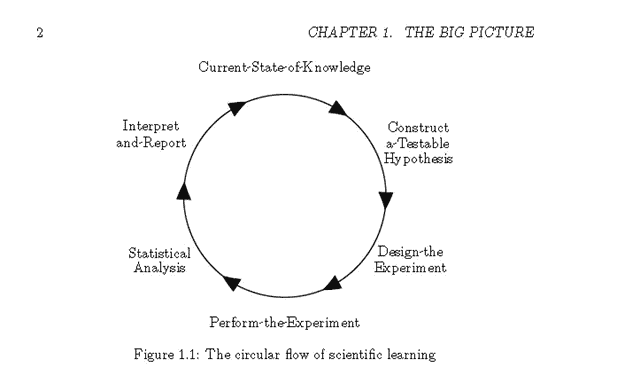

Science is circular. It never ends.

> 既然证据不是非黑即白，研究也不是非黑即白。它永远不会完成。它不是实心的。研究是一个永无止境的流动故事，在这个故事中，进步是一步步来的。它不适合胆小的人。

虽然我不打算在这篇文章的开头就触及概率值(p 值)的作用，但我确实觉得我必须这么做，因为它的滥用是当代研究中最大的问题之一。虽然不是 p 值本身，而是它的黑白应用。如果 p 值等于或小于 5%,人们将接受受限于零假设的替代假设，我们甚至不知道该假设是否正确。更重要的是，通过接受 5%的 p 值作为临界值，我们接受了 1/20 的假阳性率。这只是针对单个实验，并乘以一个人所做的测试/实验的数量。因此，如果你进行一项设计，不要只是寻找那个珍贵的 P，要确保你为流体堆栈添加了坚实的证据。这就是贝叶斯的用武之地，但我不会在这里触及它(大量的其他博客将紧随其后)。

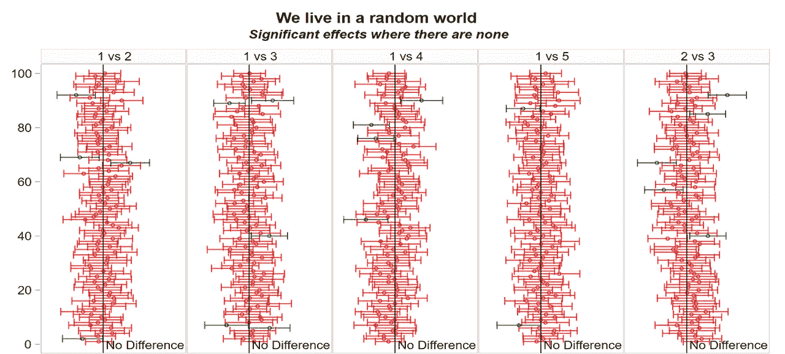

In a simulation of which we know there is no difference between treatments, the alpha value of 5% allows a 1-in-20 false positive. If you are the one, that accidentally finds a ‘significant’ effect it is not so easy to see if that result is actually ‘true’ (to the extent that ‘truth’ exists).

> 如果 p 值等于或小于 5%,人们将接受受限于零假设的替代假设，我们甚至不知道该假设是否正确。

实验设计有许多陷阱，虽然有些是针对某一特定设计的，但许多实际上适用于所有类型的设计。两个最常见的陷阱是低于预期的治疗潜力和/或存在比想象的更大的差异来源。它们中的任何一个都将导致更少的信号和更多的噪声，这将自动导致非最佳设计。请放心，您没有预料到的问题，也就是没有保护的问题，将会在您的设计中困扰您。你不会是第一个意识到你的学习在几天后就失去了潜力的人。

在动物科学中，除了上述问题之外，还有由于农场和/或动物的限制而导致的[有限样本量的问题](/@marc.jacobs012/how-many-samples-do-you-need-simulation-in-r-a60891a6e549)。与人体试验相比，动物试验只能有有限的样本量，直到物理限制将你纳入暂停。因此，如果信号存在，进行一次试验并不罕见，因为您已经知道您的设计无法获得必要的样本大小来区分信号和噪声。

> 两个最常见的陷阱是低于预期的治疗潜力和/或存在比想象的更大的差异来源。

如果一项研究太小而不能进行一次，你需要一次又一次地进行！但是每次我们这样做的时候，我们都会引入新的变量。如果我们幸运的话，我们知道这些差异是什么，但更有可能的是我们不知道。这就是一个[荟萃分析](/@marc.jacobs012/introduction-to-meta-analysis-in-r-468e9b33925c)的用武之地。

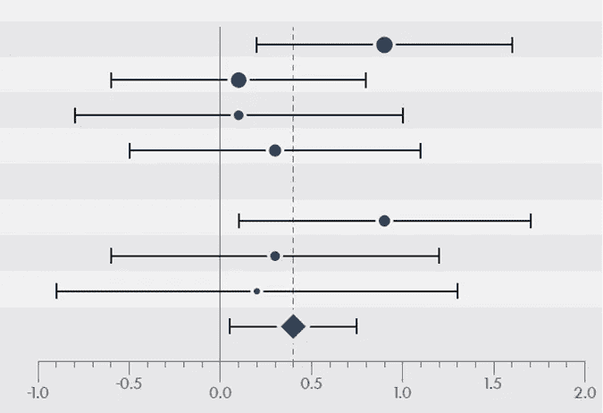

Example plot of a meta-analysis showing why measuring within variance is actually more important than measuring the treatment effect.

并非所有的研究都是相同的。进行研究的原因决定了它的设计、治疗和结果的选择、样本大小、重复次数，并最终决定了它的有效性。 [**通常，可以设计探索性或验证性研究**](https://www.researchgate.net/publication/267058525_Exploratory_vs_Confirmatory_Research) **。最好是将两者结合起来，构建一个投资组合，帮助证据从流动性极高到流动性较低再到更加坚实。因此，在我看来，所有的研发项目都应该以这个多阶段的过程为目标——内部研发研究和外部全球验证研究。这并不意味着两项研究就足够了。请记住，科学是一个循环，每次新的证据出现时，都必须根据这些知识采取行动。**

我发现大多数研究设计的最大危险是研究者无法控制他/她的好奇心。对研究人员来说，好奇是一种标志性的交易，但它往往伴随着不耐烦。运行一个研究组合将花费更长的时间，并且在开始时很可能不太令人满意，因为你需要坚持你最初的计划。例如，在计划中途增加治疗时，必须非常小心。我甚至可以开始数有多少研究被搞砸了，因为治疗是在最后一刻增加的，这降低了噪音中的信号，从而扼杀了研究增加证据的潜力。

不言而喻，你不会因为证实的原因而使用探索性设计，你也不会因为探索性的问题而使用证实性设计。


Keep calm and think long-term. Your research needs it.

下面你可以看到一个筛选研究的例子，我们的目的是测试比正常量更大的治疗量。在这项探索性研究中，目的不是找到“显著”差异，而是寻找答案。为了平衡固有的差异，我模拟了基于不同数据集的数据，这将允许我粗略地了解我需要多少样本来找到一个保持真实总体均值的均值。换句话说，为了找到稳健的平均值，我可以在这项研究中增加多少个重复(以及多少个处理)？

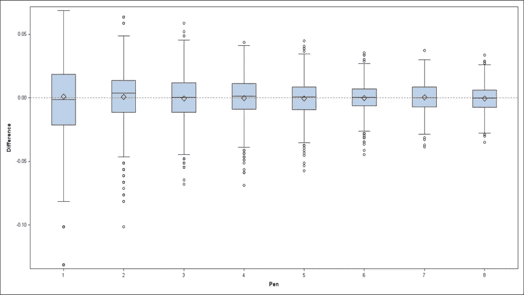

The mean and variance were deemed acceptable at 6 replications.

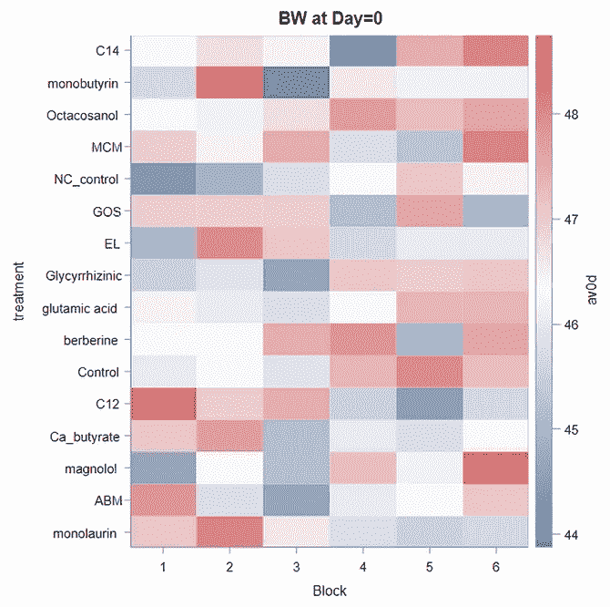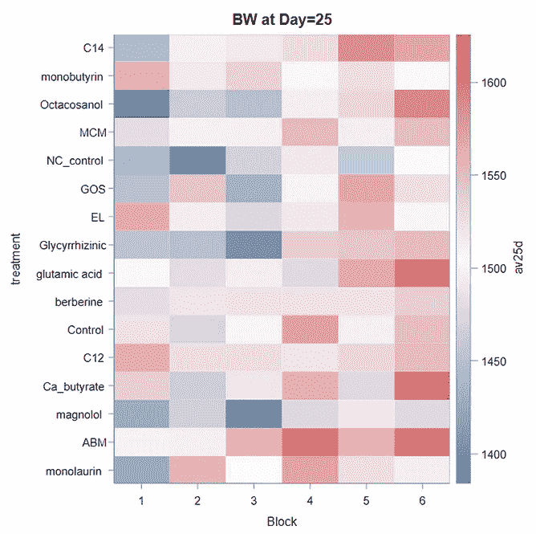

Screening study looking at several treatments across days. Clear to see how treatment, time, and the block had an effect on the mean.

在进行任何研究时，需要理解的最重要的一点是，它与 p 值无关。“不显著”的比较仍然是比较，并且该比较具有价值，因为它展示了信噪比。因此，人们必须使用“不重要”的发现来洞察发生了什么。我们是否高估了治疗效果？我们是否低估了差异的数量和/或水平？有什么特别的事情发生吗？我们是否错过了生物链中的重要一环？

> 研究不是关于 p 值的！

在内部有效性方面，立体视图可能的最佳实验被称为 [N-of-1 研究](https://www.ncbi.nlm.nih.gov/pmc/articles/PMC3118090/pdf/nihms297482.pdf):在单个动物中使用一种治疗方法，并打开/关闭。因为动物(或主体)是它自己控制的，没有其他因素起作用。因果关系不会变得更纯粹。此外，可以看出剂量-反应关系。然而，除非这只动物是世界上所有其他动物的精确复制品，否则这种内在的奇迹几乎没有外在的有效性。因此，创造/选择一个设计来回答你的研究问题，并考虑所有的变异来源，即使不是不可能，也是不容易的。

一个设计良好的实验是内部和外部有效性的折衷。目标是观察仅由治疗效果产生的可再现效果。我们同时测量效果和可变性，以估计如果使用相似但不相同的样本(重复)重复测量，我们预期的治疗效果会有多大差异。只有通过故意引入可变性(模仿真实世界)，才能对治疗效果做出概括性的陈述。

请记住这最后一句话。**你需要方差**。你进行的每一项研究，每一项分析都需要方差。它是飞机涡轮机的风。我们已经讨论过，世界是由众多看不见的过程运行的，每个过程都会带来变化。这是无法解释的差异，直到你可以解释它。因此，对于任何实验设计来说，如果你真的可以故意增加方差，那么无法解释的方差就更少了。

> 只有通过故意制造可变性，才能对治疗效果做出概括性的陈述。

治疗方法的选择可能非常困难。不仅从一开始，而且如果结果不是你所期望的。这些结果会在哪里出现？如果不是，发生了什么？如果是，它们是确凿的吗？如果动物的数量保持不变，而你增加了治疗的次数，你几乎总是要付出代价的。这是因为在动物科学中，样本量是有限的。非常有限。减少样本量会增加标准误差，从而增加治疗效果的不确定性。噪音比信号多。这反过来会降低发现一个效应的能力，如果它“真实”存在的话，这将导致频率主义者所说的第二类错误[→假阴性。](https://en.wikipedia.org/wiki/Type_I_and_type_II_errors)

即使当您增加样本量以容纳额外的治疗，您也必须为纳入更多的治疗付出代价。治疗之间的每次比较都依赖于 n*(n-1)/2 因子的治疗次数。此外，考虑到因相关多重比较而膨胀的 p 值，需要进行调整，这可能导致无法找到真正的效果。

你是正确的，另一个第二类错误。

下面你可以看到三个图表，模拟了来自随机完全区组设计的观察结果。在第一个例子中，我们有八个处理，每个处理十支笔，总共 80 支笔。下一张图显示了当你增加治疗次数但不增加笔数时方差的变化，这在上一张图中更加明显。可以清楚地看到，增加更多的处理，从而有效地减少每次处理的笔数，将会降低信噪比。

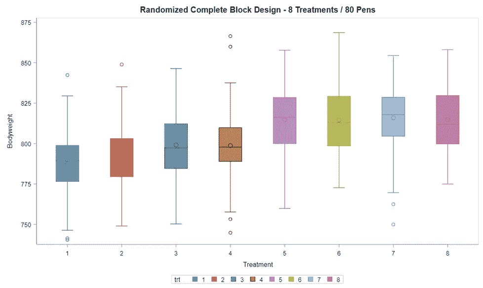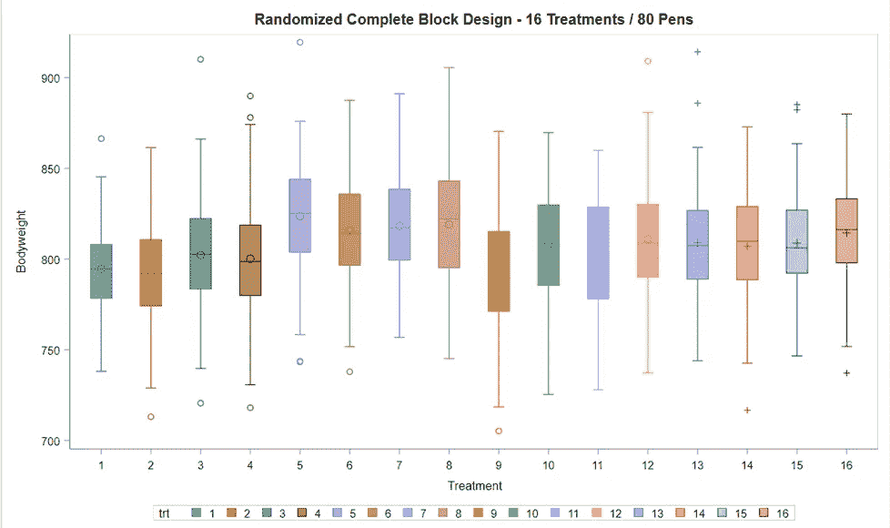

Boxplots showing observation distributions coming from a Randomized Complete Block Design for 8 and 16 treatments

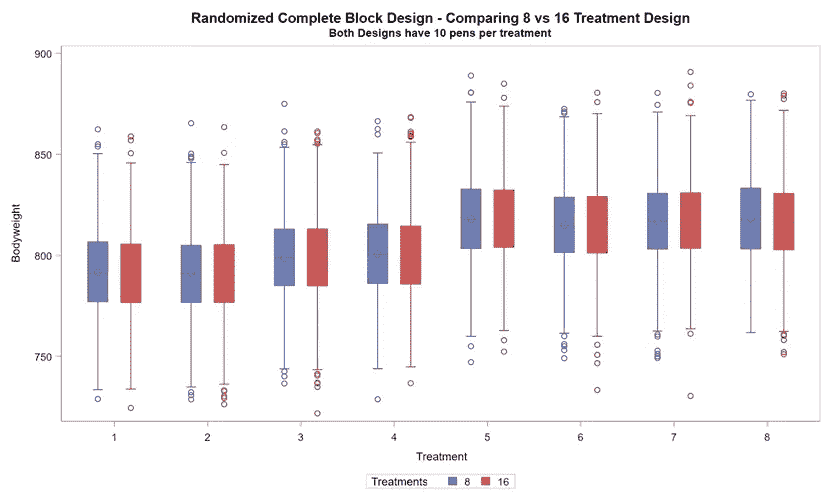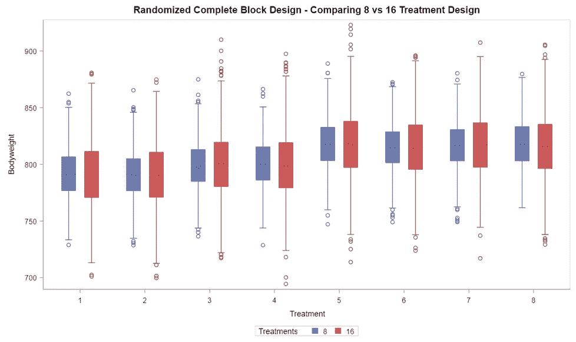

Boxplots showing, for the first 8 treatments, the mean and variance when adding treatments. The plot to the left kept the number of pens per treatment the same. The plot to the right shows what happens when you have a finite sample size — adding more treatments does not go unpunished.

> 对于任何实验设计来说，如果你真的可以故意增加方差，那么无法解释的方差就更少了。

如果你同时增加治疗次数和笔数，看起来你并没有失去动力。然而，当比较所有的治疗时，你确实得到一个更重的惩罚。此外，我们多久可以增加两次治疗的笔数保持不变？

不包括其他治疗的一个可能的例外是包括一个**冠军治疗。**这就像包括一个额外的治疗，有一个可怕的治疗→一个大的效果尺寸。对于这种特殊的治疗，较低的样本量可能不是问题，除非有大量的差异。不幸的是，对于所有其他治疗，样本量的下降会降低信噪比。那么，我们是否以其他治疗为代价包括了一个潜在的冠军？更重要的是，我们能确定这种疗法真的会成为冠军吗？下面一个模拟。

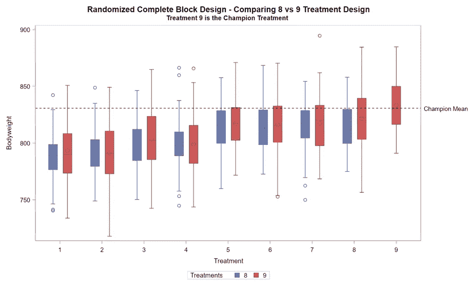

The champion treatment does for sure lend itself te fine comparisons, but at the cost of an increased variance in the other treatments due to the loss of replications.

M 任何动物研究都包括一个阳性(大治疗效果)和/或阴性对照(零治疗效果)来与其他治疗进行比较。不仅要观察这些处理与优良处理相比表现如何，还要观察阳性和阴性对照之间的差异，作为大于预期方差的标志。假设如果阳性与阴性的比较没有显示生物学上已知的差异，则实验条件不是“正常的”。

总的来说，阴性对照通常被包括在内，以防止可能影响感兴趣的结果的未知变量、假阳性，并创建对未来研究至关重要的方差估计数据库(后者我实际上很少看到或听到，但一旦实现，可能是一项巨大的资产)。通常包括阳性对照，以表明新的治疗与阳性对照一样好或更好。

包含阳性/阴性对照的一件事不应该用来**验证**该研究是否足以检测差异。这意味着，如果我们发现了一个差异，就有足够的力量来检测其他差异。我们需要使用**功率计算**，而不是正/负控制之间的差异来确定功率。并且这种功率计算需要预先进行。

此外，包括阳性/阴性质控品将减少每次治疗的有效样本量，从而增加发现**假阴性的机会。**从下图可以看出。

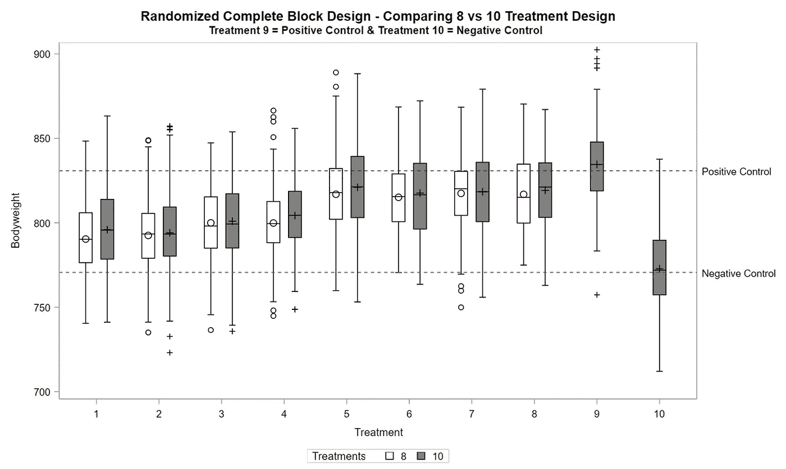

Adding a positive and negative control does allow more for more direct comparisons, and the ability to find differences. However, in most studies, adding a positive / negative control will decrease the sample size of those other treatments for which the trial was actually designed and conducted. Hence, better to do a solid power calculation then to add positive/negative controls.

与考虑治疗的数量同样重要的是你需要选择结果的数量。《动物科学》杂志上的许多试验有不止一个结果，许多甚至有超过 10 个结果。因此，在设计实验时，你需要问自己的主要问题是:*所有的结果真的同等重要吗？如果是，我是否对所有这些结果进行了研究，我认为我的产品对哪种结果有“真正”的影响？*下图显示了如果有很多结果，没有对所有结果进行正确的功率计算，进行多重比较，并且需要进行相应的调整，会发生什么情况。事实上，没有多少信号留下来，因为调整后的 p 值准确地反映了原始 p 值的相关性、小数据量和多重测试。实际上，你添加的结果越多，如果你没有让你的研究对所有人同等重要，你付出的代价就越高。

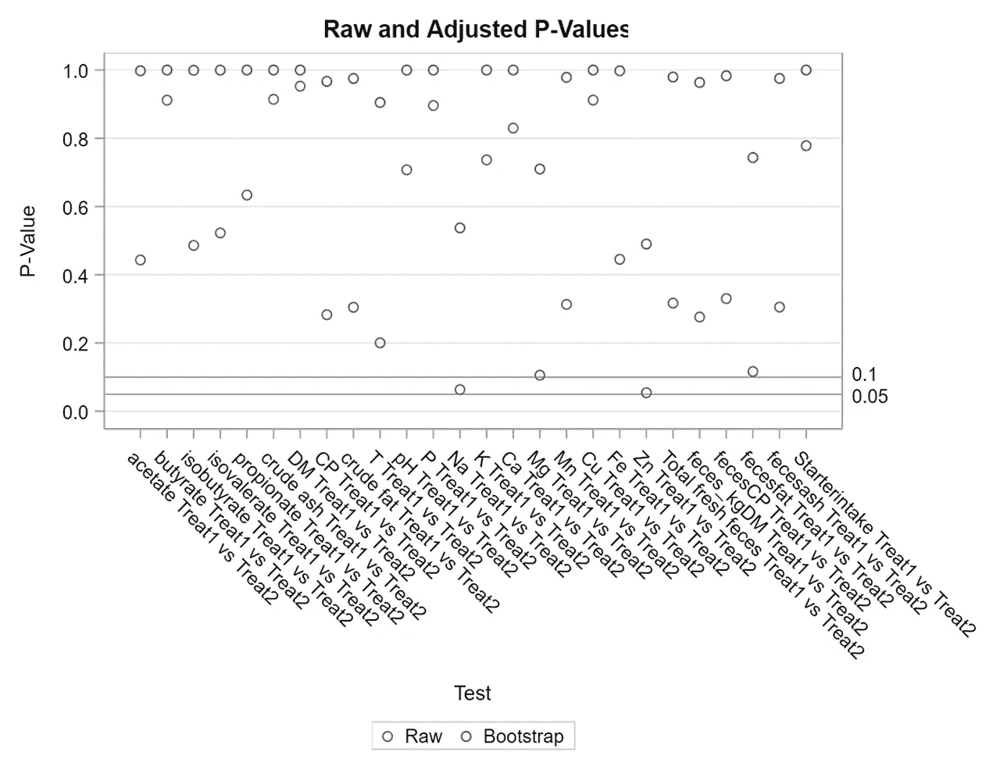

After adjustment for multiple comparisons, treatment effects disappeared. This is the price you pay for being gluttonous.

> 研究需要探索性研究和验证性研究来分别发现和验证特定治疗的效果。设计一个单独的实验并不容易，而设计一个**实验组合**更是难上加难。我们需要一个投资组合，因为单个实验很少能讲述一个完整的故事。****世界是一个随机而诡异的地方**。荟萃分析提供了一个很好的直观例子，说明单个实验通常不符合全球情况。您的**治疗选择和结果**对您实验的成功起着重要作用。不要轻视它们对你成功机会的影响——增加得越多意味着得到得越少！**

**所有实验设计的一般原则都与提高信噪比有关。这个比率是所有统计数据的引擎:T、F、Chi 等。它们都将信号放在分子中，将方差放在分母中。因此，统计值越大，p 值越低。误差方差越小，信号越强，p 值越小。为了增加比率，您需要寻找通过治疗效果增加信号的方法，通过可变性减少噪音的方法，或者通过包含/排除因素减少偏倚来增加信号的方法。**

**提高治疗效果是获得良好信噪比的最简单方法。要做到这一点，你需要确保你有一个非常好的产品。作为一名研究人员，你需要面对现实，问问自己在最佳条件下，一种产品的合理预期效果是什么。在正常甚至次优条件下，可以预期的效果是什么？*注:次优条件实际上会增加效应大小，例如通过挑战性研究。不是因为你减少了方差，而是增加了信号。***

**接下来是减少可变性，在这里使用特定的设计来寻找机会窗口可能是最好的，例如响应面设计来寻找最强的信号，剂量反应研究来确定最佳剂量，或者嵌套设计来检测可变性。在这里，在你的设计中包含变化意味着你有办法控制它——通过阻塞或重复测量。然而，没有什么比随机化更好的了。但是在我们讨论随机化之前，我们还需要讨论复制，实验单位和观察单位之间的区别，以及伪复制*(一点点)。***

**复制单位是独立分配给治疗*(或因子水平)的最小实体。*分配是偶然发生的*(如掷骰子)*应确保独立性。因此，如果将 20 个笔随机分配给四个处理，每个处理将有五个重复，它们被认为是独立的观察单位。**

**然后，我们有实验单位对观察单位的范式，这种范式在动物科学中泛滥成灾(作为一名生命科学研究者，我有时会发现这种范式极其不必要的复杂)。实验单位是随机分配治疗水平的最小单位——动物、围栏/笼子、街区。观察单位是测量反应的最小单位—围栏、围栏中的动物、动物的一部分(如肝脏/胫骨)。因此，随机化单元=实验单元=独立单元。所以，如果笔是随机单位，它也是实验和独立单位，但观察单位很可能是动物。对于[欧洲食品安全局(EFSA)](https://www.efsa.europa.eu/en) ，单位之间的差异基于处理分配:**

***实验单元是应用给定处理* *的* ***最小实体。如果动物被* *分组圈养，并且圈里的所有动物共用同一个饲料源(并且采食量不是单独测量的* *)，那么所有参数的实验单位都是圈，而不是单个* *动物。*****

**一个观察是一个实验还是一个观察单位关系到研究的分析和能力。混合模型能够估计方差(随机陈述)，并使用这些方差估计来估计治疗差异。你在代码中指出哪些单元是独立的，哪些不是。就功效计算而言，真正的 T21 复制水平通常决定了一项研究的成功。最好有更多独立的而不是依赖的单元(例如，最好有更多的围栏而不是一个围栏中的鸟)**

> ****你**随机化是为了防止实验者/系统偏差，确保误差的独立性，并允许差异仅归因于治疗效果。**

**在 SAS 中，可以通过**PROC PLAN**(SAS/STAT)/**PROC FACTEX**&**PROC OPTEX**(SAS/QC)进行随机化。 **PROC PLAN** 可以轻松设计最常见的计划，尤其是嵌套设计。 **PROC FACTEX** 对于设计具有多个设计和点重复以及设计和点的复制的研究最为有用。 **PROC OPTEX** 是用于优化在 **PROC FACTEX，**中创建的设计的常用工具，例如不完全区组设计、部分因子或响应面设计。**

```
proc factex; 
factors Treatment / nlev=5; 
size design=25; 
output out=CRD randomize(713) 
Treatment cvals=("A" "B" "C" "D" "E"); 
run; 
proc print data=CRD; 
run;
```

**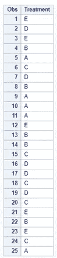**

```
proc factex; 
factors starch protein/nlev=3; 
model estimate=(starch|protein); 
output out=FF2 
randomize 
designrep=2 /* replicates design twice */ 
Starch nvals=(13,13.5,14) 
Protein nvals=(11,13,15); 
run; 
proc print data=FF2; 
run;
```

**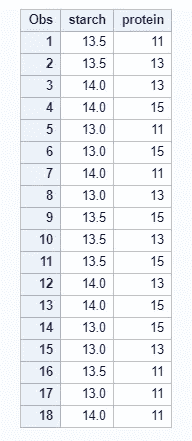**

```
proc plan seed=27371; 
factors Unit=12; 
treatments Treatment=12 cyclic (1 1 1 1 1 1 2 2 2 2 2 2); 
output out=Randomized; 
run; 
proc print data=randomized; 
run;title 'Completely Randomized Design'; 
/* The unrandomized design */ 
data Unrandomized; 
do Unit=1 to 12; 
if (Unit <= 6) then Treatment=1; 
else Treatment=2; 
output; 
end; 
run; 
/* Randomize the design */ 
proc plan seed=27371; 
factors Unit=12; 
output data=Unrandomized out=Randomized; 
run; 
proc sort data=Randomized; 
by Unit; 
proc print data=Randomized; 
run;
```

**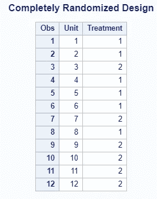****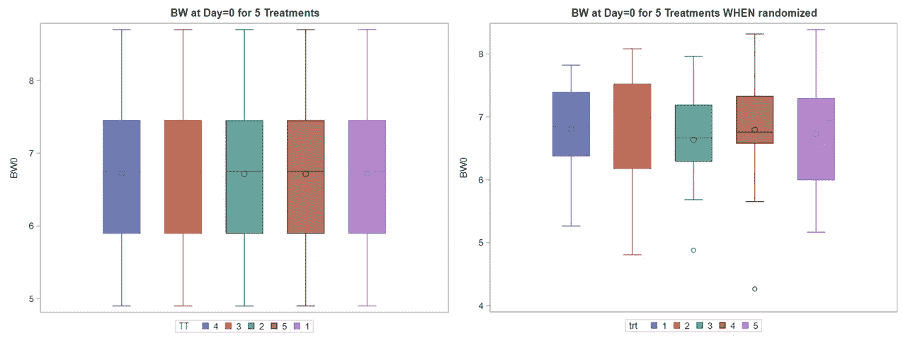**

**Distribution of BW at Day=0 for five treatment when you do not (left pic) or do (right pic) randomize.**

**我们需要首先讨论随机化的原因是因为它有助于我们区分真正的复制和伪复制。随机处理的水平决定了一个实验有多少真重复和多少假重复。例如，如果将 20 支笔随机分配给四个处理，每个处理将有五个重复。如果每个围栏有 10 只动物，我们有 200 只动物的总样本量，但不是 200 个重复，因为随机发生在围栏水平。从设计/统计的角度来看，随机化被假定为创建独立同分布[和同分布随机](https://en.wikipedia.org/wiki/Independent_and_identically_distributed_random_variables)的观察值。因此，在观察值被随机化的水平上，假设没有交叉相关，观察值不相互通知，因为它们是独立的。因此，20 次观察确实是 20 次观察。该级别下的任何复制都不是随机的。想象你随机选择 20 只动物，但是每只动物保留 5 条记录。这五项记录来自同一种动物。他们受到那种动物的影响。这五个观察值不等于五个样本量。它们等于基于互相关水平的“某物”的样本大小。想想看，如果我可以用一个值完美地预测另一个值，那个值值多少钱？**

**因此，如果复制是在随机化水平上进行的，那么复制就是真正的重复。真正的复制/重复使我们能够估计给定治疗效果的差异→误差/残差变异。实验误差的估计是通过信噪比检验治疗效果所必需的。如果我们每次处理只有一个实验单位，我们就没有真正的重复，处理之间的差异可能是由于实验单位的差异。这叫做[混淆](https://en.wikipedia.org/wiki/Confounding)。**

**我们只能在嵌套设计中找到伪复制:**

1.  **嵌套在动物中的度量(例如，时间)**
2.  **笼中筑巢的动物**
3.  **部门中嵌套的笼子**
4.  **嵌套在农场中的部门**
5.  **嵌套在位置中的农场**
6.  **嵌套在国家中的位置**

> **如果在随机化水平上进行复制，则复制是真正的重复**

**现在应该很清楚，真正的复制分解成伪复制的确切水平取决于随机化的水平。真正的复制等于独立的观察。伪复制等于从属观察。复制的类型决定能力。“简单”回归和方差分析模型的结果只有在观察独立时才有效。然而，动物科学中几乎所有的设计都是嵌套设计。因此，许多观察结果是相互依赖的，因而是相关的。相关的观察值并不代表表中的唯一信息，因为它们是相关的。因此，一项研究的[有效样本量](https://en.wikipedia.org/wiki/Effective_sample_size) (ESS)比你想象的要少。不同的程度取决于相关程度——观测值之间的完美相关将使 ESS 为 1。**

**显示这一点的一个简单方法是模拟一个随机的完全区组设计，包含跨越 10 个区组的 8 个处理，这意味着 80 支笔。我们每栏包括 15 只动物，因此研究中总共有 1200 只动物。**

**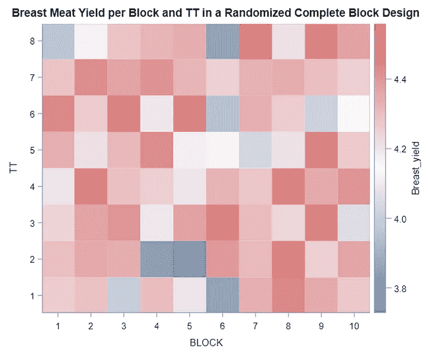****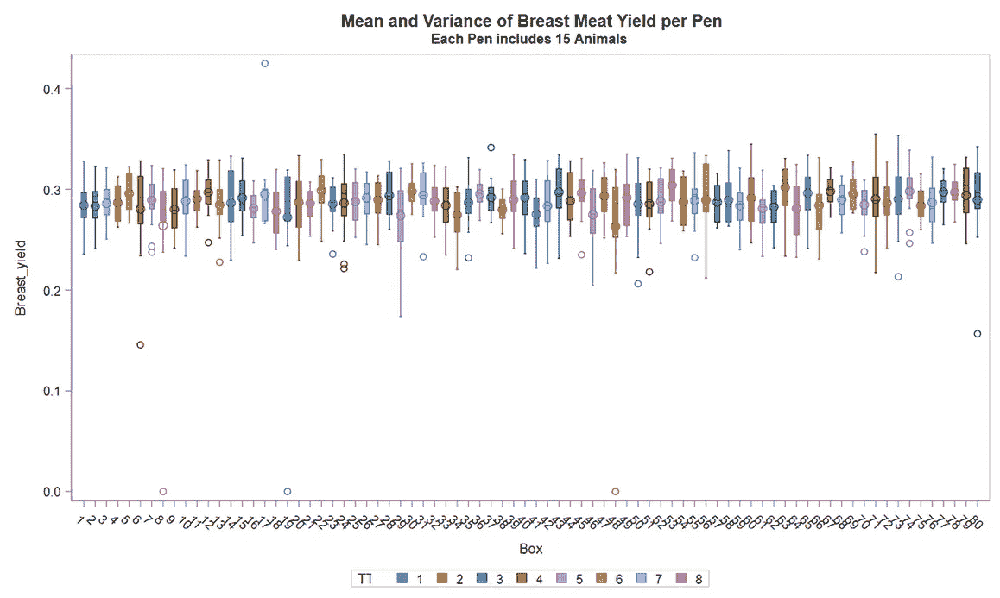**

**现在，让我们使用算术平均值、方差分析和混合模型来分析这个模拟研究。如果我们在嵌套设计中使用方差分析，我们假设所有的观察都是独立的，这意味着我们给那个研究分配了比实际更多的自由度。这将导致围绕治疗效果的不可靠的小方差估计，从而导致假阳性。下面我们可以看到这三项研究在自由度估计上的不同。混合模型是唯一可以通过合并方差-协方差矩阵来精确估计 ESS 的模型。**

**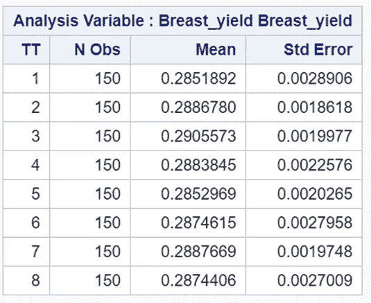****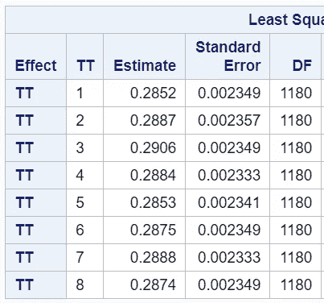****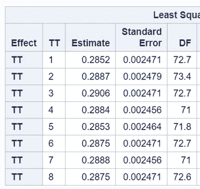**

**Arithmetic mean versus ANOVA versus Mixed Model including the nested design. The Mixed Model is able to estimate the accurate effective sample size based on the variance-covariance matrix.**

**结果，一旦你开始考虑设计的嵌套结构，处理的**标准误差**变得更大。这是因为有效样本量变小了。因此，混合模型实际上是考虑到观察值的相互依赖性，以估计真实的自由度 *(1180 比 70+)* 和每个 LSMEAN 的标准误差。**

**让我们用另一个例子，一个模拟家禽试验，包含 2112 只动物在第 35 天的个体体重测量。我们有四种处理，12 个块，因此有 48 支笔(4*12)。**

**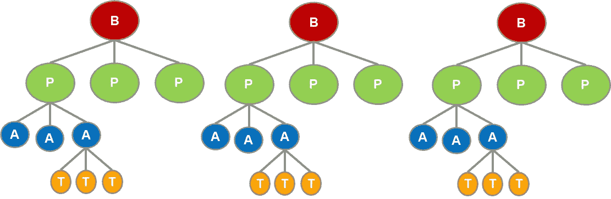**

**The design is nested via Blocks →Pens →Animals →Time.**

**分析数据的代码。最大的区别是使用随机组件来指定嵌套结构。**

**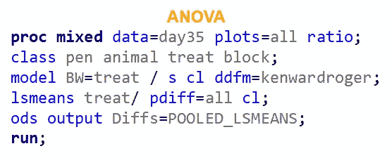********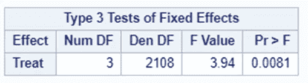****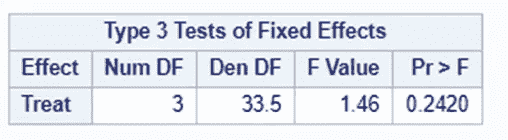**

**The effective sample size approximated by the denominator degrees of freedom to estimate the differences between treatment goes from 2108 to 33.5.**

**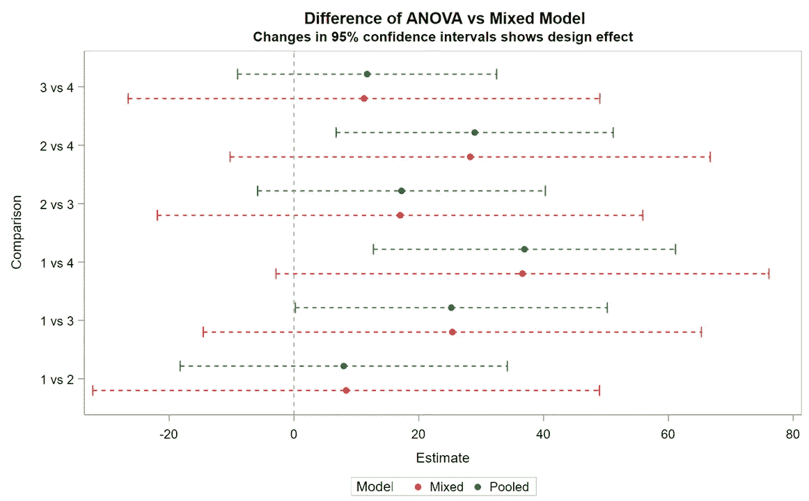**

**A smaller effective sample size leads to a larger standard error and thus a larger confidence interval. The choice for the type of analysis used will also change if a difference is ‘true’ or not. This is a splendid example of showcasing that ‘truth’ is a very volatile concept.**

**在前面的示例中，您可以看到考虑伪复制会减少有效样本量，从而增加标准误差。在下一个例子中，我们将展示为什么保留尽可能多的真实复制比放大伪复制更好。这一切都与伪复制更加相似，因此添加的独特信息更少这一事实有关。**

**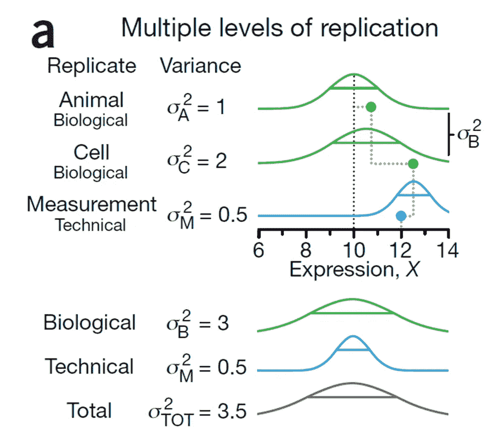**

**Variance is additive, but not each level of observations adds the same level of variance. There is more variance to be found at ‘higher’ levels than at lower levels. This is because there is less intercorrelation at higher levels. So, in this example, one could boost the sample size by adding measurements, but it would account for little when looking at the effective sample size.**

**SAS 可以区分设计和点复制。输出*设计代表*复制整个设计，相当于真正的复制。输出 *pointrep* 在à **伪**复制中复制观察值**

**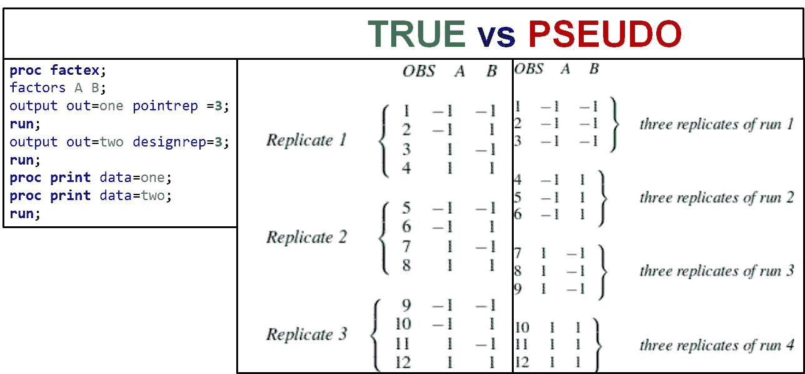**

**True vs pseudo-replication as established via PROC FACTEX.**

**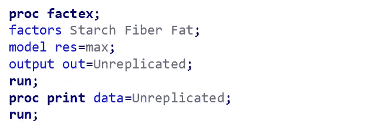****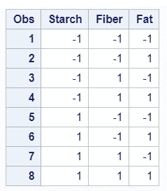****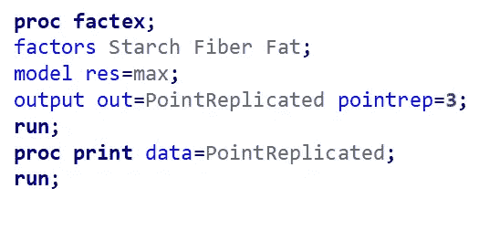****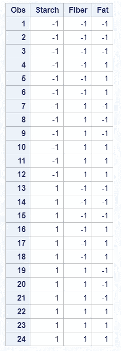**

**接下来是方差，没有比讨论随机完全区组设计更好的方法来显示方差的作用以及如何控制它。下图显示了它是如何工作的——每个处理都有相同数量的动物，但更重要的是每个颜色的动物在每个处理中都有代表。一次！因此，动物颜色的影响可以从等式中剔除，将颜色从未知方差转换为已知方差。**

**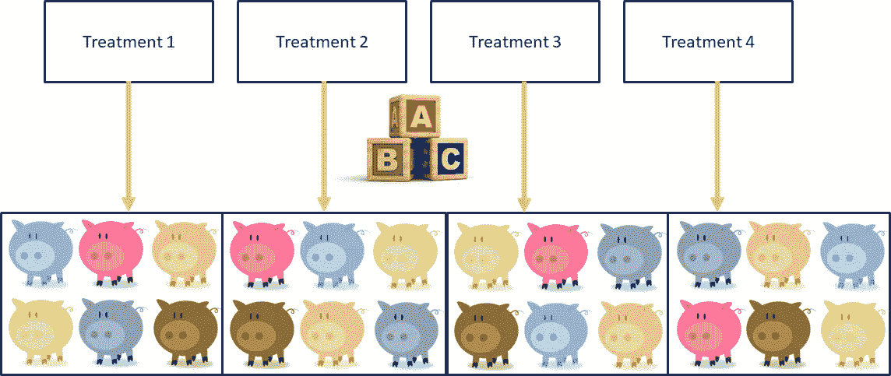**

**方差是可加的！如果您分析一个试验，并估计块方差为 3000，误差方差为 1000，则总方差为 4000。因此，决定阻断成功与否的是阻断与总变异的比率。阻塞解释的方差越高，剩余的未解释方差就越少。这种无法解释的方差的减少导致信噪比的增加，这可以通过突出显示用于估计某个效应是否“真实”的统计数据来清楚地显示出来。**

**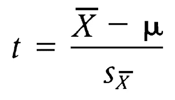**

**The t-statistic depends on the observation minus the mean divided by the variance. The less variance, the higher t will be.**

**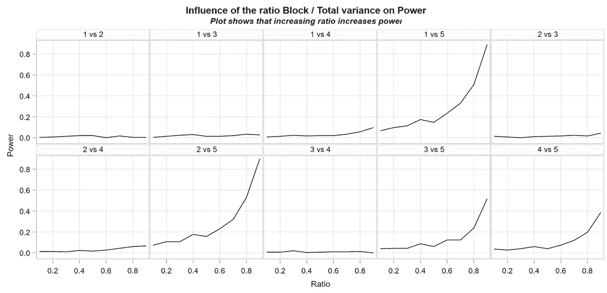**

**Plot showing the influence of the block/total variance ratio. Increasing the block variance will lead to less unexplained error and thus more signal. However, nothing adds more signal to a study then adding more signal. This is clear here — some comparisons will never materialize because there is no difference. There is no signal.**

**总之，实际块数并不真正影响偏倚，但它确实影响变异。[更多的块增加了估计真实块方差的可能性](/@marc.jacobs012/randomness-in-mixed-models-8b7affd8a7c4)。块方差越接近真实值，它对功率计算就越有用，如下图所示。**

**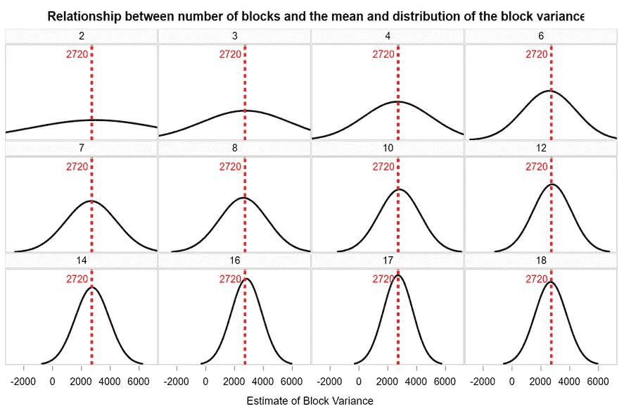**

**Block estimates depends on the sample size — the number of blocks. Hence, to let the blocking do its job in a RCBD, you need to have enough levels.**

**最后，但同样重要的是，让我们谈谈实验误差/残差。任何一种不能用治疗效果来解释的变异都会自动进入实验误差/无法解释的方差库。因此，分析的实验误差就像一个垃圾桶。它没有意义，也不包含任何信息。当然，这并不完全正确。因此，更好的描述应该是我们不知道如何处理这种差异。没有我们可以用来解释它的变量或工具。因此，它不是垃圾。事实上，无法解释的错误是我们缺乏知识的标志。我们应该珍惜它。**

**减少一个模型的错误部分的方法是解释它。两种主要的方法是通过设计(如阻断)或在分析中(如协变量调整)。不言而喻，任何可以通过设计处理的东西都有我的偏好。通过这样做，一次可以增加信噪比，因为所有的治疗效果都与实验误差/无法解释的方差相比较。**

> **无法解释的错误是我们缺乏知识的标志。我们应该珍惜它**

**综上所述，在设计、分析和进行实验时，我们需要对四大公司施加尽可能多的影响:**

1.  **复制→提高精度。**
2.  **随机化→避免偏倚。**
3.  **阻塞→降低噪音。**
4.  **实验对照→其他的。**

**我们也不应该害怕差异，因为我们需要它来区分信号和噪音，为未来的研究提供动力，并帮助我们解释我们周围的世界。**

**这是一个介绍性的帖子。接下来，我将展示 SAS 编码来指导动物科学中几个最常用的设计。**

**[](/mlearning-ai/mlearning-ai-submission-suggestions-b51e2b130bfb) [## Mlearning.ai 提交建议

### 如何成为 Mlearning.ai 上的作家

medium.com](/mlearning-ai/mlearning-ai-submission-suggestions-b51e2b130bfb)**