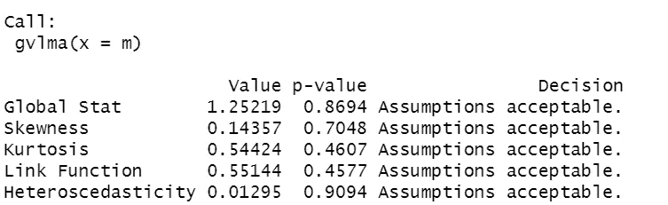
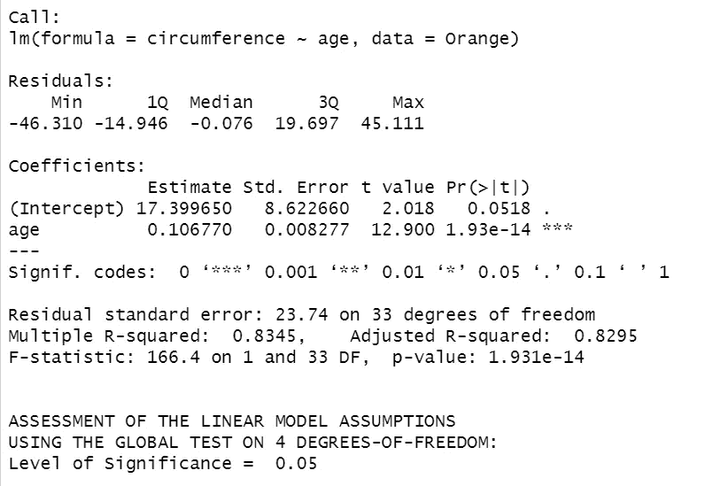
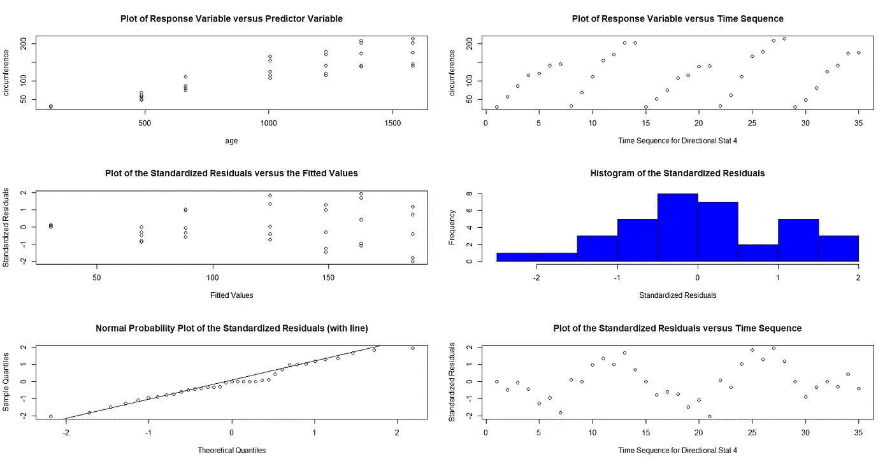

# 线性模型假设的一般验证

> 原文：<https://medium.com/mlearning-ai/general-validation-of-linear-model-assumptions-9207aca19eba?source=collection_archive---------5----------------------->

加载数据集，做一些数据清理工作，建立模型，运行结果嘭嘭嘭！！！

很简单，对吧？

没有。没那么容易。

至少，事情不应该这么简单。是的，上面提到的所有步骤都是必须的。但是如果你进入机器学习领域，在你建立模型之前需要做一些额外的工作。没那么复杂，但肯定是强制性的。如果您跳过这一部分，最终您仍将拥有一个看似有效的模型…

…但这与事实相去甚远。

假设，我亲爱的朋友，假设。

*莫斐斯在房间里徘徊，看着你的眼睛:*

假设无处不在。即使现在，就在这个房间里。当你向窗外看或者打开电视时，你可以看到它。当你去工作的时候，当你去教堂的时候，当你交税的时候，你能感觉到。是这个世界蒙住了你的眼睛，让你看不到真相。


Construct scene from Matrix (1999), Wachowskis.

我们今天要讨论的假设并没有那么复杂，不，我们不会讨论这个事实，这个世界实际上是一个建立在我们假设之上的数字图像。

我们今天要讨论的假设是统计假设。在建立你的模型之前，有一些先验的想法必须得到验证。没有经过测试，你的模型在统计学上就是乱码，我是说，你的模型可能是不准确的。

## 线性模型假设

让我们看看关于线性模型的[假设](https://www.statology.org/linear-regression-assumptions/)..必须满足四个假设，即:

1.  线性(明显)
2.  常态(也很明显)
3.  异方差性(Man what the f-)
4.  独立性(您的预测变量不得有共线性问题。)

没错，在建立你的模型之前，你必须逐一检查这一点。一个接一个。他们每个人。是的。

开玩笑的。

幸运的是，你和我都有一个 R 包，可以检查模型是否满足上述假设。多美啊，不是吗？

我所指的包装是:

[gvlma](https://cran.r-project.org/web/packages/gvlma/gvlma.pdf)

你可以点击进入 CRAN 页面。它由 Edsel A. Pena 和 Elizabeth H. Slate 开发，目前由 Elizabeth H. Slate 维护。

一个简单的功能就完成了。

## 如何安装

```
install.packages(“gvlma”)
```

## 如何部署

```
library(gvlma)
```

## 构建您的模型

我们将使用内置的 Orange 数据集，通过使用年龄来预测周长。

```
View(Orange)m <- lm(circumference ~ age, data = Orange)
```

## 验证假设

使用 gvlma()函数进行验证过程。

```
validation_m <- gvlma(m)summary(validation_m)
```

## **探索结果**

如你所见，我们有绿灯。所有假设都被接受。



Model results. Image by Author

## **检查型号**

既然我们的假设得到了满足，并且适合线性模型，那么是时候研究模型结果了。



Model results. Image by Author

## **绘制验证摘要**

因为我们有一个 R 平方相当高的线性回归模型，所以让我们通过绘制 **validation_m** 对象用 gvlma packege 来表示它，这样我们就可以进一步研究假设检查。

为了可视化我们的图，我们将使用 gvlma 函数:

```
plot.gvlma(validation_m)
```



Validation Summary Plot. Image by Author

是的，就这些。当 R 的简单遇到有才华的统计学家时，我们通常会得到这样的结果。特别感谢这个包的作者。

*附注:你可以通过检查 VIF 分数深入共线性验证。*

保重，

巴拉克。

[*https://www.linkedin.com/in/burak-tiras/*](https://www.linkedin.com/in/burak-tiras/)

```
Further Reading:[https://cran.r-project.org/web/packages/gvlma/gvlma.pdf](https://cran.r-project.org/web/packages/gvlma/gvlma.pdf)[https://www.statology.org/linear-regression-assumptions/](https://www.statology.org/linear-regression-assumptions/)
```

[](/mlearning-ai/mlearning-ai-submission-suggestions-b51e2b130bfb) [## Mlearning.ai 提交建议

### 如何成为 Mlearning.ai 上的作家

medium.com](/mlearning-ai/mlearning-ai-submission-suggestions-b51e2b130bfb)