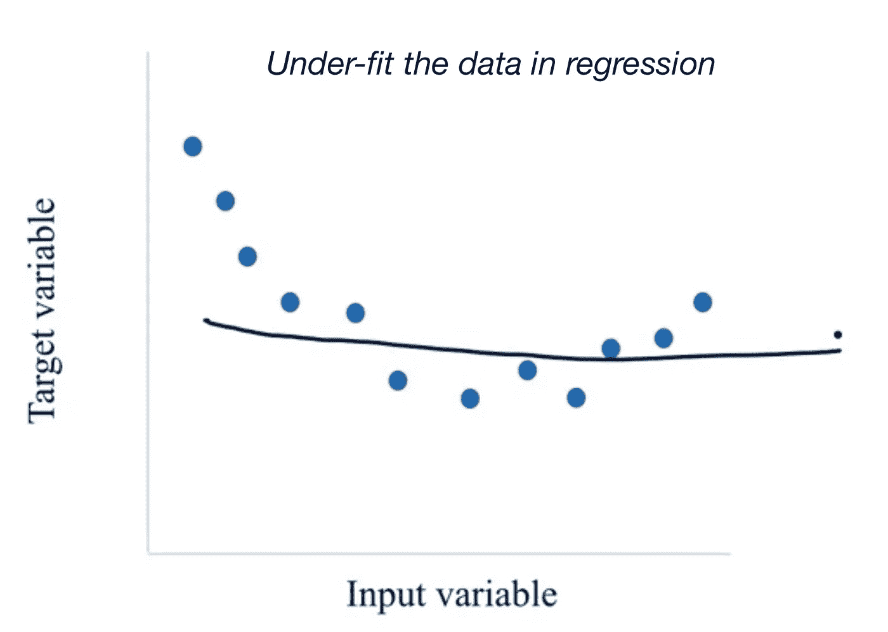
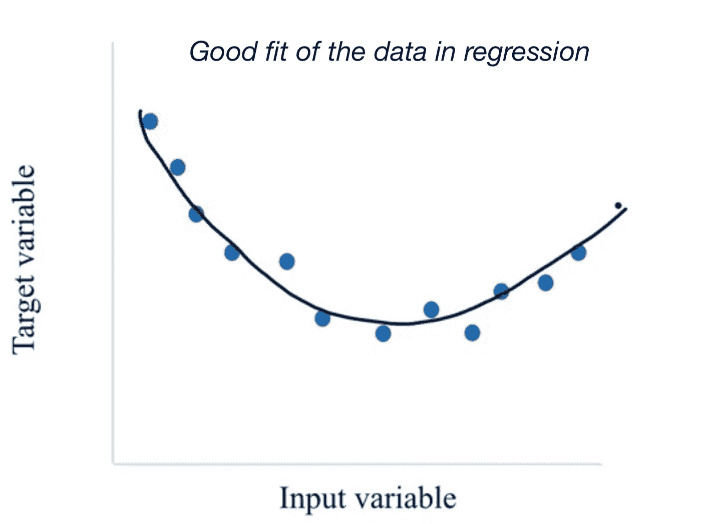
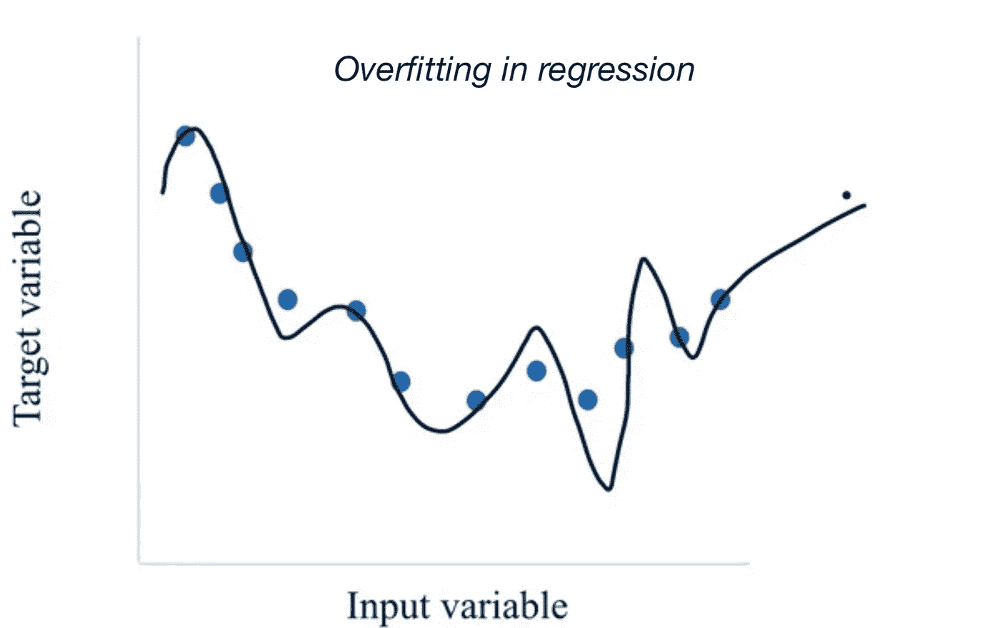
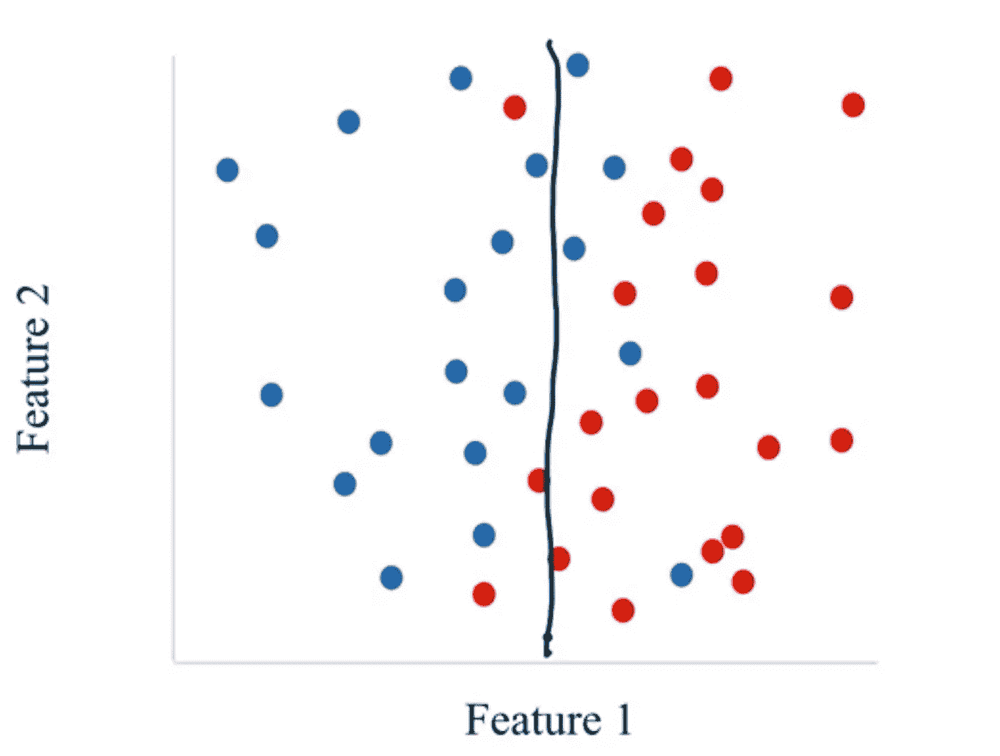
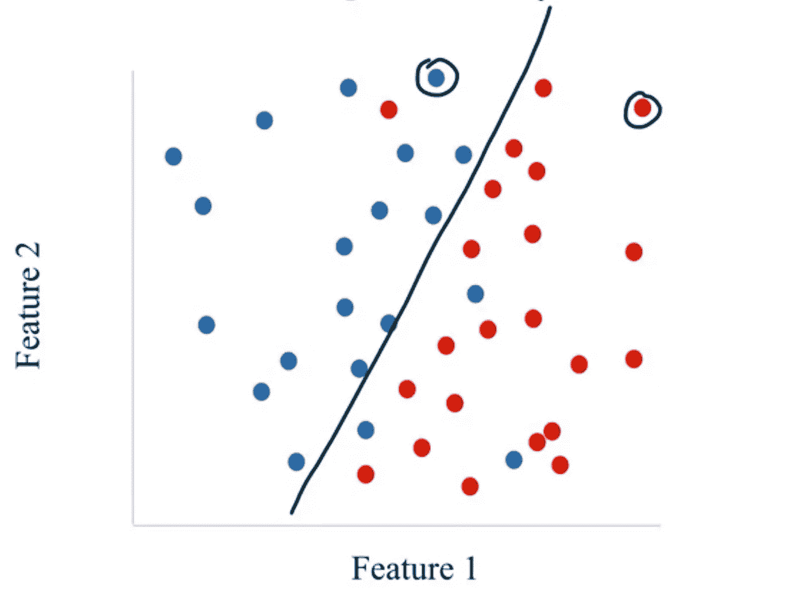
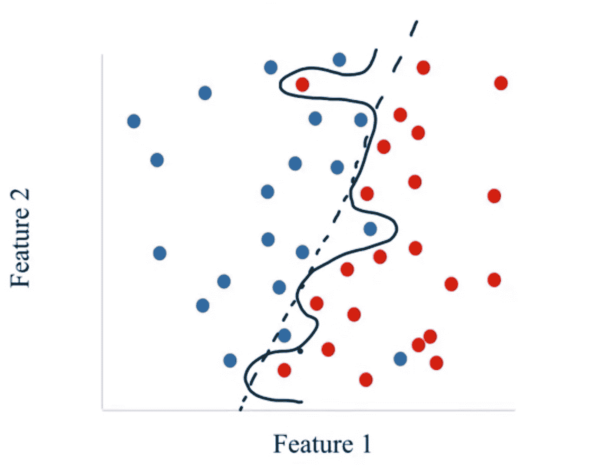
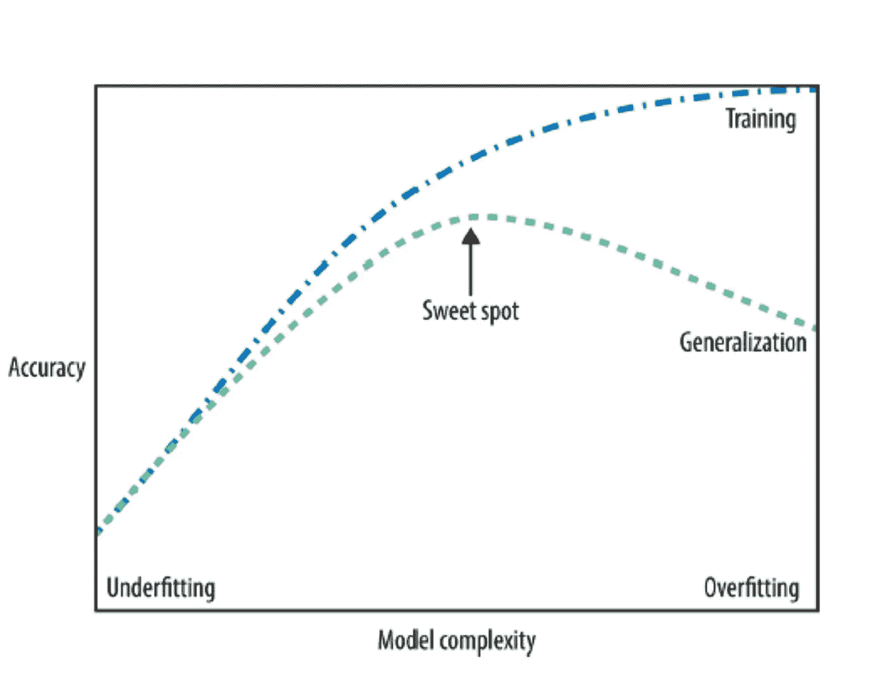

# 监督学习中的泛化、过拟合和欠拟合

> 原文：<https://medium.com/mlearning-ai/generalization-overfitting-and-underfitting-in-supervised-learning-a21f02ebf3df?source=collection_archive---------0----------------------->

无论是用于分类还是回归，构建监督学习模型时的任务之一是创建一个模型，该模型将根据训练数据进行正确的预测学习。但是，如果我们不能对看不见的数据集做出正确的预测，这个模型将毫无用处。这种在坚持测试集上表现良好的能力是算法的概括能力。但是，我们如何知道经过训练的模型是否能够很好地概括，或者对于以前看不到的数据是否准确。

通常，ML 对数据做出以下假设:

*   *未来测试数据集与当前训练集具有相同的属性。*
*   如果模型在训练集上是准确的，并且测试集与训练集相似，我们也可以期望模型在测试集上是准确的。

不幸的是，由于所谓的“过拟合”问题，这种情况并没有发生。当我们试图用不足的训练数据拟合一个复杂的模型时，就会发生过度拟合。过度拟合的模型捕获训练集中的复杂模式，但它经常错过看到训练集中的全局模式，这将有助于它在看不见的测试集中很好地概括。它不能发现更多的全球模式，因为没有足够的数据来约束模型尊重这些全球趋势。理解、检测和避免过拟合是最大似然算法中最重要的方面。过度适应会给我们的世界带来严重的后果。

> **回归过度拟合**

在回归中，我们总是试图找到输入变量(自变量)和目标变量(因变量)之间的关系。我们的想法是得到一个合适的模型来解释这种关系。我们可以尝试拟合的模型的一个例子——线性模型。

上面的例子代表了回归中的欠拟合。该模型对于数据中表示的实际趋势来说过于简单。即使在训练数据集上也表现不佳。

如果我们采用与上述不同关系的模型，我们捕捉点的一般趋势，同时忽略由于噪声引起的光线变化。

我们可以假设输入变量和目标变量之间的关系是类似多项式的不同参数的函数。如果我们用一个更复杂的模型来拟合这组训练数据，将会得出一些结论。

这个模型看起来更复杂，因为它有更多的参数和更高的方差。该模型捕捉训练数据中的变化，并且遗漏了我们作为数据中的人类可以观察到的全局趋势。这是过度拟合的一个例子。

> **分类过拟合**

下一个例子涉及分类中的过度拟合。让我们来看看有两种结果的二元分类问题。在分类中，我们建立了在特征空间中构造决策边界的模型。

**Under-fitted model in classification**

上图代表欠拟合模型(过于简单)。它没有捕获训练数据中类之间的任何模式。

**Good fit of the model in classification**

上述模型代表了总体良好的拟合度。它发现了两个阶层之间的一般趋势。它捕捉全局模式，并在忽略数据中某些可变性时保持稳健。

**Overfitted model in classification**

过度拟合模型通常具有大量参数，能够捕捉数据中的所有模式。它还表示具有高可变决策边界的模型。这个模型会在看不见的数据上犯很多错误，意味着泛化性能。

下面的最后一张图片显示了模型泛化过程中的最佳点。为了得到具有良好通用性的模型，我们应该尝试不同类型的参数模型和非参数模型。它们中的一些具有特殊的约束，这有助于实现良好的泛化性能。

**Trade-off of model complexity against training and test accuracy.**

> **结论**

我们允许模型越复杂，我们就能越好地预测训练数据。然而，如果模型变得太复杂，我们开始过多地关注训练集上的每个单独的数据点，并且该模型将不能很好地概括新数据。在这两者之间有一个最佳点，可以产生最佳的泛化性能。这就是我们想要找到的模式。