# 用人工智能生成钢琴盖

> 原文：<https://medium.com/mlearning-ai/generate-a-piano-cover-with-ai-f4178bc9cb30?source=collection_archive---------1----------------------->

一个新的模型从一首流行歌曲中生成了一个钢琴封面:它是如何工作的？你如何能尝试它？

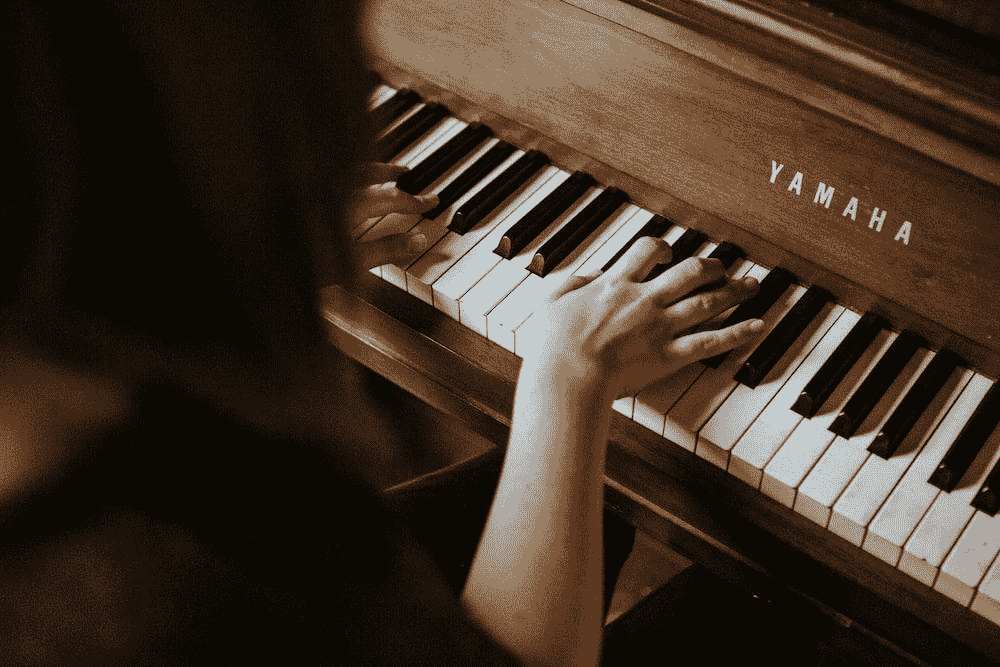

Image by [Jordan Whitfield](https://unsplash.com/@whitfieldjordan) at unsplash.com

钢琴盖指的是所有乐器都被钢琴单独的声音代替的盖。很多都可以在 youtube 上找到，它们听起来可能微不足道(剧透:事实并非如此)。

为了创造一个钢琴盖，一个人必须认识到旋律中的所有音乐元素，并只用钢琴重新诠释它。因此，一个人需要音乐技巧和创造力才能再现旋律。如果对一个人类来说已经很难了，AI 还能成功吗？

最近，一篇名为“[POP 2 PIANO:POP AUDIO-BASED PIANO COVER GENERATION](https://arxiv.org/pdf/2211.00895.pdf)”的文章就打算这么做。在这篇文章中，我们将讨论它以及你可以如何尝试它

# 想做 Lady Gaga 封面的人工智能。

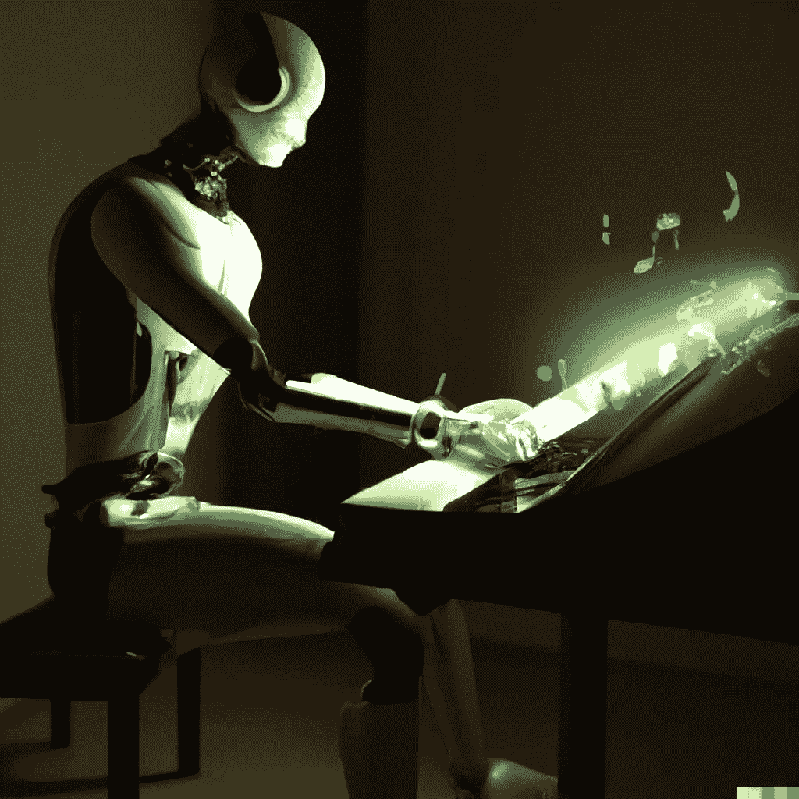

Image generated with [OpenAI Dall-E 2](https://openai.com/dall-e-2/)

事实上，正如他们在文章中所说，这样的挑战已经尝试过了。这个想法是从音频中提取各种乐器的轨道，并重新排列它们。这项任务并不容易，因为一个好的封面既受氛围的影响，也受作曲家风格的影响。

作者从 300 小时的同步钢琴封面数据集开始。基本上，他们没有使用原始音乐，而是采用了原曲和钢琴翻唱。他们把原唱和翻唱同步，然后分成片段。翻唱被转换成了 [MIDI](https://en.wikipedia.org/wiki/MIDI) ，并被缩减为 8 音单元。他们总共在 youtube 上收集了 21 个编曲者的 5989 个钢琴封面(他们当时只用了 4989 和 307 个小时)。

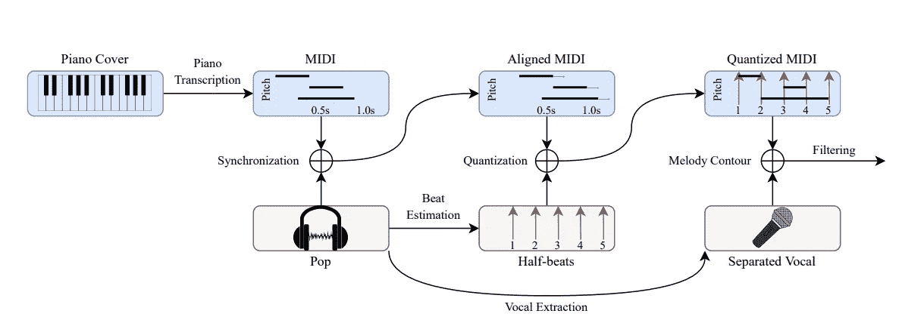

“Fig. 1\. A preprocessing pipeline for synchronizing and filtering paired {Pop, Piano Cover} audio data”. image source from the original article ([source](https://arxiv.org/pdf/2211.00895.pdf))

这个模型基本上是一个[变压器](https://en.wikipedia.org/wiki/Transformer_(machine_learning_model)):

> Pop2Piano 模型架构是[T5-small](https://paperswithcode.com/method/t5)【7】用于【9】。这是一个具有[编码器-解码器](https://d2l.ai/chapter_recurrent-modern/encoder-decoder.html)结构的变压器网络。可学习参数的数量约为 59M。与[9]不同，使用原始 T5 的相对位置嵌入而不是绝对位置嵌入。此外，可学习的[嵌入层](/analytics-vidhya/understanding-embedding-layer-in-keras-bbe3ff1327ce)用于嵌入编曲风格。—摘自原文章([来源](https://arxiv.org/pdf/2211.00895.pdf))

从图中可以看出，它包括一个编码器和一个解码器。

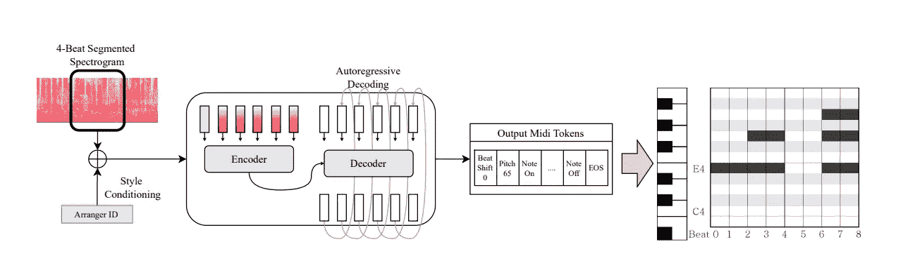

“Fig. 2\. The architecture of our model is an encoder-decoder Transformer. Each input position for the encoder is one frame of the spectrogram. We concatenated an embedding vector representing a target arranger style to the spectrogram. Output midi tokens are autoregressively generated from the decoder.” image source from the original article ([source](https://arxiv.org/pdf/2211.00895.pdf))

作者展示了一个输出示例:

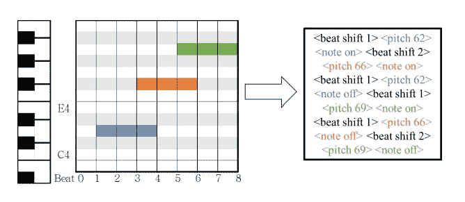

“Fig. 3\. An example of piano tokenization. the beat shift token means a relative time shift from that point in time.” image source from the original article ([source](https://arxiv.org/pdf/2211.00895.pdf))

虽然原曲还是比较复杂的(由几个乐器和人声部分组成)，但钢琴伴奏似乎是似是而非的。不仅如此，这听起来似乎有理，但也类似于编曲工作。

此外，即使在主观评价中，这似乎也是可信的(非音乐家人群中的 25 名参与者)。参与者必须听 10 秒钟的 25 首歌曲，并将它们与人类安排的歌曲进行比较。70%的人更喜欢模特的作品。

下面是作者发布的一个视频作为例子:

还有，在项目网站上，你可以测试其他歌曲和编曲(你可以在这里找到[)。](https://sweetcocoa.github.io/pop2piano_samples/)

作者承认仍然存在局限性:

> 我们认识到可以对我们的模型进行一些改进。例如，Pop2Piano 在输入上下文中只使用四拍长度的音频。因此，当生成长于四拍时，诸如旋律轮廓或伴奏织体的特征具有较少的一致性。此外，基于八分音符节拍的时间量化会阻止模型生成带有其他节奏(如三连音、十六分音符和颤音)的钢琴伴奏。—来自原文章([来源](https://arxiv.org/pdf/2211.00895.pdf))

# **如何获得钢琴盖**

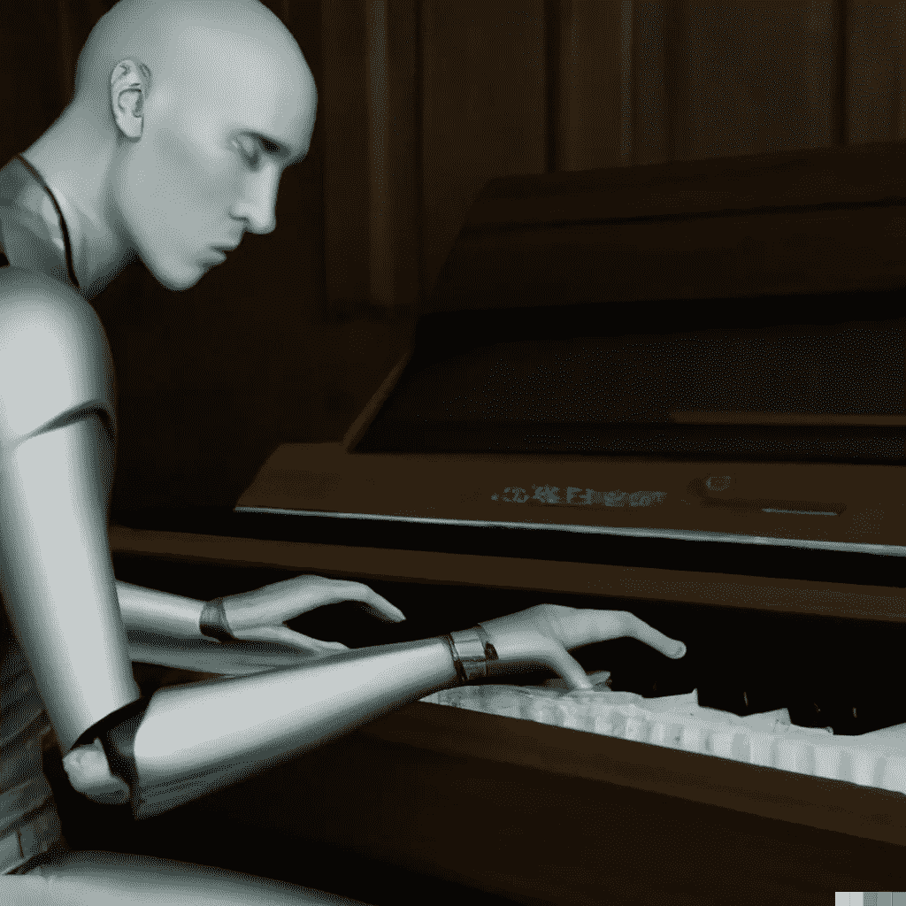

Image generated with [OpenAI Dall-E 2](https://openai.com/dall-e-2/)

作者提供了一个 Github 和一个 Google Colab。

首先，你必须改变运行时(在上面的菜单中选择运行时)，然后选择改变运行时类型(在下拉菜单中选择 GPU)。完成后，您需要运行第一个代码块(CTRL+ENTER 或按下小播放符号)。这可能需要几分钟，但是一旦完成，就进入第二个模块。

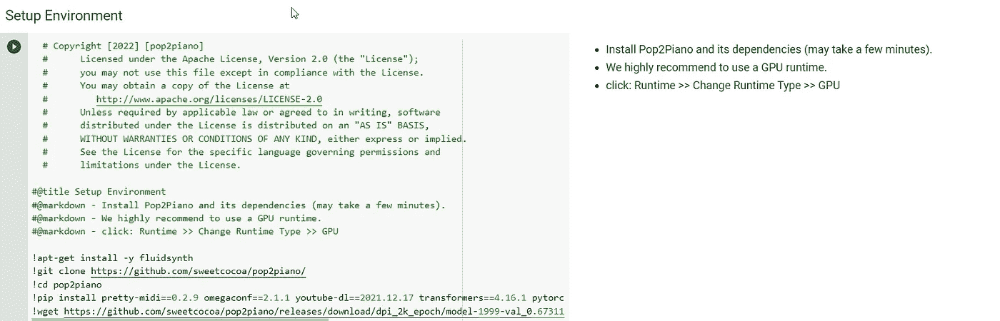

同样，您必须执行代码块。它应该需要大约一分钟

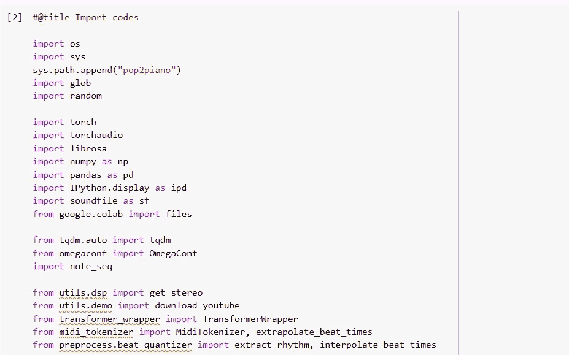

这个模块也需要很短的时间(取决于您的连接，因为它下载模板)

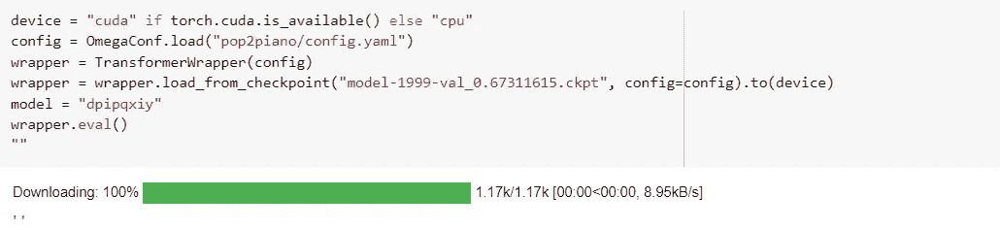

此块允许您选择编曲者。您可以在下拉菜单中选择您喜欢的作曲家(如果您需要一些指导，它们显示了项目网站上各种作曲家之间的差异)。

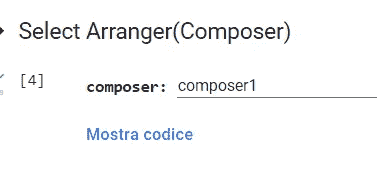

在这个模块中，您可以上传您想要创建钢琴封面的音轨(您可以在音频 WAV 和 MP3 之间进行选择，我使用的是从 Youtube 视频转换而来的 MP3)。

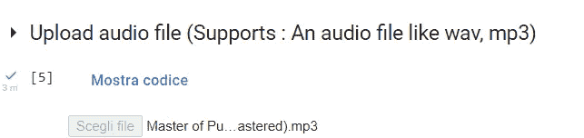

运行这段代码(应该不会花很长时间)。

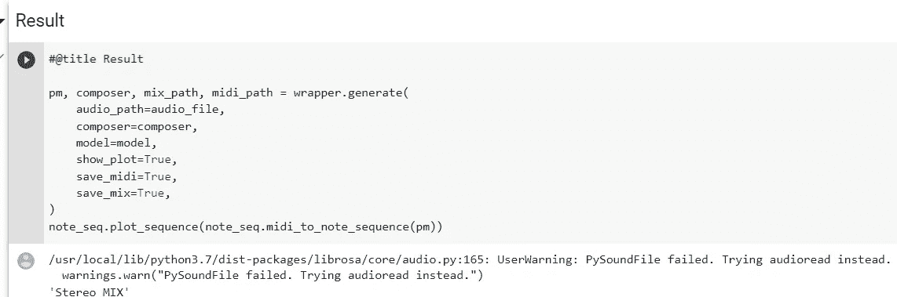

你只需要运行这个代码来下载钢琴盖(MIDI 格式)。你会发现它在原来的文件夹里。

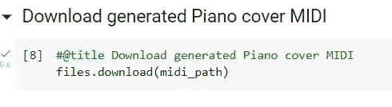

# 结论

所提出的模型，一旦一首歌曲被加载，就允许一首曲目被下载到 MIDI 中(请注意，它不像项目网站上的例子那样与人声同步)。我试过几首歌，它在流行歌曲中表现得很好，但在其他类型的歌曲中就不那么好了(例如，如果有一个很长的鼓点序列)。

总的来说，结果是有趣的，特别是考虑到架构和参数数量不是很大(只有 5000 万个参数)的事实。正如我们所见，[微软也推出了一个产生音乐的模型](/mlearning-ai/microsofts-museformer-ai-music-is-the-new-frontier-8dc5cb24459c)，而[谷歌本身也在投资同一领域](https://pub.towardsai.net/googles-audiolm-generating-music-by-hearing-a-song-s-snippet-c9512a9290cd)。似乎继图像之后，音乐是下一个前沿领域。你怎么想呢?你试过吗？请在评论中告诉我。

# 如果你觉得有趣:

你可以寻找我的其他文章，你也可以 [**订阅**](https://salvatore-raieli.medium.com/subscribe) 在我发表文章时获得通知，你也可以在**[**LinkedIn**](https://www.linkedin.com/in/salvatore-raieli/)**上连接或联系我。**感谢您的支持！**

**这是我的 GitHub 知识库的链接，我计划在这里收集代码和许多与机器学习、人工智能等相关的资源。**

** [## GitHub - SalvatoreRa/tutorial:关于机器学习、人工智能、数据科学的教程…

### 关于机器学习、人工智能、数据科学的教程，包括数学解释和可重复使用的代码(python…

github.com](https://github.com/SalvatoreRa/tutorial) 

或者随意查看我在 Medium 上的其他文章:

 [## 用人工智能恢复你的图像

### 如何用 AI 轻松还原图像

medium.com](/mlearning-ai/restore-your-images-with-ai-669a333194ba)  [## 人工智能重新想象神话生物

### 受中世纪动物寓言启发的现代动物寓言。

medium.com](/illumination/ai-reimagines-mythical-creatures-49a57d5be909)  [## 人工智能如何帮助保存艺术品

### 艺术杰作随时都是风险；人工智能和新技术可以助一臂之力

towardsdatascience.com](https://towardsdatascience.com/how-ai-could-help-preserve-art-f40c8376781d)  [## 人工智能如何拯救亚马逊雨林

### 亚马逊正处于危险之中，人工智能可以帮助保护它

towardsdatascience.com](https://towardsdatascience.com/how-artificial-intelligence-could-save-the-amazon-rainforest-688fa505c455)  [## Mlearning.ai 提交建议

### 如何成为 Mlearning.ai 上的作家

medium.com](/mlearning-ai/mlearning-ai-submission-suggestions-b51e2b130bfb)**