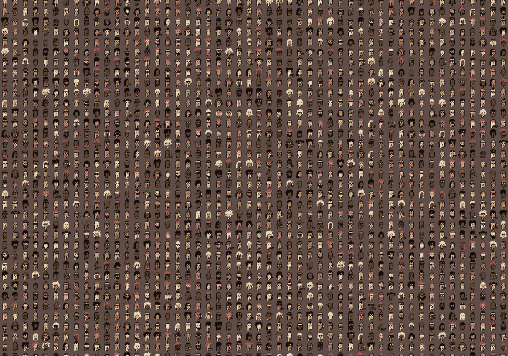

# 用深度卷积生成对抗网络生成 NFT 密码朋克

> 原文：<https://medium.com/mlearning-ai/generate-nft-cryptopunks-with-deep-convolutional-generative-adversarial-network-dcgan-db35f0a1adb4?source=collection_archive---------0----------------------->

# 介绍

NFT 是一种 [**不可替代的代币**](https://en.wikipedia.org/wiki/Non-fungible_token) ，可以在 [**以太坊**](https://en.wikipedia.org/wiki/Ethereum) 上交易和兑换的唯一代币。