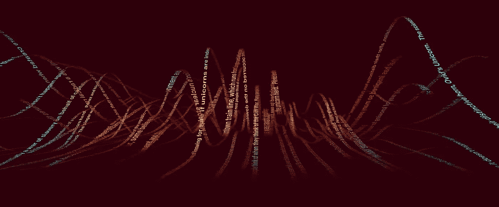

# 用 GPT-2 生成 NFT 密码朋克

> 原文：<https://medium.com/mlearning-ai/generate-nft-cryptopunks-with-gpt-2-generative-pre-training-transformer-4aa405b27bfd?source=collection_archive---------1----------------------->

# 介绍

NFT 是一种 [**不可替代的代币**](https://en.wikipedia.org/wiki/Non-fungible_token) ，可以在 [**以太坊**](https://en.wikipedia.org/wiki/Ethereum) 上交易和兑换的唯一代币。

[**crypto 朋克**](https://www.larvalabs.com/cryptopunks) 是一万个独特的可收藏角色的集合，每个角色都是一个 24x24 像素、8 位风格的独特头像，其所有权证明存储在以太坊区块链上。他们的…