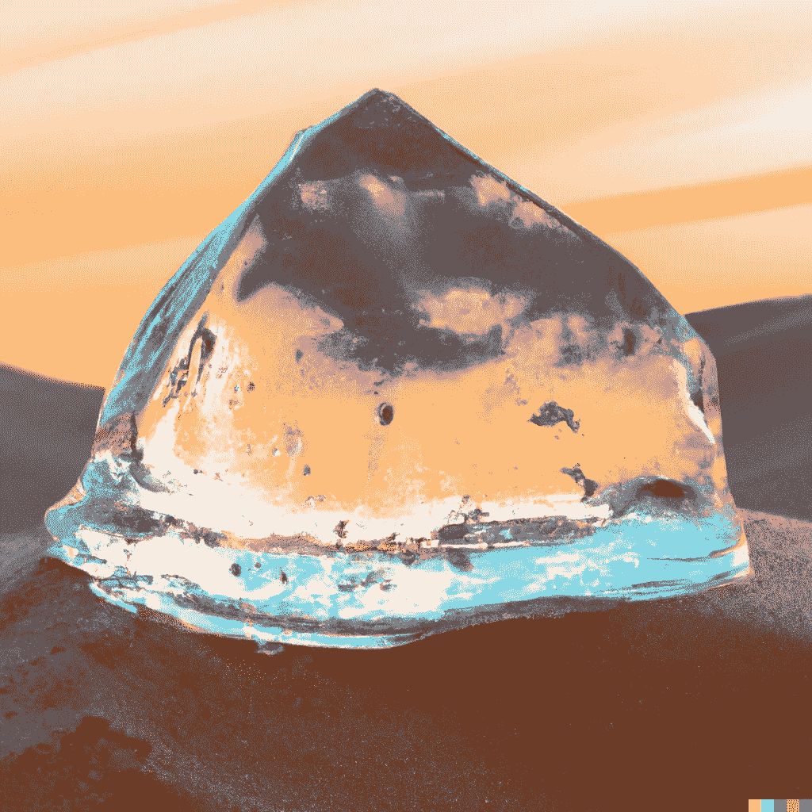

# 实时生成逼真的人工智能视频

> 原文：<https://medium.com/mlearning-ai/generate-photo-realistic-ai-videos-in-real-time-512f8dc554d9?source=collection_archive---------3----------------------->

## [机器学习艺术](https://mlearning.substack.com)

## 新的视频到视频合成框架代码

[AI — Video Generation Platform](https://mlearning.substack.com/p/top-features-of-dalle-3?r=z7zu8&s=w&utm_campaign=post&utm_medium=web)

## [人工智能能生成视频吗？](/mlearning-ai/can-ai-generate-3d-videos-10dbe76e73c3)

**视频到视频**合成(vid2vid)旨在从一系列语义地图中制作出照片般逼真的视频。这项任务可以用于广泛的事情，如使面对面交谈…