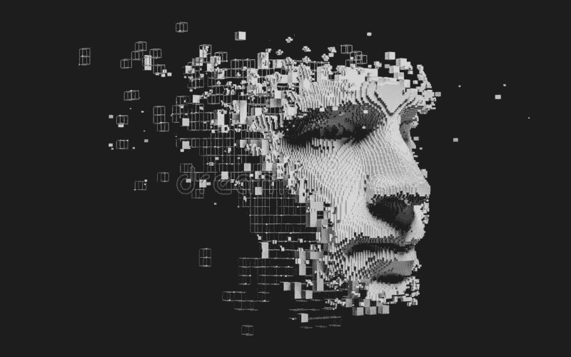

# 用深度卷积生成对抗网络生成合成图像

> 原文：<https://medium.com/mlearning-ai/generate-synthetic-images-with-deep-convolutional-generative-adversarial-network-dcgan-424528b3477b?source=collection_archive---------1----------------------->

([Dreamstime](https://www.dreamstime.com/abstract-digital-human-face-abstract-digital-human-face-artificial-intelligence-concept-big-data-cyber-security-d-image161583263))

# 介绍

[***爱德蒙·德·贝拉米* (2018)**](https://en.wikipedia.org/wiki/Edmond_de_Belamy) 的肖像是一幅人工智能生成的艺术品，以 43.2 万美元的惊人价格售出。它是利用 Ian Goodfellow 等人在 2014 年发明的**生成对抗网络(**[**GAN**](https://papers.nips.cc/paper/2014/file/5ca3e9b122f61f8f06494c97b1afccf3-Paper.pdf)**)**创建的。