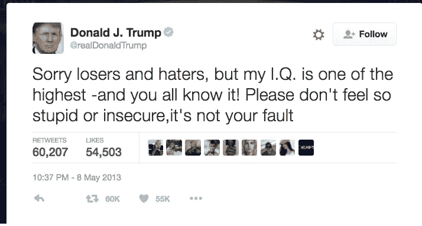

# 使用 LSTM 生成唐纳德·特朗普风格的推文/文本

> 原文：<https://medium.com/mlearning-ai/generate-tweets-text-in-donald-trump-style-using-lstm-2c83c328241c?source=collection_archive---------5----------------------->

你是唐纳德·特朗普推特的粉丝吗？在一个无聊阴沉的日子里，你有没有浏览他的推特来获取你的那份娱乐？你在推特上想念他吗？我知道。所以，我在想，是否所有这些复杂的深度学习算法都可以学习并接受训练，以生成一些唐纳德·特朗普风格的推文。你觉得这很吸引人吗？如果答案是“是”，那么你就在右边…