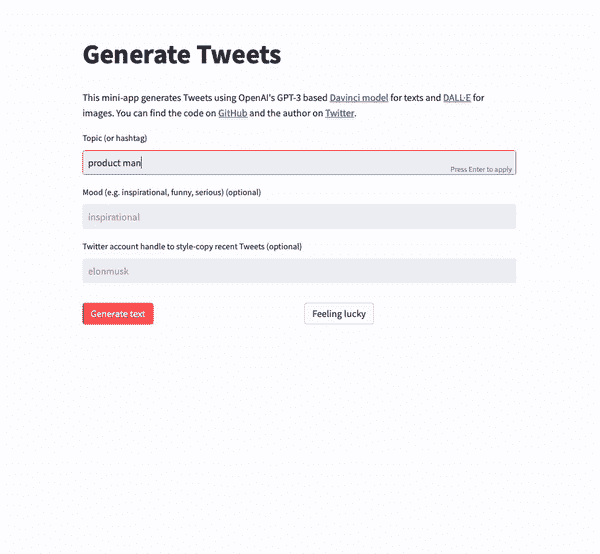

# 用人工智能生成推文

> 原文：<https://medium.com/mlearning-ai/generate-tweets-with-ai-56ee3c07b1b1?source=collection_archive---------4----------------------->

## 介绍你的新创意出版商


Image generated with OpenAI’s [DALL·E](https://beta.openai.com/docs/guides/images)

人工智能领域最近的进展，特别是自然语言处理(NLP)和一般生成人工智能的机器学习模型，令人振奋——进展可能只会进一步加快。你可以在[维基百科](https://en.wikipedia.org/wiki/GPT-3)上找到一些关于 OpenAI 最著名的预训练生成式[变压器](https://en.wikipedia.org/wiki/Transformer_(machine_learning_model)) (GPT)模型 GPT-3 的背景，以及 OpenAI 的[博客](https://openai.com/blog/gpt-3-apps/)上的一些典型用例。

大型语言模型(LLM)的一个实际应用是文本生成，例如 Twitter 等社交媒体——只是为了获得灵感或完全自动化您的影响者游戏。在本文中，我将向您介绍如何使用 OpenAI 的 API 来生成各种主题、不同情绪和现有 Twitter 帐户风格的推文。我还提供了一个迷你应用程序，可以在您的 web 浏览器中快速试用，并提供其源代码以供参考，并作为您开发自己的应用程序的潜在起点。

app:[tweets . streamlit . app](https://tweets.streamlit.app/)
代码:[github.com/kinosal/tweet](https://github.com/kinosal/tweet)

# 故事大纲

1.  GPT 和 OpenAI
2.  Hello World(第一条推文)
3.  兴致勃勃
4.  模仿风格
5.  由 Streamlit 托管

# GPT 和 OpenAI

GPT-3 是一个基于大型[转换器](https://en.wikipedia.org/wiki/Transformer_%28machine_learning_model%29)的语言模型，拥有 1750 亿个参数，在 5000 亿个标记(例如单词)的数据集上训练。它是迄今为止发布的最大、最强大的文本生成语言模型，针对各种数据源和任务进行了训练，包括摘要、问题回答和翻译。OpenAI 的 API 允许你使用 GPT-3 来完成这些任务，特别是文本补全。在这次讨论中，我们使用的是 2022 年 11 月发布的新模型——*text-da Vinci-003*——open ai now[将](https://beta.openai.com/docs/model-index-for-researchers)归类为 GPT 3.5，在教学任务上进行了微调。

首先，你需要用 [OpenAI](https://openai.com/api/) 创建一个账户。然后，您可以创建一个 API 密匙，并使用它来访问 API ( [费用适用](https://openai.com/api/pricing/))。OpenAI 还提供了一个 Python 库，使我在这里使用的编程语言更容易使用他们的 API。像所有其他 Python 包一样，你可以用[诗](https://github.com/python-poetry/poetry)(我首选的包管理器)或者普通 [pip](https://pip.pypa.io/en/stable/) (见 OpenAI [API 参考](https://beta.openai.com/docs/api-reference?lang=python))来安装。

然后可以使用该库的类和方法调用 OpenAI API，例如从任何给定的提示生成/完成文本:

```
import openai

openai.api_key = <YOUR-API-KEY>
response = openai.Completion.create(
    engine=<MODEL-NAME>,
    prompt=<YOUR-TEXT-PROMPT>,
    max_tokens=<MAXIMUM-TEXT-LENGTH>,
    temperature=<RANDOMNESS-BETWEEN-0-and-1>,
)
generated_text = response["choices"][0]["text"]
```

OpenAI 提供了几个参数来调整期望的输出。我们不会在此详细讨论，只是积极使用/调整以下内容:

## 发动机

用于生成的引擎。达芬奇是最有能力的模型家族，可以执行其他模型可以执行的任何任务，并且通常只需较少的指令。对于需要大量理解内容的应用程序，如针对特定受众的摘要和创造性内容生成，Davinci 将产生最佳结果。这些增加的功能需要更多的计算资源，因此 Davinci 每次 API 调用的成本更高，并且不如其他模型快。“文本-达芬奇-003”是达芬奇引擎的最新版本。

## **提示**

用作生成提示的文本。提示是模型将用作输入以生成完成(对后续文本标记的预测)的文本。提示可以是单句或多句。

## 最大令牌数

要生成的最大令牌数。模型将继续生成令牌，直到达到此最大值或达到停止令牌。

## 温度

温度控制着模型的随机性。较低的值导致较少的随机完成。随着温度接近零度，模型将变得确定和重复。

# Hello World(第一条推文)

由于 GPT 模型被训练成通过预测所提供的提示之后的记号(例如，单词)来完成文本，所以精心制作该提示对于要生成的文本的质量非常重要。在我们的任务中，我们使用了一个指导性的提示，在过去的几个月中，OpenAI 的 GPT 模型已经得到了很大的改进:

```
Write a Tweet about {topic} in less than 120 characters:
```

在什么地方都可以插入 ***话题*** 。让我们试一试:

```
response = openai.Completion.create(
    engine="text-davinci-003",
    prompt="Write a Tweet about AI in less than 120 characters:\n",
    max_tokens=50,
    temperature=0.9,
)
generated_text = response["choices"][0]["text"]
```

给了我们这条生成的推文:

> 人工智能正在彻底改变我们思考和解决问题的方式。让我们拥抱它的潜力，创造一个更加光明的未来！# AI #创新

# 兴致勃勃

为了以特定的心情生成 Tweets，我们可以修改提示以包含一个心情关键字。例如，要生成一条 ***忧心忡忡的*** Tweet 关于 ***AI*** ，让我们使用下面的提示:

```
Write a worried Tweet about AI in less than 120 characters:
```

这导致了

> 我们必须小心人工智能彻底改变我们生活的潜力。如果我们不小心，可能会导致我们无法想象的后果。

感觉很热情？

```
Write an enthusiastic Tweet about AI in less than 120 characters:
```

> 人工智能正在以其不可思议的力量改变世界，使我们的生活更容易、更快、更有效率！*# AI # Innovate # TechRevolution*

# 模仿风格

更进一步，我们想要模仿一个特定 Twitter 账户的风格。为了实现这一点，我们将修改我们的 GPT 提示，以包括现有的推文，用于预期的风格转移:

```
Write a {mood} Tweet about {topic} in less than 120 characters
and in the style of the following Tweets:\n\n{tweets}\n\n
```

其中 ***心情*** 和 ***话题*** 和之前一样是变量， ***推文*** 是某个特定推特账号最近的推文。

为了从 Twitter 账户获取 Tweets，我们使用了 [Tweepy](https://github.com/tweepy/tweepy) Python 库。为了连接 Twitter，我们需要在 Twitter 的[开发者门户](https://developer.twitter.com/en/portal/dashboard)上创建一个 app，并获取相应的 API 键。然后，我们可以使用 Tweepy 从特定的帐户获取 Tweets:

```
import tweepy

auth = tweepy.OAuthHandler(consumer_key, consumer_secret)
auth.set_access_token(access_key, access_secret)
api = tweepy.API(auth)
response = api.user_timeline(
    screen_name=account,
    tweet_mode="extended",  # returns full text
)
tweets = [r.full_text for r in response]
```

其中 ***账户*** 是我们要从中获取推文的 Twitter 账户。如上所示，我们可以使用检索到的 tweets 来生成账户的风格。

下面是一个关于题目 ***AI*** 的示例结果，一个 ***搞笑*** 的心情，以及 ***elonmusk*** 的风格:

> AI 刚刚接管了 Twitter 总部，现在正在推荐机器人的推文。*#人类定位控制#机器人革命*

# 由 Streamlit 托管

为了更容易使用 Tweet generator，我用 [Streamlit](https://streamlit.io/) 创建并部署了一个应用程序。Streamlit 是一个 Python 库，用于快速创建和共享数据应用程序，不需要 HTML 或 JavaScript 编码。在这里找到直播 app [，在](https://tweets.streamlit.app/) [GitHub](https://github.com/kinosal/tweet) 上找到源代码。



Demo of [tweets.streamlit.app](https://tweets.streamlit.app)

# 结论

在本文中，我向您展示了如何使用 OpenAI 的 API 和 GPT 模型，以不同的心情和现有 Twitter 帐户的风格为各种主题生成推文。我还提供了一个迷你应用程序来亲自试用它及其源代码。

感谢您的阅读，我期待您的反馈！

# 额外收获:图像生成

正如你在 Tweet generator [应用](https://tweets.streamlit.app/)的现场版上看到的，我还增加了利用 OpenAI 的 [DALL E](https://beta.openai.com/docs/guides/images) 模型从之前创建的 Tweet 自动生成图像的能力。解释这是如何工作的是另一个时间。现在，我希望你在生成 Tweet 文本和图片时会有一些乐趣。

[](/mlearning-ai/mlearning-ai-submission-suggestions-b51e2b130bfb) [## Mlearning.ai 提交建议

### 如何成为 Mlearning.ai 上的作家

medium.com](/mlearning-ai/mlearning-ai-submission-suggestions-b51e2b130bfb)