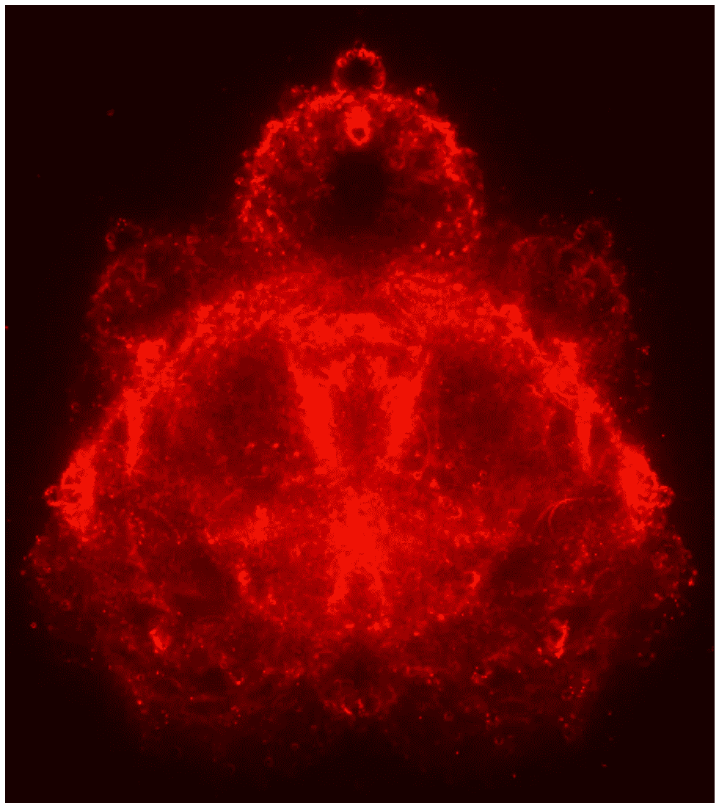
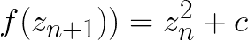
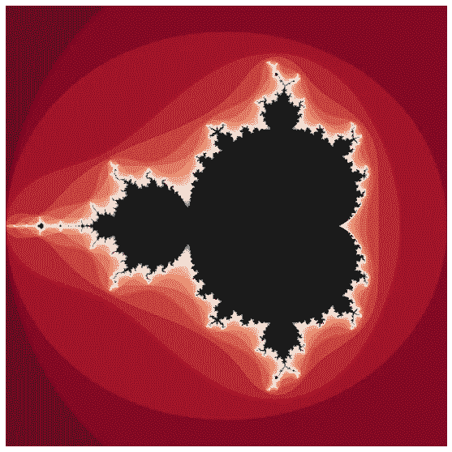
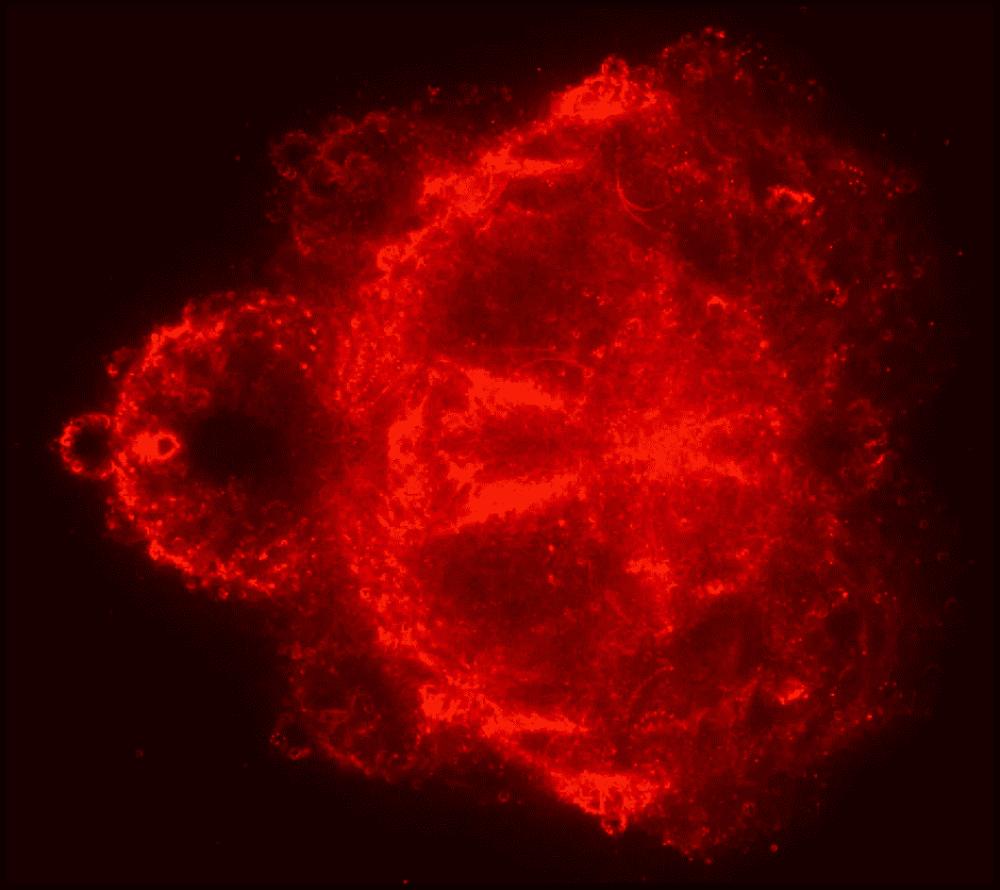
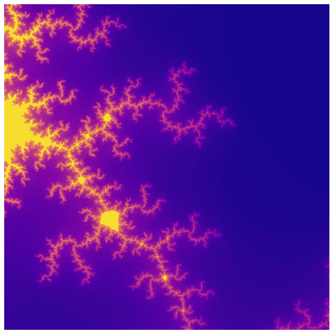
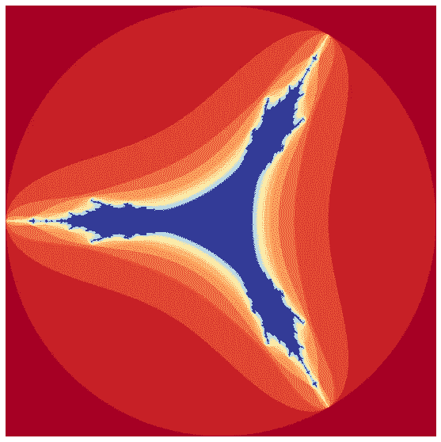
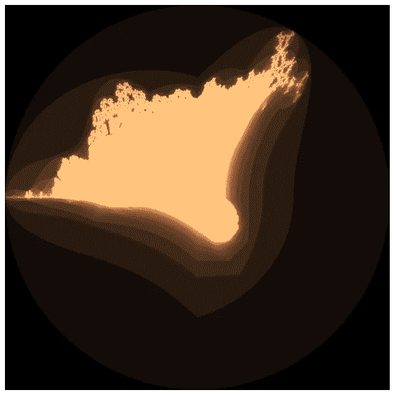
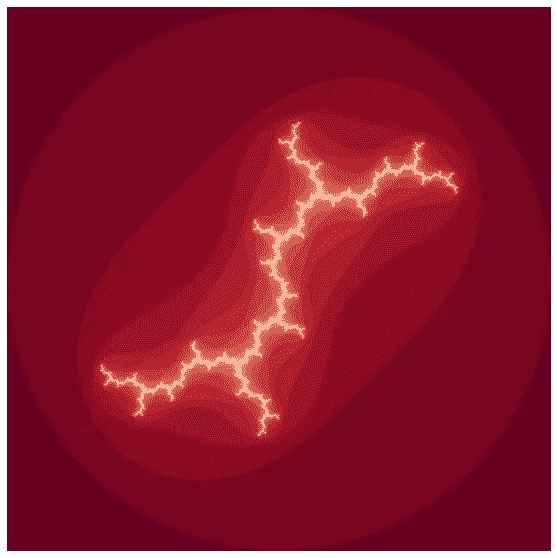
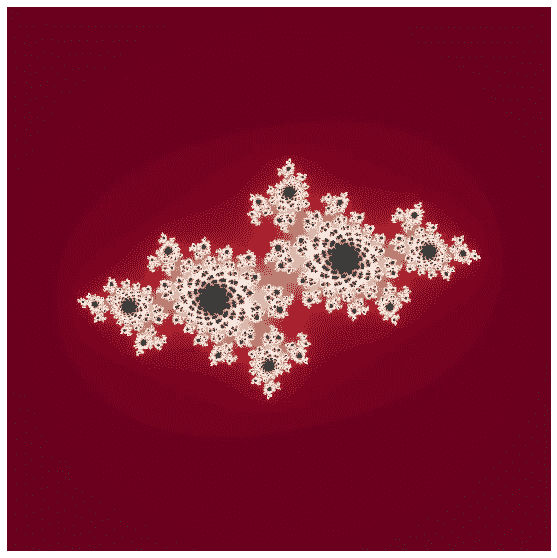
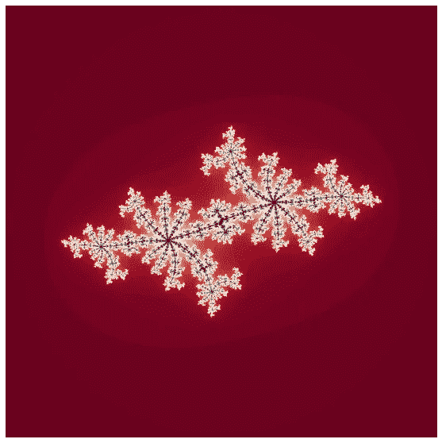

# 用 python 生成佛

> 原文：<https://medium.com/mlearning-ai/generating-buddha-with-computation-401c6cb35bb5?source=collection_archive---------2----------------------->

## 数学和神学的交叉

Buddhabrot using python. Image by Author.

在本文中，我们将介绍如何使用 Python 和 NumPy 生成 Mandelbrot 和 Buddhabrot。生成 buddhabrot 是计算密集型的，在本文中，我提供了一种生成 Buddha brot 的优化方法，并以直观的方式理解其背后的数学原理。

斯里尼瓦瑟·拉马努金是一位自学成才的印度数学家，以其在数论、无穷级数和连分数方面的工作而闻名。 ***Ramanujan 把他巨大的数学能力归功于神性*** ，并说他展示的数学知识是由他的[家庭女神](https://en.wikipedia.org/wiki/Namagiri_Thayar)透露给他的。

我引用他的话，

> 一个方程式对我来说毫无意义，除非它表达了上帝的思想。—斯里尼瓦瑟·拉马努金

如果你要用一个数学方程式来表达神性，最接近的应该是佛教方程式。

他还说，

> 睡着的时候，我有了一次不寻常的经历。有一个红色的屏幕形成了流动的血液，可以说。我在观察它。突然一只手开始在屏幕上写字。我成了众人瞩目的焦点。那只手写了一些椭圆积分。它们深深印在我的脑海里。我一醒来，就让他们开始写作。—斯里尼瓦瑟·拉马努金

# 艺术和机器学习

> 生成艺术，是机器学习的对立面。

在机器学习中，你需要一个复杂的数学方程，就像来自依赖于数十亿参数的深度神经网络的方程，并使用它来执行简单的人类任务，比如将图片分类为猫或狗。生成艺术恰恰相反。 ***它采用朴实无华的数学方程，生成令人叹为观止的复杂人类视觉*。**

# 曼德尔布罗特

伯努瓦·曼德尔布罗(1924-2010)发明了曼德勃罗集合。他创造了术语*分形*，是分形几何中最有影响力的人物。虽然有几个不同的兄弟，但曼德勃罗是所有兄弟的母亲。 ***要理解如何生成佛法，我们就必须先理解曼德尔布罗。***

## 解释一下，就像我五岁一样

当你把一个数和它本身相乘时，它会变大。当你重复几次，这个数字会很快变大。

比如拿 2 来说。当你这样做，2 x 2 你得到 4，如果你重复这个操作，你得到 16(4 x 4)，256(16 x 16)，等等，数字开始爆炸和发散。另一方面，小于 1 的数字会迅速缩小并接近 0。比如取 0.5，收敛到 0.25，0.0625，0.00390625。像 1 这样的数字不会发散或收敛，非常接近 1 的数字增长或收缩非常缓慢。

> 收敛的数属于 mandelbrot 集。它们的颜色不同于分叉的数字，创造了视觉上丰富的递归模式。

在上面的例子中，不是简单的数字 2，而是一个复数 z，不是应用一个平方它的函数，而是

Mandelbrot equation. Image by Author.

当我们重复 n 次迭代，然后绘制结果值时，您将获得 Mandelbrot 可视化。

## 解释，就像我是一个程序员

****

按照下面给出的步骤生成 Mandelbrot 集合，

1.  创建一个 m x n NumPy 数组来保存数字发散的迭代`n`。例如，如果您要绘制 500 x 500 的图像，请用零初始化形状 500 x 500 的 NumPy 数组。
2.  现在，对于数组中的每个元素，将 z 初始化为`0`，将 c 初始化为一个复数`np.complex(i, j)`，其中 I 和 j 是 x 和 y 的范围。`(-2, 1)`是曼德勃罗集合的 x 范围，`(-1.5, 1.5)`是 y 范围。
3.  在 Mandelbrot 方程上递归循环，直到两者之一出现。要么复数 z 达到发散条件，要么达到最大迭代，这就是`np.abs(z) >= 2`

Mandelbrot — Iterate, diverge logic

> 起初这似乎难以置信，如此简单的计算会导致如此丰富的可视化。

Side by side comparision of Mandelbrot and Buddhabrot. **Fig 1:** Mandelbrot with colormap ‘RdGy’. **Fig 2:** Buddhabrot with colormap ‘hot’. Images by Author.

# 佛教

Buddharbrot 与 mandelbrot 完全相反。在 mandelbrot 中，集合的元素形成 Mandelbrot 集合。然而，在佛教中，兴趣点是那些分叉的点，特别是它们是如何分叉的。

> Buddhabrot 是 Mandelbrot 的概率变异。这是一个可视化的点，汇聚和他们的轨迹无穷。

佛教一代略有不同。首先，我们生成一个不在 Mandelbrot 集合中的复数列表，然后尝试记录它们的轨迹如何发散到无穷大。

## 步骤 1:生成非 Mandelbrot 集合

**Step 1:** Generate Non Manderlbrot set

## 步骤 2:迭代并存储轨迹

**Step 2:** Iterate and store trajectories

## 兄弟奇妙世界:

在这篇文章中，我们仅仅触及了兄弟们的皮毛。我对它们研究得越多，我的发现就越多。以下是其他不太出名的兄弟的名单，可能会让你觉得有趣。这些兄弟类似于 Mandelbrot，***唯一的区别是递归函数 f(z)不同*。**

例如，在下图中，Tricorn brot 是使用递归函数`np.conjugate(z ** 2) + c`而不是传统函数`z ** 2 + c`生成的。

**Fig 1:** Mandelbrot zoomed in on coordinates (-0.02, 0.02), (0.780, 0.820). **Fig 2:** Tricorn brot. Images by Author. **Fig 3:** Burning ship brot. Images by Author.

## 朱莉娅集:

Julia 集的工作原理与 Mandelbrot 集非常相似。 ***唯一不同的是，我们不是把 z 复数初始化为*** `***0+0i***` ***，而是用*** `***x + yi***`来初始化，基于 x 和 y 的不同取值我们会得到不同的结果。

**Fig 1:** Dendrite fractal (0 + 1i), **Fig 2**: Galaxy fractal (-0.75 -0.2i) **Fig 3**: Frost fractal (-0.7 + 0.35i). Images by Author.

## 参考资料:

1.  [*http://en.wikipedia.org/wiki/Mandelbrot_set#Optimizations*](http://en.wikipedia.org/wiki/Mandelbrot_set#Optimizations)
2.  [http://Jaran . de/goodbits/2011/09/25/so-what-a-Buddha brot-anyway/](http://jaran.de/goodbits/2011/09/25/so-what-is-a-buddhabrot-anyway/)
3.  [https://en.wikipedia.org/wiki/Buddhabrot](https://en.wikipedia.org/wiki/Buddhabrot)
4.  [https://benedikt-bitterli.me/buddhabrot/](https://benedikt-bitterli.me/buddhabrot/)
5.  [https://www . quora . com/What-is-a-Mandelbrot-set-in-simple-language](https://www.quora.com/What-is-a-Mandelbrot-set-in-simple-language)