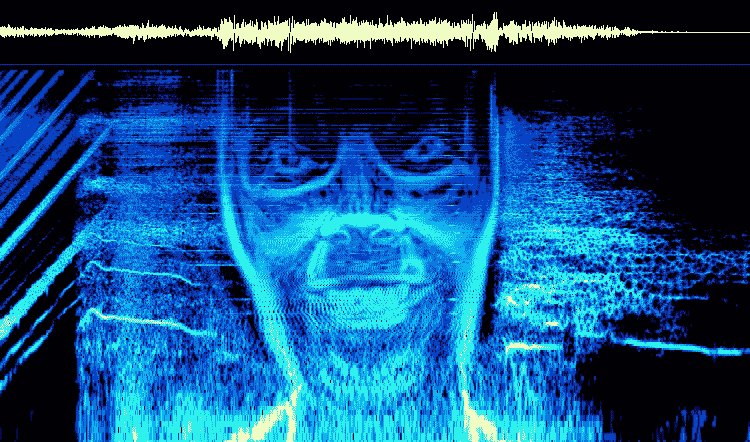
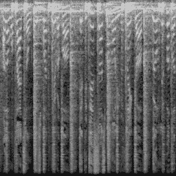

# 使用图像生成音乐

> 原文：<https://medium.com/mlearning-ai/generating-music-using-images-13bdf1c78437?source=collection_archive---------1----------------------->

## 拥抱脸的新`diffusers`包

Aphex Twin embedded a self-portrait in the spectrogram of Equation (image credit [Jarmo Niinisalo](http://www.bastwood.com/?page_id=10))

[ **更新**:我还在音乐中使用的 3 万个样本上训练了模型，这些样本来自 [WhoSampled](https://whosampled.com) 和 [YouTube](https://youtube.com) 。这个想法是，这个模型可以用来生成循环或“中断”,这些循环或“中断”可以被采样来制作新的轨迹。人们(“挖箱子的人”)会不遗余力或者愿意花大价钱来打破旧记录。]

最近深度学习模型在图像生成( [DALL-E 2](https://openai.com/dall-e-2/) 、 [MidJourney](https://www.midjourney.com/home/) 、 [Imagen](https://imagen.research.google/) 、 [Make-A-Scene](https://ai.facebook.com/blog/greater-creative-control-for-ai-image-generation/) 等领域的改进让我感到惊讶。)和文字生成( [GPT-3](https://openai.com/api/) 、[布鲁姆](https://huggingface.co/bigscience/bloom)、[巴特](https://huggingface.co/facebook/bart-large)、 [T5](https://huggingface.co/google/t5-v1_1-xl) 等。)但与此同时，对音频生成相对缺乏进展感到惊讶。我想到了两个值得注意的例外: [MuseNet](https://openai.com/blog/musenet/) 将乐谱视为连续令牌(类似于文本)并利用 GPT-2，而[点唱机](https://openai.com/blog/jukebox/)和 [WaveNet](https://www.deepmind.com/blog/wavenet-a-generative-model-for-raw-audio) 从原始波形中生成音乐。即便如此，音频代落后是因为人们对它的兴趣减少，还是因为它本质上更具挑战性？

不管是哪种情况，通过 [mel 光谱图](https://en.wikipedia.org/wiki/Mel-frequency_cepstrum)，音频可以很容易地转换成图像，反之亦然。

Left as an exercise for the reader to determine which song this was taken from.

频谱图的水平轴是时间，垂直轴是频率(在对数标度上)，阴影表示振幅(也在对数标度上)。梅尔声谱图应该与人耳感知声音的方式非常接近。

如果我们现在可以使用人工智能轻松生成令人信服的名人照片，为什么不尝试生成可信的光谱图并将它们转换成音频呢？这正是我使用新的拥抱脸`diffusers`包所做的。

## TL；速度三角形定位法(dead reckoning)

那么，它的效果如何呢？查看一些自动生成的循环:

你也可以在 Google Colab 上为自己创造更多

 [## 谷歌联合实验室

### 音频扩散

colab.research.google.com](https://colab.research.google.com/github/teticio/audio-diffusion/blob/master/notebooks/test_model.ipynb) 

你可以从我的 Spotify“喜欢”播放列表的近 500 首歌曲(约 20，000 个频谱图)中选择一个模型，或者从音乐中使用的 30，000 个样本中选择一个模型。

## 告诉我更多…

 [## GitHub - teticio/audio-diffusion:使用新的…应用去噪扩散概率模型

### 应用去噪扩散概率模型使用新的拥抱脸扩散包来合成音乐，而不是…

github.com](https://github.com/teticio/audio-diffusion) 

在上面的报告中，您将发现一些实用工具，可以从音频文件目录中创建一个声谱图图像数据集，训练一个模型来生成类似的声谱图，并将生成的声谱图转换为音频。您还可以找到允许您摆弄预先训练好的模型的笔记本。

如果你对模型的细节感兴趣，那么我推荐你阅读[的去噪扩散概率模型](https://arxiv.org/abs/2006.11239)论文。根据开放人工智能的说法，[扩散模型在他们自己的游戏](https://arxiv.org/pdf/2105.05233.pdf)中击败了甘斯。基本思想是训练一个模型来从被高斯噪声破坏的版本中恢复图像。例如，如果用名人的照片来训练模型，它将学习什么是典型的(或者也许不那么典型！)五官长得像。为了生成一个名人的随机脸，该模型被给予一个完全随机的图像，并且每次运行时，输出图像比以前稍微少一些噪声，看起来更像一张脸(或者在我们的情况下是一个声谱图)。

为了简单起见，我选择创建 256 x 256 像素的方形声谱图图像，这相当于五秒钟的合理质量音频。我使用 Hugging Face 的`accelerate`包将这些批次分割成碎片，以便安装在我的单个 RTX 2080 Ti GPU 上。培训持续了大约 40 个小时。

请记住，我的 Spotify 播放列表有点混合了不同风格的音乐。我觉得使用我非常熟悉的训练数据集很重要，这样我就能够判断模型产生了多少数据，以及有多少数据是回流的(而且我很有可能真的喜欢这些结果)。同样，名人数据集相对同质，例如，用纯钢琴音乐或纯电子音乐来训练模型，以查看它是否能够学习关于特定流派的任何东西，这将是有趣的。

## 下一步是什么？

随着采样器的出现，音乐永远地改变了。起初它们是有争议的，一个叫做 Quest 的部落必须支付“我能踢它吗？”的所有收益去卢·里德看《荒野大镖客》的样片(T1)，但之后他们被几乎所有类型的电影所接受(T3)。找到一个新的钩子来取样可能是一笔大生意，那么为什么不使用人工智能来创造新的钩子呢？我想看到的是相当于 DALL-E 2 和公司，但对于即时驱动的音频生成…

 [## Mlearning.ai 提交建议

### 如何成为 Mlearning.ai 上的作家

medium.com](/mlearning-ai/mlearning-ai-submission-suggestions-b51e2b130bfb)