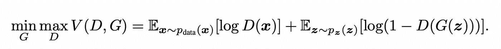
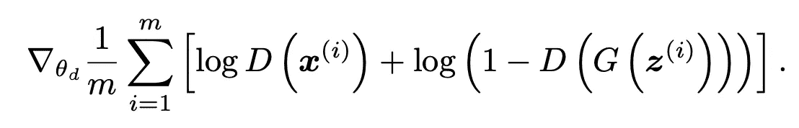
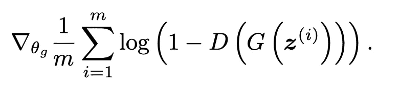

# 生成逼真的人脸

> 原文：<https://medium.com/mlearning-ai/generating-realistic-human-faces-3e5fa40c76b3?source=collection_archive---------11----------------------->

机器学习可能是当今最通用的领域之一，但同时也可能是最不稳定的领域之一。任何领域的新发现都可以动摇基础，并导致该领域的新研究。例如计算机视觉的 ConvNet 的引入。构建 ConvNet 是为了从图像中提取特征，但现在它也被用于处理顺序数据，这项任务以前非常适合 LSTM 和 RNN。目前，机器学习最有前途的领域包括无监督学习，更具体地说，包括生成模型，如 GANs(生成对抗网络)和变压器神经网络。今天，我将解决使用生成对抗性神经网络生成人脸的问题。

# 甘斯的一点背景:

生成对抗性神经网络是 Ian Goodfellow 在 2014 年提出的一种理论，此后在机器学习领域获得了许多应用。它可以用于从图像数据集生成图像，这是它的主要目的，但是生成模型也可以用于强化学习(更多信息:[https://simons.berkeley.edu/talks/tbd-241](https://simons.berkeley.edu/talks/tbd-241))。生成模型通过使两个模型相互对立来工作。这使得该模型非常适合无监督学习，但也使得该模型在没有大量数据的情况下极其不稳定并且难以收敛。该模型通过一个生成器和一个鉴别器来工作。鉴别器的工作是区分生成器生成的图像和数据集。生成器的工作是从作为输入提供给生成器的潜在空间生成图像。它试图生成与数据集足够相似的图像来欺骗鉴别器。

感谢约瑟夫·罗卡的精彩解释。

# 生成模型背后的数学:

我们之前在高层次上探索了一般对抗性网络的基础，现在让我们通过分析伊恩·古德费勒在他的论文《生成对抗性网络》(【https://arxiv.org/pdf/1406.2661.pdf】)中提出的数学来深入研究生成模型的数学和基础。在他的论文中，他提出了这个数学方程式:



Math equation for GANs from Ian Goodfellow’s paper

函数 D(x)指的是鉴频器接收真实图像并输出一个值，该值随后被对数函数缩放以返回 0 和 1 之间的值。在 log(1-D(G(z))中也发生同样的情况，该函数接收发生器模型的输出并返回从 1 减去的缩放后的值，该值返回从 0 到 1 的标度下端的值。



Math equation for Discriminator gradient from Ian Goodfellow’s paper

输入由鉴别器产生的真实图像的 x 值和伪图像的 G(z)值，该值再次由对数函数缩放。



Math Equation for generator gradient

发生器被输入一个随机噪声矢量(z ),其输出随后被传递到鉴别器函数，该函数使用对数函数来缩放该值。

该模型分批训练，首先训练鉴别器 n 步，之后训练停止，生成模型开始训练，试图从高斯噪声生成图像，试图用它认为与数据库中的图像相同的图像欺骗鉴别器。

# GAN 的实施:

GAN 的实现非常简单，但是如果使用 Tensorflow 这样的高级 api，它的长度仍然很长。

```
discriminator = keras.Sequential([keras.Input(shape=(128, 128, 3)),keras.layers.Conv2D(filters=64, kernel_size=4, strides=2, padding='same'),keras.layers.LeakyReLU(alpha=0.2),keras.layers.Conv2D(filters=128, kernel_size=4, strides=2, padding='same'),keras.layers.LeakyReLU(alpha=0.2),keras.layers.Conv2D(filters=128, kernel_size=4, strides=2, padding='same'),keras.layers.LeakyReLU(alpha=0.2),keras.layers.Flatten(),keras.layers.Dropout(0.2),keras.layers.Dense(units=1, activation='sigmoid')],name='discriminator')discriminator.summary()
```

鉴别器遵循与深度卷积神经网络相似的模型，这允许它在鉴别生成的图像和来自数据集的图像时具有更好的准确性。

```
latent_dim = 128generator = keras.Sequential([keras.Input(shape=latent_dim),keras.layers.Dense(16*16*128),keras.layers.Reshape((16, 16, 128)),layers.Conv2DTranspose(128, kernel_size=4, strides=2, padding="same"),layers.LeakyReLU(alpha=0.2),layers.Conv2DTranspose(256, kernel_size=4, strides=2, padding="same"),layers.LeakyReLU(alpha=0.2),layers.Conv2DTranspose(512, kernel_size=4, strides=2, padding="same"),layers.LeakyReLU(alpha=0.2),keras.layers.Conv2D(3, kernel_size=4, padding='same', activation='sigmoid')],name='generator')generator.summary()
```

生成器遵循与全连接神经网络相似的模型，具有 conv2d 转置层，返回大小为输入张量两倍的张量。

```
class GAN(keras.Model):def __init__(self, discriminator, generator, latent_dim):super(GAN, self).__init__()self.discriminator = discriminatorself.generator = generatorself.latent_dim = latent_dimdef compile(self, d_optimizer, g_optimizer, loss_fn):super(GAN, self).compile()self.d_optimizer = d_optimizerself.g_optimizer = g_optimizerself.loss_fn = loss_fnself.d_loss_metric = keras.metrics.Mean(name="d_loss")self.g_loss_metric = keras.metrics.Mean(name="g_loss")@propertydef metrics(self):return [self.d_loss_metric, self.g_loss_metric]def train_step(self, real_images):# Sample random points in the latent spacebatch_size = tf.shape(real_images)[0]random_latent_vectors = tf.random.normal(shape=(batch_size, self.latent_dim))# Decode them to fake imagesgenerated_images = self.generator(random_latent_vectors)# Combine them with real imagescombined_images = tf.concat([generated_images, real_images], axis=0)# Assemble labels discriminating real from fake imageslabels = tf.concat([tf.ones((batch_size, 1)), tf.zeros((batch_size, 1))], axis=0)# Add random noise to the labels - important trick!labels += 0.05 * tf.random.uniform(tf.shape(labels))# Train the discriminatorwith tf.GradientTape() as tape:predictions = self.discriminator(combined_images)d_loss = self.loss_fn(labels, predictions)grads = tape.gradient(d_loss, self.discriminator.trainable_weights)self.d_optimizer.apply_gradients(zip(grads, self.discriminator.trainable_weights))# Sample random points in the latent spacerandom_latent_vectors = tf.random.normal(shape=(batch_size, self.latent_dim))# Assemble labels that say "all real images"misleading_labels = tf.zeros((batch_size, 1))# Train the generator (note that we should *not* update the weights# of the discriminator)!with tf.GradientTape() as tape:predictions = self.discriminator(self.generator(random_latent_vectors))g_loss = self.loss_fn(misleading_labels, predictions)grads = tape.gradient(g_loss, self.generator.trainable_weights)self.g_optimizer.apply_gradients(zip(grads, self.generator.trainable_weights))# Update metricsself.d_loss_metric.update_state(d_loss)self.g_loss_metric.update_state(g_loss)return {"d_loss": self.d_loss_metric.result(),"g_loss": self.g_loss_metric.result(),}
```

代码改编自 keras DCGAN 模型

我们可以创建一个名为 GAN 的类，它包含了训练生成模型所需的所有方法。在编译函数中，我们简单地实例化参数。真正复杂的行为是在 train_step 函数中。该功能包括两个阶段。

*   在第一阶段，我们向生成器输入高斯噪声来生成假图像，然后我们通过连接相同数量的真实图像来完成这一批。伪图像的目标设置为 0，真实图像的目标设置为 1(这些标签用于计算损失函数)。然后，我们在这一批上训练鉴别器。
*   在第二阶段，我们给 GAN 注入一些高斯噪声。然后，生成器开始生成假图像，同时鉴别器尝试猜测图像是真的还是假的。我们还创造了“误导标签”,让鉴别者相信假图像是真的

运行这段代码会产生非常接近的图像，由于生成器没有完全收敛，所以会有一些小瑕疵。

查看 mnist 上 tensorflow 的教程，自己实现 GAN:[https://www.tensorflow.org/tutorials/generative/dcgan](https://www.tensorflow.org/tutorials/generative/dcgan)

[](/mlearning-ai/mlearning-ai-submission-suggestions-b51e2b130bfb) [## Mlearning.ai 提交建议

### 如何成为 Mlearning.ai 上的作家

medium.com](/mlearning-ai/mlearning-ai-submission-suggestions-b51e2b130bfb) 

[成为 ML 作家](/mlearning-ai/mlearning-ai-submission-suggestions-b51e2b130bfb)