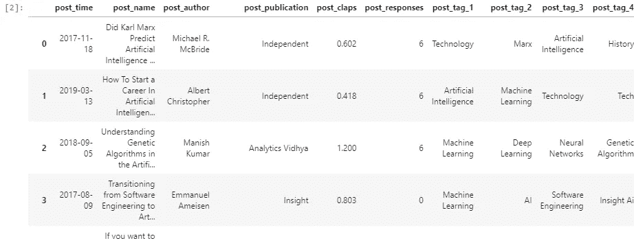
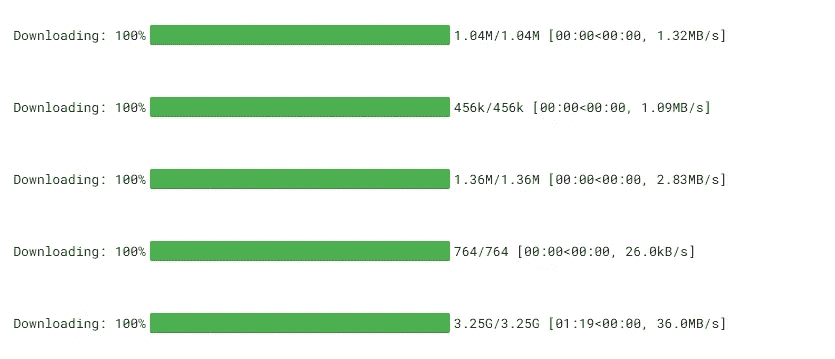
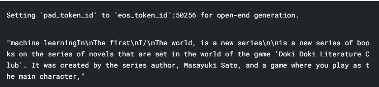
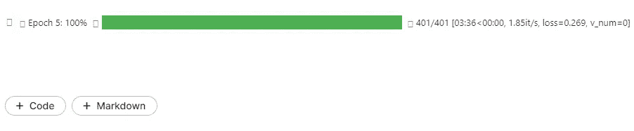
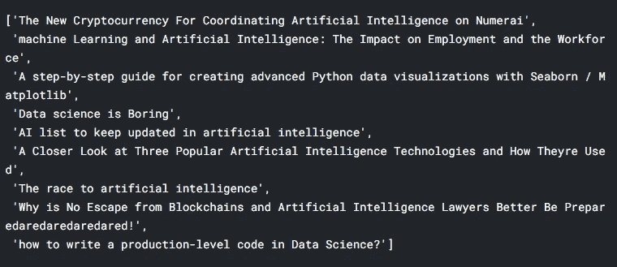

# 使用神经网络和数据分析生成最佳文章名称

> 原文：<https://medium.com/mlearning-ai/generating-the-best-article-names-using-neural-networks-and-data-analytics-194d406a8d9d?source=collection_archive---------4----------------------->


Photo by [Nick Fewings](https://unsplash.com/@jannerboy62?utm_source=medium&utm_medium=referral) on [Unsplash](https://unsplash.com?utm_source=medium&utm_medium=referral)

文章名称很难决定。读者可能会也可能不会根据标题点击你的文章。然而，制作标题很难，所以作为一名数据科学家，我决定使用 GPT2 和 NLP 来自动完成这项任务

# 数据

我制作了一个 csv 文件，其中包含了我在 Medium.com 网站上使用 Parsehub 收集的各种标签中最好的数据科学文章。csv 文件包含文章标题、使用的标签、出版物、获得的掌声、回复数量等信息。这个数据集可以在 Kaggle 上获得，被称为[中型搜索数据集](https://www.kaggle.com/aristotle609/mediumsearchdataset)。

# 工作

我的任务是制作一个文本生成器来生成连贯的文章标题。我将使用变形金刚库进行预处理和建模，然后使用 PyTorch Lightning 对模型进行微调。

# 安装变压器

要在您的环境中安装转换器，请转到您的环境并使用以下命令。

```
pip install transformers
```

它将在您的环境中安装库。如果您想避免这一步，请在 Kaggle 内核上运行您的笔记本，因为它已经在环境中预装了 transformers 库。

# 笔记本

这款笔记本使用 GPU 在 Kaggle 上运行。你可以在 [Kaggle](https://www.kaggle.com/aristotle609/medium-titles-generator) 和 [Github](https://github.com/Aristotle609/Medium-Title-Generator) 上查看完整的笔记本。我建议在 Kaggle 内核上运行这个笔记本，而不是在本地机器或 collab 上，因为 Kaggle 已经在环境中安装了大部分的依赖项。Pytorch Lightning 将作为一个包装类来加速模型的构建。

## 属国

运行下面的单元格，以确保您的环境中安装了所有必需的软件包。如果您没有安装所有的软件包，它将抛出一个错误。

```
from transformers import  GPT2LMHeadModel, GPT2Tokenizer,AdamW
import pandas as pd
from torch.utils.data import Dataset , DataLoader
import pytorch_lightning as pl
from sklearn.model_selection import train_test_split
```

## 数据

```
df = pd.read_csv("../input/mediumsearchdataset/Train.csv")
df
```



## 下载 GPT2

我将下载 GPT2-large 供公众使用。它的大小为 3 GB，这就是为什么我建议使用像 Kaggle 这样的远程笔记本电脑。

```
tokenizer = GPT2Tokenizer.from_pretrained("gpt2-large")
gpt2 = GPT2LMHeadModel.from_pretrained("gpt2-large")
```



## 测试 GPT2 模型(微调前)

```
tokenizer.pad_token = tokenizer.eos_token
prompt = tokenizer.encode("machine learning", max_length = 30 , padding = "max_length" , truncation = True , return_tensors = "pt")
output = gpt2.generate(prompt,do_sample = True, max_length = 100,top_k = 10, temperature = 0.8)
tokenizer.decode(output[0]  , skip_special_tokens = True)
```



正如我们所见，该模型确实在提示“机器学习”上生成了文本，但这与标题材料相去甚远。在接下来的部分中，我们将对模型进行微调，以生成更好的文本。

## 资料组

数据集将创建标记化的标题并将其发送到数据集。

```
class TitleDataset(Dataset):
    def __init__(self,titles):
        self.tokenizer = tokenizer
        self.titles = titles

    def __len__(self):
        return len(self.titles)

    def __getitem__(self,index):
        title = self.titles[index]
        title_token = tokenizer.encode(title , max_length = 30 , padding = "max_length" , truncation = True, return_tensors = "pt").reshape(-1)
        return title_token#sanity checkdset = TitleDataset(df["post_name"].values)
title = next(iter(DataLoader(dset , batch_size = 1,shuffle = True)))
display(title)
```


Tokenized title

## 数据模块

```
class **TitleDataModule**(pl.LightningDataModule):
    def __init__(self):
        super().__init__()
        self.train = TitleDataset(x_train["post_name"].values )
        self.test = TitleDataset(x_test["post_name"].values )
        self.val = TitleDataset(x_test["post_name"].values)

    def train_dataloader(self):
        return DataLoader(self.train , batch_size = 1 , shuffle = True)
    def test_dataloader(self):
        return DataLoader(self.test , batch_size = 1 , shuffle = False)
    def val_dataloader(self):
        return DataLoader(self.val , batch_size = 1 , shuffle = False)
```

## 模型

当标记化的文本传递给 GPT2 时，GPT 2 返回输出 logits 和模型的损失。

```
class TitleGenerator(pl.LightningModule):
    def __init__(self):
        super().__init__()
        self.neural_net = gpt2_model

    def forward(self,x):
        return self.neural_net(x , labels = x)

    def configure_optimizers(self):
        return AdamW(self.parameters(), 1e-4)

    def training_step(self,batch,batch_idx):
        x= batch
        output = self(x)
        return output.loss

    def test_step(self,batch,batch_idx):
        x= batch
        output = self(x)
        return output.loss

    def validation_step(self,batch,batch_idx):
        x= batch
        output = self(x)
        return output.loss
```

## 培养

微调 GPT2 模型需要很长时间，如果可能的话，我建议使用 GPU。Lightning 允许我们在训练器中声明 GPU，而它处理其余的。六个纪元大约需要 30 分钟。

```
from pytorch_lightning import Trainer
model = TitleGenerator()
module = TitleDataModule()
trainer = Trainer(max_epochs = 6,gpus = 1)
trainer.fit(model,module)
```



## 测试和预测

如果您计划将代码部署到产品中，我不建议这样做，因为这可能会导致错误。下面的代码是一个改变原始模型权重的快速而不实用的方法

```
gpt2.state_dict = model.state_dict
```

## 生成标题

```
raw_text = ["The" ,"machine Learning"  , "A" , "Data science" , "AI" , "A" , "The" , "Why" , "how"]
for x in raw_text:
    prompts = tokenizer.encode(x , return_tensors = "pt")
    outputs = gpt2.generate(prompt,do_sample = True, max_length = 32,top_k = 10, temperature = 0.8)
    display(tokenizer.decode(outputs[0] , skip_special_tokens = True))
```



## 尾注

我会将该模型部署为 API，但是该模型超过 3 GB，将其托管在网站上在成本上确实没有意义。你也可以试着在微调后把模型上传到 huggingface hub 上。查看 [huggingface 网站](https://huggingface.co/)获取更多模型和教程。