# 生成虚幻:GANs 实现

> 原文：<https://medium.com/mlearning-ai/generating-the-unreal-a-gans-implementation-59f36bb4e015?source=collection_archive---------4----------------------->

你知道吗？人类的大脑无法想象或创造新的面孔。是啊！做梦都没有。我们永远也不会梦到我们从未见过的人脸。但是，人工智能可以！

看下面的图片-

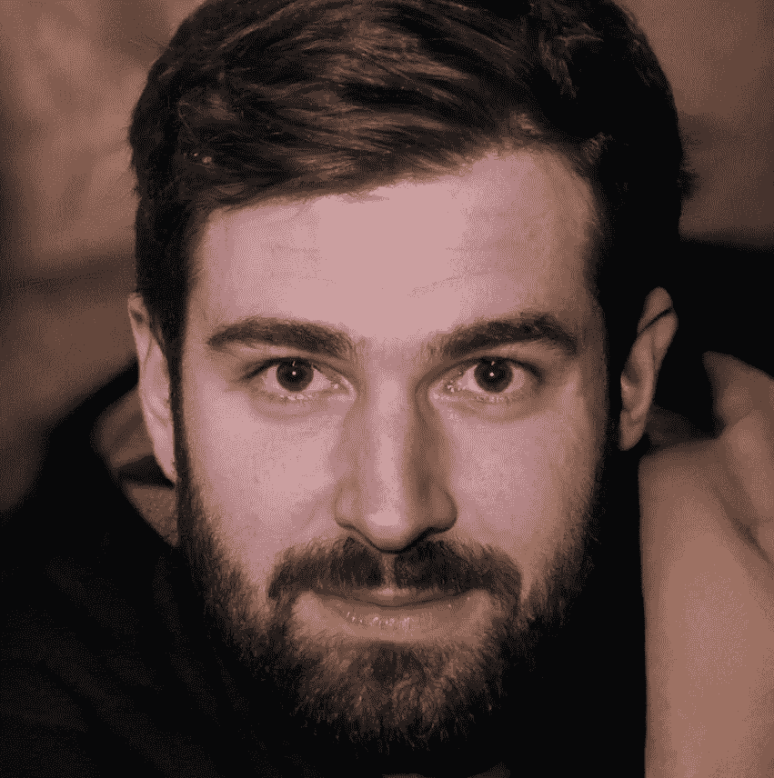

Image generated by StyleGAN2

这个形象是不是真实得惊人？这张图片来自网站:[https://thispersondoesnotexist.com/](https://thispersondoesnotexist.com/)它因人工智能生成的人脸图片而广受欢迎，这些图片看起来极其逼真，可以让任何人措手不及。如果你对甘感兴趣，你一定要访问这个网站——每次你刷新他们的网页，它都会产生一个新面孔。

虽然图像是高清晰度的，看起来很逼真的图像，但如果我们仔细观察，我们会开始注意到差异:例如，仔细看看这个人的耳朵-它们不成比例。我们还可以使用其他参数来检查图像是否是人工智能生成的，我在本文中进一步讨论了这一点。

人工生成的人类肖像可以用于数据增强、游戏进步或增强现实将达到顶峰的元世界。我们也可以把这些假脸用在使用真脸变得有争议的应用中，比如犯罪纪录片。

这篇文章将使你能够自己生成假人脸！

# 介绍

生成对手网络(GANs)是算法机器学习模型，使用两种神经架构-生成器和鉴别器。这两个网络相互竞争，并使用零和游戏框架来增强其预测和准确性。GANs 使用一种无人监督的学习方式；它们发现数据中隐藏的模式，然后从给定的数据集中生成新的数据。

有几种类型的 gan，如-DC gan、WGANs、CycleGANs 等。，每个都有自己独特的功能。在本文中，我们将使用深度卷积 gan，即 DCGANs。

如果你还不熟悉 GANs，请参考我以前的文章:[GANs 入门指南。](/@netra_hirani/a-beginners-guide-to-gans-86705602a519)

# 我们开始吧

Photo by [Possessed Photography](https://unsplash.com/@possessedphotography?utm_source=medium&utm_medium=referral) on [Unsplash](https://unsplash.com?utm_source=medium&utm_medium=referral)

为了生成图像，我们需要为我们的模型提供初始训练数据集。如果我们提供一个由相似图像组成的数据集，即相似的背景、相似的面部特征或相似的属性，那么模型以一种有偏见的方式学习工作。例如，如果我们为我们的模型提供 1000 个图像:900 个戴眼镜的人的图像和 100 个不戴眼镜的人的图像，我们可以预期我们的模型最有可能生成一个戴眼镜的人的图像。因此，建议使用具有男性/女性、不同头发颜色、不同属性等图像的多样化数据集。为了更好的模特训练。我们可以改变我们的数据集，用数据来观察不同的结果，就像我在本文后面演示的那样。

代码的链接是- [Google Colab 笔记本](https://colab.research.google.com/drive/1Hjb6blG6FqR9KuXMFCnFoc-mzDTMmvM-?usp=sharing)。**为了更好地理解，我推荐平行于代码阅读这篇文章。**

导入所需的库，如 tensorflow、keras、numpy、matplotlib 等。是入门的第一步。接下来，我们将实施以下方法-

## 方法:

*   **预处理**数据图像。
*   **建造**发电机和鉴频器。
*   建立和**培训**甘模型。
*   **超参数**调谐。
*   **测试**和**保存**生成的图像。

# 预处理数据

任何流行的数据集都可以作为你的训练数据，比如流行数据集- [CelebA 数据集](https://www.kaggle.com/datasets/jessicali9530/celeba-dataset)。然而，我使用了自己收集的数据集，从 [Kaggle faces 数据集](https://www.kaggle.com/gasgallo/faces-data-new)中选择了 1200 张图像，该数据集由大约 8000 张不同人在不同背景下以不同姿势拍摄的彩色图像组成，以实现最大可能的图像多样性。

该数据集被上传到 [Google Drive](https://drive.google.com/drive/folders/1bhmzoyikYiuUbgLFjAoGzq4hXJCKfUTk?usp=sharing) 上，并通过该项目的 Google Collaboratory 进行访问。

数据集由图像组成，如下所示:

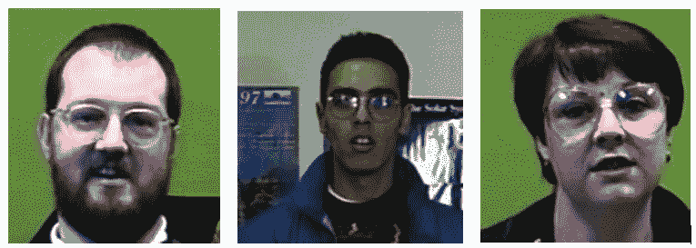

Initial data set

由于我们使用的是 Google Colab，所以图片的最大分辨率建议为 128x128。请注意，分辨率必须是 32 的倍数。因此，为了减少训练时间和内存消耗，我们将图像分辨率调整为 32 的较低倍数，即 96x96。

对于进一步的预处理:
-我们执行**抗锯齿**来减少当高分辨率图像以较低分辨率呈现时出现的视觉缺陷。抗锯齿 python 命令。
- **图像的归一化**改变像素亮度值的范围。像素强度从 0(黑色)到 255(白色)不等，我们使用**灰度归一化**来归一化图像。
-我们将图像除以 127.5 并减去 1，这样所有图像都在 *tanh* 激活函数的范围内，即-1 和 1。

调整大小和灰度归一化后的数据集图像如下所示:

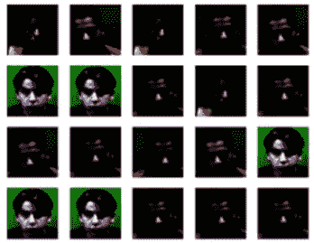

Preprocessed Images

# 搭建积木

我们现在需要构建我们的 GANs 网络的两个最重要的模块——生成器和鉴别器。

我们使用**顺序模型**在我们的 DCGAN 模型中添加神经网络层。序列模型是一个简单的层堆栈，其中每一层都有一个输入张量和一个输出张量。顺序模型创建一个顺序类，在其中创建和添加模型层。

顾名思义，我们的 GAN 模型，即 DCGAN，使用卷积神经网络(CNN)，这证明有利于图像处理任务。通过查看空间相关性，卷积网络有助于找到深层相关性。

对于这个项目，我们在生成器中使用了六个卷积层，即 1 个密集层和 5 个 Conv2D 层。Conv2D 层创建与层输入卷积的卷积核，以产生输出张量。我们返回生成器中的 *tanh* 激活函数，即一个介于-1 和 1 之间的数字。

相反，我们使用 5 个 Conv2D 层作为鉴别器，并返回鉴别器中的 *sigmoid* 函数，即 0，1 之间的数字。

# 构建和训练 GAN 模型

整体 GAN 模型需要将发生器和鉴频器与**双反馈环路**相结合。

由于这是一个对抗性的模型，重要的是要注意，训练生成器和鉴别器的权重不会给我们带来任何好处。这可以想象成两个摔跤手为了变得更好而训练。如果他们都训练有素，有竞争力，他们既不能从对方的错误中吸取教训，我们也不可能有一个明确的赢家。在这里，我们处理相同的场景，除了我们的摔跤手是两个竞争性的神经架构。因此，仅使用鉴别器模型的误差和输出来训练发生器的权重，而鉴别器模型是单独训练的。

鉴别器的权重仅在 GAN 作为一个实体被训练时受到影响，而在鉴别器单独被训练时不受影响。GANs 的目标是模拟一个**概率分布**。因此，**损失函数**是应该用来反映 GAN 产生的数据和真实数据分布之间的距离的最佳参数。

需要定义三个损失函数:
-使用实像的发电机损失。
-使用真实图像的鉴别器损耗。
-使用假图像的鉴别器损失。

鉴别器和发生器的工作原理如下:

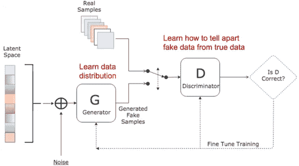

Image Source: [https://miro.medium.com/max/1400/1*TKr1dtcNgJCA8uYY1OhmSg.png](https://miro.medium.com/max/1400/1*TKr1dtcNgJCA8uYY1OhmSg.png)

此外，生成器和鉴别器的训练可以借助于下图来解释:

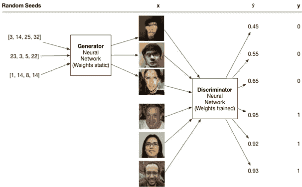

Image Source: [https://sites.wustl.edu/jeffheaton/t81-558/](https://sites.wustl.edu/jeffheaton/t81-558/)

我想快速重申，鉴别器和发生器的损失函数需要以对抗的方式训练，这需要两个独立的损失函数和两个独立的梯度更新。

上图显示，对于生成器训练集，x 包含用于生成图像的随机种子。生成器的最佳情况是生成如此可信的图像，以至于鉴别器被愚弄而指定概率为 1。鉴别器训练集包含值为 0 或 1 的 y。如果鉴别器给出的概率大于 0.5，则 y 的值为 1，否则为 0。

# 超参数调谐

由于我们使用了 DCGANs，一个可以自学如何合成新图像的模型，我们实现了拉德福德在他介绍 DCGANs 的论文中提出的一些技巧。

*   所有模型都用小批量随机梯度下降(SGD)训练，小批量大小为 128。
*   在 LeakyReLU 中，所有模型的泄漏斜率都设置为 0.2。
*   Adam optimizer 与优化的超参数一起使用。
    { Adam 是用于训练深度学习模型的随机梯度下降的替换优化算法。}
*   汇集层被替换为步长卷积(鉴别器)和分数步长卷积(生成器)。
*   使用 80%的批量标准化。
    {它加速训练，使用更高的学习率，并提供正规化。}
*   对于斜率设置为 0.2 的所有层，在鉴别器中使用 LeakyReLU 激活函数。
    {当输入小于零时，通过修改函数以允许增量负值，有助于防止出现垂死 ReLU 问题。}
*   除了使用 Tanh 的输出层之外，所有层的生成器中都使用了 ReLU 激活。
    {校正线性单元(ReLU)用于防止消失梯度问题。}
*   鉴别器使用脱落层(25%)。
    {为了防止模型中的过拟合，执行了剔除正则化。}
*   此外，还使用了 UpSampling2D()来增强数量较少的样本的数量。

# 测试和保存图像

生成器生成的图像作为输入提供给鉴别器，以揭示“现实的可能性”。如果鉴别器有一半的时间被愚弄，即图像被真实冒充的概率是 0.5，则表明我们的生成器产生了似是而非的图像。

我们可以看到，我们的模型给出了 0.5 的**精度，这表明我们的生成器正在**产生可信的图像**，并且已经成功地在 50%的时间里**欺骗了鉴别器。****

经过特定次数的训练后，生成的图像保存在用户需要的 google 位置和文件夹中，并可以从那里访问。

# 获得的训练图像

经过训练的图像保存在我们指定的位置，并显示我们生成的图像的进展，一个时期接一个时期。我的数据集的图像进展如下所示:

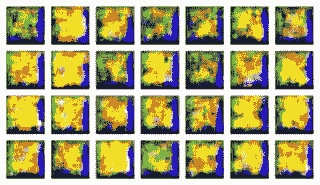

Epoch 1

我们可以看到，在我们的第一个时代产生的图像看起来像热图。它基本上是指定我们的脸在进一步训练后最终将出现的图像位置。

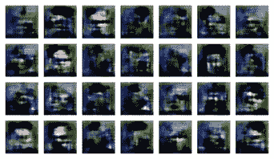

Epoch 10

我们现在可以看到，一些公式已经开始发生。

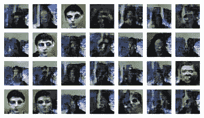

Epoch 100

如果你注意到左下角的图像，我们可以看到我们的模型几乎已经生成了一个可信的人脸。

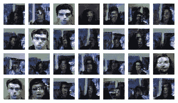

Epoch 100

现在我们可以注意到，还有一些图像可能*几乎*被认为是人脸，尽管大多数生成的人脸仍然是扭曲的，看起来像是直接从僵尸电影中走出来的。

如果通过使用 Google Colab GPU 在 150 个时期内使用 1200 张图像的数据集，我们能够确保 50%的准确性:这表明通过使用 StyleGANs 或 NVIDIA 框架，生成的人脸可能看起来非常具有欺骗性和真实性。

如果你想了解 StyleGANs 的更多信息，这里有一个视频我会推荐-[https://www.youtube.com/watch?v=u8qPvzk0AfY](https://www.youtube.com/watch?v=u8qPvzk0AfY)
你也可以访问相应的 Tensorflow 官方实现-[https://github.com/NVlabs/stylegan2](https://github.com/NVlabs/stylegan2)

# 玩弄数据

以下是将同一模型应用于不同数据集时的输出。

*   使用具有相同背景、相同姿势并且只有男人的数据集。
    (500 幅图像，50 个时期，49.9%的准确度)

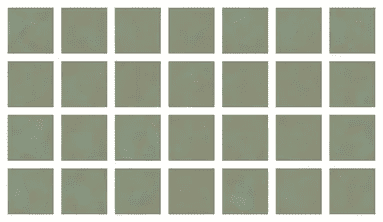

Epoch 1

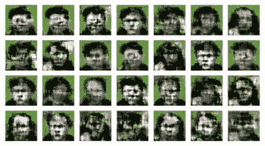

Epoch 50

*   使用具有不同背景、相同姿势并且只有女性的数据集。
    (500 幅图像，100 个时期，49.6%的准确度)

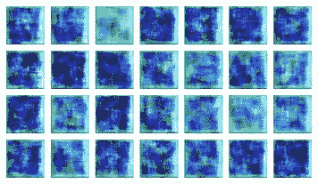

Epoch 1

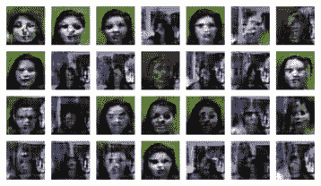

Epoch 100

因此，我们可以看到，生成的图像在很大程度上取决于我们使用的初始数据集。

# 假的还是假的？

正如我在本文中所讨论的，虽然这些技术有能力迷惑人的头脑，欺骗人的眼睛，但我们必须警惕并意识到硬币有两面。

因此，既然我帮你生成了假图像，这里有一些提示也将帮助你识别人工生成的图像！

当你看到一张照片，留意-

*   **扭曲/不寻常的背景**:由于算法的工作原理是生成相似的人脸，或者可能改变所提供数据集中的人脸属性，因此模型可能会忽略背景。
*   **不对称:**正如我们在本文的第一张图片中注意到的，这个男人的耳朵不对称。GANs 模型发现，在面部毛发、配饰或牙齿方面也会出现类似的对称错误(微笑时门牙数量更多)。
*   **荧光渗色:**同样在我们生成的图像中，我们可以看到荧光色透过图像，表明是人工生成的。

如果你想知道更多，这里有一篇好文章给你-[https://life hacker . com/how-to-spot-an-ai-generated-photo-1834558395](https://lifehacker.com/how-to-spot-an-ai-generated-photo-1834558395)

# 结论:

我们可以得出结论，GANs 是一种强大的无监督学习方法，是一种方便的数据扩充工具。gan 有助于独立的数据扩展，并解决需要生成性解决方案的问题。DCGANs 是一种改进的 GAN 类型，可用于生成人工数据。GANs 由两种不同类型的神经网络组成——生成器和鉴别器。神经网络结构、训练数据、超参数调整等的任何修改都会导致精确度的改变。

尽管数据增强是机器学习行业日益增长的需求，但 gan 也可能被滥用于不道德的目的。生成看起来真实的假图像有可能增加欺诈性的社交媒体账户，甚至可能引发假新闻。为了解决这个问题，正在开发软件来更准确地识别任何音频/图像的真实性。

GANs 看到了未来研发的巨大潜力。我们已经可以看到一些应用程序，如 3D 对象生成、视频预测、人脸正面视图生成、GANs 与虚拟现实的融合等等。

# 你已经征服了！

恭喜你！这篇长文你已经看完了。你已经成功地实现了你的模型并生成了你自己的甚至不存在的人脸！这难道不令人兴奋吗？

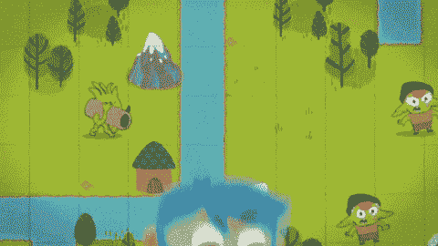

Giphy

如果你喜欢这篇文章，请给它一个掌声和评论。感谢您的反馈和回应！

# 参考:

*   拉德福德大学、梅斯大学和钦塔拉大学(2015 年)。深度卷积生成对抗网络的无监督表示学习。 *arXiv 预印本 arXiv:1511.06434* 。
*   [https://github . com/jeffheaton/present/blob/master/YouTube/gan/gans _ scratch . ipynb](https://github.com/jeffheaton/present/blob/master/youtube/gan/gans_scratch.ipynb)

## 感谢您的阅读！

如有任何疑问或机会，请通过 hiraninetra22@gmail.com 或 https://www.linkedin.com/in/netrahirani/[联系我。
附:我正在积极寻找数据分析/机器学习领域的机会，如果你能分享任何建议、意见或推荐，我会很高兴。](https://www.linkedin.com/in/netrahirani/)

 [## Mlearning.ai 提交建议

### 如何成为 Mlearning.ai 上的作家

medium.com](/mlearning-ai/mlearning-ai-submission-suggestions-b51e2b130bfb)