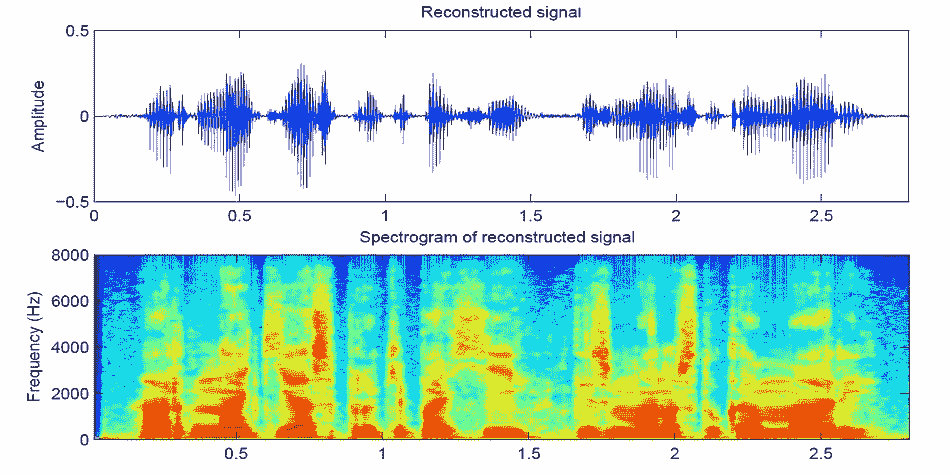

# 用于语音合成的生成对抗网络

> 原文：<https://medium.com/mlearning-ai/generative-adversarial-network-for-speech-synthesis-9af5f66dc63d?source=collection_archive---------1----------------------->

The image is taken from Speech Signal Processing Laboratory

生成对抗网络(GANs)在计算机视觉的图像生成中取得了可信的质量。最近，NLP 社区对使用 GAN 进行语音合成表现出浓厚的兴趣。由于文本和语音的性质，在文本到语音转换中使用 GANs 将更具挑战性，但同时它将改进语音合成任务并克服传统方法中的一些问题。

GAN 由两个独立的神经网络组成:生成器和鉴别器。生成器接收一个随机变量，z 遵循分布 Pz(z ),并尝试将其映射到数据分布 Px(x)。期望发生器的输出分布在训练期间收敛到数据分布。另一方面，期望鉴别器通过分别输出 0 和 1 来从生成的样本中辨别真实样本。在训练过程中，生成器和鉴别器分别通过相互对立地影响对方的表现来生成样本并对其进行分类。这是一个双人极大极小游戏。

语音合成是将文本转换成类似人类声音的过程。两种传统的方法被用于 TTS 任务:串联 TTS 和参数 TTS [1]。基于深度学习的方法通过深度神经网络将语言特征映射到声学特征，DL-method 实现了从数据中学习特征的有效工具[1]。有不同的 DL 模型提供语音合成，例如:深度信念网络(DBN) [2]，深度混合密度网络(DMDN) [3]，深度双向长短期记忆(DBLSTM) [4，5]，WaveNet [6]，以及 Tacotron 和卷积神经网络(CNN) [7，8]。但是随着今天大规模的并行计算和大数据，最近基于 GAN 的语音合成被应用于获得更有效的并行化模型。在[9]中引入的 GAN-TTS 作为条件前馈发生器，其产生原始音频语音(基于多频率随机窗口),并且鉴别器在不同大小的随机窗口上操作(总体随机窗口鉴别器),并且检查所产生的音频如何与期望的话语相关。他们在处理 TTS 时关注语言学和音高特征[9]。

由于我们在工作中选择了 GAN-TTS，我们应该如[9]中所述调整我们的数据集以适应模型并实现目标。G 的输入是 200Hz 的语言和音高特征序列，其输出是 24kHz 的原始波形。使用 GAN-TTS 需要用于训练的高性能 GPU，增加鉴别器的数量将需要更多的 GPU[9]。

参考资料:

1.  宁，等，“基于深度学习的语音合成研究综述”应用科学 9.19 (2019): 4050。
2.  康，，钱晓军，孟海伦。"用于语音合成的多分布深度信念网络." *2013 IEEE 声学、语音和信号处理国际会议*。IEEE，2013 年。‏
3.  Zen，Heiga 和 Andrew Senior。"统计参数语音合成中声学建模的深度混合密度网络." *2014 IEEE 声学、语音和信号处理国际会议(ICASSP)* 。IEEE，2014 年。‏
4.  基于深度双向长短时记忆的多尺度音乐动态情感预测方法。 *2016 IEEE 声学、语音和信号处理国际会议(ICASSP)* 。IEEE，2016。
5.  穆萨、阿姆尔·德索基和比约恩·舒勒。"深度双向长短期记忆递归神经网络，用于利用复杂的多对多排列进行字形到音素的转换."*穿插*。2016.
6.  平行波网:快速高保真语音合成。*机器学习国际会议*。2018.
7.  用 tacotron 实现表达性语音合成的端到端韵律转换。 *arXiv 预印本 arXiv:1803.09047* (2018)。‏
8.  立花，秀之，胜矢上野山和俊介相原。“基于深度卷积网络的可有效训练的文本到语音系统，具有引导注意力。” *2018 IEEE 声学、语音和信号处理国际会议(ICASSP)* 。IEEE，2018。
9.  用对抗性网络进行高保真语音合成。 *arXiv 预印本 arXiv:1909.11646* (2019)。