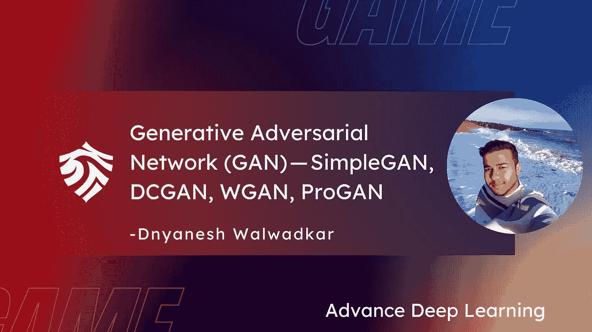
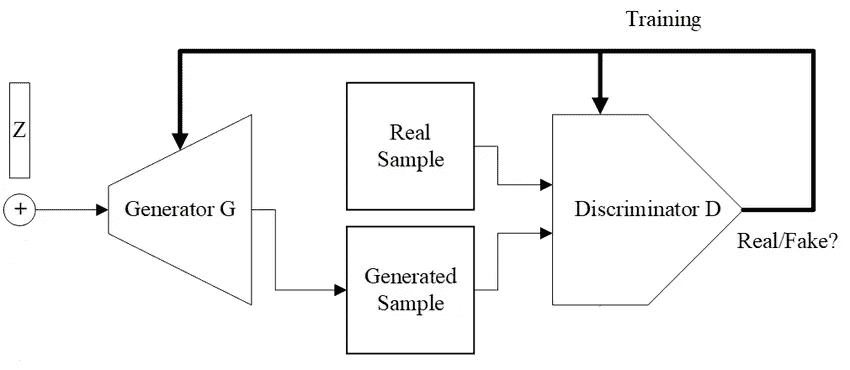

# 生成对抗网络(GAN) —简单对抗网络、DCGAN、WGAN、程序对抗网络

> 原文：<https://medium.com/mlearning-ai/generative-adversarial-network-gan-simplegan-dcgan-wgan-progan-c92389a3c454?source=collection_archive---------3----------------------->

## 高级深度学习— Dnyanesh Walwadkar

内容:

1.  简单 GAN
2.  衡量 GAN 中生成的样本质量的指标
3.  甘
4.  亲甘
5.  WGAN
6.  实施
7.  甘综述
8.  良好的研究工作从 GAN 开始

生成式对抗网络(GAN)是一种深度学习模型，旨在生成与训练数据集相似的新数据样本。该模型由两部分组成:学习生成新样本的生成模型，以及学习对给定样本是真是假进行分类的判别模型。

# 简单根

生成模型通常是一种神经网络，它接受随机噪声向量作为输入，并输出生成的样本。该模型被训练以通过试图欺骗判别模型来产生与训练数据相似的样本。

另一方面，鉴别模型是一个分类器，它接收样本并输出它是真的还是假的。该模型被训练以正确地分类来自训练数据的真实样本以及由生成模型生成的虚假样本。

src : [https://commons.wikimedia.org/wiki/File:A-Standard-GAN-and-b-conditional-GAN-architecturpn.png](https://commons.wikimedia.org/wiki/File:A-Standard-GAN-and-b-conditional-GAN-architecturpn.png)

训练 GAN 的目标是在两个模型之间找到平衡，其中生成模型产生高质量的样本，而判别模型不能区分真实和虚假的样本。这是通过使用对抗性损失函数来实现的，该函数测量生成的样本和真实样本之间的差异。

训练 GAN 的过程可以数学地描述如下。设 G 是生成模型，D 是鉴别模型，x 是来自训练数据的真实样本，z 是随机噪声向量。创成式模型的损失函数定义为:

L_G = E[log(1 — D(G(z)))]

该损失函数促使生成模型产生被判别模型分类为真实的样本。判别模型的损失函数定义为:

l _ D = E[log(D(x))]+E[log(1—D(G(z))]]

这个损失函数促使判别模型正确地将真实样本分类为真实样本，将虚假样本分类为虚假样本。GAN 的总损耗定义为生成型和判别型模型的损耗之和:

L_GAN = L_G + L_D

换句话说，GAN 的总损失等于生成模型的损失加上判别模型的损失，生成模型促使模型产生被判别模型分类为真实的样本，判别模型促使模型正确地将真实样本分类为真实样本并将虚假样本分类为虚假样本。

 [## 高级深度学习/fc _ gan . py at main dnyanshwalwadkar/高级深度学习

### 通过在 GitHub 上创建帐户，为 dnyanshwalwadkar/Adv-深度学习开发做出贡献。

github.com](https://github.com/dnyanshwalwadkar/Adv-Deep-Learning/blob/main/1.%20SimpleGAN/fc_gan.py) 

## 除了初始得分和弗雷歇初始距离之外，还有几个其他指标可用于测量 GAN 中生成的样本的质量。这些指标包括:

1.  Frechet 距离:这个度量通过计算最适合样本的多元高斯分布之间的距离来测量两组样本 x 和 y 之间的相似性。弗雷歇距离定义为:

D_F(x，y)= | | m _ x—m _ y | |+tr(c _ x+c _ y—2(c_x^(1/2)c _ y c_x^(1/2))^(1/2))

其中，m_x 和 m_y 是分布的平均值，C_x 和 C_y 是协方差矩阵，Tr 是跟踪算子。

2.Frechet 初始距离(FID)是一种度量，用于测量预训练分类器的特征空间中真实样本和生成样本的分布之间的距离。FID 的计算如下:

FID = | | mu _ r—mu _ g | |+Tr(Cov _ r+Cov _ g—2 * sqrt(Cov _ r * Cov _ g))

其中 mu_r 和 Cov_r 是真实样本特征的均值和协方差，mu_g 和 Cov_g 是生成样本特征的均值和协方差。

3.精确召回起始距离(PRID)是 FID 的一个变体，它包含一条精确召回曲线，以更好地捕捉生成样本的质量。PRID 的计算方法如下:

优先级= (1 / n) * sum_{i=1}^n (2 *精度 _i *召回 _i /(精度 _i +召回 _i))

其中 precision_i 和 recall_i 是精度-召回曲线上第 I 个点的精度和召回，n 是曲线上的点数。

4.核初始距离(KID)是一种度量，用于测量再生核希尔伯特空间中真实样本和生成样本的分布之间的距离。KID 计算如下:

KID = ||K_r — K_g|| / (2 * sigma)

其中，K_r 和 K_g 分别是真实样本和生成样本的核矩阵，sigma 是控制指标灵敏度的超参数。

这些度量可用于评估 gan 中生成的样本的质量，并在给定数据集上比较不同 gan 的性能。

# DCGAN

DCGAN 代表深度卷积生成对抗网络。它是一种 GAN，在生成和鉴别模型中都使用卷积层。

在 DCGAN 中，生成模型 G 是深度卷积神经网络，它将随机噪声向量 z 作为输入，并输出合成图像。G 的目标是产生与训练数据中的真实图像相似的合成图像。

判别模型 D 也是深度卷积神经网络，它将真实或合成的图像作为输入，并输出图像是真实的概率。D 的目标是正确地将真实图像分类为真实的，将合成图像分类为假的。

DCGAN 的总损失函数定义为 G 和 d 的损失函数之和，G 的损失函数定义为:

L_G = E[log(1 — D(G(z)))]

这个损失函数鼓励 G 产生被 d 分类为真实的合成图像。换句话说，它鼓励 G 产生与训练数据中的真实图像相似的图像。

D 的损失函数定义为:

l _ D = E[log(D(x))]+E[log(1—D(G(z))]]

这个损失函数促使 D 正确地将真实图像分类为真实的，将合成图像分类为假的。换句话说，它鼓励 D 准确区分真假图像。

DCGAN 的总损耗函数定义为:

L_DCGAN = L_G + L_D

通过使用梯度下降更新 G 和 D 的权重，在训练期间最小化该损失函数。通过最小化该损失函数，DCGAN 学习生成与训练数据中的真实图像相似的高质量合成图像。

 [## adv-深度学习/2。DCGAN at main dnyanshwalwadkar/Adv-深度学习

### 此时您不能执行该操作。您已使用另一个标签页或窗口登录。您已在另一个选项卡中注销，或者…

github.com](https://github.com/dnyanshwalwadkar/Adv-Deep-Learning/tree/main/2.%20DCGAN) 

## 摘要 SimpleGAN 和 DCGAN

简单 GAN 和 DCGAN 的相似之处在于，它们都使用生成模型 G 和判别模型 D 来生成合成图像。然而，两者之间有一些关键的区别。

简单 GAN 通常在 G 和 D 中使用全连接层，而 DCGAN 使用卷积层。这意味着 DCGAN 能够捕捉数据中的空间相关性，从而提高生成图像的质量。

此外，通常使用批量归一化和转置卷积层来训练 DCGAN，这可以稳定训练过程并提高生成模型的性能。

总之，虽然简单 GAN 和 DCGAN 在整体结构和目标上相似，但 DCGAN 使用更先进的技术来提高生成图像的质量。

# WGAN

WGAN 或 Wasserstein GAN 是一种使用 Wasserstein 距离作为其损失函数的 GAN。Wasserstein 距离是两个概率分布之间差异的度量。在 WGAN 中，生成模型 G 被训练以从合成分布中产生尽可能接近来自训练数据的真实样本的样本。

WGAN 中生成模型的损失函数定义为:

L_G = E[f(G(z))]

其中 f(x)是衡量 G 产生的合成分布和真实分布之间的距离的临界函数。生成模型的目标是最小化该损失函数，这鼓励它生成与训练数据中的真实样本相似的样本。

L_D = -E[f(x)] + E[f(G(z))]

判别模型的目标是最大化这个损失函数，这鼓励它正确地将真实样本分类为真实的，将合成样本分类为假的。

WGAN 的总损耗函数定义为:

L_WGAN = L_G + L_D

通过使用梯度下降更新 G 和 D 的权重，在训练期间最小化该损失函数。通过最小化该损失函数，WGAN 学习生成与训练数据中的真实样本相似的高质量合成样本。

 [## adv-深度学习/3。WGAN at main dnyanshwalwadkar/Adv-深度学习

### 此时您不能执行该操作。您已使用另一个标签页或窗口登录。您已在另一个选项卡中注销，或者…

github.com](https://github.com/dnyanshwalwadkar/Adv-Deep-Learning/tree/main/3.%20WGAN) 

## WGAN 研究使用

有许多使用 WGANs 生成高质量合成数据的研究实例。例如，WGANs 已经被用于生成与真实图像无法区分的人脸合成图像。这在许多领域都有应用，例如面部识别和安全。

WGANs 还被用于生成合成医学图像，例如 CT 扫描和磁共振成像。这对于训练用于诊断目的的机器学习模型是有用的。

另一个使用 WGANs 的研究例子是在音乐生成领域。WGANs 已被用于生成在音色和节奏方面类似于真实音乐的合成音乐样本。

总之，WGANs 已被广泛用于研究领域，为各种应用生成高质量的合成数据。

# ProGAN

渐进生长 GAN(Prog an)是一种在训练期间逐渐增加所生成图像的分辨率的 GAN。这允许模型产生高分辨率图像，而不需要大量的训练样本或计算昂贵的模型。

ProGAN 遵循一种分级方法来训练 GAN。最初，模型被训练以生成低分辨率图像。然后，将附加层添加到模型中，并在同一数据集上再次训练模型，以生成更高分辨率的图像。重复这个过程，直到达到所需的分辨率。

数学上，假设 G 是生成模型，D 是鉴别模型，x 是来自训练数据的真实样本，z 是随机噪声向量。创成式模型的损失函数定义为:

L_G = E[log(1 — D(G(z)))]

该损失函数促使生成模型产生被判别模型分类为真实的样本。判别模型的损失函数定义为:

l _ D = E[log(D(x))]+E[log(1—D(G(z))]]

这个损失函数促使判别模型正确地将真实样本分类为真实样本，将虚假样本分类为虚假样本。程序的总损失定义为生成模型和判别模型的损失之和:

L_ProGAN = L_G + L_D

换句话说，程序的总损失等于生成模型的损失，生成模型鼓励模型产生被判别模型分类为真实的样本，加上判别模型的损失，判别模型鼓励模型正确地将真实样本分类为真实，将虚假样本分类为虚假。

## 有几个关于 GANs 的重要事实需要理解:

1.  gan 是一种生成模型，这意味着它们能够生成与训练数据相似的新样本。
2.  GANs 由两部分组成:一个生成模型，它生成假样本；一个判别模型，它试图区分真样本和假样本。
3.  使用两部分损失函数来训练 gan，该函数鼓励生成模型产生被判别模型分类为真实的样本，并且判别模型正确地分类真实和虚假样本。
4.  GANs 可用于生成各种输出，包括图像、文本和音频。
5.  GANs 是机器学习中的一种流行技术，已经被用于在许多应用中实现最先进的结果。然而，它们可能很难训练，并且需要大量的计算能力。
6.  GANs 是机器学习领域相对较新的发展，于 2014 年首次推出。
7.  gan 是一种无监督学习的形式，这意味着它们可以从数据中学习，而不需要标签或预定义的类别。
8.  训练 GANs 的主要挑战之一是平衡生成模型和判别模型的竞争目标。
9.  尽管他们取得了成功，甘也不是没有限制。例如，它们可能很难训练，并且需要大量的数据和计算能力。此外，GANs 的输出有时很难解释或控制。
10.  GANs 已被证明在多种应用中是有效的，包括图像生成、图像超分辨率、图像平移和图像修复。
11.  GAN 的最新进展包括新架构的开发，如剩余连接和批量标准化的使用，以及新训练技术的使用，如 Wasserstein GAN 和改进的 GAN。
12.  GANs 已经被应用于广泛的领域，包括计算机视觉、自然语言处理和语音合成。
13.  GANs 也已经与其他机器学习技术结合使用，例如强化学习和迁移学习，以实现改进的性能。
14.  最近的一些研究侧重于改善 GAN 的可解释性和控制，以及解决与 GAN 生成的输出的偏差和公平性相关的问题。

GAN 实现

 [## GitHub-dnyanshwalwadkar/Adv-深度学习

### 此时您不能执行该操作。您已使用另一个标签页或窗口登录。您已在另一个选项卡中注销，或者…

github.com](https://github.com/dnyanshwalwadkar/Adv-Deep-Learning) 

## 以下一些研究论文很好地介绍了 GANs:

1.  伊恩·古德菲勒等人的“生成性敌对网络”(2014 年)
2.  马丁·阿约夫斯基等人的《瓦瑟斯坦·甘》(2017 年)
3.  Tim Salimans 等人的“训练 GANs 的改进技术”(2016 年)
4.  亚历克·拉德福德等人(2015 年)“深度卷积生成对抗网络的无监督表示学习”
5.  Meera Mohan 等人的“条件生成对抗网络”(2015 年)

此外，以下综述性论文对 GAN 研究的最新发展水平进行了很好的概述:

1.  Shubham Tulsiani 等人的“生成性敌对网络:概述”(2018 年)
2.  张子琪等人(2018)的“关于生成性对抗网络的调查”
3.  Martin Arjovsky 等人(2017 年)的“生成性对抗网络训练的原则性方法”

这些论文为理解 GANs 的基础知识和该领域的最新发展提供了一个很好的起点。

 [## Mlearning.ai 提交建议

### 如何成为 Mlearning.ai 上的作家

medium.com](/mlearning-ai/mlearning-ai-submission-suggestions-b51e2b130bfb)