# 生成对抗网络(GAN):直观介绍

> 原文：<https://medium.com/mlearning-ai/generative-adversarial-networks-gan-an-intuitive-introduction-815b953751fb?source=collection_archive---------2----------------------->

## 计算机生成模型综合介绍

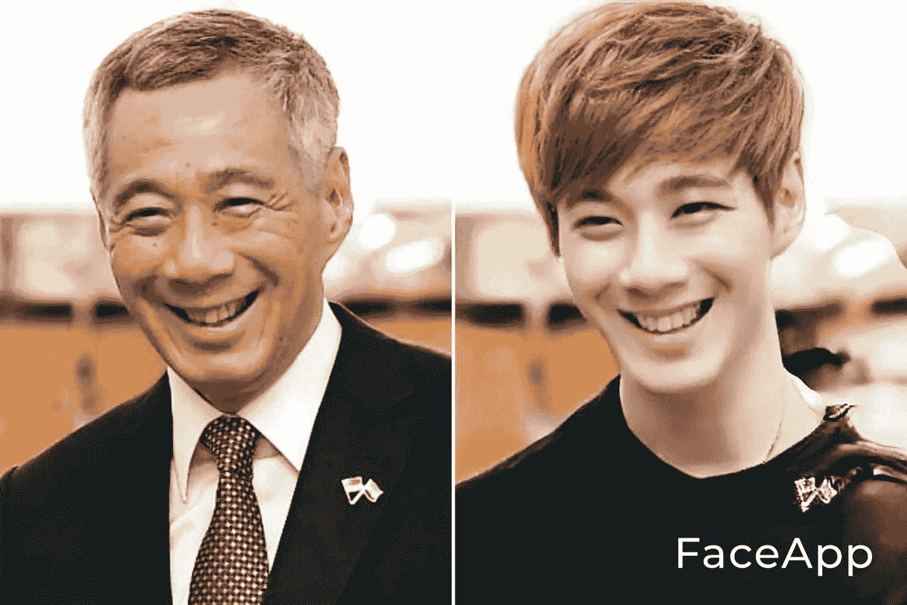

An image of Lee Hsien Loong, currently the prime minister of Singapore, transformed into Korean “oppa” [Photo reproduced with permission from content creator [Jaze Phua](https://www.facebook.com/jazephua/photos/a.1055621384455017/4060143500669442/?type=3). Watch the transformation video [here](https://www.facebook.com/watch/?v=848928798984222).]

信不信由你，上面右手边的图片完全是由电脑根据左边李显龙的真实形象制作的。在这里，他的面部形象被“反相”，同时保持他独特的外观。 *Oppa* 在朝鲜语中是指一个人的哥哥。这也是对英俊的韩国演员的爱称。这是一个松散的*图像* *风格变形*的例子，其中数字图像被变形为不同但特定的风格。鉴于它们是由计算机人工生成的，输出图像的真实性令人印象深刻。

上图是使用一个名为 [FaceApp](https://www.faceapp.com/) 的应用程序创建的。除了一些隐私问题之外，它还因为能够以高度的真实感改变数字图像中的面部特征而获得了极大的关注。可以达到各种效果，比如性别互换，衰老，逆转衰老。这样的图像，或者任何一般的合成对象——诗歌、音乐，甚至假新闻——都可以用*生成模型来合成。*

[生成对抗网络](https://arxiv.org/abs/1406.2661) (GAN)是一个利用深度学习的**生成** **建模**框架。它在计算机视觉领域有许多成功的应用。在本文中，我将提供这个框架的概述(主要是理论背景)。这应该是一个轻松阅读，提供一些直觉到甘。对于感兴趣的读者来说，这中间确实有点技术性。

# 概述

1.  **直觉。【T21 简介】提供直觉入甘的概念。**
2.  **生成型模型。**为什么生成模型(甘是其中的一个建模框架)值得研究？
3.  **生成对抗网。**GAN 的基本框架和架构。
4.  **甘模特培训。**如何在 GAN 中训练发生器和鉴别器？
5.  **甘的基本变异。一种**结构改进，能够在各种图像合成任务中使用 GANs。
6.  **甘的应用。**一些应用和当前 GAN 模型。

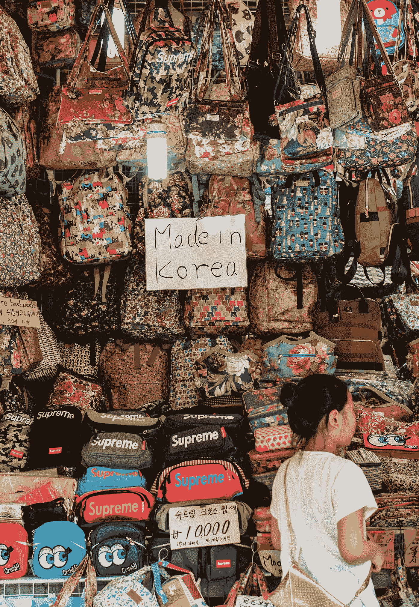

Counterfeit items sold on the streets in South Korea [Photo by [Adli Wahid](https://unsplash.com/@adliwahid?utm_source=unsplash&utm_medium=referral&utm_content=creditCopyText) on [Unsplash](https://unsplash.com/s/photos/counterfeit?utm_source=unsplash&utm_medium=referral&utm_content=creditCopyText)]

# 1.直觉

你看过莱昂纳多·迪卡普里奥主演的电影《如果你能抓住我就抓住我》吗？这是根据真实生活故事改编的，一个骗子*伪造了价值数百万美元的工资支票。他变得如此擅长，以至于最终联邦调查局求助于他来帮助抓捕其他伪造者。*

*甘很像一个骗子对联邦调查局的对抗游戏。这里我们有一个*生成器*试图“伪造”一些东西——梵高的画、莎士比亚的小说、贝多芬的钢琴曲——或者[模仿已故钢琴家格伦·古尔德](https://www.yamaha.com/en/about/ai/dear_glenn/)的演奏风格。我们有一个鉴别器*试图鉴别一件物品是伪造的还是真的。**

*最初，生成器(康曼)产生蹩脚的模仿。鉴别者(FBI)鉴别出了这些假货，并轻而易举地抓住了骗子。但是在无数次进出监狱和改进他的设计后，骗子学会了生产越来越多看起来逼真的仿制品。在某一点上，他的仿制品变得与真品难以区分。*

# *2.生成模型*

*我们大多数学习机器学习的人，可能更熟悉*判别模型*:二元分类器、多类分类器、多标签分类器等等。给定观察值 **x** ，分类器捕获类别标签 *c* 的条件概率**P(***c***| x)**:**概率。*另一方面，生成模型*捕捉观察的概率 P( **x** )或联合概率 P( **x** ，c)。***

***生成模型从*潜在空间*中提取样本，以合成新数据。潜在空间是多维空间，其中空间中的每个点对应于一个观察值(即合成数据)。简单地说，它可以被认为是领域特征的数字表示。例如，面部图像的表示类似于:***

*   ***两只眼睛，一个鼻子，一张嘴***
*   ***眼睛紧挨着，位于鼻子上方***
*   ***嘴位于噪音的下方，决定了脸部是微笑、中性还是皱眉***
*   ***面部特征可以代表男性或女性***
*   ***可能会有眼镜、口罩、化妆品之类的配饰…***

***每个特征都由空间中的一个维度(变量)来表示。这种表示允许非常有趣的潜在空间矢量算法。在[这篇论文](https://arxiv.org/abs/1511.06434)中，作者对人脸图像进行了如下所示的潜在向量运算。这些向量表示男人、女人和眼镜的图像特征，并且可以用算术方法处理，得到令人信服的输出。***

***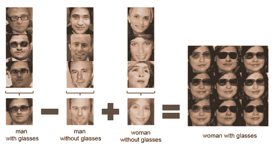***

***Latent vector arithmetic, where the resulting vector is input to a generator to generate the output image. [Image taken from [this paper](https://arxiv.org/abs/1511.06434)]***

***训练生成模型来合成特定领域中的数据类似于学习该领域的潜在空间表示。随后，该模型通过从学习空间中的无限数量的点进行采样，生成合成数据，每个数据都略有不同。***

***在更正式的定义中，由 **𝜃** 参数化的生成模型 **𝐺** 将随机噪声向量 ***z*** 作为输入，并生成输出样本***𝐺(z；𝜃 )*** 用概率分布***p _ 生成*** 。一个好的生成模型能够生成新的、可信的样本，这些样本与真实的输入样本无法区分。换句话说，***p _ 生成***∾***p _ 输入*** 。***

***在这篇论文中，作者给出了一个有趣的例子来说明为什么生成模型值得研究。生成模型，尤其是 GANs，使机器学习能够与*多模态*输出一起工作。例如，让我们采用一个回归模型，该模型被训练来最小化实际和预测输出之间的均方误差。这种模型对于每个输入样本只能产生单个预测输出。然而，对于许多任务，单个输入可能对应于许多不同的正确答案，每个答案都是可接受的。下图说明了视频序列的预测帧的计算机渲染。***

***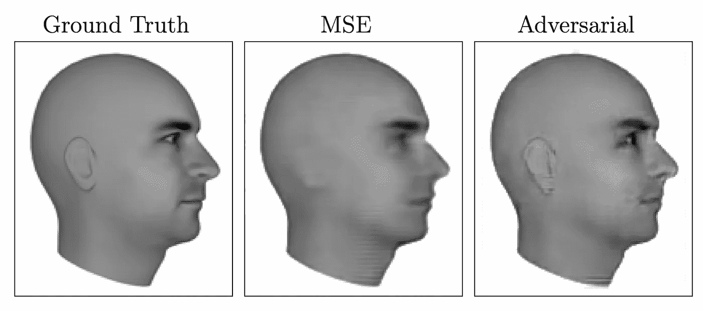***

***The output of next frame prediction task from a video sequence, showing the outputs from a model trained with only mean square error loss (MSE) and additinal GAN loss (Adversarial). [Image taken from [this paper](https://arxiv.org/abs/1701.00160)]***

***在这项任务中，模型被训练来预测视频序列中的下一帧。左边的图像是地面实况，或者是监督训练通常意义上的目标输出。中间的图像显示了使用均方误差(MSE)训练的模型的预测输出。该模型被迫输出下一帧看起来像什么的单一答案。因为有许多可能的未来，对应于头部稍微不同的位置，模型选择的单一答案对应于许多稍微不同的图像的平均值。这导致耳朵几乎消失，眼睛变得模糊。***

***使用额外的 g an 损耗，该模型能够理解有许多可能的输出。已经学习了输出图像的分布的生成模型能够从可能的输出中的一个进行采样。结果是右边的图像是清晰的，可识别为一个现实的，详细的图像。***

# ***3.生成对抗网络***

***GAN 是一个深度学习框架，通过对抗过程来训练生成模型。基本框架如下图所示，包括:***

*   ***一个**发生器网络 G** ，它采用一个随机噪声矢量 **z** 来产生合成数据 **G(z)** ，以及***
*   ***一个**鉴别器网络 D** ，其获取真实数据 **x** 和合成数据，并检测特定数据样本是真是假。***

***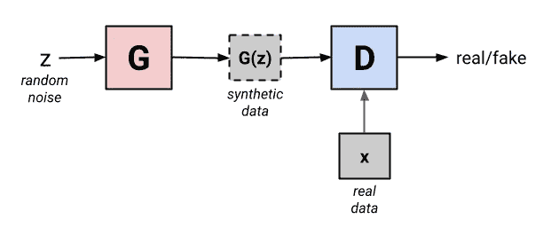***

***GAN framework with generator and discriminator networks. [Image by author]***

***两个网络都以这样的方式训练，即发生器最终合成鉴别器不能从真实数据样本中区分的数据样本。GAN 已经成功地用于计算机视觉应用，特别是用于图像合成和图像到图像的翻译。多年来，已经提出了许多架构变化。然而，众所周知，这个框架不稳定，难以训练。在网络训练期间，它遭受*消失梯度*和*模式崩溃*问题。这些问题的解决方案仍然是一个活跃的研究领域。***

# ***4.甘模特培训***

***训练被制定为双人 ***minimax*** 游戏。在这里，生成器𝐺试图 ***最小化*** 合成样本和真实样本之间的差距，以便欺骗鉴别器，而鉴别器𝐷试图 ***最大化*** 其对合成样本的理解，以便更好地区分真实数据和合成数据。***

***直觉上，生成器可以被认为类似于一组伪造者，他们试图制造假支票并在不被发现的情况下使用它。鉴别器类似于联邦调查局，试图检测假币。对抗训练的过程类似于一场竞赛，两个团队都在不断改进他们的方法，直到无法将赝品与真品区分开来。***

***这两个网络以交替的步骤进行训练。鉴别器网络被训练一个或多个时期，同时保持发生器网络常数，反之亦然。重复这些步骤，直到鉴别器具有 50%的准确度。此时，生成的图像与真实图像无法区分，鉴别器只是猜测。***

## ***4.1.鉴频器训练阶段。***

***鉴别器对来自生成器的真实数据和虚假数据进行分类。因此，它只是一个二元分类器，旨在最大化正确分类真实和合成输入的概率。目标可以通过交叉熵损失来定义。***

***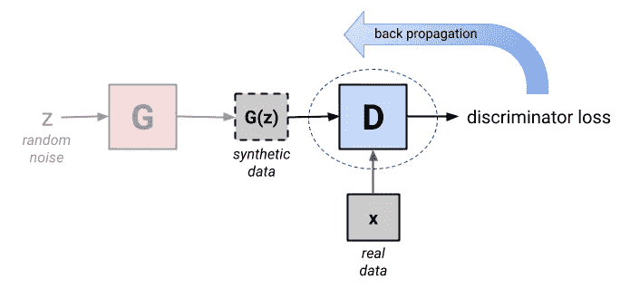***

***Discriminator training. [Image by author]***

## ***4.2 发电机培训阶段***

***发电机网络的培训稍微复杂一些。它包括发生器和鉴别器网络。发电机训练的迭代包括以下步骤:***

1.  ***样本随机噪声。***
2.  ***产生发电机输出。***
3.  ***将输出传递给鉴别器。***
4.  ***计算二元分类损失。***
5.  ***通过鉴别器和发生器网络反向传播。***
6.  ***仅更新**发电机重量**。***

***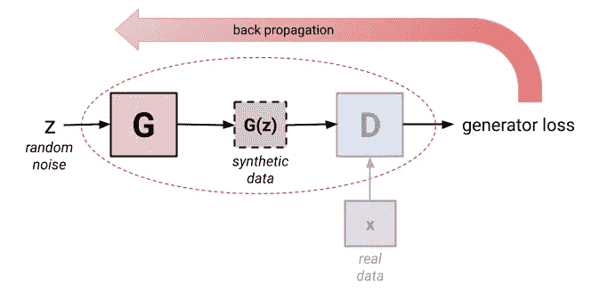***

***Generator training. [Image by author]***

# ***5.GAN 的变体***

***GAN 许多变体已经被提出来执行各种任务。在这里，我们将看看几个基本的变化。这一部分提供了一个简要的概述，并提供了更多详细阅读资料的原始论文链接。它相对来说技术性更强，需要对神经网络体系结构有基本的了解。***

## ***5.1 深度卷积 GAN (DCGAN)***

***原始 GAN 中的发生器和鉴别器由全连接网络构成。然而，GAN 在图像合成领域具有广泛的应用，其中卷积神经网络(CNN)是天然的。因此，一个名为 [DCGAN](https://arxiv.org/abs/1511.06434) (深度卷积 GAN)的网络架构家族被提出。它允许训练一对深度卷积生成器和鉴别器网络。***

***通常，卷积网络使用空间池层，如*最大值*和*平均池*，在图像沿网络移动时对其进行上采样或下采样。DCGAN 使用*步长*和*分数步长*卷积，这是可以学习的。这允许在训练期间学习空间下采样和上采样算子。这些算子处理采样率和位置的变化，这是从图像空间映射到可能更低维度的潜在空间以及从图像空间映射到鉴别器的关键要求。***

***在这篇论文中，作者提出了一种为他们的实验需要而设计的深度卷积生成器结构。结构如下图所示。发生器的第一层将 100 维均匀分布噪声 **𝑧** 作为全连接网络的输入。结果被整形为 4 维张量，并用作卷积叠加的开始。然后，一系列四个分数步长卷积将这种高级表示转换为 64 × 64 像素图像。对于鉴频器，最后一个卷积层被展平，然后馈入单个 sigmoid 输出***

***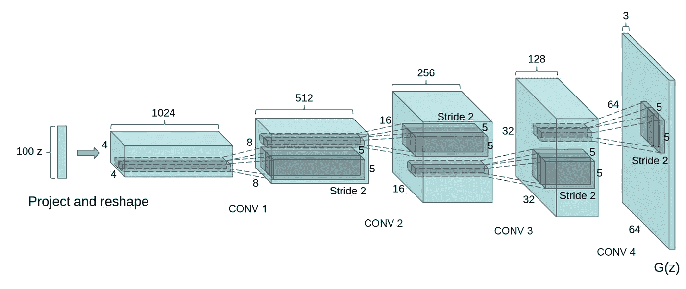***

***Deep convolutional generator structure for DCGAN. [Image taken from [this paper](https://arxiv.org/abs/1511.06434)]***

## ***5.2 有条件 GAN (CGAN)***

***在原始 GANs 中，对生成的图像没有控制，因为它们仅依赖于随机噪声作为输入。GAN 的一个[条件版本是在 GAN 推出后不久提出的。可以通过根据附加信息来调节模型来指导生成过程。典型地，条件向量 **y** 与噪声向量 **z** 连接，并且结果向量被输入到原始 GAN。](https://arxiv.org/abs/1411.1784)***

***条件向量是任意的。例如，在 CGAN 论文中，作者使用类别标签的一个热向量来调节 GAN 以生成 MNIST 数字。他们还展示了由预先训练的 AlexNet 的卷积层提取的图像的特征向量调节的图像的自动标记。***

***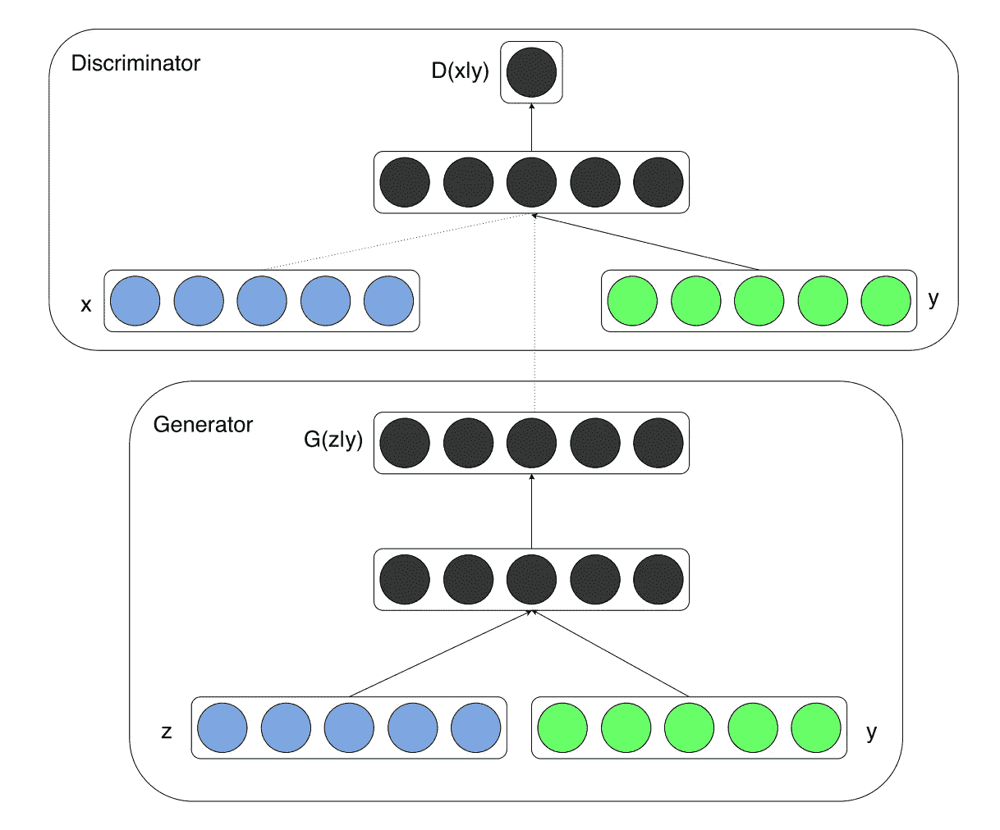***

***Structure of CGAN, in which the generator and discriminator are conditioned by additional vector **y.** [Image taken from [this paper](https://arxiv.org/abs/1411.1784)]***

## ***5.3 辅助分类器 GAN (ACGAN)***

***[ACGAN](https://arxiv.org/abs/1610.09585) 是条件 GAN 的扩展，它通过增加一个额外的任务来修改鉴别器:在真/假分类之上预测给定图像的类别标签。众所周知，强迫一个模特执行额外的任务( [*【多任务学习】*](https://ruder.io/multi-task/) )可以提高原始任务的表现。它具有稳定训练过程并允许生成大的高质量图像的效果，同时学习独立于类别标签的潜在空间中的表示。ACGAN 的结构如下所示。作者论证了这种方法有助于产生更清晰、分辨率更高的图像。***

***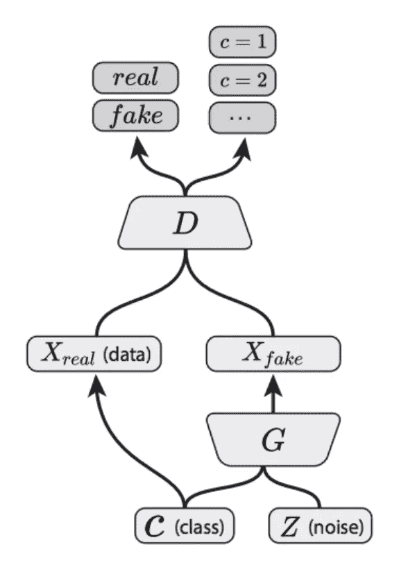***

***Structure of ACGAN in image synthesis, where the discriminator performs additional task of predicting the class label of image. [Figure taken from [this paper](https://arxiv.org/abs/1610.09585)]***

## ***5.4 双向 GAN(甘比)***

***GAN 可以将噪声向量 **z** 从简单的潜在分布转换成数据分布相当复杂的合成数据样本**【𝐺(z】**。证明了这种生成器的潜在空间捕获数据分布中的语义变化。直观地，训练来预测给定数据的这些语义潜在表示的模型可以充当语义相关的辅助问题的有用特征表示。然而，GANs 缺乏将数据样本 **x** 映射到潜在特征**z**的能力***

***甘比被提出来作为学习这种逆映射的方法。结果表明，所得到的学习特征表示对于辅助监督辨别任务是有用的，与无监督和自监督特征学习的当代方法相竞争。***

***甘比的结构如下所示。除了来自标准 GAN 框架的生成器 **𝐺** ，甘比还包括一个编码器 **𝐸** ，它将数据 **x** 映射到潜在表示 **z** 。甘比鉴别器 **𝐷** 不仅在数据空间( **x** 对 **𝐺 (z)** 进行鉴别，而且在数据和潜在空间(元组( **x** ， **𝐸(x)** )对( **𝐺(z)** ， **z** )进行联合鉴别，其中潜在分量是编码器输出 **𝐸(x)** 或发生器输入 **z*****

***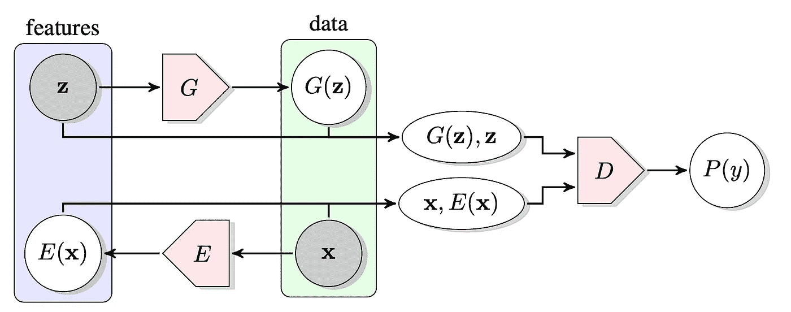***

***Structure of BiGAN. [Image taken from [this paper](https://arxiv.org/abs/1605.09782)]***

# ***6.应用***

***GAN 一直是许多现实世界应用的支柱，尤其是在图像合成方面。这也是一个非常活跃的研究领域。这里讨论一些有趣的应用。***

## ***6.1 图像超分辨率***

***在该应用中，GAN 用于基于低分辨率输入重建更高分辨率的图像。[第一个此类框架](https://arxiv.org/abs/1609.04802)于 2017 年推出，能够推断逼真的自然图像以进行 4 倍放大操作。***

***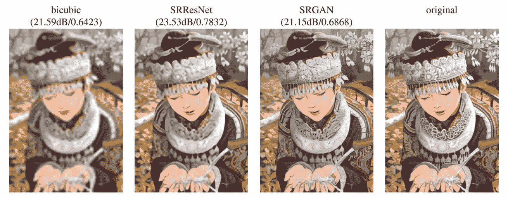***

***The quality of image upscaling (4x) comparing bicubic interpolation, super-resolution ResNet optimized with MSE, and super-resolution with GAN optimized with perceptual loss. [Image taken from [this paper](https://arxiv.org/abs/1609.04802)]***

***在本文的[中，GAN 训练方法被引入到生成可信的面部图像的背景中。这种方法的关键思想是逐渐增加生成器和鉴别器，从低分辨率开始，随着训练的进行增加新的层，以使模型增加精细的细节。生成的图像令人印象深刻，非常逼真。此后，图像质量和分辨率不断提高。](https://arxiv.org/abs/1710.10196)***

*****最新款** : [渐进式人脸超分辨率](https://arxiv.org/abs/1908.08239) (2019)，对监控摄像头采集的人脸图像的[超分辨率](https://arxiv.org/abs/2102.03113) (2021)***

## ***6.2 图像修复***

***图像修复是指基于背景信息恢复和重建图像的技术。期望生成的图像看起来非常自然，并且难以与地面真实相区分。高质量的图像修复不仅要求生成的内容语义合理，而且要求生成的图像纹理足够清晰逼真。例如， [ExGAN](https://arxiv.org/abs/1712.03999) 能够将闭着眼睛的面部图像修改为睁开眼睛的图像，同时保留对象的身份。***

***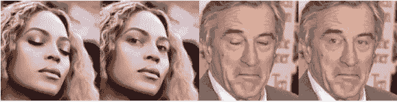***

***Result from eye opening ExGAN model. [Image taken from [this paper](https://arxiv.org/abs/1712.03999)]***

*****近期车型** : [Deepfillv2](https://arxiv.org/abs/1806.03589) (2019)、 [EdgeConnect](https://arxiv.org/abs/1901.00212) (2019)***

## ***6.3 图像到图像的翻译***

***最初的 GAN 被提出用于从噪声中生成图像。图像到图像 GAN 从图像生成不同的图像。图像翻译的目标是学习从源图像域到目标图像域的映射，即在保持图像内容不变的情况下，将源图像域的风格或其他一些属性改变到目标图像域。***

***2017 年， *pix2pix* 软件与一项关于[多用途图像到图像翻译与条件 GAN](https://arxiv.org/pdf/1611.07004.pdf) 的工作联合发布。例如，它能够从草图中生成逼真的图像。***

***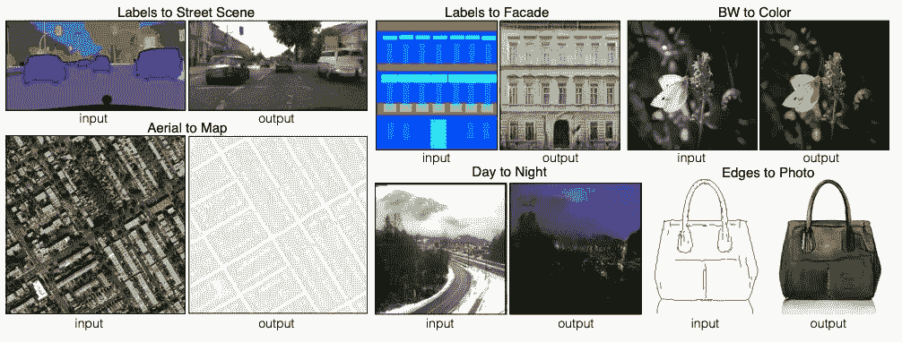***

***Results from pix2pix, enabling realistic image generation and transformation. [Image taken from [this paper](https://arxiv.org/pdf/1611.07004.pdf)]***

***近期车型: [pix2pixHD-Aug](https://arxiv.org/abs/2011.12636) (2020 年) [toon2real](https://arxiv.org/abs/2102.01143) (2021 年)***

# ***结论***

***在这篇文章中我介绍了 GAN，一个深度生成模型类。氮化镓被广泛应用于计算机视觉领域，尤其是图像合成。不仅限于图像，GAN 还学习了音频、文本和一般数据中隐含的复杂和高维分布。***

***作为临别赠言，我想强调一下 GAN 在数据增强方面的潜力。由于 GAN 能够在数据样本的域中产生样本，因此 GAN 具有用于此目的的良好前景。它已经被提出用于[图像数据增强](https://arxiv.org/abs/1904.09135)。在我的研究领域，即语音分析，GAN 已经成功地用于语音情感识别中的语音数据增强。***

# ***参考***

1.  ***I.J. Goodfellow，J. Pouget-Abadie，M. Mirza，B. Xu，D. Warde-Farley，S. Ozair，a . c . & y . beng io，[生成对抗网络](https://arxiv.org/abs/1406.2661) (2014)， *NIPS* 。***
2.  ***I.J. Goodfellow， [NIPS 2016 教程:生成对抗网络](https://arxiv.org/abs/1701.00160) (2017)， *ArXiv，abs/1701.00160* 。***
3.  ***A.拉德福德，l .梅斯和 s .钦塔拉，[深度卷积生成对抗网络的无监督表示学习](https://arxiv.org/abs/1511.06434) (2016)， *arXiv:cs。LG/1511.06434****
4.  ***米（meter 的缩写））Mirza & S. Osindero，[条件生成通用网](https://arxiv.org/abs/1411.1784) (2014)， *arXiv:cs。LG/1411.1784****
5.  ***A.Odena，C. Olah & J. Shlens，[使用辅助分类器的条件图像合成 GANs](https://arxiv.org/abs/1610.09585) (2017)， *arXiv:stat。ML/1610.09585****
6.  ***J.多纳休，P. Krähenbühl 和 t .达雷尔，[对抗性特征学习](https://arxiv.org/abs/1605.09782) (2017)， *arXiv:cs。LG/1605.09782****
7.  ***C.Ledig，L. Theis，F. Huszár，J. Caballero，A. Aitken，A. Tejani，J. Totz，Z. Wang & W. Shi，[使用生成式对抗网络的照片真实感单幅图像超分辨率](https://arxiv.org/abs/1609.04802) (2017)， *2017 年 IEEE 计算机视觉与模式识别大会()*，105–114。***
8.  ***B.Dolhansky & C. Canton-Ferrer，[具有范例生成对抗网络的眼内画](https://arxiv.org/abs/1712.03999) (2018)， *2018 IEEE/CVF 计算机视觉与模式识别会议*，7902–7911。***
9.  ***页（page 的缩写）Isola，J. Zhu，t . Zhu & a . a . ef ROS，[条件对抗网络的图像到图像翻译](https://arxiv.org/abs/1611.07004) (2017)， *2017 年 IEEE 计算机视觉与模式识别大会()*，5967–5976。***
10.  ***F.H. Tanaka & C. Aranha，[使用 GANs 的数据增强](https://arxiv.org/abs/1904.09135) (2019)， *ArXiv，abs/1904.09135* 。***
11.  ***A.Chatziagapi，G. Paraskevopoulos，D. Sgouropoulos，G. Pantazopoulos，M. Nikandrou，t .詹纳科普洛斯，A. Katsamanis，A. Potamianos & S.S. Narayanan，[使用 GANs 进行语音情感识别的数据增强](https://www.isca-speech.org/archive/Interspeech_2019/abstracts/2561.html) (2019)， *INTERSPEECH* 。***