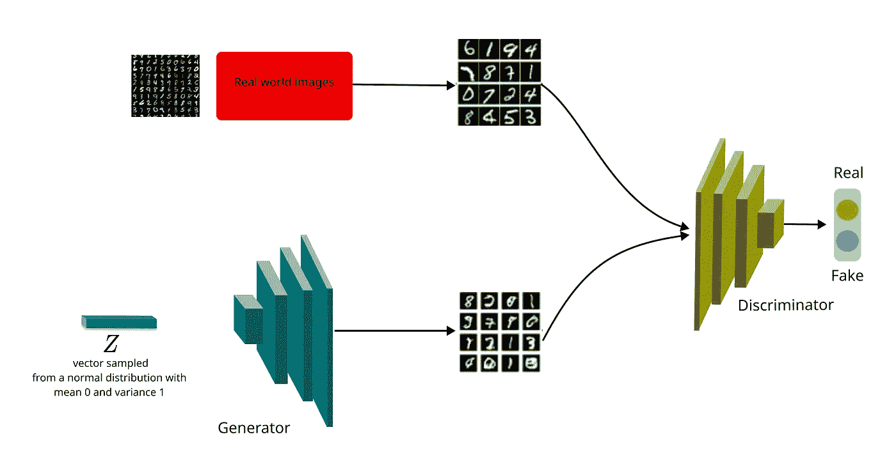
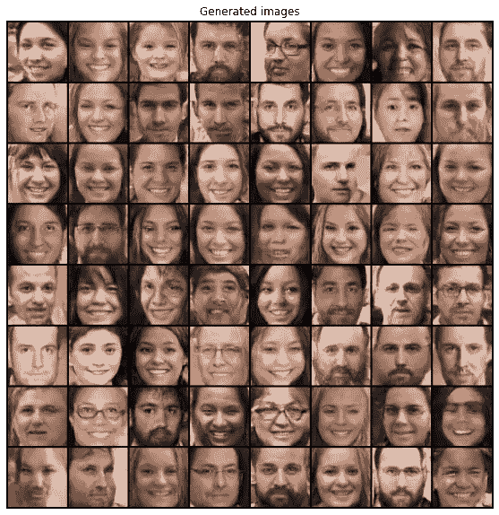

# 生成对抗网络:介绍与实例

> 原文：<https://medium.com/mlearning-ai/generative-adversarial-networks-gan-introduction-and-example-3b66f5f235e9?source=collection_archive---------1----------------------->

基于深度卷积生成对抗网络的人脸生成

图像处理和计算机视觉中的许多问题可以被看作是图像到图像的转换，其中输入被从一种可能的表示转换成另一种表示。社区通过利用卷积神经网络(CNN)在这个方向上取得了重大进展，该网络随后成为许多图像预测问题的常用工具。CNN 学习最小化一个损失/目标函数；然而，已经有许多设计有效损失的尝试。因此，根据给定的任务，CNN 仍然需要适当的损失函数。例如，如果我们使用欧几里德距离来测量预测像素和地面真实像素之间的差异，它很可能会产生模糊的结果。然而，想出一个有效的损失函数来鼓励 CNN 产生非常真实的图像是极其困难的。

幸运的是，生成对抗网络(GANs)最近在该领域取得了令人印象深刻的成果。具体来说，通过合并两个独立的网络，生成器和鉴别器，GAN 学习损失函数，从而能够产生高度逼真的图像。

# 概念

DCGAN. Image by the author.

给定一个训练数据集，生成模型从相同的分布中合成新的样本。上图展示了 GAN 的工作原理。正如所看到的，生成器的目标是生成与真实数据不可区分的数据，而鉴别器接受真实数据和生成的数据，并试图对它们进行正确的分类。

**生成器:**将随机向量映射到图像

**鉴别器:**评估图像真伪。

此外，考虑到 GAN 学习适应训练数据的目标，它们已经被应用于各种各样的任务。最近，甘人受雇于:

*   图像恢复
*   文本到图像的翻译
*   图像到图像的翻译
*   人脸正面视图生成
*   卡通人物一代
*   风格转移
*   面部老化
*   3D 对象生成

# 氮化镓的特性

不要使用显式密度函数。

采取博弈论的方法:通过双人游戏学习从训练分布中生成。

产生美丽的、高质量的图像。

训练不稳定。

> 不要限制鉴别器，以免让它太聪明。让学习变得更容易不一定会让一代人变得更好。

# 深度卷积生成对抗网络

DCGAN 是最早的 GANs 类型之一，其中两个网络(生成器和鉴别器)都是深度卷积神经网络。因此，生成器将具有(*批次大小×D×1×1)*形状的采样向量作为输入，并输出期望的图像。此外，发生器通常看起来像一个反向鉴别器。

> DCGAN 的架构指南

为更深层次的架构移除完全连接的隐藏层。

对所有隐藏层使用 ReLU 激活，对输出层(发生器)使用 Tanh。

对鉴别器的所有层使用 LeakyReLU 激活。

## 训练鉴别器

正如所看到的，鉴别器应该通过分别分配 0 和 1 来正确地分类伪图像和真实图像。目标函数是众所周知的二进制交叉熵(BCE)损失。最后，总损失是真实和虚假数据损失的总和。

## 训练生成器

如前所述，生成器的目的是通过生成高质量的图像来欺骗鉴别器。因此，鉴别器网络应该为假数据产生 1。因此，损耗是通过将产生的数据通过鉴频器网络并应用 BCE 来计算的。

# 一些遗言

DCGAN output. Image by the author.

上图是训练 DCGAN 25 个历元后得到的结果。你可以比我玩得更好，取得更好的成绩。尽管如此，令人惊讶的是，生成器能够从随机向量中生成这些图像。已经有很多 GANs 架构被提出，我想尽快写出来。我会留下原始论文的链接，这样你就可以在空闲时间研究它。感谢您花时间阅读我的文章。

# 纸张:

[深度卷积生成对抗网络的无监督表示学习](https://arxiv.org/pdf/1511.06434.pdf)