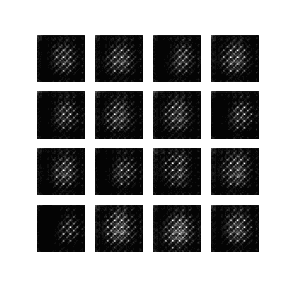
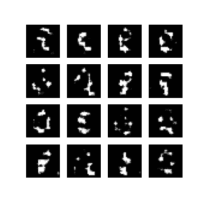
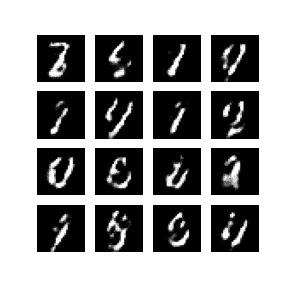
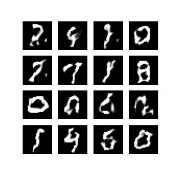
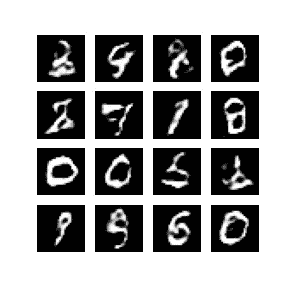
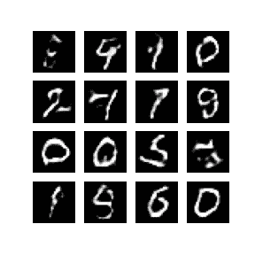

# 生成对抗网络(GANS) -一个实际的实现

> 原文：<https://medium.com/mlearning-ai/generative-adversarial-networks-gans-a-practical-implementation-90e5f54fb81d?source=collection_archive---------4----------------------->

GANS 被设计用来创建逼真的图像。它由一个发生器和一个鉴别器网络组成。生成器网络将尝试从随机噪声中创建逼真的图像。鉴别器的职责非常简单。它所要做的就是验证一个图像是真是假。

这种方法的理想目标是很好地训练生成器网络，以便鉴别器将被生成器创建的假图像所愚弄，并使生成器相信它是真实的图像。在这里，我们将讨论使用手写数字的 mnist 数据集来训练我们的模型以生成相似图像的整个过程。

```
import glob
import imageio
import matplotlib.pyplot as plt
import numpy as np
import os
import PIL
from tensorflow.keras import layers
import time
from IPython import display(train_images, train_labels), (_, _) = tf.keras.datasets.mnist.load_data()
```

我们加载 mnist 数据集，并从中获取训练图像和训练标签。

```
train_images = train_images.reshape(train_images.shape[0], 28, 28, 1).astype('float32')train_images = (train_images - 127.5) / 127.5  # Normalize the images to [-1, 1]
```

图像的大小将被调整为(28，28，1)并且它们将被转换为浮点值。现在我们将像素值减去 127.5，也就是 255/2，这样两边的最大值就变成了(-127.5，+127.5)，现在很容易将其归一化为[-1，1]

```
BUFFER_SIZE = 60000
BATCH_SIZE = 256
```

我们将批量设置为 256。这意味着我们一次训练 256 张图片。混洗数据需要缓冲区大小。

```
train_dataset = tf.data.Dataset.from_tensor_slices(train_images).shuffle(BUFFER_SIZE).batch(BATCH_SIZE)
```

“from_tensor_slices”给出了切片元素的对象。数据集以 256 为一批创建，并使用缓冲区进行混洗。请记住，缓冲区的大小不应小于数据集的大小。

```
def make_generator_model():
    model = tf.keras.Sequential()
    model.add(layers.Dense(7*7*256, use_bias=False, input_shape=(100,)))
    model.add(layers.BatchNormalization())
    model.add(layers.LeakyReLU())
    model.add(layers.Reshape((7, 7, 256))) assert model.output_shape == (None, 7, 7, 256)  # Note: None is the batch size model.add(layers.Conv2DTranspose(128, (5, 5), strides=(1, 1), padding='same', use_bias=False)) assert model.output_shape == (None, 7, 7, 128) model.add(layers.BatchNormalization())
    model.add(layers.LeakyReLU())
    model.add(layers.Conv2DTranspose(64, (5, 5), strides=(2, 2), padding='same', use_bias=False)) assert model.output_shape == (None, 14, 14, 64) model.add(layers.BatchNormalization())
    model.add(layers.LeakyReLU())
    model.add(layers.Conv2DTranspose(1, (5, 5), strides=(2, 2), padding='same', use_bias=False, activation='tanh')) assert model.output_shape == (None, 28, 28, 1)
    return model
```

现在我们需要生成器模型来从噪声中创建图像。输入形状给定为 100，因为我们从 100 个点生成图像。然后，我们使用批处理规范化和泄漏 relu。每一层的形状都不同，最后一层的形状应该是(28，28，1)。这个形状是我们原始数据的形状。

普通 Conv2D 对图像进行下采样，但这里我们使用 Conv2D 的转置对图像进行上采样，消除噪声。

assert 函数用于检查是否按预期获得了形状。最后一层使用 tanh 作为激活函数，因为它的值在[-1，1]之间变化。请记住，我们将实像归一化为[-1，1]。

```
generator = make_generator_model()noise = tf.random.normal([1, 100])generated_image = generator(noise, training=False)plt.imshow(generated_image[0, :, :, 0], cmap='gray')
```


现在，在创建模型之后，我们需要创建它的一个实例。然后我们会测试随机噪声产生的图像。我们将训练设置为假。

```
def make_discriminator_model(): model = tf.keras.Sequential()
    model.add(layers.Conv2D(64, (5, 5), strides=(2, 2), padding='same',input_shape=[28, 28, 1])) model.add(layers.LeakyReLU())
    model.add(layers.Dropout(0.3))
    model.add(layers.Conv2D(128, (5, 5), strides=(2, 2), padding='same')) model.add(layers.LeakyReLU())
    model.add(layers.Dropout(0.3))
    model.add(layers.Flatten())
    model.add(layers.Dense(1))
    return model
```

现在，一旦我们创建了生成器，就该创建鉴别器了。相比之下，鉴别器比发生器轻，因为它只需要识别图像是真是假。此外，我们使用步长卷积。脱落层用于避免过度拟合。最后一层仅由一个具有乙状结肠激活功能的神经元组成。

```
discriminator = make_discriminator_model()decision = discriminator(generated_image)print (decision)
```

现在，鉴别器的一个实例被创建，生成器生成的图像被提供给鉴别器。如果输出是零，则意味着图像是假的，如果是真的，则输出是一。

```
cross_entropy = tf.keras.losses.BinaryCrossentropy(from_logits=True)
```

这是需要注意的一件重要事情。发生器和鉴别器的损耗是不同的。

```
def discriminator_loss(real_output, fake_output): real_loss = cross_entropy(tf.ones_like(real_output), real_output)
    fake_loss = cross_entropy(tf.zeros_like(fake_output), fake_output)
    total_loss = real_loss + fake_loss
    return total_loss
```

我们创建一个定制的损失函数。因为我们把原始图像和伪图像提供给鉴别器。两者的损失计算方式不同。

对于实图像的交叉熵函数，我们有两个参数。第二个是实际输出，第一个是期望输出。所以当我们给出一个真实的图像时，输出应该是 1。“tf.ones_like”给出了所有 1 的矩阵。

现在，当我们给出假数据时，期望输出应该为零。

总损失是真实损失和虚假损失的总和。

```
def generator_loss(fake_output):
    return cross_entropy(tf.ones_like(fake_output), fake_output)
```

发电机的情况也是如此。

```
generator_optimizer = tf.keras.optimizers.Adam(1e-4)discriminator_optimizer = tf.keras.optimizers.Adam(1e-4)
```

生成器和鉴别器的优化器是相似的。

```
checkpoint_dir = './training_checkpoints'
checkpoint_prefix = os.path.join(checkpoint_dir, "ckpt")checkpoint = tf.train.Checkpoint(generator_optimizer=generator_optimizer,discriminator_optimizer=discriminator_optimizer,
generator=generator, discriminator=discriminator)
```

**保存检查点。**

随着模型被训练，生成器模型、鉴别器和优化器被保存在它定义的目录中。

```
EPOCHS = 50
noise_dim = 100
num_examples_to_generate = 16# You will reuse this seed overtime (so it's easier)
# to visualize progress in the animated GIF)seed = tf.random.normal([num_examples_to_generate, noise_dim])
```

我们将纪元的数量设置为 50。所以它被训练了 50 个纪元。如上所述，噪声的维数是 100。

在测试模型时，我们创建了 16 个噪声样本，以观察生成的图像看起来有多好。

```
@tf.functiondef train_step(images):
    noise = tf.random.normal([BATCH_SIZE, noise_dim])
    with tf.GradientTape() as gen_tape, tf.GradientTape() as disc_tape:
      generated_images = generator(noise, training=True) real_output = discriminator(images, training=True)
      fake_output = discriminator(generated_images, training=True) gen_loss = generator_loss(fake_output)
      disc_loss = discriminator_loss(real_output, fake_output) gradients_of_generator = gen_tape.gradient(gen_loss, generator.trainable_variables) gradients_of_discriminator = disc_tape.gradient(disc_loss, discriminator.trainable_variables)generator_optimizer.apply_gradients(zip(gradients_of_generator, generator.trainable_variables))
discriminator_optimizer.apply_gradients(zip(gradients_of_discriminator, discriminator.trainable_variables))
```

这里我们创建一个自定义的训练循环。我们需要指定数据应该如何从生成器流向鉴别器。

**@tf.function** 在我们创建自定义训练循环时使用。该注释导致函数被编译。

梯度带有助于我们跟踪参数，并随时间记录下来。

流程非常简单:

我们制造一些噪音。噪音被传送到发电机。它给出生成的图像。

现在，我们将生成的输出提供给鉴别器，然后将该输出命名为 fake_output。下一个真实图像被馈送到鉴别器，并且所获得的输出被称为真实输出。

分别计算了发生器和鉴别器的损耗函数。对于鉴别器，应该在两种情况下计算损失函数，即真实输出和虚假输出。

现在使用损失函数，我们使用梯度函数计算梯度，损失函数和可训练变量(模型的参数)作为输入。测量梯度，然后进行相应的优化。应用梯度功能进行优化。我们对鉴别器和发生器都这样做。

```
def train(dataset, epochs):
for epoch in range(epochs):
start = time.time()
for image_batch in dataset:
train_step(image_batch)# Produce images for the GIF as you godisplay.clear_output(wait=True)
generate_and_save_images(generator,epoch + 1,seed)# Save the model every 15 epochsif (epoch + 1) % 15 == 0:
checkpoint.save(file_prefix = checkpoint_prefix)
print ('Time for epoch {} is {} sec'.format(epoch + 1, time.time()-start))# Generate after the final epochdisplay.clear_output(wait=True)
generate_and_save_images(generator,epochs,seed)
```

最后，我们创建一个训练循环，在这个循环中，我们向函数提供数据集以及历元数。

我们进入 for 循环。一次将数据集中的一批图像提供给训练集。在这里，一次对每一批进行整个训练步骤

在每个时期之后，生成的图像被显示给我们以了解它进行得有多好。

在每 15 个时期之后，我们将权重保存到我们创建的检查点

```
def generate_and_save_images(model, epoch, test_input):# Notice `training` is set to False.
# This is so all layers run in inference mode (batchnorm).predictions = model(test_input, training=False)
fig = plt.figure(figsize=(4, 4))for i in range(predictions.shape[0]):
plt.subplot(4, 4, i+1)
plt.imshow(predictions[i, :, :, 0] * 127.5 + 127.5, cmap='gray')
plt.axis('off')
plt.savefig('image_at_epoch_{:04d}.png'.format(epoch))
plt.show()
```

这里测试已经完成。所以我们将训练设置为假。该函数接受模型、时期和测试输入。测试输入是之前创建的种子。种子确保每次都产生相同的随机噪声，这样我们每次都能得到相似的结果。

我们绘制预测图。我们将模型图像乘以 127.5，再加上 127.5，使其范围从 0 到 255。

```
train(train_dataset, EPOCHS)
```



Epoch=1



Epoch=10



Epoch=20



Epoch=30



Epoch=40



Epoch=50

```
checkpoint.restore(tf.train.latest_checkpoint(checkpoint_dir))
```

最后，我们使用“checkpoint.restore”来保存最新更新的权重。

因此，我们成功地用 GANS 生成了手写数字。

谢谢大家！

[](/mlearning-ai/mlearning-ai-submission-suggestions-b51e2b130bfb) [## Mlearning.ai 提交建议

### 如何成为 Mlearning.ai 上的作家

medium.com](/mlearning-ai/mlearning-ai-submission-suggestions-b51e2b130bfb)