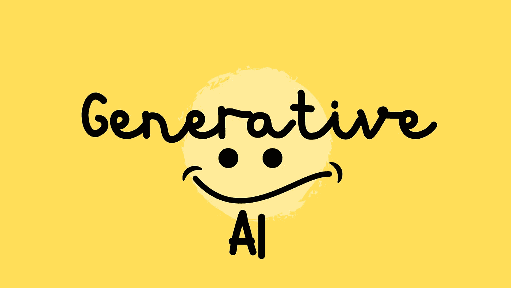
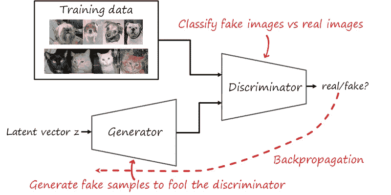
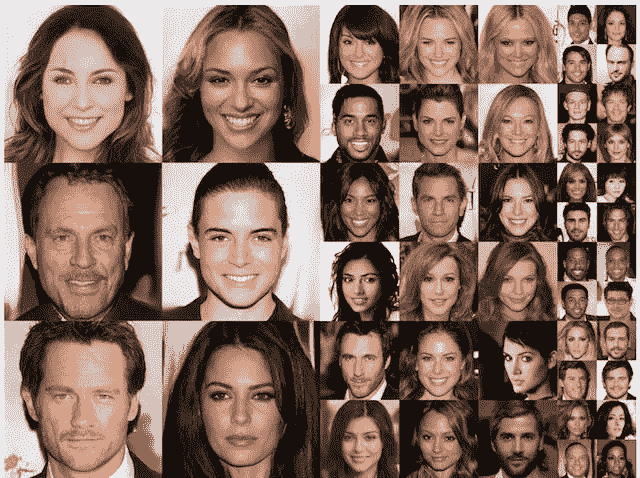
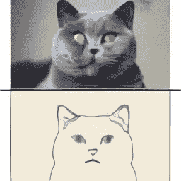

# 生成人工智能

> 原文：<https://medium.com/mlearning-ai/generative-ai-1d3a5cf681f1?source=collection_archive---------7----------------------->

在生成式人工智能的帮助下，计算机可以识别输入的底层结构，并利用它来产生与之相似的内容。

生成性人工智能有许多方法，但生成性对抗网络(GANS)是我现在关注的重点。

GANs 可以生成类似于一组训练数据的合成数据点。我们经常使用它们来制作逼真的照片，将文本转换为图像，增强图像的细节，或将图像转换为各种形式。

gan 是由一个生成器和一个鉴别器神经网络组成的生成模型。创建模拟源数据的新数据或内容的神经网络称为生成器。区分源数据和生成数据的神经网络称为鉴别器。

The image is from [http://www.lherranz.org/2018/08/07/imagetranslation/](http://www.lherranz.org/2018/08/07/imagetranslation/)(more details regarding GAN,you can follow the link)

生成式人工智能最著名的应用是生成模拟真实图像的合成图像。例如，NVIDIA Research 的杰出研究科学家 Tero Karras 在 2017 年写了一份题为“GANs 的渐进增长，以提高质量，稳定性和变化性”的研究报告。

The figure is from *from Progressive Growing of GANs for Improved Quality, Stability, and Variation, 2017*

GANs 可能被用于许多令人兴奋的事情，但吸引公众注意力的是使用 GANs 制作深度假像，即一个人说话的电影，其中一个不同的人的脸被替换。

深度假视频的例子:

GAN 的另一个应用，DALL-E 和 DALL-E 2 是 OpenAI 开发的机器学习模型，用于从文本描述中创建图像。

The image is from [https://openai.com/blog/dall-e/](https://openai.com/blog/dall-e/) .This image is generated by DALL-E

深入猫的形象。用来创建图像的关键词是“顶部的猫和底部的草图完全一样。”

正如我们所看到的，人工智能可以创建令人惊叹的应用程序，如果你想了解 GAN 算法，我建议通过 IBM 制作的这个视频来轻松解释 GAN。

参考资料:

 [## IBM 开发人员

### 编辑描述

developer.ibm.com](https://developer.ibm.com/blogs/what-is-generative-ai-and-how-much-power-does-it-have/)  [## 生成式人工智能模型解释

### 看看上面的特色图片。很美，不是吗？有趣的是，这幅画不是由…

www.altexsoft.com](https://www.altexsoft.com/blog/generative-ai/)  [## Mlearning.ai 提交建议

### 如何成为 Mlearning.ai 上的作家

medium.com](/mlearning-ai/mlearning-ai-submission-suggestions-b51e2b130bfb)