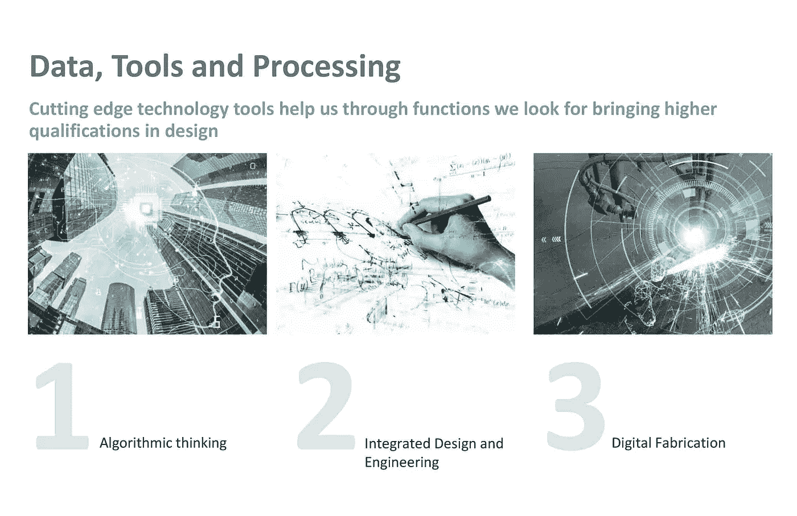
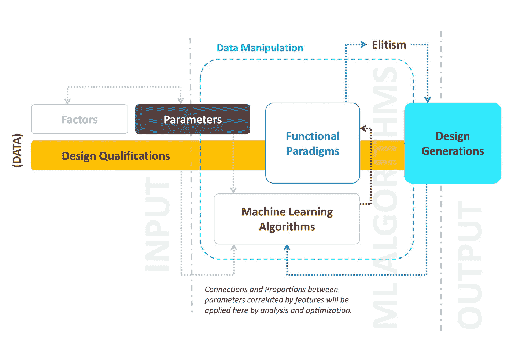
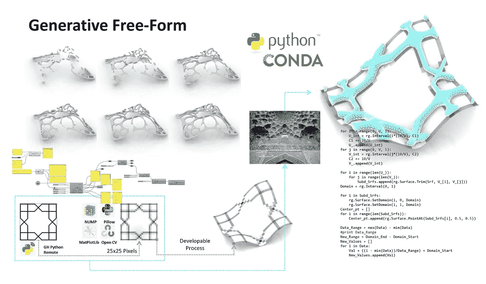
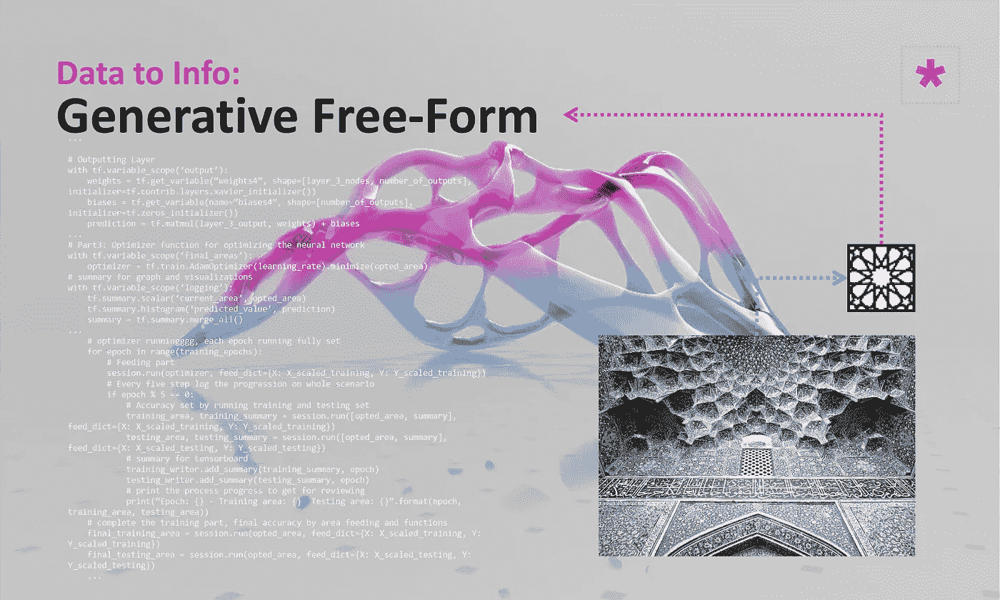

# 生成式设计及其在建筑中的实现

> 原文：<https://medium.com/mlearning-ai/generative-design-and-how-to-implement-it-in-architecture-bd05ff6dfee4?source=collection_archive---------2----------------------->

> 案例研究:基于伊朗传统几何图形的自由结构

# 骨刺简介

虽然我们设计师正致力于通过数据操作实现每个元素的智能化，但如何通过与技术相关的建筑、工程和施工(AEC)流程来应对这一演变，仍是一个重要的考虑因素。自从“集成设计”成为跨学科项目的旅行以来，已经过去了近十年，我们可以超越空谈，从人工智能(AI)的框架中看到数字未来的生动操作。人工智能可以让我们通过每一个复杂的过程从/到 AEC 获得/设置影响，在元素行为的范式(功能范式)中探索更深刻的认知层。然而，这些功能范例中的每一个都应该是从大量的迭代和数据收集中得出的；它们可以由机器学习可以接近的高质量算法来管理。当从理论走向实践时，总是有一个“但是”来证实这些路径，这就是设计师如何利用本段中的术语所提到的相关尖端技术。这是本文试图在实例、定义和实际项目中讨论的整个场景。

> 等一下！这是一个复杂的段落，充满了有点难以理解的专业术语，也写得很全面。好吧！我不会像那样保持从 A-Z 开始的语气，这样我们最终会得到一个复杂的文本或者其他什么东西；让我们在一步一步的食谱下稍微放松一下来做饭吧。

首先，如果你是机器学习和人工智能主题的新手，你可以通过谷歌 it 找到该领域顶级研究人员的大量优秀员工，特别是在 [Edx](https://www.edx.org/) 和 [Coursera](https://www.coursera.org/) 上，尽管我建议去 Lynda.com 看看，在那里你可以找到一些掌握 [AI 和 ML](https://www.lynda.com/Data-Science-tutorials/Artificial-Intelligence-Foundations-Machine-Learning/601797-2.html) 整体概念的最佳课程，由我自己打包的 [Doug Rose](https://dougenterprises.com/) 教授。当这篇文章试图推动设计师理解新技术的极限时，你也可以从我的博客中找到“[Intelligent Architecture to integration](https://msfard.me/intelligent-architecture-towards-integration/)”作为开始的关键。我们不打算讨论这些术语的基础知识，这需要在向前迈出任何一步之前了解很多，但是，如果您对数据如何流向设计流程进行了第二次审议，并且已经了解了这些技术的背景，这可能会确保与本文有更高的对应性。因此，通过上面提到的所有帮助你通过的方法，让我们进入我们已经标记的问题:

> **“设计师如何利用前沿技术，从哪里开始？”**

返回这样的问题不一定有确定的响应；因此，我们需要提前回顾一下我们的设计方向。我们将在随后的字幕中描述数字设计的版本，随后是使用被称为生成设计的技术的趋势，最后是一个名为基于伊朗传统几何学的自由形式结构的研究项目。我们可能认为是对主要问题的正确回答的高级版本将在后续文章中发表，在这些文章中，机器学习将数字设计进步的其余部分视为不断发展的技术。

Figure 1: From thoughts to Tech implementation

# 1.数字设计的发展方向是什么？

不管什么笑话说:“建筑师是不懂数学的工程师”，建筑都是跨学科项目的绝佳领域。我们对项目要求的限定越复杂，我们对集成设计原则的印象就越明显。事实上，通过整合来自不同领域的数据，根据我多次提到的功能范式使用工程和设计，并实时累积使用这些数据，我们将有一个更动态的环境来积极地解决我们的问题。这是每一个可持续发展的想法所寻求的。这里的问题相当大胆:AEC 如何才能更接近技术本身？知道吗？！

最近，我们看到了来自哈佛、麻省理工学院、瑞士联邦理工学院、ITKE 等领域的世界领导者的优秀实践，作为综合设计项目。因此，我强烈建议您查看他们是如何确定在 AEC 流程中操作数据的流程的。2019 年，[斯塔尼斯拉斯·夏洛](https://issuu.com/stanislaschaillou/docs/stanislas_chaillou_thesis_)提出了通过数据集的历史布局分析建筑规划的新方法，使用人工智能模型将程序风格化。 [Autodesk 创成式设计](https://www.autodesk.com/autodesk-university/class/Generative-Design-Architectural-Space-Planning-Case-Autodesk-University-2017-Layout-2017)还为设计师定义了一个新的更广阔的空间，以达到他们设计的最有利水平。许多其他公司已经开始开发技术，并可以通过 Solid Edge 发现[西门子，一群知名的蚱蜢插件，如](https://solidedge.siemens.com/en/solutions/products/3d-design/next-generation-design/generative-design/)[阿米巴](https://www.food4rhino.com/app/ameba)、[千足虫](https://www.grasshopper3d.com/group/millipede)、 [Monolith](https://www.food4rhino.com/app/monolith) ，以及全新的进化解算器，如 [Wallacei](https://www.food4rhino.com/app/wallacei-0) 。使用人工智能和机器学习等前沿技术的设计原则，如 [TOPOS](https://www.food4rhino.com/app/topos) (使用 Nvidia 的 Cuda 进行 GPU 计算) [Owl](https://www.food4rhino.com/app/owl) 、 [Crow](https://www.food4rhino.com/app/crow-artificial-neural-networks) 、 [LunchBoxML](https://provingground.io/2017/08/01/machine-learning-with-lunchboxml/) 、 [DODO](https://www.food4rhino.com/app/dodo) ，其中我们使用数据集将更多层的信息完全连接起来，或者按照特定的功能和权重学科进行分类，以实现数据驱动的设计。内森·米勒和他出色的团队一直是我的过度动力，我邀请你查看他们令人敬畏的博客帖子和他们在[试验场](https://provingground.io/2019/11/19/free-generative-design-a-brief-overview-of-tools-created-by-the-grasshopper-community/)取得的成就。设计不是人工智能和人工智能被使用的唯一领域。工程也在这些新策略的影响之下。我们可以找到数字孪生模型，其中传感器和数据汇集在一起，通过基于现实的相关模拟获得更好的解决方案，监控条件并优化决策。该过程被分配来根据预测的情况进行控制和决策，在工程过程定义的特定特征内对不同的输出进行分类。我不得不提到 CITA 所做的杰出工作，特别是创新项目，学者和专业人士一起从这些方面将想法带到现实世界。有许多项目展示了实现数据是如何达到更复杂但更具表演性的结果的。

# 2.生成式设计！或者/和什么？

由人工智能驱动的设计在实践中会越来越流畅，作为计算设计爱好者，我们可能会了解不同的算法如何工作，以提出通过函数范式进行数据驱动设计的想法。这些条件参数来自各种因素，如结构分析、能源性能、建筑规划等。都是由算法按比例实现的。因此，设计每一个架构元素、工程中的每一个过程以及建造的每一个步骤都将更加优化和可靠，以应对复杂的问题。

设计迭代可以根据不同的参数和因素生成，以使结果在功能上适应项目需求。我们从不同代获得的输出数量加快了优化过程，同时在负载情况和其他有意义的主动影响特性方面设置了差异。已经解释了该过程，介绍了**“生成式设计”**方法，这是当今工程设计中的高质量趋势。试想一下，我们有一个算法，它使用数据集的范例，在设计世代中具有我们希望更加校准和充分的特征，以在我们希望的资格和计算的输出之间具有更好的相称性。

Figure 2: How data to Generative design find its path

因此，生成式设计在定义主要由人工智能驱动的高质量算法时将被简化，用于设计元素内的特定功能范例。无论设计过程中的激活因素是承载负载和力流还是其他功能，我们作为设计师可能会根据办公室平面图关注空间中居住者的流动，或者特定形式的阳光事件将如何分布，这是根据特定功能的数据驱动的设计优化器。您可以加速获取背后的知识，并深入到 [Autodesk 创成式设计](https://www.autodesk.com/solutions/generative-design#:~:text=Generative%20design%20is%20a%20design,manufacturing%20methods%2C%20and%20cost%20constraints.)页面的研究中。但现在，我们希望通过一个生成式设计过程，使用 Python 和 Grasshopper3D 进行自由形式的结构设计，体验数据如何进入从设计到生成 3D 模型的动态链接。

# 3.基于伊朗传统几何图形的自由形式结构

这项研究项目背后最令人兴奋的挑战之一是通过工程设计，从结构中解放出来，这种结构除了性能之外，还有很大的复杂性。近年来，这种美丽结构的世界领导人取得了许多进步。其中一个受欢迎的令人印象深刻的团队是 [Block Research Group](https://www.block.arch.ethz.ch/brg/) ，以苏黎世联邦理工学院的 BRG 而闻名。然而，当涉及到复杂性时，没有限制设计方案的界限，但是只要我们有一个参考的想法，我们就可以通过不同的几何形状和紧急响应来开发它。这可以通过为 3d 格式中的每个元素选择的几何形状来设置，这里我们可以使用术语:“通过几何形状的强度”(【Block 教授)。这是这个项目一直强调的主要思想。我们将通过演示一个从伊朗 Girih Geometries 的图像生成模型的图像处理场景来回顾这个过程。这只是一个最初的想法，关于传统的伊朗传统大师对他们当时经常使用的几何学的思考，以及它如何与自由形式的结构相关联。该项目仍在进行中，而下一步将是结构分析模拟，以实现输出如何超越美学。

Figure 3: The travelling of data from referenced model to generating the iterations

在伊朗传统建筑的某些物理元素中，Girih 几何图形有许多应用。它们被用在窗户、规划和砖结构上，包括巨大的大跨度圆顶、尖塔、门廊和 [kar-bandi](https://journals.sagepub.com/doi/abs/10.1177/0956059919845631) ，致力于确定巨大结构下的力流。问题是如何将我们的输入数据设置为对应于图 2 的第一阶段？查看下图，作为该问题的直观解释程序。

当输入准备好进行分析时，这个过程将会来回进行，直到我们有一大堆层来开始使用机器学习算法的范式识别部分。在这个项目中，这一部分尚未完成，但它正在开发中，以获得我们需要的最多数据作为输入。在这个阶段，项目使用 RhinoCommon、Anaconda 和 [GHPythonRemote](https://github.com/pilcru/ghpythonremote) 来加载 [NumPy](https://numpy.org/) 、 [Pillow](https://pillow.readthedocs.io/en/stable/index.html) ，在进一步的步骤中使用 [OpenCV](https://opencv.org/) 和 [Matplotlib](https://matplotlib.org/) 。这是定义一种算法，通过 RGB 代码读取图像像素，并使用 Alpha 模式跟踪它们，使其朝向曲面细分设置。后面的步骤致力于将这些数据作为可由数字滑块控制的网格点，以改变网格参数，并作为结构元素在自由曲面上向 3d 结构发展。

Figure 4: The process under recognition by ML algorithm, still going to have the amount of data adequate enough for paradigm recognition

# 4.结论

因此，从从 Girih 几何的像素化图像收集数据到吸收基于哪个像素具有我们定义为我们想要的特征的范例的建模算法的过程是我们想要的显式识别。这是确切的部分；高质量的算法可以计算图像以生成数据库。开发该项目的下一步是在由不同 Girih 几何图形、其他自由形式模型以及定义结构元素的变体 3d 网格生成的每个 3d 模型上进行结构分析的水平和垂直剖面。在各个领域都有很多需要考虑的问题，基于这种功能性技术的设计、工程和制造可能会有新的优势，而这个项目只是一个简单的项目，可以让你在使用机器学习算法时理解这些过程。每个机器学习项目都有自己的输入、定义和输出过程，这就是为什么我们需要知道如何根据项目需求编写算法程序。在这篇文章中，我们没有开始解释算法的内部或者它们实际上是如何工作的，也没有从建筑的角度去理解整个概念。我们可能会进一步详细讨论不同的机器学习算法，它们是如何实现的，相关术语是什么，以及我们应该如何使用贡献工具来使每个过程对我们这些设计师来说更加方便和简化。