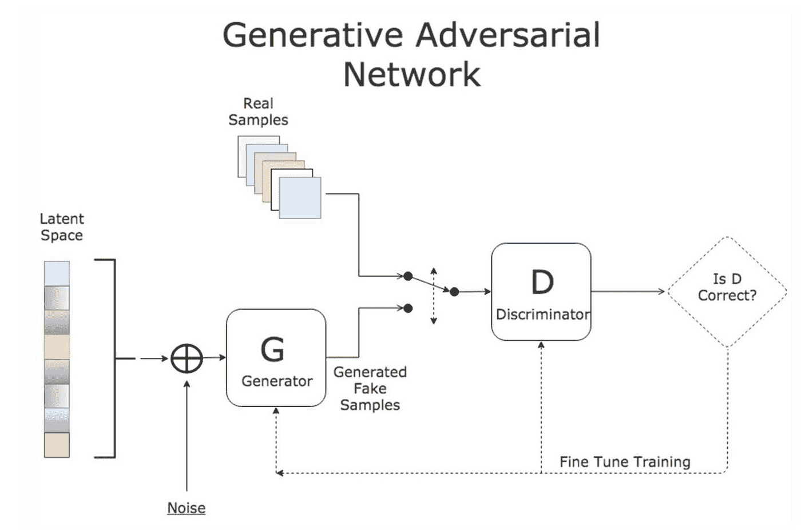
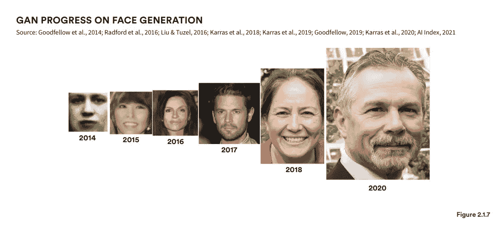
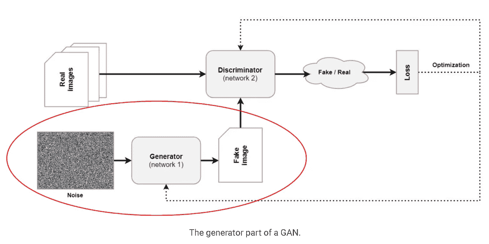
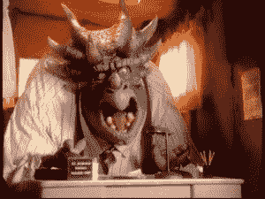

# 生成一切:给你带来深刻假象的技术很快也会给你带来

> 原文：<https://medium.com/mlearning-ai/generative-everything-the-technology-that-brought-you-deepfakes-soon-brings-you-3777a8bccee7?source=collection_archive---------1----------------------->

像任何主要技术一样，人工智能可以用作工具或武器。需要更多的道德护栏，但大多数技术专家认为，受益于有益工具的人数将超过这些工具被武器化的负面影响。

争论的焦点之一是**生成对抗网络(GANs)** 。这些技术最近越来越受欢迎，被用来制作“深度伪造”视频，展示名人和政治人物做他们没有做的事情的现实。这些视频足够接近现实，以至于它们可以被真人混淆，很快只有人工智能才能识别出什么是假的。

告诉我你能不能辨别这是不是一个真人的照片…【https://thispersondoesnotexist.com/

 [## 此人不存在

### 此人不存在

这个人不是 Existthispersondoesnotexist.com](https://thispersondoesnotexist.com/) 

鉴于输出令人信服的真实性和负面用例的风险，很明显这是一个更多监管、监督和人工智能伦理关注的领域。我们需要努力确保技术的快速发展符合我们人类的最佳利益。

然而，就像其他处于生命周期早期的技术一样，GANs 的恶意用例受到了最多的关注，我相信随着技术的改进，正面用例将远远超过负面用例。*我们已经开始在有趣的应用程序中看到这种很好的例子，甚至可以帮助更好地进行视频通话*。让我们回顾其中的一些。

# **甘斯的快速概述**

关于 GANS 的**简单概述**—[甘斯 101。那么，甘代表什么呢？游戏全部… |作者莎兰·巴布| Medium](/@sharanbabu2001/gans-101-14001579e879)

关于**更详细的**介绍— [生成性对抗网络，一个温和的介绍—机器曲线](https://www.machinecurve.com/index.php/2021/03/23/generative-adversarial-networks-a-gentle-introduction/)

**我的总结**:生成式对抗网络是一种无监督的人工智能模型，其中两个神经网络相互竞争以产生一个结果。这些网络通过竞争学会生成逼真的图像、文本和语言。

本质上，一个网络(生成器)试图通过创建真实的数据来欺骗另一个网络，而另一个网络(鉴别器)试图确定(标记)这些数据是真的还是假的。他们来来回回的走，直到生成器网络真的很会造 _ _ _ _ _ _ _ _ _[此处插入酷炫的东西]。

**元利益** =氮化镓模型的广泛使用在人工智能行业的两个令人敬畏的领域创造了普遍的需求和技能:1。)使用噪声和 2。)合成数据。

噪声很重要，因为在模型中引入虚假的噪声数据有助于消除模型的偏差并提高其鲁棒性。《出埃及记》如果你的模型的输出开始看起来太像一个人口中被过度代表的部分…增加更多的噪音。

使用更多的合成数据很好，因为这比支付标记数据要便宜得多。

# GAN 型号的更好视角:

我相信 GAN 模型将很快失去“只用于深度假货”的品牌，因为这些技术也将**成为我们对抗恶意使用创成模型**的最佳保护。除此之外，gan 的有益和良性用例将继续快速增长。

## **部分示例:**

*   **好玩**——甜甜圈可以改变现实。

[GitHub — junyanz/CycleGAN: Software that can generate photos from paintings, turn horses into zebras, perform style transfer, and more.](https://github.com/junyanz/CycleGAN)

*   **谷歌艺术和文化应用程序**——使用一些 GANs 制作酷图片。[https://experiments.withgoogle.com/collection/arts-culture](https://experiments.withgoogle.com/collection/arts-culture)
*   **生成新的游戏角色** — [谷歌人工智能博客:使用游戏角色创造梦幻生物(googleblog.com)](https://ai.googleblog.com/2020/11/using-gans-to-create-fantastical.html)
*   **还原动画或外语电影**——让人类的嘴巴随着新音节移动，让电影更有趣，也可能让唇语读者更容易理解/接触到。
*   **工作** —自动调节背景噪音或人工智能，估计当您切入或切出对话时，其他人对您所说的话的反应，以减少带宽

[NVIDIA 使用人工智能削减视频通话带宽(petapixel.co](https://petapixel.com/2020/10/06/nvidia-uses-ai-to-slash-bandwidth-on-video-calls/)

**奖金**——当您因为没有梳头而跳过播放视频时。一个生成模型可以创建一个虚拟现实的你的化身，你已经洗了澡或者穿上了一件体面的衬衫。这个虚拟角色还可以领导基于书面脚本(全球翻译)的录制培训或授课，节省视频编辑或多次拍摄的时间。

# 较少对抗性

这项技术的风险是显而易见的，但解决方案是加强对 GAN 模型的治理和监管。如果人工智能模型是唯一强大到足以识别视频是否是深度伪造的东西，那么我们就在最准确的看门狗人工智能与恶意演员之间进行了一场军备竞赛。一些好消息是，与网络安全类似，一些拥有超级计算和人工智能能力的大型组织与我们一样有兴趣减少 deepfakes。此外，从长远来看，计算领域的军备竞赛有利于大型组织，而不利于较小的恶意参与者。然而，如果不对这些技术进行深思熟虑的治理，这还不够。

尽管存在这些风险，我相信 GANs 的有益用途将超过其恶意用途。这些技术能够也将会在保证人类安全的治理护栏内发挥作用。

就我个人而言，我期待着能够在一个 wifi 不好的偏远滑雪场注册团队，并作为我的化身发言。虽然我的同事可能不会…

