# 生成建模

> 原文：<https://medium.com/mlearning-ai/generative-modeling-7a88e847f62e?source=collection_archive---------0----------------------->

这是我总结 Sergey Levine 教授从 CS182 开始的演讲的系列文章的第四篇，所有的荣誉都归于他。所有图片均取自他的讲座。这些是第一条、[、第二条](/mlearning-ai/convolutional-networks-recurrent-neural-networks-and-transfomers-ee6a63ddb57f)和[第三条。](/mlearning-ai/detailed-basics-of-deep-learning-part-three-b930c40cf7f8)

生成模型的中心思想源于训练生成模型，其样本 x∞pθ(x)来自与训练数据分布 x∞PD(x)相同的分布。

考虑一个医学诊断问题，其中我们拍摄了一个病人的 X 射线图像，我们希望确定病人是否患有癌症。生成模型首先解决为每个类 Ck 单独确定类条件密度 p(x|Ck)的推理问题。此外，它单独推断先验类别概率 p(Ck)。然后，它使用以下形式的贝叶斯定理:

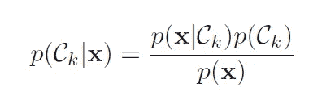

等价地，我们可以直接对联合分布 p(x，Ck)建模，然后归一化以获得后验概率。找到后验概率后，我们使用决策理论来确定每个新输入 x 的类成员资格。显式或隐式建模输入和输出分布的方法称为生成模型，因为通过从中采样，可以在输入空间中生成合成数据点。

随着生成模型的应用范围不断扩大，我们可以确定三种基本的推理查询来评估生成模型:

1.  *密度估计:*给定一个数据点 x，模型赋予的概率是多少，即 pθ(x)？
2.  *采样:*如何从模型分布中*生成*新数据，即 xnew∾pθ(x)？
3.  *无监督表示学习:*我们如何学习一个数据点 x 的有意义的特征表示？

这是生成模型的分类:

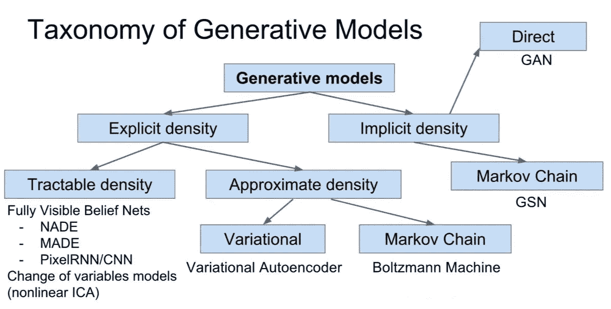

具体来说，我们将讨论四种生成模型:

1.  自回归模型
2.  可变自动编码器
3.  标准化流动模型
4.  生成对抗网络

## **自回归生成模型**

*自回归生成模型使用条件概率链规则隐式定义了序列的分布，由此在每一步中，给定前一个元素，预测下一个序列元素的分布*。训练自回归生成模型的主要原则是:

1.  我们把 x 分成它的维度 x1，…，xn
2.  我们将这些维度中的每一个离散化为 k 值(例如，当我们生成图像时，图像像素自然被离散化为 256 个值，因为像素只能呈现 256 种不同的颜色)
3.  我们用链式法则来表示 x 的所有像素或所有维度上的全关节
4.  用你最喜欢的序列模型来模拟这个 p(x)

让我们来看看这个类别中的一个流行的模型类别，它专门针对图像的自回归生成模型。这叫“pixel rnn”；我们的想法是，按照扫描线的顺序，从左到右，从上到下，一次生成一个像素。因此，整个图像的概率由所有像素的乘积给出，并且每个像素依赖于它的前一个像素，前一个像素被定义为所有前面的扫描线和当前扫描线中当前像素左侧的所有前面的像素。

每个像素由三个颜色通道组成，因此我们也必须一次生成一个颜色通道——实际上每个像素都有一个小网络，在给定所有先前像素的情况下生成红色，然后在给定所有先前像素和该像素自身的红色的情况下生成绿色，然后在给定所有先前像素和该像素的红色和绿色的情况下生成蓝色。然后每个颜色通道是一个 256 路 softmax，所以每个颜色通道的亮度可以有 256 个可能的值。

有了这个模型，一旦你训练了它，你可以给它一个图像的上半部分，它可以为下半部分完成不同的随机实现。

一些实际考虑:

1.  它非常慢，因为虽然基本的配方与语言模型相同，但如果图像是 32×32 像素，这意味着图像中大约有一千个像素，所以这就像一个一千个单词的句子。另外，每个像素本身有三个颜色通道，所以它提高到 3000。
2.  像这样逐行生成图像可能无法捕获图像中存在的一些空间上下文，因为位于扫描线正上方的像素在 RNN 排序中被认为是很远的。
3.  有许多实际的改进和更好的架构有可能改进 PixelRNN (PixelCNN，PixelTransformer，…)。

**条件自回归模型**

*条件自回归模型解决了这个问题:如果我们想要生成以另一条信息为条件的东西呢？*

例如，我们可以生成特定类型对象的图像，或者我们可以有一个模仿学习的条件自回归模型，该模型可以生成动作的分布。

配方非常类似于条件语言模型；你有一些你所依赖的东西，我们称之为“背景”。使用某种编码器网络来处理上下文，该网络可以只是前馈模型、CNN 或另一个 RNN，并且用于开始自回归生成模型的第一时间步。

编码器可能非常简单，如果你正在生成一个类的图像，或者它可能非常复杂，如果你在模仿学习中表示策略。

总而言之:

*   自回归生成模型基本上类似于语言模型，但针对其他类型的数据——尽管更准确的说法是语言模型只是自回归生成模型的一种特殊类型。换句话说，自回归生成模型的概念实际上比语言模型更普遍
*   您可以用许多不同的方式来表示自回归模型(RNNs、LSTMs、PixelCNNs、Transformers……)
*   与我们稍后将讨论的其他模型相比，这些模型有一些有趣的权衡。*这种自回归生成模型的一个真正好处是，它们提供了概率的完整分布，因此它们会为每个可能的 x 分配一个概率，这些概率很容易得到*。缺点是它们对于大数据点(如图像)很慢，并且通常图像分辨率有限。

总结一下，pixelRNNs 和 pixelCNNs 的一些优点:

*   它们允许你明确地计算可能性 P(X)。这是一个显式的密度，我们可以优化。
*   能够做到这一点还有另外一个好处，那就是提供一个好的评估指标。你可以通过计算数据的这种可能性来衡量你的样本有多好。
*   它能够产生非常好的样本

然而，这仍然是一个活跃的研究领域，这些方法的主要缺点是生成是连续的，因此可能相当慢。

## **自动编码器**

自动编码器是一类广泛用于各种无监督学习任务的模型。并非所有的自动编码器都是创成式模型；事实上，我们将在这里讨论的自动编码器很难用于生成，但我们将讨论一种特殊的自动编码器，称为变分自动编码器，它实际上是一个非常好的生成模型。

更广泛地说，*an****auto encoder****是一种人工神经网络，用于学习无标签数据的高效编码(无监督学习)。通过尝试从编码*重新生成输入来验证和细化编码。自动编码器通过训练网络忽略无关紧要的数据(“噪声”)来学习一组数据的表示(编码)，通常用于降维。变体是存在的，旨在迫使学习到的表征呈现有用的性质。

让我们从概率无监督学习模型的一个非常非常高的层面开始，例如像语言模型这样的东西。在很高的层面上，你可以认为它们有输入，其中输入对应于图像中的像素，目标是产生相同的图像，但在中间，你有一些结构，使重建图像的任务有点不平凡。因此，举例来说，PixelRNN 不能看到它还没有生成的像素；它必须先生成一个像素，然后才能看到这个像素是什么。

你可以认为这是生成模型的一般设计:你有一些输入(可能是一个图像，一个链接，一个自然语言句子)进入一个模型，这个模型有一个损失，就是产生与输出相同的东西。*一个任意的模型可以只学习相同的函数，但是某种结构被强加在该模型上，使得重建输入图像的任务不容易，并且迫使该模型学习有意义的表示*。中间那个结构的例子:

*   RNN/LSTM 序列模型只能根据先前的像素来预测像素值
*   PixelCNN 模型必须根据屏蔽邻域预测像素值
*   像素转换器，它基于被掩盖的自我关注进行预测

所有这些模型都有空间结构，这与图像中像素的排列或句子中单词的排列有关。但是，一旦我们认识到所有这些模型基本上都是读入 x，然后输出同一个 x，我们能使用更抽象的结构吗？更广泛地说，接受一些输入，然后负责产生与输出相同的东西的模型被称为自动编码器和*。自动编码器背后的基本思想是训练一个网络，将图像编码成某种隐藏状态，然后从该隐藏状态尽可能准确地解码图像。*

关于模型设计或数据处理或正则化的某些东西必须迫使自动编码器学习结构化表示。

*   **维数**:使隐藏状态(就维数而言)小于输入/输出，这样网络不得不压缩它。
*   **稀疏度**:强制隐藏状态稀疏，意味着隐藏状态下的大部分条目都是零，所以网络不得不压缩输入。
*   **去噪**:用噪声破坏输入，迫使自动编码器学习区分噪声和信号
*   **概率建模**:强制隐藏状态与先验分布一致。这是我们可以用来让自动编码器成为非常好的生成模型的方法。

1.  瓶颈自动编码器依赖于这样一个事实:无论你输入的维度是多少，你选择隐藏状态的维度要小得多。如果你有一个 100 乘 100 像素的图像，隐藏状态只有 128 维，它不可能学习恒等函数，因为它不能存储这 128 维中每个像素的值。这非常简单，而且确实有一些有趣的特性。这是主成分分析的非线性推广，因为如果编码器和解码器都是线性的，那么训练这种具有均方误差的瓶颈自动编码器进行重建就可以准确地恢复主成分分析——隐藏状态的维度就是您将要获得的主成分的数量。综上所述，好处是实现起来非常简单；缺点是简单的降维往往不能提供我们想要的结构。
2.  **稀疏自动编码器**依赖于这个基本原理:我们可以用一小组属性来描述输入——而不是通过指定每个像素的颜色来描述狗的图像，这不是结构化的和可解释的，你可以为狗拥有的每个属性(耳朵、翅膀、轮子等)赋予 1。).这种表示的一个有趣的特性是，对于大多数图像来说，大多数属性将为零，因为世界上有大量可能的对象不具有大多数属性。与结构紧密相连。稀疏原则说，你想要的是这种属性字典，它非常结构化，并且趋于稀疏。这很简洁，因为呈现的属性对于该对象来说是非常特定的，并且它们非常能描述该对象。顺便说一下，这个想法起源于神经科学，研究人员认为大脑使用这些稀疏表示来表示世界上的事物(“稀疏编码”)。实际上，要获得稀疏自动编码器，我们唯一需要做的就是选择一个稀疏损失。我们将训练具有反向传播的稀疏自动编码器，以在重构输入时最小化一些损失函数，但它将有一个附加损失函数应用于隐藏状态，这将促使隐藏状态变得稀疏。总而言之，好处是这是一个原则性的方法，可以提供一个清晰的表示；缺点是在实践中更难，因为它需要选择正则化子和调整超参数。
3.  **去噪自动编码器**依赖于一个已经学习了有意义结构的好模型应该能够填补空白的想法。如果你拍摄了一幅图像，并以某种方式破坏了它，然后你要求你的模型消除这种破坏，那么你的模型将不得不了解一些真实图像的样子。综上所述，好处是实现起来非常简单；缺点是不清楚为瓶颈选择哪一层，并且有许多特别的选择要做。
4.  **变型自动编码器**执行概率建模:它将自动编码器连接到概率生成模型。它还解决了其他自动编码器存在的一个大问题:从它们中采样或生成非常困难，这限制了它们的使用。一般来说，变分自动编码器意味着将输入信息压缩成受约束的多元潜在分布(编码)，以尽可能精确地重建它(解码)。

自回归模型定义了一个易处理的密度函数，基于此，我们可以直接优化训练数据的可能性。另一方面，变分自动编码器定义了具有潜在 z 的难以处理的密度函数。我们的数据似然性 p(x)现在是对 z 的所有可能值取期望值的积分——然而，我们不能直接优化它。

**潜在变量模型**

作为变分自动编码器的介绍，让我们首先讨论潜在变量模型。在统计学中，*潜在变量是不直接观察到的变量，而是从观察到的(直接测量的)*其他变量中推断出来的(通过数学模型)。旨在用潜在变量解释观察变量的数学模型被称为潜在变量模型。

更一般的说，假设我们的分布 p(x)非常复杂，我们不能简单地表示它。然后让我们在另一个变量 z 上引入另一个分布；p(z)只是一个零均值单位方差正态分布。然后，我们将生成模型构建为从 z 到 x 的概率映射。*换句话说，我们试图将 p(x)表示为两个非常简单的分布的组合。*其中一个是 p(z)，只是一个高斯；另一个是 p(x|z)，也是一个简单的分布，但是它的参数非常复杂，是 z 的确定性函数。

p(x)现在是 p(x|z) p(z) dz 上的积分。我们将讨论的所有复杂模型都基于这个原则:在非常抽象的潜在变量 z 上有一个简单的分布，在复杂变量 x 上有一个简单的条件分布，但是从 z 到 x 的映射是由神经网络表示的。

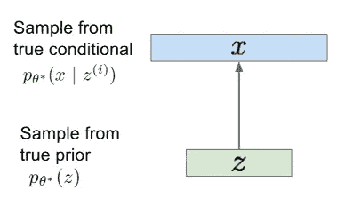

**我们如何训练潜变量模型？**

我们将有一些模型 pθ(x ),我们有一个 x 的数据集。我们以最大可能性进行训练:

因为你的每个 p(x)是:

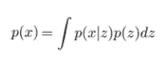

我们替换为:

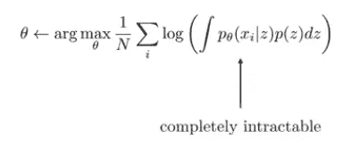

但是这个目标是完全难以实现的，因为你不能对所有可能的 z 进行积分——这个积分没有封闭形式的解。相反，当我们训练潜在变量模型时，我们需要使用一些更容易管理的东西:预期对数可能性。

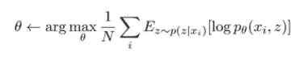

我们不是对 z 进行积分，而是通过估计每张图像的 p(z|x)来猜测 z 是多少，然后最大化 x 与 z 的概率。但是我们如何计算 p(z|x)？这就是所谓的概率推理。

**深度学习中的潜在变量模型**

某个变量 z 有某个先验分布 p(z)。这种先验分布通常设置得非常简单，因为 z 的含义是不固定的；z 的意义完全由您的模型决定，因此您不需要学习或设计 p(z ),您可以选择简单的东西，如零均值恒等协方差多元正态分布。然后，你有一个解码器，它将向量 z 映射到 x 上的分布:这是一个神经网络。

使用模型生成的工作方式如下:

1.  从 p(z)中抽取样本 z:随机数生成。
2.  从 p(x|z)中抽取 z 样本:将随机数向量转换成图像

潜变量深度生成模型通常只是一个把随机数变成有效样本的模型。

**我们如何表示潜在变量模型？**

最简单的部分是表示 p(z):生成随机高斯数。表示 pθ(x|z)稍微复杂一点。

1.  方案一是说你的像素是连续值；您可以将它们表示为具有对角协方差的多元正态分布，这相当于说每个像素都有一个均值，每个像素都有一个方差。每个像素的平均值和方差通常都可以是 z 的函数，因此它们可能是神经网络的输出。通常，我们会简化这一过程，让 sigma 为常数，在这种情况下，您只会得到均方误差损失
2.  另一种选择是说，你的像素是离散值，在这种情况下，像素都取决于 z，但在 z 的条件下，他们可以被视为独立的。这实际上工作得很好，但是有点慢。
3.  还有其他选择(离散逻辑、二元交叉熵等)

**pθ(x | z)应该用什么架构？**

对于微小的图像或非图像数据，一个简单的选择是使用一个大的完全连接的网络。对于更复杂的数据，更好的选择是(a)通过完全连接的层运行 z 向量，将它们转换为较低分辨率的卷积图(b)，使用转置卷积和取消卷积来提高分辨率，直到达到最终图像所需的最高分辨率。

**训练潜在变量模型**

1.  第一种选择是进行推断，为每个训练图像 x 计算出 p(z|x ),然后最小化预期的负对数似然性(这就是变分自动编码器所做的)
2.  另一种选择是使用 z 到 x 的可逆映射
3.  不要费心去得到每个 x 的 z 值，而是试着去匹配分布本身。基本上随机抽样一个 z，抽样给定 z 的 x，并尝试在群体级别将这些样本与训练数据相匹配(这就是生成式敌对网络所做的)

我们猜测 z 的方法是对我们数据集中的每个数据点 xi 取 p(z|xi)下的期望值，然后我们将最大化 xi 和我们猜测的 z 的联合对数概率。实际上，p(z|xi)是一个分布，这意味着我们不知道哪个个体 z 与哪个 xi 相匹配，但我们可以猜测差异的概率:我们要做的是对所有这些可能性进行平均，这就是期望值的作用。这种方案的最大挑战是我们计算 p(z|xi)的方式:我们基本上已经把计算一个难以处理的积分的问题转化为以某种方式估计然后从 p(z|xi)采样的问题。这叫做概率推断，因为我们在推断哪个 z 和特定的 x 在一起。

**变分近似**

我们要做的事情背后的基本思想叫做变分近似。我们不是实际计算真实的分布 p(z|xi)，而是用一些更简单，更容易处理的分布来近似它。例如，我们可以说，特定图像 xi 的 p(z|xi)是具有某种均值和方差的高斯 qi(z ),每幅图像的均值和方差都不同。

当然，真实的 p(z|xi)不仅仅是一个高斯函数，它可能是一些非常复杂的东西——所以这是一个近似值，也许是一个相当粗糙的近似值。*值得注意的事实是，对于 qi(z)的任何选择，我们可以在 log p(xi)上构造一个下界，因此我们将计算出的量不等于 log p(xi)，而是小于或等于它*。这意味着，如果我们试图最大化 log p(xi)，我们可以最大化这个下限数量。

我们可以这样做:让我们从 log p(xi)的表达式开始，它使用了之前的难处理的积分。

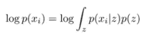

然后，我们乘以 1，将对数改写为 qi(z)下的期望值:

现在我们要应用一个数学恒等式，它是变分近似的核心，也就是 Jensen 不等式:它允许我们用凹函数的期望来限制下面期望的任何凹函数。

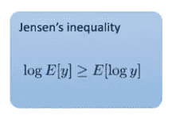

换句话说，如果你有一个期望值的对数，这个量总是大于或等于期望值的对数。如果是凸函数，那么不等式就反过来了。

这是我们得到的结果:

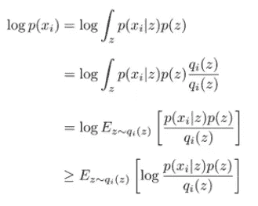

现在我们做一点代数运算，把最后一行变成我们可以用梯度下降法优化的东西。首先，我们将应用一个非常有用的恒等式，即乘积的对数等于对数之和:

最后一项是气的负熵。

所有这些讨论的结论是*最大化我们最终拥有的这个量将推高 log p(xi)的下限，这意味着它最终也将最大化 log p(Xi)*。关于熵的简短插入语:

**熵允许我们问:**

1.  随机变量的随机性有多大？熵代表分布的随机程度；如果所有的结果都有相同的可能性，那么你有最高的熵，而如果一个结果是确定的，那么你有最低的熵。
2.  期望中的对数概率在自身下有多大？例如，如果您有两个这样的发行版:

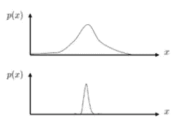

这些是连续值分布。我们可以问:哪一个具有更高的熵？因为熵量化了随机变量的随机程度，所以最上面的一个具有更高的熵，因为有更多的值是可能的，这意味着这些值中的每一个的概率都必须更低(因为分布总是积分为 1)。

那么，我们对这种表达有什么期待呢？

我们最大化 qi 的熵，也最大化这些对数概率的期望值。

*   第一项是鼓励给 z 值赋予大量的概率质量，因为 log p(xi|z) +log p(z)很大
*   第二项将鼓励拓宽这个概率质量

*这意味着，我们将捕捉 p 下概率最大的点，但我们也将尽可能使所得分布 q 更宽，以便它覆盖尽可能多的概率质量，并具有最高的熵。*

**KL-散度**

信息论中我们应该讨论的另一个概念是 KL-散度。它可以被认为是:

1 衡量两个分布的差异，因为如果 q 和 p 完全相同，则散度为零:

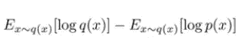

2 对一个分布在另一个分布下的期望对数概率有多小的度量，减去熵。

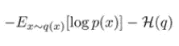

**变分近似**

我们之前用 Jensen 不等式导出的表达式实际上是 KL 散度。我们称之为证据下限，它是两个分布的函数:p，这是我们正在学习的分布，qi，这是我们对后验概率的近似。那么是什么让齐(z)好呢？能够精确地近似 p(z|xi ),它们之间具有低的 KL 散度。

人们可以证明对数 p(xi)等于:

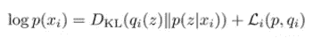

其中第二项是:

因此，如果我们想要 qi(z)很好地逼近 p(z | Xi ), KL 散度必须很低。

如果我们想知道如何训练我们的模型，我们可以通过最大化关于模型 p 的证据下限来训练我们的模型，并且如果我们想获得最佳 qi，我们也最大化关于 qi 的相同证据下限。这告诉我们，如果我们只是最大化证据下限，我们实际上是最小化 KL-散度。

目标是最大化证据下限:对于数据集中的每个 xi，我们将计算证据下限相对于模型参数的梯度。我们这样做的方法是我们首先从 qi(z)中采样一个 z；然后，我们将我们的梯度近似为该样本模型的梯度；然后，我们采取一个梯度下降步骤，并更新我们的 qi，以最大化预期下限(有不同的方法可以做到这一点)。

先说简单的:姑且说 qi 是 z 上的高斯分布，有均值和方差。对于数据集中的每一幅图像，我们都有不同的平均值和不同的方差来跟踪。

1.  **常规变分推断** 我们可以更新均值和方差的一种方法是，我们可以计算证据下限相对于这些量的梯度，然后对这些量进行梯度下降。但是这种方法有两个问题。第一个是我们需要优化的参数数量(至少)随着观察次数的增加而线性增长。不适合大规模数据集。第二个是，如果我们得到新的观察结果，或者有我们想要进行推理的测试观察结果，不清楚这如何适合我们的框架。一般来说，对于新的观察，我们需要重新运行优化程序。

**2。摊销变分推断
摊销变分推断 VI 的思想是，我们可以引入一个参数化的函数，从观测空间映射到近似后验分布的参数，而不是优化一组自由参数。在实践中，我们可能(例如)引入一个神经网络，它接受一个观察值作为输入，并输出与该观察值相关的潜在变量的均值和方差参数。然后，我们可以优化这个神经网络的参数，而不是每个观察的单个参数。**

请注意，这直接解决了前面提到的问题。首先，变分参数的数量现在相对于数据大小是恒定的！在我们的例子中，我们只需要指定神经网络的参数，这与我们所拥有的观察值的数量没有任何关系。第二，对于一个新的观察值，我们所要做的就是让它通过网络，我们就有了一个与其相关的潜在变量的近似后验分布。代价是不断向前通过网络！这些收益就是摊销期限的来源。

在φ上采取梯度上升步骤:通过计算 L. φ关于φ的梯度，φ出现在证据下界的两个地方:(1)它作为我们计算期望值的分布的参数出现(2)它出现在第二熵项内部

这是我们的证据下限:

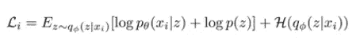

熵项的梯度很容易处理，但是第一部分有点复杂。我们可以考虑计算第一部分的梯度的一种方法是，注意期望中的所有东西都不依赖于φ，所以我们可以将这些项收集到一个表达式中，我称之为 r(xi，z):

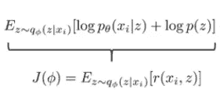

这类似于强化学习中的目标，即最大化奖励的期望值，其中期望值是相对于由策略确定的分布来取的。这里，我们有某个函数 r 的期望值，其中分布由 qφ决定:我们可以只使用策略梯度。

简单的版本应该是:

这个表达式的缺点与一般的政策梯度的缺点是一样的:方差很大，这意味着我们实际上可能不得不生成相当多的样本 zj 来获得精确的梯度估计。

有一种更好的方法可以训练这些模型，在实践中会更快更有效；它将利用这一事实，与强化学习的情况不同，在潜在变量模型的情况下，我们实际上可以计算 r 的导数，这被称为重新参数化技巧。

想法是这样的。我们有我们的表达方式:

我们想计算它对φ的导数，但φ不是任何分布，而是正态分布。这意味着我们也可以将 z 写成均值、方差和ε的确定性函数，这是一个标准的高斯样本:

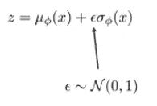

这是因为具有非零均值和不为 1 的方差的高斯可以表示为 0-1 高斯的仿射变换。这里的一切都是确定的，除了ε，但是ε不依赖于φ。它不依赖于神经网络，所以我们可以等价地把我们的目标写成关于ε的期望值，这里我们用这个等式代替 z:

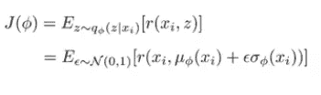

φ只出现在期望中:我们取期望的分布不再依赖于φ。我们重新参数化了分布，这就是为什么它被称为重新参数化技巧。所以现在我们可以如下估计关于φ的梯度:我们可以从零均值单位方差高斯中采样一串ε，然后通过使用微分链规则来应用关于φ的导数。我们无法在强化学习中做到这一点的原因是，奖励的导数对我们来说是未知的。

我们看待证据下限目标的另一种方式是这样的:

θ只进入第一项；第二项和第三项与θ无关，如果我们把它们放在一起，我们会注意到这只是负的 KL 散度。这样表达证据下界是很方便的，因为所有的难点基本上都在第一项中

如果我们应用重新参数化技巧，那么θ和φ现在都出现在期望值内，我们得到期望值的分布不依赖于任何一个参数。我们可以用ε的一个样本来估算，只需要代入ε。

在这一点上，画出最终的神经网络可能是有益的:

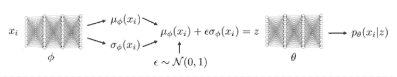

这就是如何实现一个可变的自动编码器。之所以称之为可变自动编码器，是因为如果你观察这个神经网络的结构，它看起来像一个自动编码器。它有一个参数为φ的编码器，在末尾有这个不寻常的噪声，均值和方差的东西；然后，它有一个参数为θ的解码器。因此，它只是一个自动编码器，与去噪自动编码器不同，噪声被放入隐藏状态 z，而不是一开始就放入。但是变分自动编码器有一个非常吸引人的解释，作为一个潜在的变量模型。

**再参数化绝招 vs 政策梯度:**有哪些权衡？

政策梯度:

*   可以处理离散和连续的潜在变量
*   它有很高的方差，需要多个样本和小的学习规则

重新参数化的技巧:

*   它只处理连续的潜在变量
*   它实现起来非常简单，如果你能使用它，效果会更好

现在，让我们把事情放在一起，并通过完整的变分自动编码器。

变分自动编码器是具有潜在变量 z 和观察变量 x 的潜在变量模型

*   它有一个编码器，执行推理:

这是一个神经网络，它接受 x，产生 z 的平均值和方差。

*   它有一个解码器:

这是一个接受 z 的神经网络，它产生 x 的平均值和方差。

这是目标:

物镜的第一部分看起来像一个自动编码器物镜:你将 xi 编码成均值和方差，得到 z，然后解码得到 x 上的结果分布，并尝试最大化真实图像的概率。

第二部分可以被认为是一种惩罚，惩罚 qφ(z|xi)偏离先验 p(z)多少。由此，我们可以得到一点关于为什么变分自动编码器工作的直觉:因为第二 KL-Divergence 项鼓励编码的 z 看起来类似于来自 p(z)的样本，在测试时间解码器将知道如何处理这些 z。

我们也可以训练变分自动编码器的条件模型；如果你有一个条件模型，那么你将 x 映射到某个输出变量 y，你希望 p(y|x)是某个相当复杂的分布。我们将使用和以前一样的直觉:p(y|x)可能是复杂的，但是 p(y|x，z)将是简单的。一切都和以前一样，只是现在我们生成 y，一切都以 x 为条件。

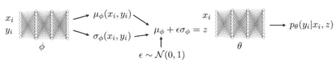

**带有回旋的阀门**

让我带你看一个潜在的架构，我们可以用它来做 VAE。你有你的图像，首先它必须进入编码器。这是架构:

到目前为止，一切都与任何其他卷积自动编码器相同，但现在我们将有一个输出均值的全连接层和另一个输出方差的全连接层:

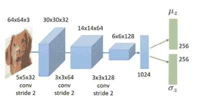

然后我们对正态分布的ε进行采样，将其中一个乘以σ，得到 z。

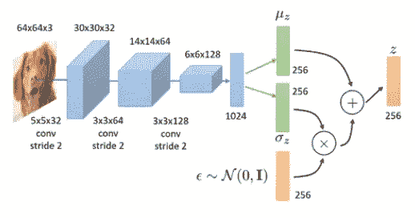

这是我们的瓶颈表示:如果我们想要使用变分自动编码器进行表示学习，例如用于下游分类任务，这是我们将用作图像的压缩表示的向量。

但是为了训练 VAE，我们还需要一个解码器。为此，我们将使用转置卷积对矢量进行上采样，一直到 64 乘 64 的图像。然后，我们通过反向传播使用两个损失项来训练整个过程:

*   图像的负对数概率
*   由μz 和σz 确定的分布与我们的先验 p(z)之间的 KL-散度，它通常是零均值单位方差高斯分布。

我们的解码器为每个像素输出两个数字:平均值和方差。

**实践中的 VAEs**

*   一个常见的问题是，VAEs 很容易忽略潜在代码或生成较差的样本。原因是，如果你可以用一个规则的高斯分布来近似你的 x，特别是对于条件值来说，这样做要容易得多，因为最初 z 看起来只是一个噪声，并且弄清楚如何使用它是相当困难的。当您得到一个看起来不像输入的模糊的“平均”图像时，您可以知道这正在发生。
*   您可能遇到的第二个问题是潜在代码没有被压缩。当你的重建很好的时候，你可以知道这正在发生，但是当你从 p(z)中采样一个 z，然后解码，你会得到一个不真实的图像。

对于问题 1，KL-Divergence 太低:通常，qφ(z|x)忽略 x，只输出一个单位方差的零均值。这意味着 z 不携带关于 x 的信息，这意味着您的解码器 pθ不使用 z。这就是为什么它会产生那些模糊的平均图像:z 中没有对实际重建 x 有用的信息。

问题 2 的特征是相反的，KL-Divergence 太高:有太多的信息被打包到 z 中，这意味着你可以完美地重构 x，但是因为当你从它采样 z 时，它离先验太远，你的解码器不知道如何处理它。

为了控制 KL-散度，一个非常常见的技巧是在 KL-散度前面放一个乘数。你可以根据你看到的问题来调整这个超参数:如果你有问题一，那么你需要降低 beta，反之，如果你看到问题二，那么你需要增加 beta。

有时很难在训练的早期找到既能产生好的样本又能产生好的重建的 beta。直觉上，在训练的早期，VAE 需要学会注意 z，在训练的后期，它需要做更好的压缩工作。实际上安排测试来改变测试是非常有用的。例如，您可以从非常低的β值开始，以便 VAE 学会使用 z，然后提高β值，使样本变得更好。换句话说，一旦你的重建看起来不错，你可以增加β，然后你的样本也会变得更好

**可逆模型和标准化流程**

我们将讨论一种不同的模型，它在结构上有点类似于变分自动编码器，但训练起来要简单得多。想法是这样的:不是让解码器表示给定 z 在 x 上的分布，我们会有一个确定性的解码器，直接把 z 变成 x。

现在，如果我们想计算 p(x)用于训练，我们可以使用变量的变化公式，它说，如果 x 是 z 的确定性函数，那么 p(x)等于:

它的意思是，如果你在 z 上有一些分布，并且 z 以确定的方式变换得到 x，那么要得到 x 上的密度，你所要做的就是修改 z 上的密度，根据 f 改变多少体积。

如果我们可以计算雅可比 df/dz 的行列式，并且可以计算其倒数，那么我们就可以用一个确定性函数来实现这种模型，映射这些堆栈。所以行列式只是对 f 引起的局部密度变化的修正，基本思想是，如果我们可以学习从 z 到 x 的可逆映射，这可以使行列式容易计算，我们可以建立这种模型，而不必担心所有的变分推理。我们也不需要下界，可以得到精确的概率。

这类模型有时被称为标准化流程模型。我们的训练目标只是最大似然:最大化数据集中所有 xi 的对数概率。我们使用上一张幻灯片中变量变化公式的表达式，将 p(x)写成 p(z)；p(z)还是一些很简单的分布。如果我们将这个公式代入培训目标，我们的目标是:

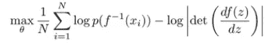

我们要选择一个特殊的结构，使得这个很容易计算。一个正常化的流程模型由多层可逆转换组成，因此为了实现这些类型的模型，我们需要做的就是弄清楚如何创建一个可逆层，然后将这些可逆层组合起来，形成一个深度网络。

一些观察结果:

*   如果每一层都是可逆的，那么整个事物都是可逆的
*   通常，可逆层也有非常方便的行列式
*   整个模型的对数行列式就是各层对数行列式的和
*   我们的目标是设计一个可逆层，然后将它们组合起来，创建一个完全可逆的神经网络

有许多不同的方法来设计可逆层；我将从一种最简单的类型开始，称为非线性独立分量估计(NICE)。

通常，神经网络中的层是从 z 到 x 的某种映射。例如，x 由应用于(Wz+b)的 ReLU 给出。但是我们不能用这个，因为这是不可逆的。这里有一个想法:如果我们强制该层的一部分保留所有信息，以便我们可以恢复被非线性部分改变的任何内容，会怎么样？

我们可以把 z 分成两部分。第一部分从数字 1 到 d，第二部分从数字 d+1 到 n，X 也会有两个部分:第一部分被完全复制到 z 的第一部分，但它也通过一些神经网络，它被添加到 z 的第二部分。

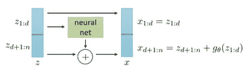

问题变成:如果我们有 x，我们能恢复 z 吗？如果是这样，那么这一层是可逆的。然后，我们可以组成这样的可逆层的整个网络。

1.  恢复 z(1:d) = x(1:d)
2.  恢复 gθ(z(1:d))
3.  recover z(d+1:n)= x(d+1:n)—gθ(z(1:d))

我们需要的技巧是无损保留第一部分，而非线性部分仅依赖于第一部分。这意味着您可以恢复非线性分量并将其减去。

雅各宾派呢？

我们需要行列式来计算我们的标准化流程目标；x 和 z 都有这两部分，所以这将是 df/dz 作为一个矩阵:

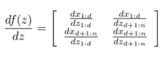

这个矩阵的导数是:

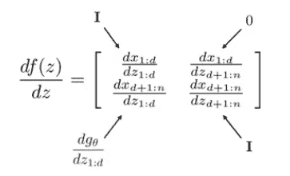

然而，你可能知道行列式不受左下块的影响，因为右上块是零。所以像这样的矩阵的行列式是下三角矩阵。它只是由对角线元素决定，对角线元素都是 1，所以行列式是 1。

这非常方便:因为这种特殊的形式，对于这些可逆层，行列式总是 1，这意味着目标中的项对训练模型没有任何影响。不幸的是，它在表示上有点限制，因为行列式总是一个，因此我们不能总是改变行列式的大小。这种网络只将 z 转换成 x，但它从不重新调整它们，因此以这种方式训练非常复杂的分布可能非常困难。

因此，在实践中，我们看到的是，如果我们采用这种可逆层，堆叠几个这样的层，并使用它们来训练生成模型，我们可以很好地模拟简单的数据集(MNIST)，但当我们开始查看更复杂的图像时，它往往会崩溃(CIFAR10)。

我们可以对这个模型做一个小小的改变，使它更具表现力，这就是所谓的 Real-NVP:非体积保持变换。我们将像以前一样把 z 和 x 分成两部分，但现在我们将有两个神经网络:一个缩放网络和一个偏置网络。我们将后半部分乘以第一个神经网络，然后加上第二个神经网络的项，这样 x 的后半部分等于 z 的后半部分乘以第一个神经网络加上第二个神经网络输出的指数:

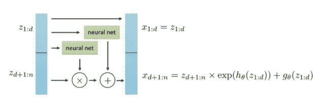

这也是一个可逆运算，你得到逆运算的方式和之前非常相似。你只要利用 z 的前半部分等于 x 的前半部分，就可以恢复 z 的前半部分；一旦你恢复了，你就可以恢复 gθ和 hθ，然后你可以通过 x 的后半部分，减去 g，然后除以指数 h，来求解 z 的后半部分。

现在雅可比矩阵有了更有趣的形式:

右下角的方块是这些指数值的对角线，这意味着行列式不再是 1 了。以增加第二个非线性分量为代价，它明显更有表现力，并且这可以产生高得多的质量的图像

关于正常化流程的一些总结性评论

*   标准化流程的一大优势是你可以从中获得精确的概率或可能性；你实际上可以计算 p(x ),而变分自动编码器只能给出 p(x)的一个界限
*   你不需要任何下限
*   这在概念上更简单

它也有几个主要缺点:

*   它需要一个特殊的架构，所以你不能只使用常规层
*   由于每一层都是可逆的，每一层的维度必须保持不变，这对于高分辨率图像来说是一件大事。如果你的图像中有一百万个像素，那么你在 z 轴上需要一百万个维度，而一个可变自动编码器可能有一个比图像维度低得多的潜在代码，这可能是一个主要的限制

## [生成性对抗网络](https://www.youtube.com/watch?v=39CmbTX1S8M&list=PL_iWQOsE6TfVmKkQHucjPAoRtIJYt8a5A&index=58)

我们在今天的讲座中要探讨的想法是，我们是否可以不训练编码器，就像我们对 VAEs 所做的那样，我们可以只训练整个模型来生成看起来与人口水平上的真实图像相似的图像。

换句话说，与其试图猜测每个真实图像对应的 z 值是多少，然后用它来监督我们的网络，不如我们只是生成一堆随机图像，然后试图改变我们的网络，使这些随机图像在总体水平上类似于我们训练集中给我们的真实图像的总体，怎么样？*这意味着我们想要从复杂的、高维的训练分布中取样，并且没有直接的方法来做到这一点；因此，解决方案是从简单分布(如随机噪声)中采样，然后学习到训练分布的转换(使用神经网络)。*

举个例子:假设我有两套面孔。没有两张脸是完全相同的，但是它们在总体水平上看起来有点相似，所以如果我从一个分布中取五个样本，从另一个分布中取五个样本，你可能无法分辨出这些样本来自哪个分布。在这种情况下，我们可以说这两种分布在总体水平上是相似的。这就是我们如何基本上尝试匹配分布，而不必弄清楚任何特定图像的潜在变量实际上是什么。我可能还会问你，你是否能猜出哪一组脸是真实的:如果我告诉你，其中一些脸实际上是由潜在变量模型生成的，你能猜出是哪一组吗？这种在群体水平上匹配分布的模型可以变得非常好，甚至比这好得多。

我们将这样设置:我们将设置一个游戏，在这个游戏中，唯一的获胜步骤是生成逼真的图像。换句话说，*这个想法是训练一个网络去猜测哪些图像是真的，哪些是假的；该分类器将输出该图像是真实图像的概率*。为了训练这样一个网络，你需要的只是一个带标签的训练集；虚假图像可能来自我们的生成模型，而真实图像可能来自我们的训练集。

然后，该模型可以用作我们的生成器的损失函数:换句话说，将 z 变成 x 的生成器的损失函数可以是由该分类器产生的结果图像的现实主义得分。这种方法背后的基本直觉是，我们将通过训练一个分类器来学习一个损失函数，以在伪图像和真实图像之间进行分类，然后我们将使用它作为我们的生成器的负损失，以使它根据该分类器生成的图像更加真实。

*   **生成器网络**:通过生成看起来真实的图像来欺骗鉴别器
*   **鉴别器网络**:尝试区分真假图像

GAN 的核心思想是基于通过鉴别器的“间接”训练，鉴别器本身也是动态更新的。这基本上意味着生成器没有被训练成最小化到特定图像的距离，而是被训练成欺骗鉴别器。这使得模型能够以无人监督的方式学习。

这里有一个潜在的算法:

1.  获得真实图像的真实数据集
2.  得到一个生成器 Gθ(z)，它甚至可以随机初始化
3.  生成虚假图像的数据集
4.  训练你的鉴别器，它只是一个分类器，试图预测图像是来自真实数据集还是虚假数据集
5.  使用这个鉴别器来构造某种用于训练 G(z)的损失函数

这个方法几乎是可行的，但是在我们构建一个可行的方法之前，我们需要解决几个主要问题。

如果我们只做第五步一次，大问题是在第五步 G(z)很容易骗过 D(x)。如果 D(x)被训练用于来自一个非常糟糕的生成器的假图像，那么针对步骤五的新生成器只需要比旧生成器更好，但它可能仍然不是非常真实。为了让它工作，我们选择了一种迭代的方法。在得到一个生成器后，我们将对我们的伪图像进行采样，然后只用一个梯度步骤更新我们的鉴别器:我们实际上不会训练鉴别器收敛，我们将只采取一个梯度步骤。这将给我们一个稍微好一点的鉴别器，然后我们将只为一个梯度步骤更新我们的生成器，然后我们将生成新的假图像；因此，不是预先生成所有的假图像并训练您的鉴别器收敛，而是实际上交替更新鉴别器以更好地区分真假，然后更新生成器以生成更真实的图像。这将是一种游戏，其中鉴别者将不断试图跟上发电机，而发电机将不断试图愚弄它。因为他们有这种竞争过程，所以生成器赢得游戏的唯一方法就是生成与真实图像真正无法区分的图像

**总结**

一个已知的数据集作为鉴别器的初始训练数据。训练它包括向它呈现来自训练数据集的样本，直到它达到可接受的准确度。发电机根据它是否成功骗过鉴别器进行训练。通常，生成器被播种以从预定义的潜在空间采样的随机化输入。此后，由生成器合成的候选者由鉴别器评估。独立的反向传播过程被应用于两个网络，使得发生器产生更好的样本，而鉴别器在标记合成样本方面变得更加熟练。

**关于为什么这个基本想法实际可行的更多直觉**

G(z)想干什么？理想情况下，它的目标是以某种方式说服鉴别器为所有生成的图像输出 0.5。为了做到这一点，它必须生成看起来逼真的图像；但更微妙的一点是，为了在所有生成的图像上真正获得 0.5，你不仅仅需要生成看起来真实的图像，*你实际上需要生成所有可能的真实图像，这就是为什么甘匹配分布。*

假设我们有一个包含猫和狗照片的数据集；这些图片一半是猫，一半是狗。我们的生成器在生成非常真实的图像方面做得非常好，但是它只生成狗，所以它没有覆盖整个发行版。想象一下在这种情况下鉴别器要做什么:

*   如果我们给一只猫拍照，然后把它传给鉴别器，鉴别器会说它是真实图像的概率是 1。这是因为训练集有大约一半的真实图像包含猫，但是没有一个虚假图像包含猫。
*   如果我们给一只狗拍照，然后把它传给鉴别器，鉴别器会说它是真实图像的概率是 0.25。这是因为训练集有大约一半的真实图像包含狗，但所有的虚假图像都是狗。

*这就是为什么为了让生成器赢得这场对抗鉴别器的游戏，它不仅要生成真实的图像，还要生成所有真实的图像。*为了充分披露，GANs 的一个特殊问题是，在实际的实例化中，这些模型经常会遇到所谓的模式崩溃问题，我不会在本次讲座中过多谈论这个问题。模式崩溃问题是一种过度拟合，当这种情况发生时，GANs 实际上不能捕捉整个分布。

**实际设置 GANs 的技术细节**

前面过程描述的经典 GAN 也可以表示为一个两人游戏—一个最小-最大问题，其中有两个玩家分别试图最小化(生成器)或最大化(鉴别器)同一目标。这个表达式基本上只是交叉熵损失:它取正标签图像，并最大化那些图像的对数概率；然后，它采用负标记图像并最大化这些图像的对数概率。

在二进制分类问题中，负标签的概率正好是 1 减去正标签，所以这就是你看到“1 — D”的原因。这两个都是预期值:

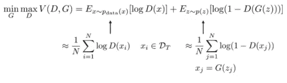

D 试图最大化对数似然，使得 D(x)接近 1(真实)，D(G(z))接近 0(虚假)；g 正试图做相反的事情。这不再是一个传统的梯度下降优化问题，实际上是寻找两人博弈的纳什均衡问题。下面是 GAN 游戏，按照θ(G 的参数)和φ(D 的参数)改写:

该算法基本上与φ上的梯度上升步骤(因为φ最大)和θ上的梯度下降步骤(因为θ最小)之间的变换相同。这两步只是交替进行。

为了实现这一点，我们必须弄清楚两个重要的细节:

1.  **如何利用随机梯度下降或上升来实现这一点，因为我们想使用小批量**

对于使用随机梯度上升或下降，我们通过使用第一个期望的小批训练点来近似梯度，然后对于第二个期望，我们采样相同数量的 z，并通过生成器运行它们。这基本上给了我们一个小批量梯度上升或小批量梯度下降的版本。损失是交叉熵损失。发电机损耗只是用相同的小批量 z 估算的；你只要让它们通过发生器，问鉴别器它们的概率是多少，然后用它作为你的发生器的损耗。

**2。如何计算梯度**

计算这些梯度非常简单；鉴别器的梯度只是交叉熵损失；发生器的梯度可能稍微复杂一点，因为计算发生器的损失函数需要生成图像，然后将它们传递给鉴别器。我们计算发生器梯度的方法是通过鉴别器反向传播到发生器

**GAN 实际上优化了什么特定的目标？**

我们能否以某种方式来分析这个双人游戏，并能够正式声明，在收敛时，这应该会最小化数据分布和我们的 GAN 生成的图像分布之间的差异？

出于理论分析的目的，我们将最优 D(x)表示为 G(z)的函数的封闭形式；我们有一个外部最小化和内部最大化，所以也许内部最大化的解可以表示为 G 的函数的封闭形式。我们显然不能在代码中实现，我们需要实际训练一个神经网络来完成，但也许至少在理论上我们可以将 D 的解表征为 G 的函数

一个非常有用的特性是可以用来描述贝叶斯最优分类器的恒等式。假设我们有一组正标签图像(来自 p(x))和一组负标签图像(来自 q(x))。P(x)是 p(数据), q(x)是从 p(z)中对 z 进行采样，然后通过 g 得到的图像分布，我称之为 D*的最佳鉴别器就是对数似然的 arg max，我们可以将它写成 log(D)的 p 下的期望值加上 log(1-D)的 q 下的期望值。

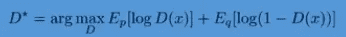

现在我们要对 D 求导。我们不求任何参数的导数，我们只求函数 D 的导数，我们将该导数设为 0，然后求解 D。如果我们能够求解将我们设为 0 的 D，我们将恢复最佳鉴别器。至关重要的是，这并不意味着你的神经网络可以代表最佳鉴别器——这更多是在我们有一个非常有表现力的函数的情况下，我们可以不担心参数，只表征将是最佳解决方案的函数。

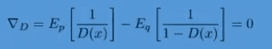

我要说的是，如果我把这个插进去:

那么导数就是 0。期望值就是概率的所有可能 x 的总和乘以期望值内的量，因此 p(1/D(x))下的期望值就是 p(x)的所有 x 的总和除以 D(x):

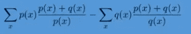

第二个任期也是如此。在这两个期望中，分母和期望的分布相互抵消，所以我们只剩下:

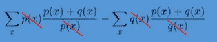

等于 0。如果我们的正标记点来自 x 的 p，负标记点来自 x 的 q，这个表达式 D*(x)实际上是我们可以得到的最佳分类器。这就是贝叶斯最佳分类器。

取 p 数据(x)为 p，pG(x)为 q，我们可以导出最佳分类器 D*(G)作为 G 的函数。如果 G 是固定的，并且我们优化了鉴别器的收敛，如果我们的神经网络非常非常有表现力，在极限情况下我们应该得到:

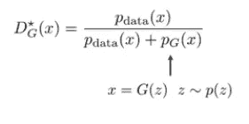

现在，G 的目标是什么？我们可以简单地将 D*G(x)代入上述最小-最大优化，将其转化为 G 的最小化，我强调这纯粹是一个理论练习，我们这样做的唯一原因是为了了解 GAN 的真正目标是什么。所以如果我们把这个代入。我们基本上只需要写出:

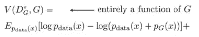

## GAN 优化了什么？

这是我们得到的表达式:它有两个有趣的期望值表达式。它们真的有什么意义吗？

让我们定义另一个分布，我们称之为 q，它是 p 数据和 pG 的平均值。因此，我们将 q(x)定义为:

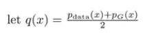

然后，我们可以将生成器目标的表达式写成:

每一项都是 KL 散度:

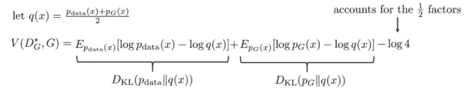

原来这个表达式其实是另一个散度度量，叫做詹森-香农散度。它有一些有趣的特性:

*   如果分布匹配，它会变为零
*   与 KL 散度不同，它是对称的

这意味着 GAN 确实在尝试匹配数据分布

**关于 GANs 的一个小实用旁白**

根据我们到目前为止的所有推导，结论应该是发电机损耗为:

这相当于说:让我们把图像是假的可能性降到最低。在实践中，我们实际上经常使用稍微不同的损失:

这相当于说:让我们最大限度地提高图像真实的可能性。这两个东西非常相似，它们代表相同的概念，但是当你离最优值很远的时候，它们的梯度看起来有点不同。最大化图像是真实的概率更好的原因与函数 log x 和函数 log 1 减去 x 的形状有关:

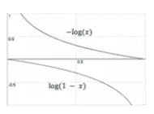

*   如果你有一个非常糟糕的发电机，你会有一个大的损失值，所以你会在这两条曲线的左侧。
*   如果你有一个非常好的发电机，你会有一个低损耗值，所以你会在这两条曲线的右边

最小化图像是假的概率的问题是，当发生器坏的时候，梯度趋向于非常小，然后一旦发生器好了，梯度在右边变得非常陡；我们并不真的希望这样，因为当发电机坏的时候，对发电机来说学习得很好是最重要的。如果它在糟糕的时候不能进步，它就永远不会变好

**关于 GAN 架构的一些实用说明:如何实际设置 GAN？**

*   你可以拥有一个完全连接的架构。你可以把你的 z 通过两个各有 512 个单元的全连接层安装起来，产生一个 MNIST 数字。然后，您的鉴频器也可以有两个完全连接的层，每层 512 个单元，并产生真/假输出，最后是 sigmoid 非线性。

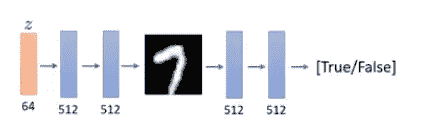

*   你可以有一个更复杂的卷积 GAN，可能在精神上类似于一些 VAE 架构，你可能有一些转置卷积实际上产生一个更高分辨率的图像，然后卷积鉴别器产生你的真/假标签

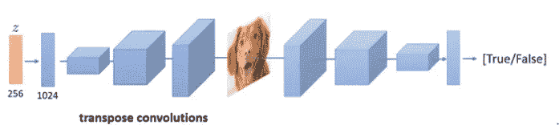

*   BigGAN 是一种非常现代的 GAN，可以生成高分辨率图像。这种架构要复杂得多，但在概念上与前一种非常相似。基本原理是相同的:它将是某种转置卷积型结构

*   条件 gan 生成特定类别的图像。你所要做的就是把你的类标签，这里显示为 y，连接到你的生成器的输入和你的鉴别器的输入。你把你的类标签表示成一个热向量，把它连接到 z，然后对于鉴别器，把它连接到 x

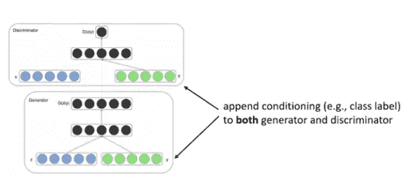

*   CycleGAN 关注的是一个非常特殊的问题:不只是生成任何图像，而是具体地从一个领域转换到另一个领域。例如，如果你收集了大量斑马的照片和马的照片，你能把斑马的照片变成马吗？问题是，你会得到这些图像，但你不会得到成对的图像:这不像英语到法语的翻译，你会得到一个英语句子和一个相应的法语句子。你只会得到一批马和一批不同的斑马

我们有两个条件生成器和两个鉴别器:

g 把 X 变成 Y，所以它以 X 为条件，可能是一匹马的照片，它的工作是生成 Y，斑马的照片。

Dx 的训练中，正的是马的真实图片，负的是 G 的后代，Dy 的训练中，正的是斑马的真实图片，负的是 F 的后代。我们现在可以想象训练这两个生成器和两个鉴别器，现在我们将有一个生成器把马变成斑马，另一个生成器把斑马变成马。但是我们还没有完成，因为这里没有说你应该生成哪匹马或哪匹斑马。所以问题是为什么翻译的斑马看起来和原来的马一模一样？

这就是周期一致性损失的来源:如果我把这匹马变成斑马，然后把那匹斑马变回马，我应该得到同一匹马，这是用距离来衡量的。从字面上看，图像中的像素应该在绝对值差方面很接近。所以，这就是 CycleGAN 背后的想法:两个 GAN，每个域一个，一个 loss 表示:如果你从一个域映射到另一个域，然后再返回，你应该在你开始的地方结束。

**简要总结**

*   GAN 是一款双人游戏。这是它的方程式:

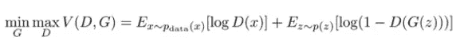

*   我们可以推导出最佳鉴别器，并由此确定在纳什均衡下什么目标实际上是最小的

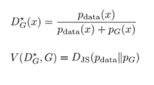

这并不能保证我们真的会找到纳什均衡。所以，这个推导只是表明，如果我们找到纳什均衡，这个 GAN 的不动点，它将最小化散度。

*   我们可以训练全连接或卷积 gan，在确定它们的架构方面，我们有很大的自由

## [训练甘斯的现代技术](https://www.youtube.com/watch?v=RdC4XeExDeY&list=PL_iWQOsE6TfVmKkQHucjPAoRtIJYt8a5A&index=60)

如果您只是按照我之前描述的方式实现 GAN 训练，您可能会发现，在所有最简单的问题中，它都需要大量的超参数调整才能正常工作。对于 GANs 来说，一个特别困难的场景可能说明了这个问题:假设 x 是一维的，所以我可以在幻灯片上画出来。现在，假设这些蓝色的圆圈代表真实的数据；假设这些橙色圆圈代表您的电流发生器产生的样本。你可以想象这样的分布:

如果我用 pdata 和 pG 训练我的鉴别器，我的鉴别器可能如下所示:

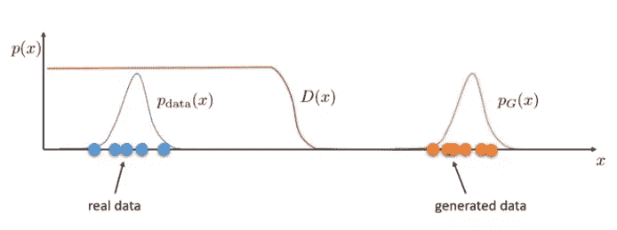

它将非常接近真实数据的 1.0，非常接近生成数据的 0.0，我们将在中间的某个地方有一些决策边界，离任何一个分布都非常远。

记住生成器完全是通过使用通过鉴别器的梯度来学习的，那么生成器梯度在生成的数据附近实际上会是多少呢？嗯，鉴频器在所有这些点上都输出零。

如何确保即使发生器相对于鉴别器非常差，产生的数据离 p 数据非常远的时候，鉴别器仍然给我们一个有意义的梯度信号？

*   我们可以做的一件事是我们可以改变我们的鉴别者；也许我们可以以某种方式改变鉴别器的训练方式，这样即使它可以很好地从 pG 中分类 p 数据，它仍然被鼓励在这两个分布之间产生更平滑的斜率，以给生成器一些梯度信号来引导它朝向 p 数据

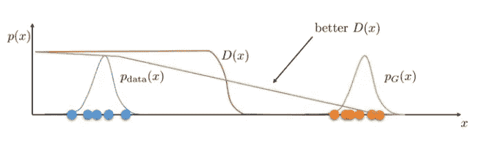

*   我们可以做的另一件事是，我们可以基本上稍微改变一下分布，也许我们可以以某种方式修改 p 数据和 pG，使它们重叠更多，然后鉴频器就不会那么尖锐，这样我们就会看到更强的梯度信号

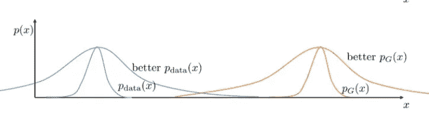

这两个都是可行的想法，我们实际上可以用一些实用的方法来实例化这种直觉。以下是一些改进的 GAN 技术，不分先后，都值得注意:

*   最小平方 GAN 是一种修改 GAN 鉴别器的方法，以输出一个实数值，而不是零和一之间的概率，并训练鉴别器，使其产生更平滑的斜率
*   Wasserstein GAN 是一种将鉴别器修改为 Lipschitz 连续的方法，这也促使它在 p 数据和 pG 之间具有更清晰的斜率
*   梯度惩罚是一种改进 Wasserstein GAN 的方法，因此更难将鉴别器约束为连续的
*   谱范数是一种真正约束鉴别器连续的方法
*   实例噪声试图通过向 p 数据和生成的样本添加大量噪声来改变分布，希望使它们的分布重叠更多

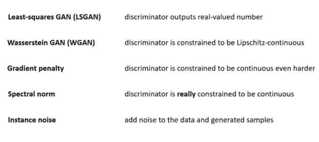

在本文中，我将主要关注 Wasserstein GAN，然后简要说明梯度惩罚和频谱范数，但请记住，最小平方 GAN 和实例噪声等也是可行的选择

## 瓦瑟斯坦·甘

高层次的直觉是，经典 GAN 使用的 Jensen-Shannon 散度没有任何方法来说明距离。基本上，如果你有这种情况:

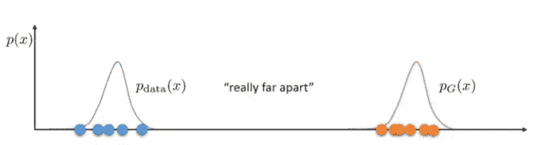

你可以说这两个分布真的相差很远。或者，您可以看到这种情况，并注意到这两个发行版非常接近:

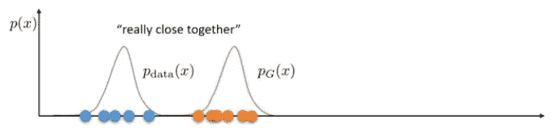

就 JS 散度而言，这两种情况大致相同，因为在这两种情况下，分布之间的重叠可以忽略不计。因此，在这两种情况下，JS 背离，KL 背离，以及其他大多数纯粹使用概率的背离几乎是相同的，尽管很明显底部的背离要好得多。这就是为什么当发生器非常差时，在 GAN 中获得有意义的梯度如此困难的高级原因:因为一个好的梯度应该告诉你，改善上面情况的方法是向下面情况移动，但是如果你的散度测量认为这两个分布几乎相同，那么它当然不会有太大的梯度。

这在数学上成立的原因是，如果你以 GAN 目标的形式来看 JS 散度的形式，你会看到它基本上是以一种分布下的对数概率来表示的，而在另一种分布下的期望。所以如果 p 数据对于所有的 x 都近似为 0，而 pG 不为 0，对于所有的 x 都近似为 0，那么这些表达式不会给你任何有意义的梯度。就 JS 散度而言，这基本上解释了为什么顶部情况被认为与底部情况非常相似，尽管在底部情况下这些分布实际上非常接近。

我们可以做的是纠正这个问题，试图找到一种方法来训练具有不同散度测量的 GAN，以更好地捕捉两个分布之间的距离。你可以这样考虑一个更好的度量标准:考虑在欧几里得空间中所有的概率位相距多远；想象一下那些分布基本上都是一堆堆的素材堆。你要走多远才能把泥土从一堆移到另一堆？这有时被称为最优运输问题。将一个发行版运输到另一个发行版需要走多远？你要移动的总距离就是这两个分布之间的距离。

Wasserstein 距离被正式定义为 y 和 x 之间距离的期望值，其中 y 和 x 根据联合分布γ的最优选择来分布。所以，你找到了最小化这个期望值的最佳伽马值。

伽马是 x 和 y 上的联合分布，其中相对于 x 的边际是 p 数据，相对于 y 的边际是 pG。直觉上，γ(x，y)中 x 和 y 之间的相关性表明哪个 x 应该被传输到哪个 y

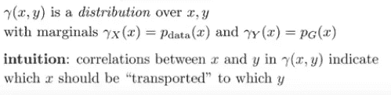

为了计算 Wasserstein 距离，您需要找到使这些距离的期望值最小化的 gamma，即对于每个到达特定 x 的 y，使 x 和 y 之间的差异最小化。直观地说，找到 gamma 就像找到将 p 数据中的所有点移动到 pG 的最佳方案。

不幸的是，实际上像这样直接学习 gamma 是非常非常困难的，因为 p 数据是未知的，gamma(x，y)本身可能是非常非常复杂的分布

基于 Kantorovich-Rubinstein 对偶，我们可以使用一个非常酷的定理，它为我们提供了一个更容易处理的方法来求解 Wasserstein 距离。该陈述是 Wasserstein 距离也等于 f 的 p 数据下的期望值减去 f 的 pG 下的期望值的所有可能函数 f 上的上确界:

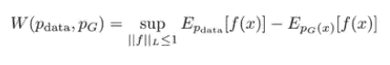

粗略的直觉是，f 将会来自你得到拉格朗日乘子的地方。因此，对 gamma 有一个限制，即 gamma 的裕量需要与 p 数据和 pG 匹配，基本上要取两者之和。这个关于 Wasserstein 距离的表达式真正吸引人的是，它表达了 pG 和 p 数据下期望的差异，就像常规的 GAN 一样

最高法院接管了这个有趣的表达说:

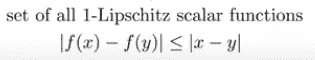

这就是说，你应该对 1-Lipschitz 函数这样做。这意味着 x 的 f 和 y 的 f 之差应该小于或等于 x 和 y 之差，这有点等同于说函数是有界斜率——所以永远不应该太陡，因为如果 f 太陡，那么它可以在 p 数据下任意最大化 x 的 f，在 pG 下任意最小化它。这个斜率限制是一种速度限制，当你把一个分布的小部分带到另一个分布的时候，你能走多快。

我们如何强制 f 的斜率应该以某个常数为界？这基本上是实例化 WGAN 的困难部分。这里有一个想法，不一定是最好的，但它是一个:

如果只有一个 1 层网络，一个线性层后跟一个 ReLU 非线性层，并且 W 中的所有条目都在-0.01 到+0.01 之间，则斜率不能大于 0.01 x D。

如果您有一个 2 层网络，那么您可以将两个权重矩阵中的所有条目限制在-0.01 和+0.01 之间。那么你的斜率也是有界的。当然，它比以前大了很多，因为你实际上是把这些 w 相乘，但它仍然被一个常数限制，所以这不能保证它是 1-Lipschitz，但它确实保证它是某个常数的某个东西-Lipschitz，这意味着斜率将是有界的，这意味着你将得到 Wasserstein 距离的某个倍数。

需要注意的是，作为一种强制执行 Lipschitz 约束的方式，权重裁剪显然是很糟糕的。如果削波参数很大，那么任何权重都需要很长时间才能达到它们的极限，从而使训练评论家直到达到最优变得更加困难。如果剪裁很小，当图层数量很大或者没有使用批规范化时，这很容易导致渐变消失。

但是如果我们想完成 Wasserstein GAN 的手术，这就是它的工作原理。我们会像以前一样有一个生成器，我们会有一个鉴别器，现在不是输出图像是真实的概率，而是输出一个实数。那个实数是无约束的，所以你只是有一堆线性层，末端有 ReLUs，没有 sigmoid。鉴别器将使用权重限幅，所以下面是它的工作方式。

在随机梯度算法的每次迭代中，您都要使用 WGAN 物镜更新鉴别器。然后，将 theta 中的所有权重矩阵剪切到一些常数之间，这将确保对于某个固定的有限 k，鉴别器是 k-Lipschitz。最后，更新生成器以最大化 G(z)的 f 的期望值

我们如何做更好的鉴别器正则化，因为权重削波是一种加强 Lipschitz 常数的可怕方式？

*   一种非常简单而有效的方法叫做梯度罚函数。如果我们开始的想法是，我们想要限制斜率，为什么我们不直接写下斜率的表达式，然后把它加到我们的目标中？

*   谱范数是一种更复杂的方法。梯度惩罚的问题是，它实际上不是一个约束，它只是一个惩罚。所以你真的需要一个 Lipschitz 约束，但这只是给你一个惩罚。如果你真的想要一个约束，你可以用网络中每个权重矩阵的奇异值来限制 Lipschitz 常数。

如果你的 x 的函数 f 是多个函数的合成，Lipschitz 常数可以写成三个函数的合成。我们所要做的就是限制我们网络每一层的李普希兹常数。ReLUs 的最大斜率是 1，所以你不用担心它们；线性层的最大斜率是 w 的谱范数，其定义为:

你所要做的就是确保在每一步之后，你的网络中每个权重矩阵的谱范数小于或等于 1；为了确保这一点，您只需将每个权重矩阵除以其光谱质量

## 摘要

GAN 训练真的很难，因为鉴别器可以提供很差的梯度。各种各样的技巧可以使它更加实用。例如，您可以拥有:

*   平滑实值鉴别器(LSGAN、WGAN、WGAN-GP、谱范数)
*   实例噪声

 [## Mlearning.ai 提交建议

### 如何成为 Mlearning.ai 上的作家

medium.com](/mlearning-ai/mlearning-ai-submission-suggestions-b51e2b130bfb)