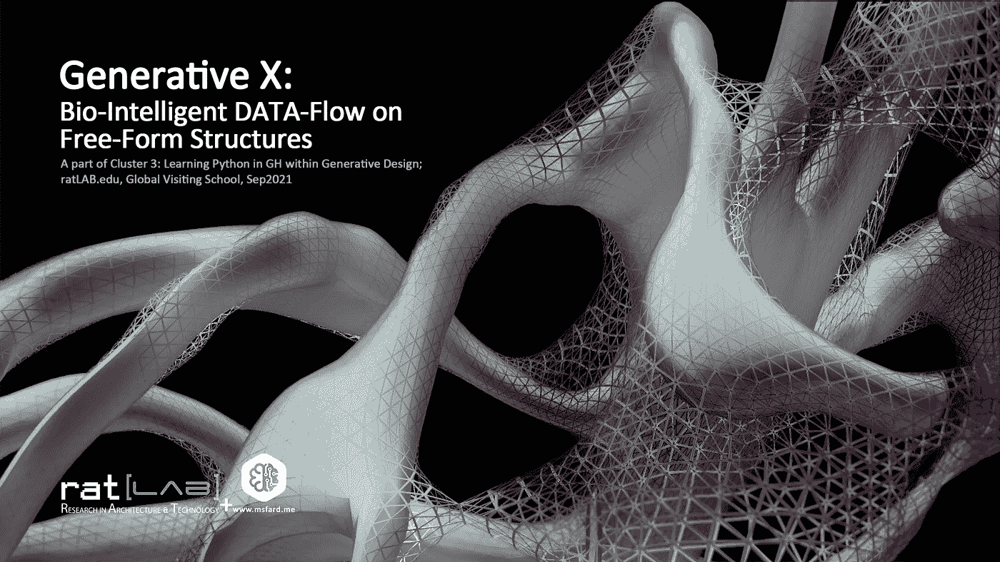
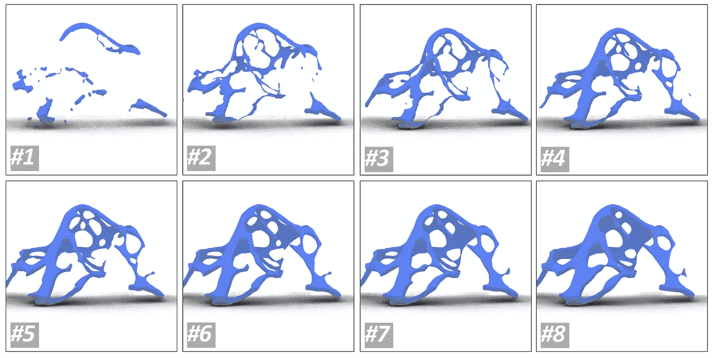
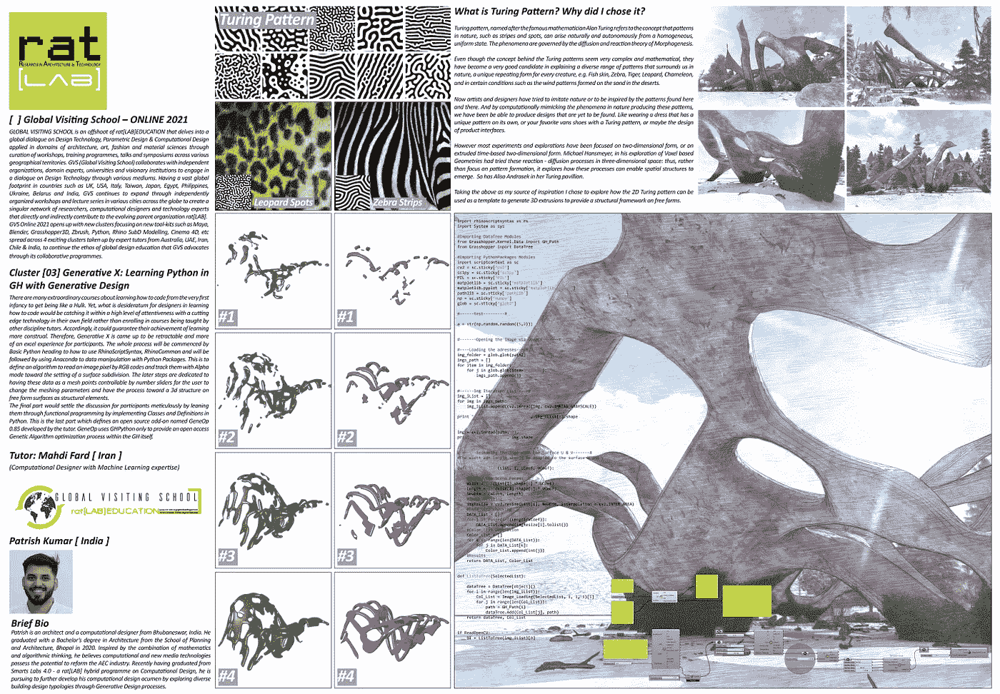
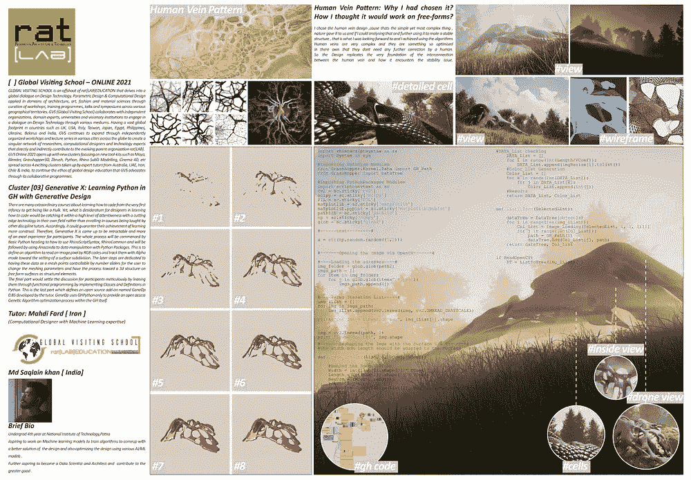

# 生成 X:自由形式结构上的生物智能数据流

> 原文：<https://medium.com/mlearning-ai/generative-x-bio-intelligent-data-flow-on-free-form-structures-2342ed3c7e5?source=collection_archive---------2----------------------->

> 集群 3:在生成式设计中学习 GH 中的 PythonratLAB.edu，环球访问学校，2021 年 9 月



The Integrated Structural Design sample based on Nature growth patterns by the Author.

# 启动舱门

我们正在走向工业 5.0！众所周知，它强调人与机器的互动，利用数据流作为每项任务和决策过程的主流，以更少的时间、成本和材料浪费更好、更快地工作。它让我们能够更明智地利用技术进行设计和生产，实现可持续发展。这种智能是值得称赞的，而不是线性的观点，复杂问题的核心范式现在可以通过机器学习和深度学习算法来解码。虽然这种洞察力已经被不同领域的多学科思想和努力所传达，但它要求我们的道路通过数据库建立在可靠性和有效性上。这是最具挑战性的部分，它整合了最近的数据科学问题，必须进行良好的监控。然而，一切似乎都进行得很好，除了，我们开发大数据集合的方式，创造性的最先进的系统，技术，并不完全与我们以前制造的漫不经心相称，这仍然存在，这消除了我们与自然的互动！

> 在设计上！当研究整合有一个深刻的来源时，为什么我们仍然顽固地基于同样的过程生产大数据包，这种过程使我们多年来在地球上生活时失败了？难道现在不是在人工智能衍生的尖端技术上重新开始我们与自然的互动的时候吗？这是这篇文章的主要关注点，它被一系列学习如何处理这种沉思的研讨会僵化了。首先，它通过设计师应该在哪里以及如何进行数据驱动设计打开了你的思路；其次，它涵盖了**创成式 X workshop** 的术语和成果。最后，我们客观地探讨了机器学习和深度学习算法如何利用自然资源来促进设计智能的发展。

与我们必须如何重新启动我们与自然的联系的想法相对应，我建议你阅读由 [mLearning.ai](https://medium.com/mlearning-ai) 出版的[生成设计和如何在建筑中实现它](/mlearning-ai/generative-design-and-how-to-implement-it-in-architecture-bd05ff6dfee4)中关于我们将要发现的思想的非常基本的步骤。

我们生活在一个复杂的世界里，这个世界充满了各种各样相互关联的系统。我们作为这个世界的一个组成部分所设计和建造的东西，必须通过描绘的一致性被插入到这个复杂性中。否则，要么失败，要么继续无能。许多先进的技术、方法、成就和方法支持建筑、工程和施工(AEC)中的程序，然而这些步骤没有跨学科地融合。然而，最近的努力正朝着凝聚面对复杂问题的不同学科的方向发展，但是，实践研究与实际问题无关，相反，它们似乎更多地来自纯粹的创造力，而无意于那些实际问题。它强调了阿尔伯特·爱因斯坦的说法:“我们不能用制造问题的思维方式来解决问题。”

> “我们人类制造的混乱还在加剧。因此，人类世和人类有害的普遍影响正迫使聪明的头脑去思考地球以外的殖民，以适应已经失控的情况。这里可以生动地提出的问题是，留下一个烂摊子是否是一种解决方案？”将所有这样的努力集中起来，重新开始我们在地球上的生活，或者至少试着这样做，难道不是更合理吗？"

我将把这一系列的问题放在你们的脑海中，暗示一种与我们在这个星球上到底发生了什么进行斗争的欢乐气氛！从这里开始，请考虑这篇文章倾向于如何将这种关注与知识共享合并的实例。

# 1.阅读和学习集成设计的资源

大自然是活泼聪明的。自然界中的每一种成分都有许多因素，包括一系列不同的参数共同作用。这些组件的每个功能还包括许多不同的适应性特征。如果任何定义想要表明这些特征，它必须与其他参数成比例地设置在逻辑联系中。因此，自然界中的组件可以系统地参数化工作。相应地，当建筑开始基于不同的因素设计一些东西时，它有一个平行的流程。这里出现的问题是:在构件的形态发生过程中开发这种包容性功能的与自然融合的设计如何在架构工作流程中得到管理？答案是显而易见的，遵循仿生或生物灵感，表明设计如何从自然中获取建设性的属性。然而，基于最近先进进展的集成设计也可以更新，特别是以一种可能通过算法纠缠从设计、工程到制造的程序的方式。

# 2.功能范式与人工智能

这篇文章的主要印象是基于这样一个问题:我们如何使我们所知的设计专业知识与自然同步，而不是使用我们已经失败的步伐？这个问题引发了功能范式思想，以及如何根据设计过程中参数之间联系和比例来定义集成。你可以在这里找到一个可靠的基础，功能范式是神经元与[智能架构的整合走向整合](https://mahdifard.medium.com/intelligent-architecture-towards-integration-66e567eeb598)。依靠上述事实，设计师负责追溯为什么，什么，以及如何设计和生产寻址理论，功能和技术，所有这些都基于最新的经验和技术。结果必须与我们的生活环境相和谐，这需要与不同的元素高度一致。融入自然的设计创造了一个聚合的概念，以实施技术来深刻地管理当前的问题。它加速了混合的和适应性更强的系统开发。因此，为了拥有软件和硬件资源来实现更加自然友好的真正战略，我们需要一种数据驱动的方法来读取环境所做的事情，学习其技术和工作流，然后部署所赋予的程序来实现更具适应性的设计。

与自然的互联推进了设计过程的未来，解决了我们目前面临的复杂问题。通过感知引导学习过程的环境，阅读自然组件做什么有助于计算设计轨迹。学习部分致力于我们如何研究自然，收集适应性过程，收集数据，并将其作为我们的数据库。尽管有许多方法可以做到这一点，但深度学习算法有助于训练模型根据不同的函数从不同的属性范围生成设计迭代，作为人工神经网络的每个隐藏层。这不是这篇书面工作的主要目的，来阐明如何应用人工智能、人工智能或数字图书馆，但事实上，这篇文章试图提出这样的考虑更多地支持遵循。



The process of implementing data on a generative design iterations, from bio-images on free-form surface.

# 3.创成式 X 车间

虽然我们设定的目标是让设计对自然友好，通过从适应性过程中学习的数据智能融合每个元素，但在如何通过设计、工程和施工处理 it 术语方面有很大的考虑。至少十年来，随着集成的发展已经被开发，我们可以宣布它的压倒性作用，因为技术已经由人工智能进化。它可以让我们在算法思维中更深层次的认知中潜水，让每个过程的功能范式从/到我们的设计中获得/设置影响。功能范例致力于对设计质量有影响的主要因素的参数连接。答案不能扩展地陈述，因此我们需要在实践中反复吸收和传播知识，以达到积累的经验主义发散地萌芽的顶点。

因此，通过操纵自由形式结构上的生长模式数据，Generative X 成为可伸缩的，更像是 excel 的设计体验。整个过程从如何使用 RhinoScriptSyntax、RhinoCommon 的基本 Python 开始，然后是使用 Anaconda 的 Python 包的数据实现。它定义了一种算法，通过 RGB 代码读取自然模式图像的像素，并使用 Alpha 模式跟踪它们，以设置曲面细分。后面的步骤致力于将这些数据作为网格点，可通过数字滑块进行控制，以便用户更改网格参数，并以自由曲面上的 3d 结构作为结构基础。整个想法是为了适应基于自然模式的自由形式结构设计，我们假设在每一代的每一步中都有优化和功能范例。显然，评估迭代的性能是必要的，这是为了下一次车间升级。请查看[帕特里什](https://www.instagram.com/the__otherguy/)、[萨克莱恩](https://www.instagram.com/star_man_11/)和[克里斯皮娜](https://www.instagram.com/parametric_360degrees/)随后的最终作品。以后会有更多的作品上传到这里。



以下代码与我们使用 [OpenCV](https://opencv.org) 、 [Numpy](https://numpy.org) 、 [Glob2](https://pypi.org/project/glob2/) 和 [MatplotLib](https://matplotlib.org) 在 [Grasshopper3D](https://www.grasshopper3d.com) 中处理 Img 数据的方式有关。

```
**import** **rhinoscriptsyntax** **as** **rs**
**import** **System** **as** **sys***#Importing DataTree Modules*
**from** **Grasshopper.Kernel.Data** **import** GH_Path
**from** **Grasshopper** **import** DataTree*#Importing PythonPackages Modules*
**import** **scriptcontext** **as** **sc**
cv2 = sc.sticky['cv2']
scipy = sc.sticky['scipy']
PIL = sc.sticky['PIL']
matplotlib = sc.sticky['matplotlib']
matplotlib.pyplot = sc.sticky['matplotlib.pyplot']
pathlib = sc.sticky['pathlib']
np = sc.sticky['numpy']
glob = sc.sticky['glob2']*#------test---------#*a = str(np.random.random((5,2)))*#-------Opening the Image via OpenCV-------#**#----Loading the adresses----#*
img_folder = glob.glob(path2)
imgs_path = []
**for** item **in** img_folder:
    **for** j **in** glob.glob(item+"/*.jpg"):
        imgs_path.append(j)*#------Img Iteration List-----#*
img_iList = []
**for** img **in** imgs_path:
    img_iList.append(cv2.imread(img, cv2.IMREAD_GRAYSCALE))**print** "1st Image Dimension is:", img_iList[0].shapeimg = cv2.imread(path, 0)
**print** "Image Dim is:", img.shape*#-------Reshaping the Imge with the Surface U & V-------#*
*#The width adn length should be adapted to the surface U and V***def** Image_Loading(List, I, UCoef, VCoef):

    *#Behind the Scene Params*
    Width = int(List[I].shape[0] * UCoef)
    Length = int(List[I].shape[1] * VCoef)
    NewDim = (Width, Length)
    *#Image Resizing*
    imgResize = cv2.resize(List[I], NewDim, interpolation = cv2.INTER_AREA)
    *#DATA_List checking*
    DATA_List = []
    **for** i **in** range(int(Length/VCoef)):
        DATA_List.append(imgResize[i].tolist())
    *#Color_List Generation*
    Color_List = []
    **for** k **in** range(len(DATA_List)):
        **for** j **in** DATA_List[k]:
            Color_List.append(int(j))
    *#Results*
    **return** DATA_List, Color_List**def** ListToTree(SelectedList):

    dataTree = DataTree[object]()
    **for** i **in** range(len(img_iList)):
        Col_List = Image_Loading(SelectedList, i, 1, 1)[1]
        **for** j **in** range(len(Col_List)):
            path = GH_Path(i)
            dataTree.Add(Col_List[j], path)
    **return** dataTree, Col_List**if** ReadOpenCV:
    DT = ListToTree(img_iList)[0]*"""*
*if ReadOpenCV:*

 *DT = DataTree[object]()*
 *All_Colors = []*
 *for i in range(len(img_iList)):*
 *Col_List = Image_Loading(img_iList, i, 1, 1)[1]*
 *for j in range(len(Col_List)):*
 *path = GH_Path(i)*
 *DT.Add(Col_List[j], path)*
*"""**#            All_Colors.insert(i, DT.Branch(path)[j])* *#d = ListToTree(Image_Loading(img_iList, 1, 1, 1)[1])**"""**Width = int(img_iList[img_iterate].shape[0] * 1)*
*Length = int(img_iList[img_iterate].shape[1] * 1)*
*NewDim = (Width, Length)**imgResize = cv2.resize(img_iList[img_iterate], NewDim, interpolation = cv2.INTER_AREA)**print "Image Dim is:", imgResize.shape*
*b = str([i for i in imgResize])*
*c = imgResize[0].tolist()**Data_Color_Code = []*
*for i in range(Length):*
 *Data_Color_Code.append(imgResize[i].tolist())**Col_List = []*
*if ReadOpenCV:*

 *for i in range(len(Data_Color_Code)):*
 *for j in Data_Color_Code[i]:*
 *Col_List.append(int(j))**"""**"""*
*cv2.imshow("Resized", imgResize)*
*cv2.waitKey(0)*
*cv2.destroyAllWindows()*
*"""**"""**Data_Color_Code = []*
*for i in range(Length):*
 *Data_Color_Code.append(imgResize[i])**Col_List = []*
*for i in range(len(Data_Color_Code)):*
 *for j in Data_Color_Code[i]:*
 *Col_List.append(int(j))**"""*
```

# 4.光明/黑暗的未来！

为了总结和交织主要关注点和研讨会意图，有必要就我们如何阅读自然并从中学习进行一次自由讨论。看起来很明显，我们越能引导我们的设计过程、设计中的数据收集、工程和制造，朝着自然以同样的顺序运行的方向发展，我们就能得到更完整、更升级的轮廓，而不会对我们生活的环境造成普遍的伤害。在这个星球上书写我们的足迹可以通过智能设计和生产来实现，通过人工智能和深度学习算法来升级，深度学习算法目前是 Ardaena.com 的一项在制品研究。这项名为“生物启发的结构”的研究的主要目的是以一种更明显的方式来完成这里讨论的全部理解。 [Mahdi Fard](https://www.instagram.com/mahdi89fard/) 和[Pouria shahoxiini Nia](https://www.instagram.com/purya_sh/)正在开发将自然智能引入设计过程的相关算法。根据大自然如何处理其组成部分中的并行过程，这条道路可以朝着更具适应性和精致的设计方向前进。在这种情况下，我们作为这个星球上的另一个居住者所扮演的角色的方式可以保证未来更加互动，但不仅对我们人类如此，对其他居住者也是如此。因此，无论如何，如果您有基于自然确证数据库的创成式设计的想法，您可以联系我们进行进一步的合作和我们的下一次研讨会。

# *.a 知识

任何步伐都需要被坚持，由谁汇聚他们的思想、努力和挑衅性的见解来分享知识。在这种情况下，作者认为有必要感谢[而非](https://www.rat-lab.org/gvsonline2021)的大力支持，并创造了这次研讨会的机会。也请继续关注下一个版本！

[](/mlearning-ai/mlearning-ai-submission-suggestions-b51e2b130bfb) [## Mlearning.ai 提交建议

### 如何成为移动人工智能的作者

medium.com](/mlearning-ai/mlearning-ai-submission-suggestions-b51e2b130bfb)