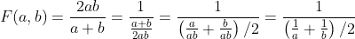
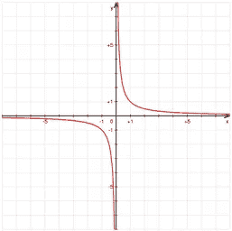
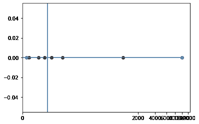
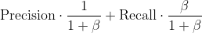
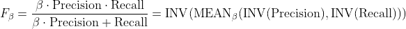

# F1 分数的几何解释

> 原文：<https://medium.com/mlearning-ai/geometric-interpretation-of-f1-score-7fad9c63fd48?source=collection_archive---------3----------------------->

The best way to get a fast interpretation of a classifier !

今天，我想谈谈一个在分类问题中非常常用的度量。所谓 F1-score。我的目标是追溯一种历史形式，以便给你一种“F1 分数到底是什么，为什么有用”的直觉？

当我们有一个分类问题时，我们希望有一些指标来启发我们对结果的理解。
[精确和回忆](/mlearning-ai/precision-recall-a-combinatoric-and-probabilistic-point-of-view-c904f7ab15df)是很好的候选，来自我们直觉的一个很低的层次。
由于它们提供了非常不同且互补的信息，我们希望有一个综合这两条信息的指标。

# 从平均值到 F1

第一个想法是使用均值:当我们想要对信息进行“分组”时，使用均值是很常见的。很好，但是…

假设我们想在一个平衡的二进制数据集上为一个分类器提供一个全局分数，其召回率为 0.01，精确度为 0.99。
对于这样的结果，我们希望提供非常接近 0.01 的结果。假设 0.02 比较好…

如果我们使用算术平均值，我们将得到 0.5 的结果，这将给人一种可以改进的中等分类器的印象。

那怎么办呢？
显然，我们想要一个函数 F1 使得
1)F1(a，b) ~ (a+b)/2 如果 a 和 b 远离零
2)F1(a，b)~ 0 否则
和 F1-score 是一个很好的候选。

为什么？首先，让我们转换它的公式:

因此，如果我们称 MEAN 为算术平均值，INV 为反函数，我们可以看到

> F1 = INV(均值(INV(精度)，INV(召回)))。

使用这种“算法”的观点，我们现在可以更好地理解发生了什么。

# F1 的几何性质

首先，你需要回忆一下反函数是从(0，1)到[1，inf 的自然映射。此外，离原点最近的是零，离无限远的是反函数。

The graph is symmetric with respect to the axis y = x. So closest to 0 is the input, most far on 1 will be the output.

1/10 会移到 10，1/100 会移到 100。
输入之差为 0.099，接近 0.1，输出之差为 90，接近 1/(1/100)。

我们可以在下图中想象这个概念。
线左边的每个点代表一个输入，并且映射的是相同颜色的点，但是在线的右边。我们可以看到，最接近零的是两个邻居，它们中的每一个的输出都是最远的。

The blue vertical line is representing the axis x = 1\. The inputs are on the left, the mapping by inverse on the right.

那么，F1-score 在做什么呢？首先，它转置右行[1，inf 中的两个输入，之后，它取平均值，并将该结果再次转置到段(0，1)中。

这样做，我们确保了接近于零的值在我们的最终结果中是突出的。
相反，*如果两个变量远不为零*，那么转位就不是在做强效应，这样 *F1 得分就可以看成是调和平均值的“小扰动”。*

# 逐步理解的算法程序

为了说服我们自己，让我们做一些计算。

## 1)两个远离 0 的变量

a)从 0.4 和 0.7
开始 b)计算倒数:2，5 和 1.42 *(它们并不是那么远)* c)计算它们的平均值:1.96 ( *仍然捕捉到两者的信息* )
d)再次求逆:1/1.96 = 0.51 ( *不完全是 0.55，但也不是那么远，在好的范围内*)。

## 2)一个接近 0 的变量

a)从 0.1 和 0.8
开始 b)计算倒数:10 和 1.25 ( *10 会很突出* )
c)计算它们的平均值:5.625 ( *我们离 1 比以前远得多* )
d)再次求倒数:0.17 ( *从 1 到 0.07，从 0.8 到 0.63:本质信息被 0.1 捕捉！！*)

# F_beta 评分:扩展到权重均值！！

人们可以采用调和平均值中的均匀权重以外的其他权重。我们可能希望更多地关注某个特定的指标，但继续寻找两者之间的平衡。
例如，一个人想要具有“远离零”的属性，分数看起来像 0.3 精度+ 0.7 召回。

好的，听起来不错。但是可以将精确度的权重设为 1，将召回率的权重设为 2。或者 2 表示精确，4 表示召回。
我们看到，显然，我们需要一个约定，以便消除这个虚假的问题。而最好的是，一如既往地在这类“问题”上，利用有理数的性质！

如果我们假设β= coeff(召回)/coeff(精度)，我们看到加权调和平均值的一般公式将是(做计算！)

这导致 F1 分数扩大到(做吧！)

其中 MEAN_(Beta)是加权调和平均值。

注意，当精度和召回的权重相同时，我们得到β= 1。😮

最后一句话:由于β必须严格为正，一般来说，在公式中我们使用这个系数的平方。

 [## Mlearning.ai 提交建议

### 如何成为 Mlearning.ai 上的作家

medium.com](/mlearning-ai/mlearning-ai-submission-suggestions-b51e2b130bfb)