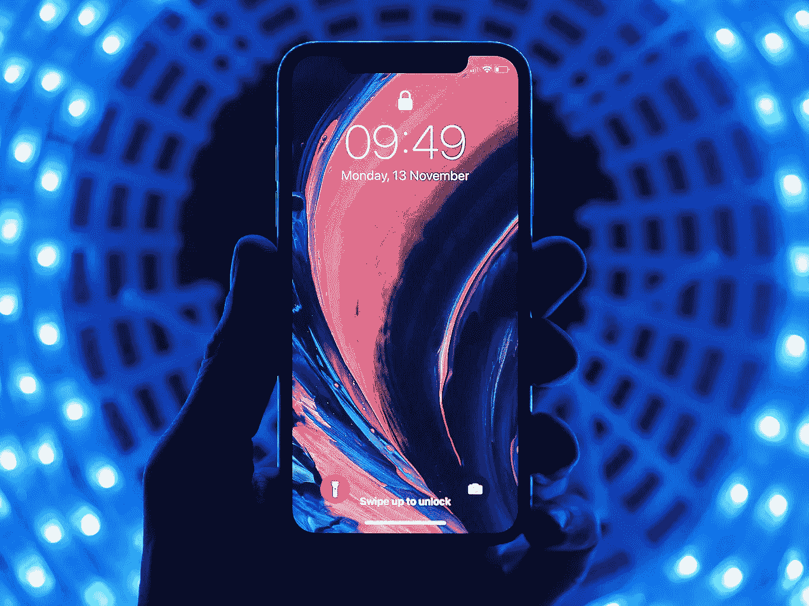
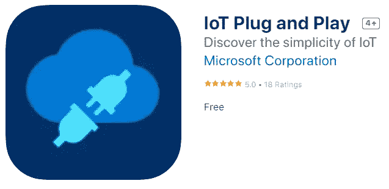
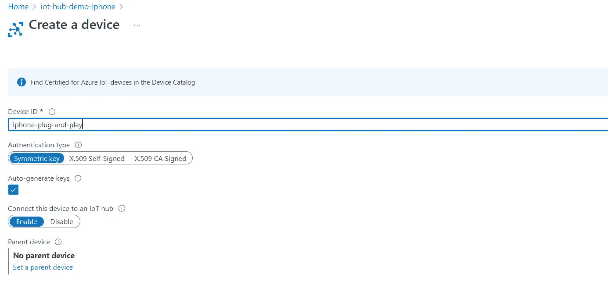
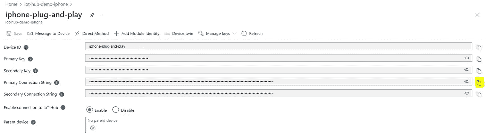
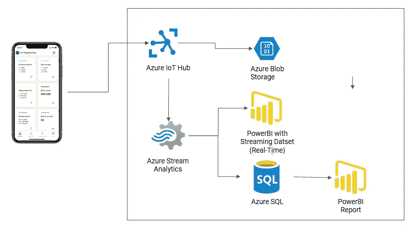

# 只需您的手机即可开始使用 Azure IoT

> 原文：<https://medium.com/mlearning-ai/get-started-in-azure-iot-with-just-your-phone-23d846c01c58?source=collection_archive---------3----------------------->

## 无硬件 Azure 物联网入门愿景

Photo by [Youssef Sarhan](https://unsplash.com/@youssefsarhan?utm_source=unsplash&utm_medium=referral&utm_content=creditCopyText) on [Unsplash](https://unsplash.com/s/photos/iphone?utm_source=unsplash&utm_medium=referral&utm_content=creditCopyText)

有时候，你想了解如何在云提供商(如 Azure)中实现物联网，但不想陷入 X.509 证书、Docker(和莫比)容器和大规模数据工程工作流中。

有时候，你只是想要一个快速工作的解决方案来理解 Azure(或其他云提供商)中的特定资源是如何工作的。

从这一切出发，微软推出了物联网即插即用。

 [## 使用 Azure IoT Central 和物联网即插即用进行构建

### 我们的使命是跨云和边缘提供强大且易于使用的物联网产品，以便我们…

azure.microsoft.com](https://azure.microsoft.com/en-us/blog/build-with-azure-iot-central-and-iot-plug-and-play/) 

有一些很好的资源提供了关于如何使用 Azure IoT Central(他们的 SaaS 产品)的物联网即插即用的说明，并且你可以轻松地使用 Azure IoT Hubs、流分析、Synapse、PowerBI 等进一步发展。

# 目的

物联网设备的数量和复杂性只会越来越多。[物联网分析预测到 2025 年 CAGR 将增长 22%](https://iot-analytics.com/wp/wp-content/uploads/2022/05/Global-IoT-Market-Forecast-in-billion-connected-IoT-devices-min.png)。物联网正在扩展到几乎每个应用领域。无论你是成长为数据科学家、ML 工程师、软件开发人员还是商业利益相关者，物联网都是揭开神秘面纱的关键。

通常，进入物联网可能需要设置 Raspberry Pi 设备，在 Arduino 中配置适当的屏蔽，或者利用其他设备。这些都是相对较低的入门，并有大量的开源指令和指南。但有时，您可能希望快速探索物联网用例，或者向您的团队传达物联网的简单性。这就是 Azure 即插即用应用的用武之地。

Azure IoT Plug and Play

## 从您的应用商店下载 Azure 即插即用设备，立即开始使用。

# 低代码/无代码物联网:Azure 物联网中心

你可以使用 Azure 的 SaaS 产品 Azure IoT Central 快速构建解决方案。这个 Azure 文档([https://docs . Microsoft . com/en-us/Azure/IOT-fundamentals/IOT-phone-app-how-to](https://docs.microsoft.com/en-us/azure/iot-fundamentals/iot-phone-app-how-to))也是一个很好的参考。

这是一个很好的入门服务，因为你只需一个二维码就可以连接你的设备。遥测技术易于访问，不需要任何复杂的查询。它很简单，但仍可用于一些工业应用。

# 实际代码物联网:Azure 物联网中心

通过 Azure IoT Central 和 Azure IoT 即插即用，您可以立即取得许多进展和见解，并且您可以继续在 Azure 中使用 PaaS(平台即服务)模块。

## 以下是一些典型的步骤:

1.  提供 Azure IoT Hubs 模块并创建具有对称密钥认证的设备；复制连接字符串并将其粘贴到 Azure 物联网即插即用设置配置中，以通过物联网集线器访问数据
2.  尝试路由(请参见消息路由刀片)将批量消息直接发送到 Azure Storage 等源
3.  通过提供 Azure 流分析资源([链接到示例查询](https://gist.github.com/van-william/66e8797a30929715637c29130c1a9e28))来试验分析流遥测
4.  向各种来源发送 Azure Stream Analytics 查询，包括 PowerBI、Synapse、数据库等

# 将即插即用设备连接到物联网集线器的详细信息

## 将 PnP 应用连接到物联网集线器

创建一个 Azure IoT Hub(在此演示中，您可以使用免费层(F1 ))并创建一个设备，如下所示:

Device Creation on Azure IoT Hubs

复制主连接字符串并将其发送到您的手机:

作为参考，这是对称密钥认证。它不如 X.509 身份验证安全，但对于快速概念验证项目来说要容易得多。

**确认:**转到设备 Twin，您可以确认设备已“连接”

## 初步实验

对 PaaS Azure 物联网的初步尝试可能看起来像是将批量物联网数据路由到存储帐户(例如 Blob 存储)，使用 Azure 流分析将数据发送到 PowerBI 和 SQL，等等。

Example IoT Architecture for Initial Demonstrations

该架构利用消息路由功能将批量物联网数据直接转储到 Azure 存储(如 Blob 存储)，并通过 Azure Stream Analytics 提供一些流分析和可视化。您可以使用 Azure Stream Analytics 将数据直接传输到 PowerBI，也可以传输到数据库，然后在 PowerBI 中可视化。显然，当您考虑为成千上万的设备设计一个解决方案时，选项会有所不同，复杂性也会增加。

# 潜在的后续步骤

如果你感兴趣并想了解更多，我推荐以下资源:

1.  学习 AZ220 认证，深入了解 Azure 物联网知识
2.  买个树莓派，开始黑吧
3.  尝试使用面向物联网设备的氦网络来揭开物联网和 Web3 的神秘面纱([我在 Medium](https://blog.cryptostars.is/web3-iot-connect-iot-devices-to-azure-via-helium-network-fdd144d526f1) 上提供了一个演示)
4.  尝试 Synapse 和 Databricks 等大数据流分析工具
5.  了解有关使用 PowerBI 可视化数据的更多信息

在物联网等不断发展的领域，揭开新技术的神秘面纱并通过实践学习的能力非常强大。正如你所看到的，在如此大的领域中，通往精通的道路是漫长的，但开始只需要不到一个小时。出去建造吧！

 [## Mlearning.ai 提交建议

### 如何成为 Mlearning.ai 上的作家

medium.com](/mlearning-ai/mlearning-ai-submission-suggestions-b51e2b130bfb)