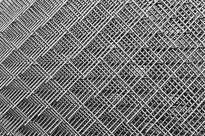

# 进入 gridsearchcv，预测泰坦尼克号的幸存者

> 原文：<https://medium.com/mlearning-ai/get-stuck-in-to-gridsearchcv-to-predict-on-the-survivors-of-the-titanic-842b46941b7c?source=collection_archive---------2----------------------->

在我的上一篇文章中，我讨论了 sklearn 的 train_test_split 是一个辅助函数，它将数据分成训练集和验证集，作为交叉验证过程的一部分，因为预测的数据不能与之前训练的数据相同。数据拆分后，必须放入模型中进行训练和拟合，并且…