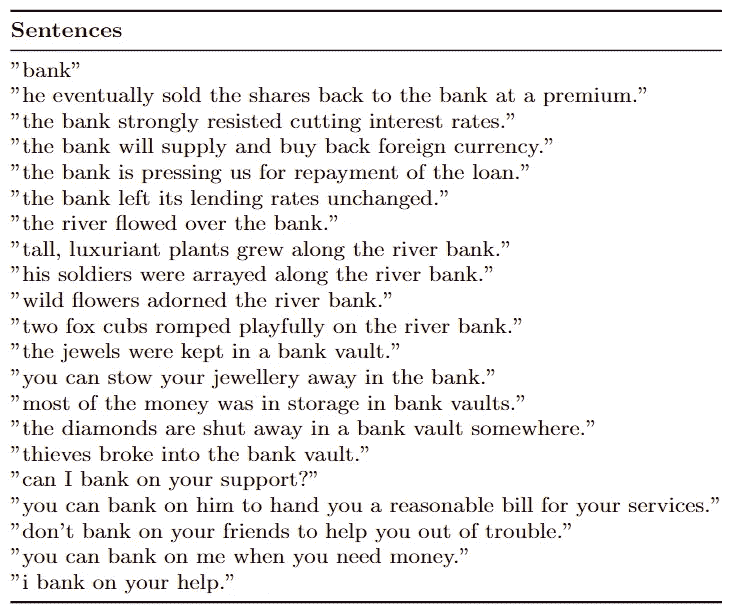
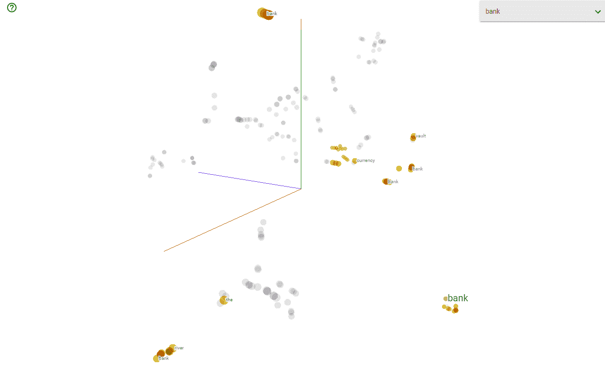

# 使用 BERT 获得上下文化的单词嵌入

> 原文：<https://medium.com/mlearning-ai/getting-contextualized-word-embeddings-with-bert-20798d8b43a4?source=collection_archive---------1----------------------->


## 如何使用 Python、PyTorch 和 transformers 库在 BERT 中获得上下文化的单词嵌入。


[[Source](https://unsplash.com/s/photos/words)]

伯特、埃尔莫和 GPT-2 证明，语境化单词嵌入是自然语言处理中一项改变游戏规则的创新。使用上下文化的单词表示代替静态向量(例如，word2vec)已经改进了几乎每个 NLP 任务。

> 但是，这些表象首先是如何语境化的呢？

想想这个词*‘老鼠’*。它有多重含义，其中一个指啮齿动物，另一个指一种装置。伯特能够正确地为每个词义建立一个“*鼠标*”表示吗？


Multiple embeddings for the same word ‘*mouse*’. [[Source](http://ai.stanford.edu/blog/contextual/)]

# **用 Python 生成 BERT 嵌入**

查看我的 Colab 笔记本，获取完整代码。

为了形象化语境化单词嵌入的概念，让我们看一个小例子。对于下面的文本语料库，如下面的所示，BERT 用于为每个单词生成上下文化的单词嵌入。



在本文中,“银行”一词有四种不同的含义。第一句话是上下文无关的。此后，“银行”一词指金融机构、河岸、银行金库和动词。

**无聊的 Python 玩意儿**

导入包:

```
import pandas as pd
import numpy as np
import torch
```

接下来加载预训练的 BERT 模型和标记器:

```
from transformers import BertModel, BertTokenizermodel = BertModel.from_pretrained('bert-base-uncased',
           output_hidden_states = True,)
tokenizer = BertTokenizer.from_pretrained('bert-base-uncased')
```

我们必须将输入的文本转换成 BERT 可以阅读的特定格式。主要是我们在输入的开头加上` `[CLS]`` `,在结尾加上` `[SEP]``'。然后，我们将符号化的 BERT 输入转换为张量格式。

```
def bert_text_preparation(text, tokenizer):
  """
  Preprocesses text input in a way that BERT can interpret.
  """
  marked_text = "[CLS] " + text + " [SEP]"
  tokenized_text = tokenizer.tokenize(marked_text)
  indexed_tokens = tokenizer.convert_tokens_to_ids(tokenized_text)
  segments_ids = [1]*len(indexed_tokens)# convert inputs to tensors
  tokens_tensor = torch.tensor([indexed_tokens])
  segments_tensor = torch.tensor([segments_ids])return tokenized_text, tokens_tensor, segments_tensor
```

为了获得实际的 BERT 嵌入，我们将预处理的输入文本(现在用张量表示)放入我们预先训练的 BERT 模型中。

哪一种向量最适合作为情境化嵌入？我认为这取决于任务。提出 BERT 的原始论文考察了六个选择。

我选择了其中一个在他们的实验中运行良好的选项，这是模型最后四层的总和。

```
def get_bert_embeddings(tokens_tensor, segments_tensor, model):
    """
    Obtains BERT embeddings for tokens.
    """
    # gradient calculation id disabled
    with torch.no_grad():
      # obtain hidden states
      outputs = model(tokens_tensor, segments_tensor)
      hidden_states = outputs[2] # concatenate the tensors for all layers
    # use "stack" to create new dimension in tensor
    token_embeddings = torch.stack(hidden_states, dim=0) # remove dimension 1, the "batches"
    token_embeddings = torch.squeeze(token_embeddings, dim=1) # swap dimensions 0 and 1 so we can loop over tokens
    token_embeddings = token_embeddings.permute(1,0,2) # intialized list to store embeddings
    token_vecs_sum = [] # "token_embeddings" is a [Y x 12 x 768] tensor
    # where Y is the number of tokens in the sentence # loop over tokens in sentence
    for token in token_embeddings: # "token" is a [12 x 768] tensor # sum the vectors from the last four layers
        sum_vec = torch.sum(token[-4:], dim=0)
        token_vecs_sum.append(sum_vec)return token_vecs_sum
```

现在我们可以为一组上下文创建上下文嵌入。

```
sentences = ["bank",
         "he eventually sold the shares back to the bank at a premium.",
         "the bank strongly resisted cutting interest rates.",
         "the bank will supply and buy back foreign currency.",
         "the bank is pressing us for repayment of the loan.",
         "the bank left its lending rates unchanged.",
         "the river flowed over the bank.",
         "tall, luxuriant plants grew along the river bank.",
         "his soldiers were arrayed along the river bank.",
         "wild flowers adorned the river bank.",
         "two fox cubs romped playfully on the river bank.",
         "the jewels were kept in a bank vault.",
         "you can stow your jewellery away in the bank.",
         "most of the money was in storage in bank vaults.",
         "the diamonds are shut away in a bank vault somewhere.",
         "thieves broke into the bank vault.",
         "can I bank on your support?",
         "you can bank on him to hand you a reasonable bill for your   
services.",
         "don't bank on your friends to help you out of trouble.",
         "you can bank on me when you need money.",
         "i bank on your help."
         ]from collections import OrderedDictcontext_embeddings = []
context_tokens = []for sentence in sentences:
  tokenized_text, tokens_tensor, segments_tensors = bert_text_preparation(sentence, tokenizer)
  list_token_embeddings = get_bert_embeddings(tokens_tensor, segments_tensors, model) # make ordered dictionary to keep track of the position of each   word
  tokens = OrderedDict() # loop over tokens in sensitive sentence
  for token in tokenized_text[1:-1]:
    # keep track of position of word and whether it occurs multiple times
    if token in tokens:
      tokens[token] += 1
    else:
      tokens[token] = 1 # compute the position of the current token
    token_indices = [i for i, t in enumerate(tokenized_text) if t == token]
    current_index = token_indices[tokens[token]-1] # get the corresponding embedding
    token_vec = list_token_embeddings[current_index]

    # save values
    context_tokens.append(token)
    context_embeddings.append(token_vec)
```

# **可视化结果**

我们可以使用 TensorFlow 的 [TensorBoard](https://projector.tensorflow.org/) 来可视化我们的多维单词嵌入。为了做到这一点，我们首先必须将上面生成的 BERT 嵌入保存为。tsv 文件。

```
import osfilepath = os.path.join('gdrive/My Drive/projections/')name = 'metadata_small.tsv'with open(os.path.join(filepath, name), 'w+') as file_metadata:
  for i, token in enumerate(context_tokens):
    file_metadata.write(token + '\n')import csvname = 'embeddings_small.tsv'with open(os.path.join(filepath, name), 'w+') as tsvfile:
    writer = csv.writer(tsvfile, delimiter='\t')
    for embedding in context_embeddings:
        writer.writerow(embedding.numpy())
```

现在我们可以将这些文件上传到 [TensorBoard](https://projector.tensorflow.org/) 上，以获得我们结果的可视化。



[The results can be seen here.](https://projector.tensorflow.org/?config=https://gist.githubusercontent.com/arminmirrezai/2c59f675a997fef20d59851291f8c268/raw/c542be898dc77aad2d593ebcd7b60ac302b71359/gistfile1.txt)

我们看到了单词“bank”及其最近邻词的上下文化单词嵌入的可视化。显而易见，与指代金融银行的单词 embedding 相比，指代河岸的单词 embedding 在嵌入空间中具有不同的位置。

**关注我:** [推特:@ r3d _ robot](https://twitter.com/r3d_robot)
[Youtube:r3d _ robot](https://www.youtube.com/channel/UC-47UN9znQBo3ItNj8Ghspw/featured)

[](/mlearning-ai/mlearning-ai-submission-suggestions-b51e2b130bfb) [## Mlearning.ai 提交建议

### 如何成为 Mlearning.ai 上的作家

medium.com](/mlearning-ai/mlearning-ai-submission-suggestions-b51e2b130bfb)