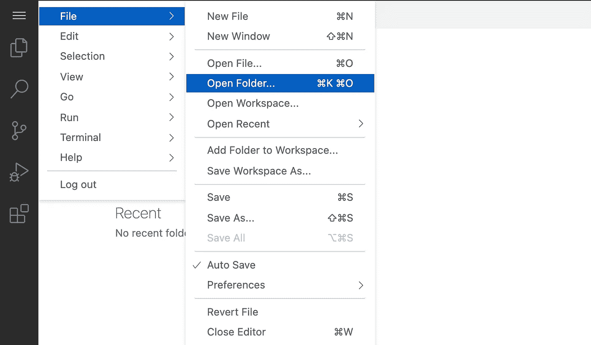
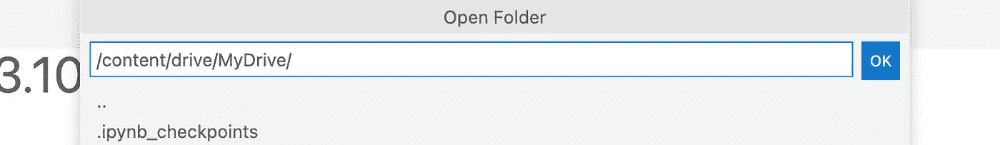
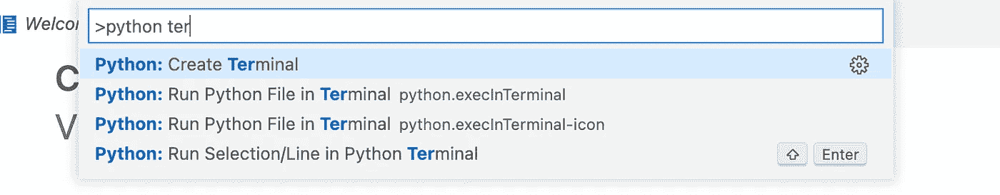

# 从 Colab 中获得更多

> 原文：<https://medium.com/mlearning-ai/getting-more-out-of-colab-3659e7bc04d8?source=collection_archive---------4----------------------->

Google Colab 对于学生来说是一个不可思议的工具(像我！)谁身边没有 GPU。虽然它对于 python 笔记本来说很棒，但是它没有 IDE 功能(目前还没有！).输入 [colabcode](https://github.com/abhishekkrthakur/colabcode) ，这是一个很棒的 python 包，可以让你通过 web VSCode IDE 使用 Google Colab 资源！你甚至可以在上面安装谷歌硬盘。说够了，让我们开始吧！

**第一步**:在 Colab 中打开一个笔记本，安装你的 Google Drive

```
from google.colab import drive
drive.mount('/content/drive')
```

**第二步**:在驱动器上安装 colabcode。现在你不需要每次都安装它。(感谢[这篇](https://ayoolafelix.hashnode.dev/how-to-permanently-install-a-module-on-google-colab-ckixqrvs40su044s187y274tc)博文)

```
import os
import sysnb_path = '/content/notebooks'
os.symlink('/content/drive/MyDrive/Colab_Notebooks/packages/', nb_path)
sys.path.append(nb_path)!pip install --target=$nb_path colabcode
```

***步骤 2.1*** :下次在新的内核上使用笔记本时，请使用下面的代码片段。这将从您的驱动器加载软件包，并节省您再次下载它的努力。

```
import sys
sys.path.append('content/drive/MyDrive/Colab_Notebooks/packages/')
```

**第三步**:启动 colab 服务器

```
from colabcode import ColabCode
ColabCode(port=10000,mount_drive=True)
```

***注意*** :你甚至可以用密码保护你的连接。只需向 *ColabCode* 函数调用提供带有*密码*参数的密码。

完成步骤 3 后，您将在单元输出中看到一个链接。只要点击它，你就会被带到 web VS 代码服务器。(如果您在启动服务器时提供了密码，系统会提示您输入密码)。就这样，你有了使用 Colab 运行的 VS 代码！


Photo by [J E W E L M I T CH E L L](https://unsplash.com/@preciousjfm?utm_source=medium&utm_medium=referral) on [Unsplash](https://unsplash.com?utm_source=medium&utm_medium=referral)

对于不熟悉 VS 代码的人来说，有更多的步骤。

**打开您的项目文件夹**



Go to *Open Folder*



Enter the path to your drive folder containing your code

**接入终端**

您还可以通过按下 *F1* 并在提示符下键入 *python: Create Terminal* 来启动 Python 终端。



*感谢阅读。让我知道你对更多特性和 Colab 技巧的建议。干杯！*