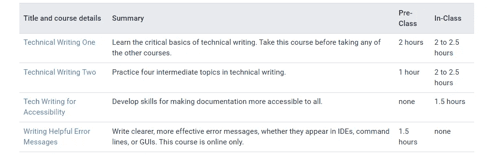

# 开始为数据科学组合撰写一篇简单的技术文章

> 原文：<https://medium.com/mlearning-ai/getting-start-to-write-a-simple-technical-article-for-data-science-portfolio-bd5f96b956aa?source=collection_archive---------8----------------------->

## 文章写作的本质，要采取的步骤，要使用的工具，以及资源

Photo by Jessica Lewis Creative from [Pexels](https://www.pexels.com/photo/ball-point-pen-on-opened-notebook-606541/)

作为一名数据科学家，向他人展示你的技能是必须的。一种方法是写一篇文章。文章是包含特定讨论的一段文字。

技术文章是独一无二的文章。这通常旨在使用技术或理解特定概念向读者解释。一篇好的技术文章在技术上是准确的、有用的、简洁的、完整的、清晰的、一致的、有针对性的、组织良好的，并且必须在语法、拼写和标点符号上是正确的。

成为专业技术文章作者的第一步是开始写作。写一篇技术文章不需要考虑复杂的想法。一个简单的想法加上正确的写作风格就足够了。

# 写文章的本质

写作其实不仅仅是写作。要写好一篇技术文章，必须要明白写技术文章本身的本质。

Photo by Suzy Hazelwood from [Pexels](https://www.pexels.com/photo/black-and-red-typewriter-1995842/)

技术文章的内容和普通文章有很大不同。技术文章强调客观写作，而不是写作风格或作者对主题的感受。我们还必须记住，撰写技术文章的目的是向读者提供一些技术信息或文档。

这里最重要的是，读者很容易理解我们的技术文章。所以，写技术文章的本质是让读者容易理解。如果读者仍然感到困惑和难以理解，那么我们还没有把写技术文章本身的精髓倒出来。

另外，我们需要注意的是写技术文章时的意图。我们需要有帮助读者的意图，或者我们的技术文章会对读者产生多大的影响。写作时有了这样的意图，那么你就很容易把写技术文章的精髓倒出来。

# 要采取的步骤

要写一篇技术文章，你必须经历几个阶段。

Photo by Pixabay from [Pexels](https://www.pexels.com/photo/contemporary-gradient-handrails-perspective-434645/)

首先，你要集思广益。通过头脑风暴，你会对以后的技术文章内容有所了解。你也可以利用这个阶段来集中或限制你的写作。

2 第二是学习。写技术文章就像教人一样。如果我们自己仍然不理解我们要写的主题，我们将无法写作。当我们决定写什么的时候，我们也必须理解我们以后要写的主题。

3 第三种是开发我们在头脑风暴时已经确定的想法或思路。我们文章的内容必须和我们写的标题相符。在这个阶段，还需要书籍或期刊作为参考。

4 第四是重读我们所写的东西。每个人都不可避免地会犯错误。重读我们写的东西对检查我们文章中的错误是必要的。

5 第五是向他人寻求帮助(可选)。我们必须有盲点，我们也看不到我们的盲点。只有其他人能看到我们的盲点。因此，寻求他人的帮助来检查我们所写的技术文章，对于检查我们是否还有遗漏的错误非常有帮助。

6 第六是检查我们的文章有没有抄袭。抄袭是指有意识或无意识地使用他人的语言、想法、思想或图像，并通过不注明出处的方式将其作为自己的原创作品。因此，我们不能抄袭，当我们想使用别人的思想来源时，我们必须参考他们。

最后是出版。如果我们做了一篇技术文章，但没有人阅读，那就不完整。发布技术文章使我们接触到更多的读者。每个出版商都有自己的水平，出版商的水平越高，你就越需要额外努力才能让你的文章被他们发表。

# 要使用的工具

使用正确的工具可以使我们的工作更容易。为了让我们更容易地撰写技术文章，有几个工具可供您使用。

Photo by Pixabay from [Pexels](https://www.pexels.com/photo/business-computer-connection-contemporary-270640/)

在这里，我将给出一些我写作时使用的工具的建议。首先是 [**谷歌翻译**](http://translate.google.com) 。我用谷歌翻译来帮助把我写的文章翻译成英语。第二，我用[**quill bot**](https://quillbot.com/)**来意译几句，让他们更容易理解。**

**第三，我用 [**Canva**](https://www.canva.com/) 来编辑或创作与文章内容相匹配的插图。第四，我用 [**发表或灭亡**](https://harzing.com/resources/publish-or-perish/) 找期刊或书籍参考。最后我用[**Quotext**](https://www.quetext.com/)**来检查文章是否有抄袭。****

# ****成为作家的资源****

****成为一个专业的技术文章作者，就是要努力，不断学习。有几个免费资源可供你学习。首先，我们推荐尝试一下**[**Google 技术写作课程**](https://developers.google.com/tech-writing)**。谷歌提供免费的技术写作课程。********

************

******Source: [https://developers.google.com/tech-writing](https://developers.google.com/tech-writing)******

******接下来推荐 Coursera 上提供的 [**《工程领导写作技巧》**](https://www.coursera.org/learn/engineering-writing?) 课程。我们向初学者推荐这门课程。学完这个瘦子，希望你的文笔有条理，清晰，简洁。******

********

****Source: [https://www.coursera.org/learn/engineering-writing](https://www.coursera.org/learn/engineering-writing)?****

# ****谁有权利成为作家？****

****任何人都可以成为专业的技术文章作者。没有人生来就是作家。成为作家不需要很高的教育背景。****

> ****任何人都可以学习，我们可以成为任何我们想成为的人。****

****在这个时代，互联网上有很多免费的学习资源。利用这些资源，你可以成为任何人。伴随着努力工作和不断学习，你会实现它。****

# ****结论****

****对于任何想展示自己技能的人来说，写一篇技术文章都是非常重要的，包括一名数据科学家。一篇好的技术文章应该结构严谨、简洁明了。写一篇技术文章的本质是让读者容易理解。有几个步骤和工具可以让我们更容易地写技术文章。通过努力学习和工作，我们可以成为专业的技术作家。****

# ****参考资料:****

****[1]布罗根，J. (1965 年)。美国第一位伟大的科技作家本杰明·富兰克林的教训。 *IEEE 工程写作与演讲汇刊*， *8* (1)，3–7。[https://doi.org/10.1109/tews.1965.6594555](https://doi.org/10.1109/tews.1965.6594555)****

****[2]m .阿里和 d .奥斯马尼(2012 年)。如何成为一个有效的技术写作者？。*《国际工程教育学杂志》(Ijep)* ， *2* (3)，4。【https://doi.org/10.3991/ijep.v2i3.2094 ****

**** [## Mlearning.ai 提交建议

### 如何成为 Mlearning.ai 上的作家

medium.com](/mlearning-ai/mlearning-ai-submission-suggestions-b51e2b130bfb)****