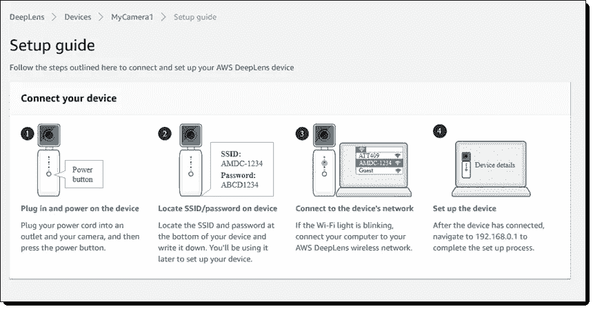
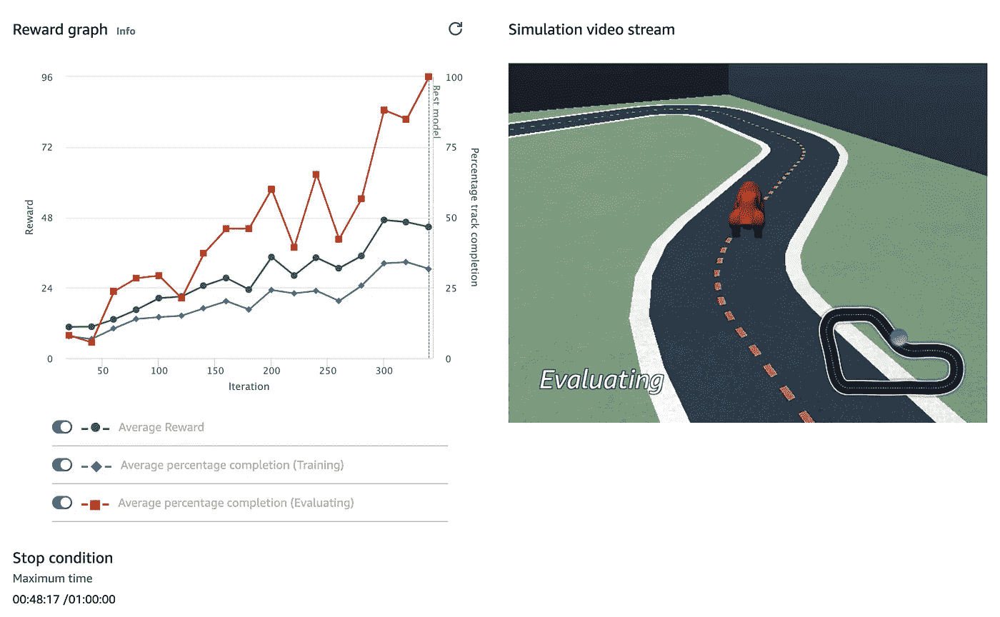
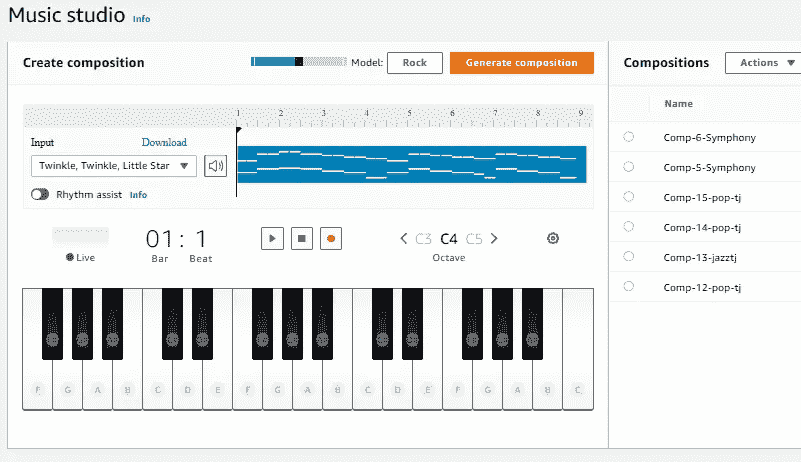

# 使用 AWS 开始机器学习

> 原文：<https://medium.com/mlearning-ai/getting-started-machine-learning-with-aws-d65fc7fb107b?source=collection_archive---------8----------------------->

AWS Educational Devices

## **什么是机器学习？**

机器学习(ML)是一种软件开发技术，它使计算机能够通过使用来自真实世界数据的样本来解决复杂的问题。因此，这种技术可以让计算机在没有被明确编程的情况下自动学习并根据经验进行改进。

## **它是如何工作的？**

在用软件工程解决问题的传统方法中，工程师将收集数据并分析现实世界中的问题。他们设计一个解决方案并写下代码来解决这个特殊的问题。为许多现实世界的问题开发代码是一项费力的任务。

在机器学习中，开发人员编写一个代码片段，该代码片段将由现实世界的数据以这样一种方式进行训练，即它将开始预测以前没有提供的新数据的结果。该代码片段被称为模型，它将由一个称为模型训练算法的特殊程序进行训练。

## **为什么机器学习要用 AWS？**

是的，这是你开始读标题时出现的第一个问题。为什么是 AWS？

AWS 正在提供如此多易于使用的服务和工具，这使得每个人都可以轻松地投入机器学习之旅。它从用户那里抽象出许多复杂的实现，并提供了任何新手都可以轻松开始使用的简单功能。AWS 的使命是把机器学习放到每一个开发者的手中。

AWS 提供了许多预先训练的人工智能服务，这些服务可以作为现成的智能用于广泛的应用程序。这种服务有很多例子，例如，个性化推荐、使联络中心现代化、提高安全性以及增加客户参与度。

## **亚马逊 SageMaker**

这是一项完全托管的服务，消除了机器学习工作流的复杂性，因此每个开发人员和数据科学家都可以轻松部署机器学习。

## **入门**

正如我之前解释的那样，AWS 提供了许多服务，使每个开发人员都可以轻松地开始使用 ML。然而，AWS 也为 ML 学生和这个领域的新开发者提供了许多学习方法。

AWS 已经创建了一个教育设备组合，通过 AWS DeepLens、AWS DeepRacer 和 AWS DeepComposer，以有趣的方式帮助开发人员掌握新的机器学习技术。

1.  **AWS DeepLens:** 这是一款帮助学习计算机视觉的摄像设备。
2.  **AWS DeepRacer:** 这是一款专为在实体赛道上行驶而设计的赛车。它有助于学习强化学习技术。
3.  AWS DeepComposer: 这是一个由生成式人工智能驱动的作曲设备。它创造的旋律转变成一首完全原创的歌曲。

## **AWS DeepLens**

AWS DeepLens 允许您创建和部署基于计算机视觉的端到端应用程序。这个设备集成了几个 AWS 机器学习服务。您可以连接 AWS cloud，以使用部署的模型，这些模型通过设备捕获的新数据进行训练和测试。它使您能够学习和探索基于深度学习模型开发计算机视觉应用程序的最新人工智能(AI)工具和技术。

AWS DeepLens Console

## **AWS DeepRacer**

这个设备是一个自主赛车，旨在通过在物理赛道上比赛来测试强化学习模型。强化学习是一种 ML 技术，其中模型(这里通常称为代理)通过来自环境的反馈来训练。代理人将因其采取的行动而获得数量奖励。有助于代理实现其目标的行动会得到更高数量的激励。没有帮助的行为会导致低奖励或没有奖励。

AWS DeepRacer 联盟每月都会举办几场赛车比赛。您可以通过发送您的模型来参加这些比赛，以便有机会赢得奖品，同时深入学习机器学习开发技能。

请注意，该设备在开发过程中不是强制性的，AWS 提供了模拟器，您可以在其中测试您的模型。这些比赛也不需要物理设备，许多比赛是使用模拟器进行的。

AWS DeepRacer Simulator

## **AWS DeepComposer**

AWS DeepComposer 是专门设计来提供一种创造性和简单的方法来开始机器学习(ML)，特别是生成式人工智能。它由一个 USB 键盘组成，连接电脑输入旋律。有一个 AWS DeepComposer 控制台，其中包括一个音乐工作室来生成音乐，还有一个学习胶囊来深入研究生成性人工智能模型。

在这里，你不需要购买设备来提高你的技能，你可以上传现有的音乐和应用 ML 技术。有几个 AWS DeepComposer Chartbusters 挑战赛，在那里你可以分享你用 ML 技术创作的音乐，并与其他人展示你的技能。

AWS DeepComposer Music Studio

## **AWS 账户**

您需要一个帐户来访问 AWS 控制台和使用 ML 服务。它需要支付信息，但这只是为了验证，它不会扣除金额，直到你使用免费层和服务是免费的。AWS 提供了一个免费层，允许您在每个服务的指定限制内免费使用多个服务。详情可以在 [AWS 网站](https://aws.amazon.com/free/)上找到。

## **参考&进一步阅读**

1.  [AWS deep composer(Amazon.com)](https://aws.amazon.com/deepcomposer/)
2.  [AWS DeepRacer——使用机器学习的最快方法(Amazon.com)](https://aws.amazon.com/deepracer/)
3.  [AWS DeepLens -面向开发者的支持深度学习的摄像机-AWS(Amazon.com)](https://aws.amazon.com/deeplens/)

 [## Mlearning.ai 提交建议

### 如何成为 Mlearning.ai 上的作家

medium.com](/mlearning-ai/mlearning-ai-submission-suggestions-b51e2b130bfb)