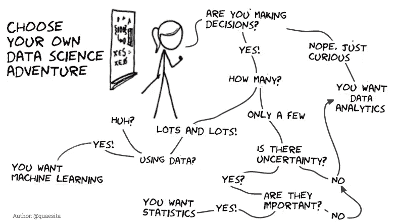

# 成为数据分析师

> 原文：<https://medium.com/mlearning-ai/getting-started-with-data-analytics-43ef397a4339?source=collection_archive---------0----------------------->

## 我的故事📖

我的职业生涯从软件开发人员开始，然后过渡到从事数据方面的职业。我喜欢作为一名软件开发人员工作，然而，我总是对直接影响商业价值和用户或客户对产品和服务的体验感兴趣，这影响了我深入数据世界的决定。

## 我开始时犯的几个错误

作为一名软件开发人员，我采用了自顶向下的方法。它击倒了我。在我掌握 SQL 和完全理解数据结构之前，我专注于学习机器学习。我把每一个问题都视为钉子，因为我只有一把“锤子”——技术技能。

## **经验教训📝**

1.  ***准备心态转变***

拥有合适的工具和技术技能并不能保证你会成为一名优秀的数据分析师。虽然技术技能可以增强并实现解决方案的交付，但拥有一颗好奇的心、跳出框框思考、关注细节、通过相信数据而不是直觉来保持开放的心态是最基本的。接受思维转变有助于你客观地进行分析，并意识到自己的偏见和局限。

***2。打造商业敏锐性***

作为一名数据分析师，要想发挥更大的影响力，就要对自己的业务和环境有全面的了解。了解你的商业战略，它的市场地位，了解你的竞争对手，独特的卖点，以及提供的不同产品。
虽然你不可能无所不知，但通过跨职能工作和建立关系来积累你的商业知识是有帮助的。

***3。提高沟通和协作技能***

数据分析师的角色是高度跨职能的。你可能会与不同背景的人合作和交流。你必须能够站在他们的角度，根据他们的兴趣和背景来解释事情。
找到有效交流发现的方法——最近的研究表明，成年人的平均注意力持续时间是 8 秒！比金鱼还少。

***4。不要假设！*质疑一切**

总是通过问正确的问题来开始你的分析，不要害怕深入。花点时间问你的用户和客户一些不带偏见的问题，让你的利益相关者参与到期望中来，并问一些澄清性的问题。提问是避免不正确假设的有力手段。
求更多信息！这样做是有空间的，不会陷入分析瘫痪。

***5。要敏捷***

[敏捷是指思维的敏捷和敏锐。](https://www.yourdictionary.com/agility)

当开始进行数据分析时，很容易陷入这样的陷阱:花费大量时间分析一个问题，使用所有“正确”的数学来解决错误的问题，以找到答案。
数据过载和陷入分析瘫痪的陷阱也很常见，因此无法获得可操作的见解并延缓决策过程。
因此，需要确定优先级，及时提供可操作的见解，并学会拒绝对关键指标没有重大影响的任务。

***倒带⏪ ⏪***

***让我来回答你可能有的一些问题……***

## 什么是数据分析？🤔

数据分析包括收集、分析和解释数据，以帮助企业优化绩效、解决问题和降低风险，并实现其目标。
数据分析非常广泛，几乎涉及到每个行业。

## 数据分析师是做什么的？💭

数据分析师使用数据来解决问题和回答问题，从而做出更好的商业决策。

## **一些误解🙅‍♀️**

数据科学家和数据分析师有时会互换使用。虽然这两者相关，但需要不同的技能。我发现 Linkedin 上的这个展示应用程序差异的视觉效果很有帮助。

## **成为数据分析师😎**

**成为数据分析师需要有数学、统计学或计算机科学学位吗？**不……虽然你可以用数学、计算机科学、统计学或其他相关领域的学位来发展基础知识和增强你的简历，但你也可以通过替代计划来学习你需要的东西，如专业证书计划、训练营或自学课程，并为自己找到一份数据分析师的工作。

**打入数据分析需要哪些技术技能，可以使用哪些学习平台进行学习？**

1.  **Excel**

Excel 仍然是更小、更轻、更快速的分析工具。掌握高级的 Excel 方法，如编写宏和使用 VBA 查找，将有助于你的分析任务。然而，Excel 在处理大数据集方面有局限性，作为一名数据分析师，你将不得不经常与大数据打交道，因此，随着你在分析师职业生涯中的晋升，鼓励你学习统计编程语言。

*学习资源:*

[微软培训中心](https://support.microsoft.com/en-us/office/excel-video-training-9bc05390-e94c-46af-a5b3-d7c22f6990bb?ui=en-us&rs=en-us&ad=us):免费初级到中级教程。

[跳板](https://courses.springboard.com/p/excel-data-analysis):15-20 小时 Excel 免费数据分析课程。

[GFC Learnfree.org](https://edu.gcfglobal.org/en/topics/excel/):免费 Excel 内容及教程。

2.**结构化查询语言(SQL)**

SQL 可以说是获得数据分析师工作的一项重要技能。根据 [Josh Devlin](https://www.dataquest.io/blog/why-sql-is-the-most-important-language-to-learn/) 创建的统计数据，SQL 被列为数据分析师角色所需的顶级技术技能。SQL 是用于从数据库中提取数据的语言，并将其作为分析的先决条件。SQL 的美妙之处在于，与 Excel 不同，它是完全可扩展和可重复的。

*学习资源:*

[使用微软 Sql 服务器的 sql](https://www.udemy.com/course/microsoft-sql-server-an-introduction-2018-edition/?ranMID=39197&ranEAID=JVFxdTr9V80&ranSiteID=JVFxdTr9V80-_oEjiZHu59EQQYGaaDMEpQ&LSNPUBID=JVFxdTr9V80&utm_source=aff-campaign&utm_medium=udemyads):Udemy 免费 SqL 课程。

[自由代码营](https://youtu.be/HXV3zeQKqGY) : SQL 和数据库管理系统课程。

[Udemy](https://www.udemy.com/course/introduction-to-databases-and-sql-querying/?LSNPUBID=JVFxdTr9V80&ranEAID=JVFxdTr9V80&ranMID=39197&ranSiteID=JVFxdTr9V80-jh1RiVD0BeauTTkx5fB.OA&utm_medium=udemyads&utm_source=aff-campaign) :数据库和 SQL 查询概念简介

**3 .r 或 Python 统计编程**

> “任何 Excel 可以做的事情，R 或者 Python 都可以做得更好——更快”——匿名

r 和 Python 是强大的统计编程语言，用于对大数据集执行高级和预测性分析。两者都是行业标准。要真正成为一名数据分析师并取得进步，您需要超越 SQL 并至少掌握其中一种语言。

*学习资源-R*

[从 R 开始:](https://rfortherestofus.com/courses/getting-started/)从 R 开始的分步指南

[R 大书](https://www.bigbookofr.com):面向数据科学的 R 免费书籍和视频教程

*学习资源— Python*

[全民 Python](https://www.py4e.com/lessons/):免费 Python 教程。

[FreeCodeCamp](https://www.youtube.com/channel/UC8butISFwT-Wl7EV0hUK0BQ) :免费视频教程，让你开始使用 python。

4.**统计**

统计学是收集、分析、展示和解释数据的科学。

良好的统计学基础会帮助你更好地:

*   *识别数据中的模式和趋势*
*   *在你的分析中避免偏见和逻辑错误*
*   *产生准确可信的结果*

*学习资源*

[麻省理工学院开放课件](https://ocw.mit.edu/courses/15-075j-statistical-thinking-and-data-analysis-fall-2011/):本课程是统计数据分析入门。

这门课程包括描述统计学的介绍

这门课程包括推断统计学的介绍

5.**数据可视化**

> “一幅画胜过千言万语”——**弗雷德·r .**巴纳德——

交流见解以制定更好的业务决策是数据分析流程的重要组成部分。视觉化可以增强注意力，让观众专注于主题。

为了更好地使用视觉传达见解，要知道哪些视觉最适合您的数据，使用什么颜色，需要什么标签，以及如何吸引观众。微软 Power BI 和 tableau 等商业智能工具是帮助实现可视化的很好的工具。

*学习资源*

1.  PowerBi 终极定位:报名参加这个免费课程，开始使用 Power BI。
2.  Tableau:Tableau 创作者的免费培训视频

## 哪些行业雇佣数据分析师？

你可以在不同的垂直行业工作，如医疗保健、金融、娱乐、电信、银行、营销等。你感兴趣的都行！

## 寻找额外的资源？

Kaggle 是一个面向数据科学家的在线社区，让你可以访问数据集、笔记本、培训加速器和教育。

[津迪](https://zindi.africa/):这是一个数据科学竞赛平台，让你接触真实世界的数据科学挑战。

## 最后的想法💡

美国劳工统计局预测，到 2026 年，数据分析师的需求将增长约 28%。
问题是，会有足够的人才来磨练这些工作吗？

职业成长和发展需要时间，你不会在一夜之间达到最高水平，但这一切都是从正确方向上的一小步开始的。有许多方法可以培养必要的技能来达到你的目标，这取决于你现有的背景、你愿意投入的时间和资源以及你个人的职业目标。

做数据分析师从来没有比现在更好的时机！🚀🚀

 [## Mlearning.ai 提交建议

### 如何成为 Mlearning.ai 上的作家

medium.com](/mlearning-ai/mlearning-ai-submission-suggestions-b51e2b130bfb)