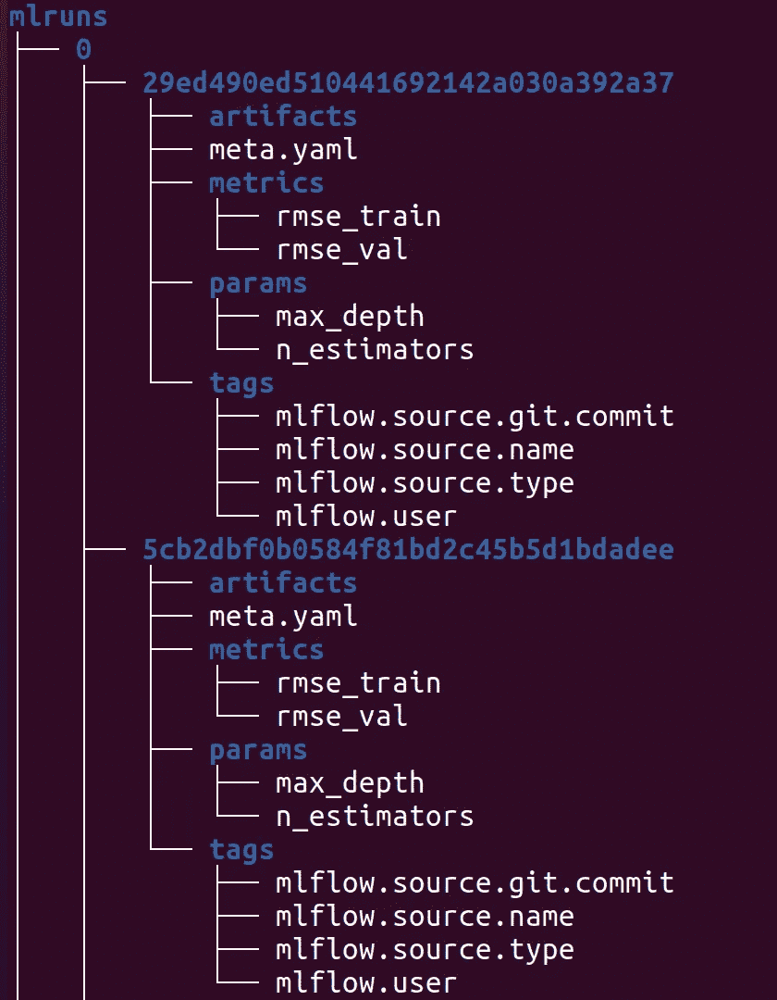
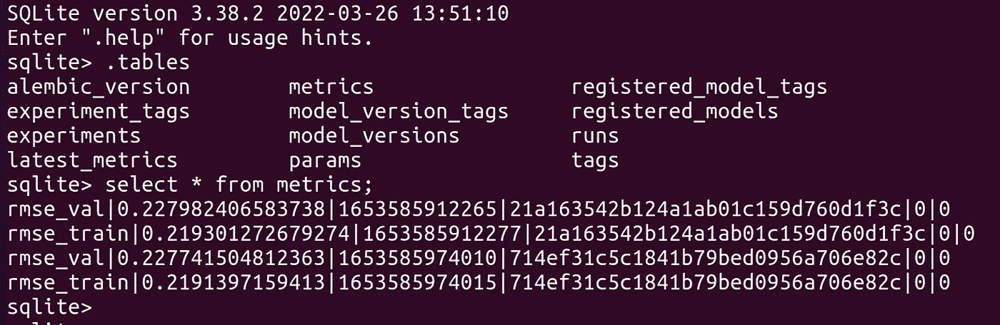
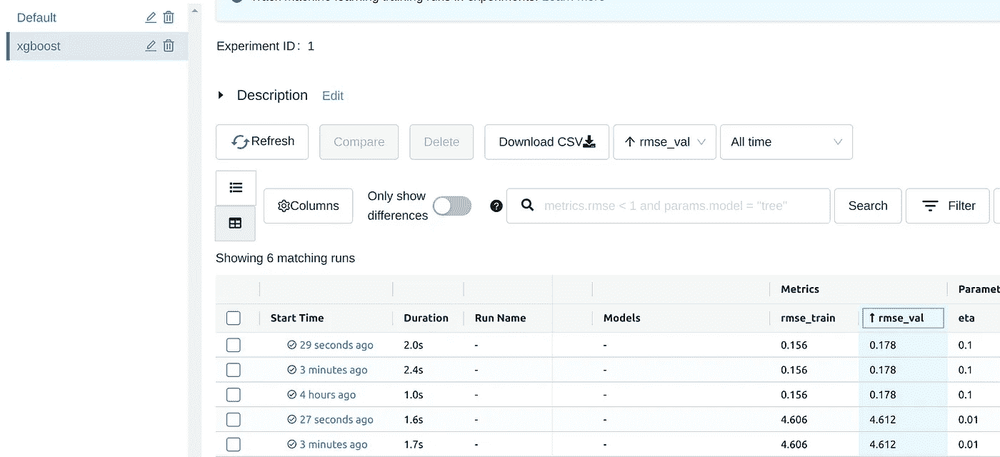

# mlflow 实验跟踪入门

> 原文：<https://medium.com/mlearning-ai/getting-started-with-mlflow-tracking-46a0089d6a73?source=collection_archive---------6----------------------->

## 使用本地文件夹和 SQLite


Photo by [Raymond Kotewicz](https://unsplash.com/@rayjkiii?utm_source=medium&utm_medium=referral) on [Unsplash](https://unsplash.com?utm_source=medium&utm_medium=referral)

## 介绍

> [MLflow 是一个简化机器学习开发的平台，包括跟踪实验，将代码打包成可重复运行的代码，以及共享和部署模型。](https://github.com/mlflow/mlflow)

[mlflow](https://www.mlflow.org/) 提供的功能之一是以有组织的方式跟踪实验。这篇文章解释了如何开始这样做。我们将考虑一个简单的机器学习示例，并展示如何以两种不同的方式跟踪实验:

*   使用本地文件夹
*   使用 SQLite 数据库

跟踪实验有更多的可能性，详细列表可以在 mlflow 的[文档中找到。在](https://www.mlflow.org/docs/latest/tracking.html) [GitHub](https://github.com/froukje/articles/blob/main/03_mlflow.ipynb) 上可以找到一个 jupyter 笔记本，上面有这里显示的示例代码。

## mlflow 入门

为了使用 mflow，我们需要使用`pip install mlflow.`来安装它

现在，让我们为随机森林回归量定义一个简单的训练函数:

```
def train_rf(X_train, y_train, X_val, y_val, n_estimators=100, max_depth=6):

    model = RandomForestRegressor(n_estimators=n_estimators, max_depth=max_depth)
    model.fit(X_train, y_train)

    # generate predictions
    y_pred_train = model.predict(X_train).reshape(-1,1)
    y_pred = model.predict(X_val).reshape(-1,1)

    # calculate errors
    rmse_train = mean_squared_error(y_pred_train, y_train, squared=False)
    rmse_val = mean_squared_error(y_pred, y_val, squared=False)
    print(f"rmse training: {rmse_train:.3f}\t rmse validation: {rmse_val:.3f}")
```

然后，我们可以使用 mlflow 记录参数、指标等等。这对于分析培训和评估指标如何变化以及比较不同的参数设置非常有用。我们将修改该函数，并记录参数“n_estimators”、“max_depth”和度量“rmse ”,用于训练和验证。

```
def train_rf(X_train, y_train, X_val, y_val, n_estimators=100, max_depth=6):

    model = RandomForestRegressor(n_estimators=n_estimators, max_depth=max_depth)
    model.fit(X_train, y_train)

    # generate predictions
    y_pred_train = model.predict(X_train).reshape(-1,1)
    y_pred = model.predict(X_val).reshape(-1,1)

    # calculate errors
    rmse_train = mean_squared_error(y_pred_train, y_train, squared=False)
    rmse_val = mean_squared_error(y_pred, y_val, squared=False)
    print(f"rmse training: {rmse_train:.3f}\t rmse validation: {rmse_val:.3f}")

    # Logging params and metrics to MLFlow
    mlflow.log_param('n_estimators', n_estimators)
    mlflow.log_param('max_depth', max_depth)
    mlflow.log_metric('rmse_val', rmse_val)
    mlflow.log_metric('rmse_train', rmse_train)
```

## 在本地文件夹中跟踪实验

跟踪我们实验的最简单方法是将所有记录的信息保存在本地文件夹中。我们可以通过使用`with mlflow.start_run()`并在`with`语句中运行我们的模型来实现。创建一个保存运行和所有相关日志的目录`mlflow`。每次我们用命令`with mlflow.start_run()`运行代码，一个新的运行将在相同的实验名称下被创建。默认情况下，该实验被命名为`0`。

```
with mlflow.start_run():
    train_rf(X_train, y_train, X_val, y_val, n_estimators=100, max_depth=6)
```

我们通过改变“最大深度”参数来执行模型的新运行。如果我们像上面一样运行它，它将像前面一样存储在当前实验文件夹下，在本例中是用`experiment_id=0`。

```
with mlflow.start_run():
    train_rf(X_train, y_train, X_val, y_val, n_estimators=100, max_depth=None)
```

如果我们想在不同的实验下保存我们的结果，我们可以使用`mlflow.set_experiment()`设置一个新的实验。如果实验已经存在，运行将保存在该实验下，如果不存在，将创建一个新的。让我们假设我们有第二个模型(例如 XGBoost ),并且我们想要记录一个新实验的结果。我们需要给出实验名称，实验 id 会自动递增。

```
# defining a new experiment
experiment_name = 'xgboost'
exp_id = mlflow.set_experiment(experiment_name=experiment_name)
with mlflow.start_run():
    train_xgb(X_train, y_train, X_val, y_val, learning_rate=0.1)
```

我们可以在特定的实验名称下运行模型，方法是将`experiment_id`设置为现有的实验。

```
with mlflow.start_run(experiment_id=1):
    train_xgb(X_train, y_train, X_val, y_val, learning_rate=0.01)
```

使用`tree mlruns`我们可以看到文件夹的结构，我们的实验就存储在那里。



Structure of the folder where the experiments are stored

数字 0，1，…是不同的实验。在每个文件夹中，我们执行的运行都存储在一个单独的文件夹中，每个运行都以实验 id 命名。在这个文件夹中，我们可以找到所有的指标、参数和其他我们存储的东西。

## 使用 Sqlite 跟踪实验

或者，记录的结果可以存储在数据库中。Mlflow 支持 MySQL、Postgres 和 Sqlite。在这篇文章中，我们将只考虑 SQlite 对数据库跟踪可能性的概述，可以在 mlflow 的[文档中找到。为了告诉 mlflow 在数据库中存储东西，我们需要将跟踪 uri 设置为`mlflow.set_tracking_uri("sqlite:///mlruns.db")`。或者，我们可以导出环境变量`export MLFLOW_TRACKING_URI sqlite:///mlruns.db.`，然后像以前一样开始运行。](https://www.mlflow.org/docs/latest/tracking.html)

```
mlflow.set_tracking_uri("sqlite:///mlruns.db")
with mlflow.start_run(experiment_id=0):
    train_rf(X_train, y_train, X_val, y_val)
```

这将在当前文件夹中创建一个数据库“mlruns.db”。我们可以使用 SQLite 检查表格，例如，选择存储的指标。



## 使用 web 用户界面进行可视化

我们可以使用 mlflow 的 web UI 可视化结果，以分析和比较不同的运行和实验。在第一种情况下，当我们在本地将记录的参数和度量存储在`.\mlflow`中时，我们可以简单地在终端中键入`mlflow ui`来交互式地查看结果。如果我们在创建文件夹`mlflow`的同一个位置，这是可行的。更普遍的是，我们可以使用`mlflow ui --backend-store-uri file:////absolute-path/mlruns.`从其他位置访问该文件夹

在第二种情况下，我们需要更改`backend-store-uri`并使用`mlflow ui --backend-store-uri sqlite:///mlruns.db`。如果我们想从不同的位置访问数据库，我们可以设置路径`mlflow ui --backend-store-uri sqlite:////absolute-path/mlruns.db`。为此，需要安装 sqlalchemy，例如`pip install sqlalchemy.`

另一个有用的参数是`--port`来改变 UI 的端口，默认设置为`5000`。这是一个 web 用户界面的例子。还有很多可视化功能，这只是开始页面。去探索它们吧！



!Example of the web UI of mlflow

## 进一步阅读

*   [https://www.mlflow.org/docs/latest/tracking.html](https://www.mlflow.org/docs/latest/tracking.html)
*   [https://www . ml flow . org/docs/latest/tutorials-and-examples/tutorial . html](https://www.mlflow.org/docs/latest/tutorials-and-examples/tutorial.html)
*   [D. Hundley](https://dkhundley.medium.com/?source=post_page-----8b45bfbbb334--------------------------------) ， [mlflow part 1 入门 mlflow](https://towardsdatascience.com/mlflow-part-1-getting-started-with-mlflow-8b45bfbbb334) (2020)，[https://towardsdatascience . com/ml flow-part-1-入门-mlflow-8b45bfbbb334](https://towardsdatascience.com/mlflow-part-1-getting-started-with-mlflow-8b45bfbbb334)

[](/@frauke.albrecht/subscribe) [## 每当弗劳克·阿尔布雷特出版时，就收到一封电子邮件。

### 每当弗劳克·阿尔布雷特出版时，就收到一封电子邮件。通过注册，您将创建一个中型帐户，如果您还没有…

medium.com](/@frauke.albrecht/subscribe) [](/@frauke.albrecht/membership) [## 通过我的推荐链接加入媒体

### 阅读 Frauke Albrecht 的每一个故事(以及媒体上成千上万的其他作家)。您的会员费直接支持…

medium.com](/@frauke.albrecht/membership) [](/mlearning-ai/mlearning-ai-submission-suggestions-b51e2b130bfb) [## Mlearning.ai 提交建议

### 如何成为 Mlearning.ai 上的作家

medium.com](/mlearning-ai/mlearning-ai-submission-suggestions-b51e2b130bfb)