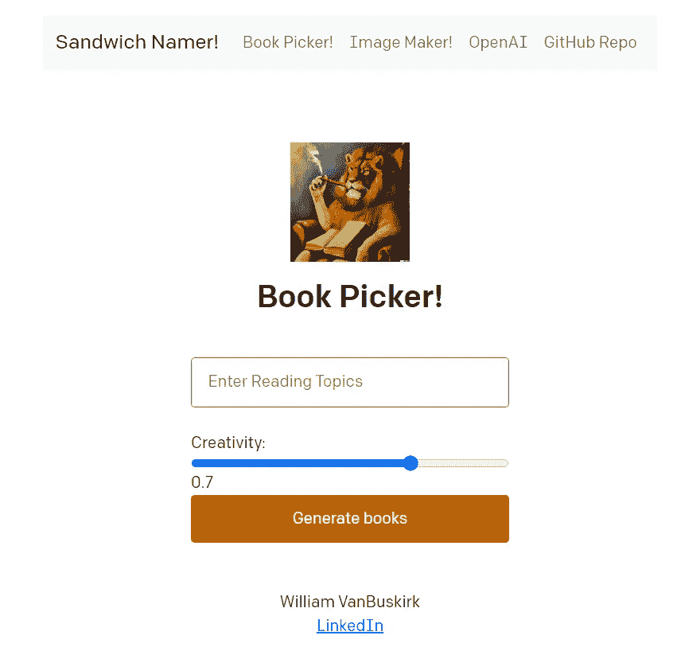

# OpenAI 的入门非常简单

> 原文：<https://medium.com/mlearning-ai/getting-started-with-openai-is-incredibly-easy-3ab1f4c5586?source=collection_archive---------6----------------------->

## 在不到 60 分钟的时间内构建一些东西

Robot Drinking Coffee — One of my DALL-E Creations

GPT-3 和 DALL-E 2 可能已经淹没你的新闻提要有一段时间了。如果你像我一样，你可能有一些网络应用和机器学习的经验，但不知道从哪里开始使用生成式人工智能或大型语言模型(LLM)。

# 短篇小说

1.  查看 [OpenAI 快速入门指南](https://beta.openai.com/docs/quickstart/build-your-application)和他们的 [github repo](https://github.com/openai/openai-quickstart-python)
2.  更改提示和输入，并部署一个实时推理 web 应用程序
    *(我喜欢使用 Heroku 来主持参考消息)*
3.  添加一个菜单，包括多个提示，并与 DALL-E 2 配对
4.  查看我的 github repo，它是基于快速入门指南( [Github Repo](https://github.com/van-william/prompt-web-app) )的一个例子；[网络应用链接](https://openai-webapp-demo.herokuapp.com/)
5.  让我知道进展如何！

# 更长的故事

## 背景

GPT 3 和其他大型语言模型是引人注目的，因为它们可以解决大量的一般化问题。典型地，在经典的机器学习中，你为一个特定的问题建立一个分类，你的模型能够完成这个特定的功能；该模型解决其他类似问题的推广机会不多。

有了 LLMs，你可以训练理解和综合模型，在精确措辞的提示帮助下解决更一般化的问题。

## 模型探索

OpenAI 有 GPT-3 和 DALL-E 2 的游乐场；注册为您提供了一定数量的学分。很快，你就会看到，通过一些精心策划的提示，你可以让 GPT 3 号或 DALL-E 2 号产生复杂的输出。

除此之外，您可以轻松构建一个定制的 web 应用程序，向公众展示特定的提示。OpenAI 也有一个简单的 flask app 快速入门指南。

## 构建 Web 应用程序

有各种各样的关于使用 Flask 或 Django 在 Python 中构建定制 web 应用的教程。这些允许你主要用 Python 和一点 html 和 css 来构建 web 应用。这使你不仅能够提出创造性的提示和 GPT 3 输出，还能从根本上思考如何在 web 应用程序上向消费者提供 OpenAI 输出。

下面，我做了一个非常简单的 web app:三个提示:

1.  三明治命名者——输入配料后，它给三明治命名
2.  图书挑选器——输入主题后，它会推荐一本书和作者
3.  图像生成器(标准 DALL-E 2)

Example Web App Built from OpenAI QuickStart

利用像简单的 web 应用程序这样的机会来进一步了解如何提供建议和提示，可以作为一个强大的学习工具和强大的投资组合工具。

查看 Github 回购，让我知道你的想法！

 [## GitHub-van-William/prompt-we B- App:GPT-3 和达尔-E 2 演示 web 应用程序

### Web 应用程序:https://openai-webapp-demo.herokuapp.com/这个 web 应用程序借鉴了 OpenAI 快速入门教程。它使用…

github.com](https://github.com/van-william/prompt-web-app)  [## Mlearning.ai 提交建议

### 如何成为 Mlearning.ai 上的作家

medium.com](/mlearning-ai/mlearning-ai-submission-suggestions-b51e2b130bfb)