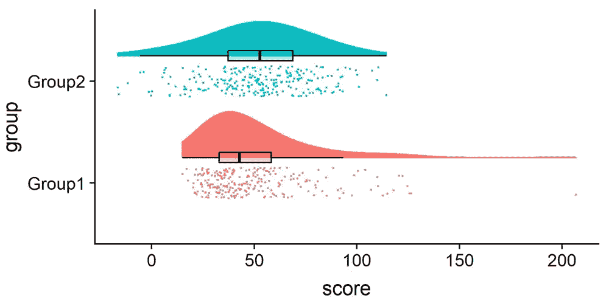
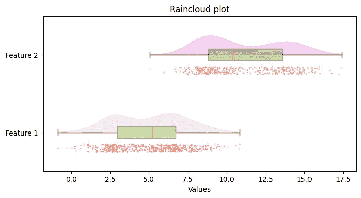

# Python 中的雨云图入门

> 原文：<https://medium.com/mlearning-ai/getting-started-with-raincloud-plots-in-python-2ea5c2d01c11?source=collection_archive---------3----------------------->

一种强大的数据可视化方法，由小提琴图、散点图和箱线图组成。

上述每种可视化方法都有各自的**优势**和**劣势**。但是，如果我们可以将它们结合在一起，得到一种更强大的数据可视化技术，即*雨云图*，会怎么样呢？

## 什么是雨云图？

雨云图是一种更加*形式的*数据可视化*。正如我前面提到的，它们是多种方法的*混合*,共同提供了我们需要了解的关于数据集中观察结果的大部分**统计数据和模式**的概述。*

**

*Figure 1\. Allen M, Poggiali D, Whitaker K *et al.* Raincloud plots: a multi-platform tool for robust data visualization ([https://doi.org/10.12688/wellcomeopenres.15191.2](https://doi.org/10.12688/wellcomeopenres.15191.2)). Image from the paper.*

*在本文中，我们将学习如何使用 *numpy* 和 *matplotlib* 库在 Python 中使用和实现这种类型的绘图。*

## *加载数据集*

*为了简单起见，在这个例子中，我们将在给定的数值范围内生成两个随机分布。*

*让我们导入所需的库*

```
*# Imports
import numpy as np
import matplotlib.pyplot as plt*
```

*接下来，下面的代码片段将为我们生成两个数字分布，我们稍后将使用它们来可视化雨云图中的数据*

```
*# Generate random distribution of integers between 0-10 as the first feature
x1 = np.random.choice([0,1,2,3,4,5,6,7,8,9,10], p=[0.01, 0.01, 0.15, 0.19, 0.05, 0.11, 0.2, 0.16, 0.10, 0.01, 0.01], size=(500))

# Apply random noise on each sample so they don't overlap on the x-axis in scatter plot
idxs = np.arange(len(x1))
out = x1.astype(float)
out.flat[idxs] += np.random.uniform(low=-1, high=1, size=len(idxs))
x1 = out

# Generate random distribution of integers between 6-17 as the second feature
x2 = np.random.choice([6,7,8,9,10,11,12,13,14,15,16,17], p=[0.01, 0.01, 0.15, 0.23, 0.14, 0.06, 0.05, 0.10, 0.12, 0.11, 0.01, 0.01], size=(500))

# Apply random noise on each sample so they don't overlap on the y-axis in scatter plot
idxs = np.arange(len(x2))
out = x2.astype(float)
out.flat[idxs] += np.random.uniform(low=-1, high=1, size=len(idxs))
x2 = out

# Combine features in a list
data_x = [x1, x2]*
```

*太好了。现在我们有了一些可视化的东西，让我们来看看如何建立一个雨云图*

## *数据可视化*

```
*fig, ax = plt.subplots(figsize=(8, 4))

# Create a list of colors for the boxplots based on the number of features you have
boxplots_colors = ['yellowgreen', 'olivedrab']

# Boxplot data
bp = ax.boxplot(data_x, patch_artist = True, vert = False)

# Change to the desired color and add transparency
for patch, color in zip(bp['boxes'], boxplots_colors):
    patch.set_facecolor(color)
    patch.set_alpha(0.4)

# Create a list of colors for the violin plots based on the number of features you have
violin_colors = ['thistle', 'orchid']

# Violinplot data
vp = ax.violinplot(data_x, points=500, 
               showmeans=False, showextrema=False, showmedians=False, vert=False)

for idx, b in enumerate(vp['bodies']):
    # Get the center of the plot
    m = np.mean(b.get_paths()[0].vertices[:, 0])
    # Modify it so we only see the upper half of the violin plot
    b.get_paths()[0].vertices[:, 1] = np.clip(b.get_paths()[0].vertices[:, 1], idx+1, idx+2)
    # Change to the desired color
    b.set_color(violin_colors[idx])

# Create a list of colors for the scatter plots based on the number of features you have
scatter_colors = ['tomato', 'darksalmon']

# Scatterplot data
for idx, features in enumerate(data_x):
    # Add jitter effect so the features do not overlap on the y-axis
    y = np.full(len(features), idx + .8)
    idxs = np.arange(len(y))
    out = y.astype(float)
    out.flat[idxs] += np.random.uniform(low=-.05, high=.05, size=len(idxs))
    y = out
    plt.scatter(features, y, s=.3, c=scatter_colors[idx])

plt.yticks(np.arange(1,3,1), ['Feature 1', 'Feature 2'])  # Set text labels.
plt.xlabel('Values')
plt.title("Raincloud plot")
plt.show()*
```

*上述代码片段的结果将是如下图:*

**

*Figure 2\. Representation of the Raincloud plot. Image by the autor*

*如你所见，这为我们提供了*在**初始**数据探索**阶段**我们需要了解的关于数据集的几乎一切*。我们对总体分布、个体趋势、中位数、四分位数和异常值有一些了解。*

*此外，即使没有统计学/数据科学背景的人也可以更容易地阅读它，因为它非常直观。*

## *关于我*

*大家好，我叫 Alex，是一名对机器学习和数据科学充满热情的年轻学生。*

*如果你喜欢的内容，请考虑下降一个关注和掌声，因为他们真的很感谢。也可以随时在 LinkedIn 上与我联系，以便获得一些关于机器学习相关主题的每周见解。*

## *参考*

*[1] Allen M，Poggiali D，Whitaker K *等* [Raincloud plots:一种用于鲁棒数据可视化的多平台工具](https://wellcomeopenresearch.org/articles/4-63/v2)(2019)【https://wellcomeopenresearch.org/articles/4-63/v2 *

*[](/mlearning-ai/mlearning-ai-submission-suggestions-b51e2b130bfb) [## Mlearning.ai 提交建议

### 如何成为 Mlearning.ai 上的作家

medium.com](/mlearning-ai/mlearning-ai-submission-suggestions-b51e2b130bfb)*