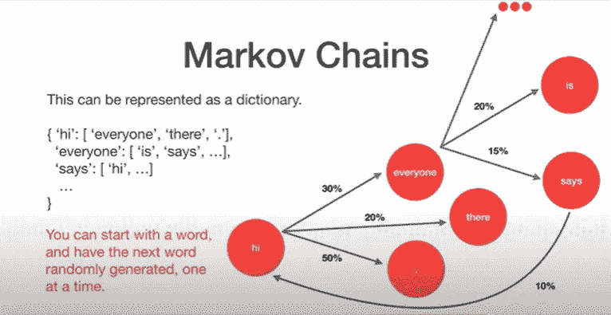
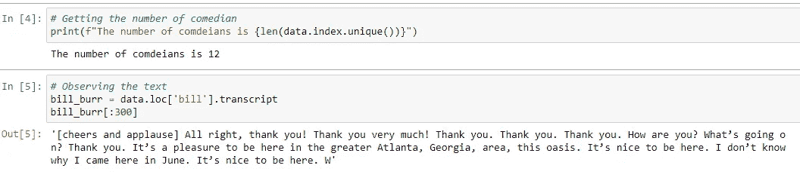
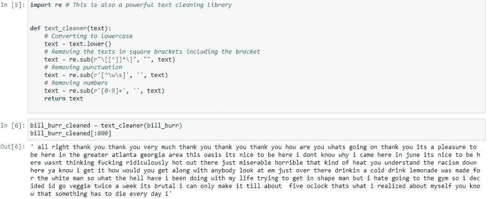
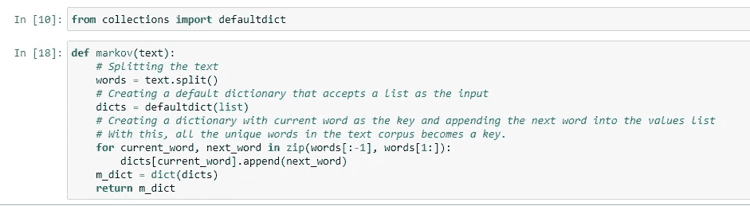
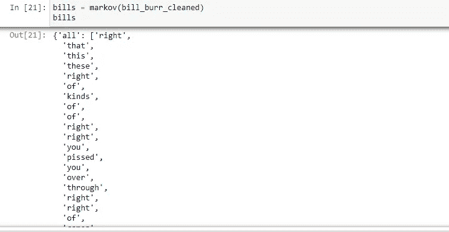
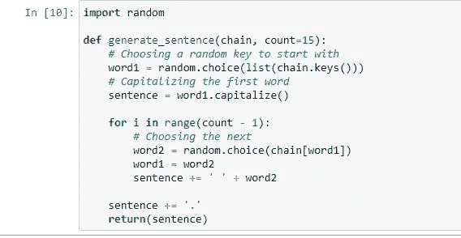
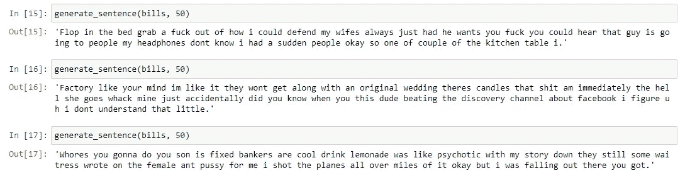

# 使用马尔可夫链开始文本生成

> 原文：<https://medium.com/mlearning-ai/getting-started-with-text-generation-using-markov-chains-661800599a23?source=collection_archive---------4----------------------->

## 介绍

马尔可夫链背后的概念是，在转移中，一个事件依赖于前一个事件的发生，即，只有依赖于它的事件已经发生，该事件才能发生。

马尔可夫链有很多应用，包括语音识别、遗传学、网页排名等。但是在我们的例子中，正如主题所暗示的，我们将使用它来生成文本

在这个项目中，我们的**目标**是根据喜剧演员的惯例，为我们选择的喜剧演员生成喜剧文本。

## 战略

> NB:如果你熟悉我之前的两篇文章，那么开始的方法论几乎是一样的。在 NLP 中，几乎所有的项目都是从这个过程开始的

1.  加载数据集
2.  数据清理和预处理
3.  创建马尔可夫链
4.  构建我们的文本生成器

## 加载数据集

使用著名的 pandas 库，我们将把数据集加载到我们的工作环境中。我们将要处理的数据集包含了十二个不同喜剧演员的喜剧套路文本，我将从中选择我最喜欢的。数据集也是 pickle 格式(。pkl)，不知道什么是泡菜文件也不用担心；熊猫处理它们。我会推荐你阅读熊猫的文献。我将在参考资料部分放一个链接

查看数据集，我们可以看到喜剧演员的名字被设置为索引。得到我们想要的喜剧演员已经很简单了。我们只需使用数据帧的 iloc 功能。

> 注意:熊猫加载的任何数据集都被转换成一个数据帧

## 数据清理和预处理

仅仅看文本，我们可以看到文本清理是必要的，最明显的是围绕观众反应的方括号。此外，标点符号将被删除，文本将全部转换为小写，以便“是”和“是”被视为相同。让我们创建一个函数来执行这个任务。

> 您可能想知道 NLP 文本清理中的一个常见步骤被跳过了，即删除停用词。当处理文本序列时，不需要删除停用词，因为即使前一个词是停用词，该词仍然依赖于前一个词。也是为了让我们的模型生成的文本更有意义。**现在到了最有趣的部分:**

## 构建马尔可夫模型

我们在这里尝试做的是将文本语料库中的每个唯一的单词作为一个关键字，然后将每个单词附加到单词旁边。这样，一个单词在特定单词旁边出现得越多，当我们构建文本生成器时，它就越有可能被选为下一个单词。

> 我们使用 default this 是为了减轻一个问题，这个问题可能是由于字典中还没有键而导致的。为了更好地理解 defualt _ dict，我将在下面的参考资料部分链接一篇很好地解释它的文章。

## 文本生成器

这里有了马尔可夫链，我们将生成文本。我们将在这里使用随机库来选择将在特定单词之后出现的随机单词。

> 下面，我们可以看到使用马尔可夫链生成的文本。通读它们，让我知道你对生成的文本有什么看法。

最后备注:

> 如果你已经到了这个地步，敬请 [**跟随我的页面**](https://amusatomisin65.medium.com/subscribe) 。我会每周上传与 NLP 相关的文章。如果你也有 NLP 技术想让我写的话。请在评论中告诉我。非常感谢，另一边见。

资源:

更多关于 Default _ dict:'[https://medium . com/swlh/python-collections-Default dict-dictionary-with-Default-values-and-automatic-keys-305540540 d2a](/swlh/python-collections-defaultdict-dictionary-with-default-values-and-automatic-keys-305540540d2a)

我的 GitHub 上的源代码: [oluwatomsin/Text_Generation:这个项目涉及使用马尔可夫链进行文本生成(github.com)](https://github.com/oluwatomsin/Text_Generation)

熊猫文档:[https://pandas . pydata . org/docs/getting _ started/intro _ tutorials/01 _ table _ oriented . html](https://pandas.pydata.org/docs/getting_started/intro_tutorials/01_table_oriented.html)

订阅我的页面:[https://medium.com/r/?URL = https % 3A % 2F % 2 famusatomisin 65 . medium . com % 2f 订阅](https://amusatomisin65.medium.com/subscribe)

 [## Mlearning.ai 提交建议

### 如何成为 Mlearning.ai 上的作家

medium.com](/mlearning-ai/mlearning-ai-submission-suggestions-b51e2b130bfb)