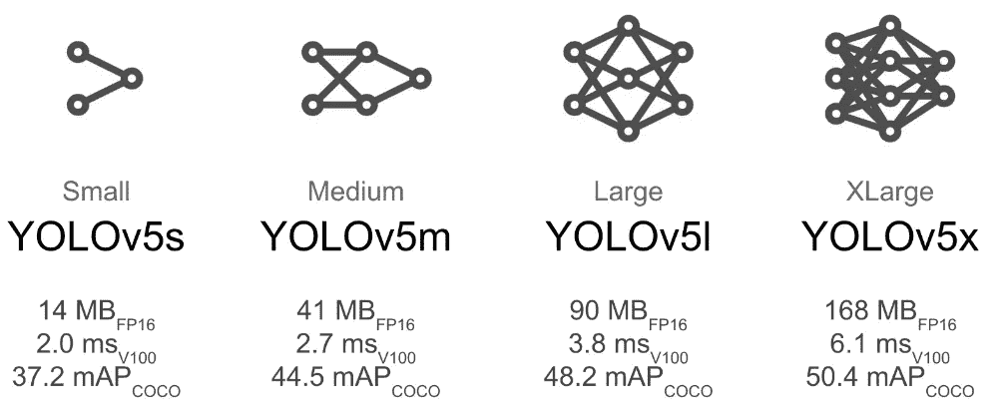
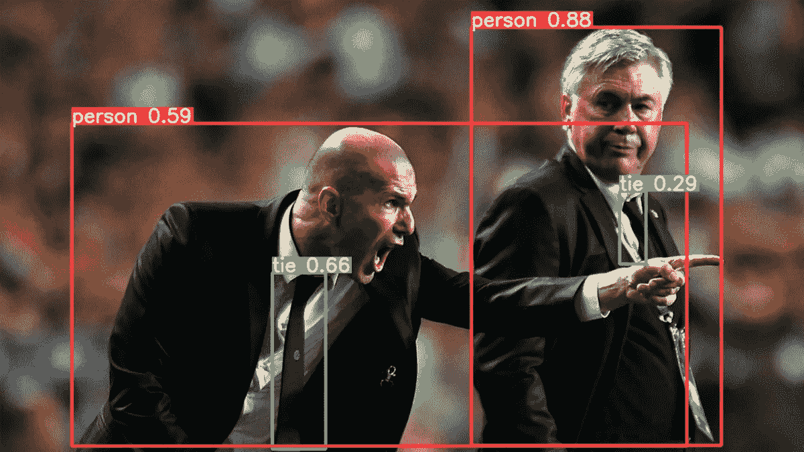
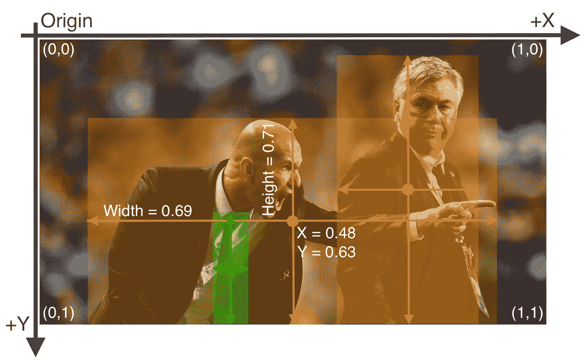

# 几分钟后开始使用 YOLOv5！

> 原文：<https://medium.com/mlearning-ai/getting-started-with-yolov5-in-a-few-minutes-80ea2ff25c3c?source=collection_archive---------1----------------------->

你好，今天我将向你展示如何开始使用写作时最好的物体检测算法之一，即 YOLO。

在这篇文章中，我们将使用由 [Ultralytics](https://github.com/ultralytics/yolov5) 实现的 YOLOv5。Ultralytics 实现得非常好，非常流畅，这让我们非常容易使用和开始对象检测。这个网络是用 PyTorch 实现的，但是使用这个实现并不需要成为 PyTorch 专家。如果你对 PyTorch 不是很熟悉，这就更好了。

## 准备存储库

首先，我们必须将 GitHub 中的存储库克隆到一个项目中。我个人喜欢在虚拟环境中做，但是做你想做的。

创建项目(虚拟或非虚拟)后，打开终端并运行以下命令:

```
git clone https://github.com/ultralytics/yolov5
```

当存储库被克隆时，安装需求。

```
cd yolov5
pip install -r requirements.txt
```

现在存储库被克隆，需求被安装，我们准备好进行训练和推理。但是在我们继续之前，我们需要决定网络的规模。

## 模型尺寸

YOLOv5 有 4 种尺寸(s、m、l 和 xl)。直观上，网络越大，可调参数越多，性能越好。但是，更多的参数意味着更长的训练时间和推理时间。如果您正在构建一个用于实时检测的系统，您肯定会选择小型或中型的模型。以下是四种型号的概述:



source: [https://github.com/ultralytics/yolov5/wiki/Tips-for-Best-Training-Results](https://github.com/ultralytics/yolov5/wiki/Tips-for-Best-Training-Results)

增加模型大小需要更多的 CUDA 内存，从而减少批量大小以使批量适合内存。不建议使用小批量，因为小批量提供的批量标准化统计数据较差。这激励了中小型模型，而不是大型模型。

# 测试预先训练的模型

为了确保我们已经正确安装了所有东西，我们将测试一个在 COCO 上预先训练的模型。使用[火炬中枢](https://pytorch.org/hub/)初始化网络和加载预训练的重量非常方便。

要加载网络并对测试映像进行推断，请运行以下脚本:

```
import torch

# Initialize the (small) network from ultralytics
model = torch.hub.load('ultralytics/yolov5', 'yolov5s')# Load test image, could be any image
img = 'https://ultralytics.com/images/zidane.jpg'# Do inference
results = model(img)# Show results
results.show()
```

应该会出现下面的图像，否则，一定是出错了(如果您有任何问题，请告诉我，我会尽力帮助您)。



[https://github.com/ultralytics/yolov5](https://github.com/ultralytics/yolov5)

很简单，对吧？现在我们已经初始化了一个强大的网络，并在 COCO 上预先训练了参数。如果您对人物检测感兴趣，这可能就足够了。但是在大多数情况下，您对在自己的自定义数据集上进行训练感兴趣。在接下来的几节中，我将介绍在您的自定义数据集上训练 YOLOv5 的步骤。

## 准备数据集

YOLOv5 遵循注释的标准 darknet 格式，所以如果您熟悉这种格式，可以跳过这一节。然而，如果没有，让我们看看如何为框架提供注释文件。

darknet(YOLO 的原始框架)使用规范化的注释文件，其中注释是相对于图像大小给出的。
这意味着所有注释都在[0，1]的范围内，其中 1 表示图像大小的 100%。

对于每个图像，我们需要一个对应的。txt 文件，其中包含各个图像的注释。例如，如果您有一个名为 0001.txt 的图像，您应该有一个名为 0001.txt 的文件，其中包含带注释的边界框。名称必须相同，否则图像将被跳过，不会包含在训练过程中。

每个注释文件的结构如下，用空格分隔。

```
<class label> <center x> <center y> <width> <height>
```

例如，与更快的 RCNN 类标签不同，RCNN 类标签是零索引的，所以从 0 开始到数据集中的类数。YOLO 不需要背景课。如上所述，YOLO 需要规范化注释。这些转换可通过以下公式获得:

```
<center x> = (x1 + w/2) / image_w
<center x> = (y1 + h/2) / image_h
<width>    = w / image_w
<height>   = h / image_h
```

其中 x1 和 y1 是边界框的左上角，w 和 h 是边界框的宽度和高度，image_w 和 image_h 是图像大小。<>中的变量是注释的规范化版本。请看下图以获取灵感:



source: [https://github.com/ultralytics/yolov5/wiki/Train-Custom-Data](https://github.com/ultralytics/yolov5/wiki/Train-Custom-Data)

文件夹结构应按以下顺序排列:

```
./Dataset
../Train
.../images
..../img01.jpg
..../img02.jpg
.../labels
..../img01.txt
..../img02.txt
```

保持这种结构很重要，因为框架的实现是为了用“标签”和文件的扩展名替换“图像”文件夹，以找到相应的注释。

```
dataset/train/images/img01.jpg
dataset/train/labels/img01.txt
```

最后需要做的是用数据集信息创建一个 YAML 文件。文件名为 dataset_name.yaml，例如 cars.yaml:

```
train: ../cars/train/images
val: ../cars/val/images
test:    # optional, if any test images.nc: 1    # number of classes
names: [ 'car' ] # List of class names
```

现在您得到了所需的东西，一个以正确方式注释的数据集和一个描述路径和名称的 YAML 文件。包含数据集文件的文件夹应该位于 yolov5 文件夹旁边。换句话说，在项目文件夹中，而不是在克隆的文件夹中。YAML 文件应该在 yolov5/data 文件夹中。现在我们准备开始训练。

## 在自定义数据集上训练

当一切设置正确时，开始训练程序应该是相当容易的。从终端，您只需运行以下命令:

```
python train.py --img 640 --batch 16 --epochs 3 --data cars.yaml 
                --weights yolov5s.pt
```

请注意，这些参数指定了培训。第一个参数是所需的图像大小，640 px 是常用的形状，但是您可以选择其他大小。下一个参数指定批处理大小，并且应该总是尽可能大。第三个参数指定历元的数量(在整个数据集上迭代的次数),而数据参数指定在训练期间应该使用的数据集。最后一个参数指定预先训练的权重，并确定使用哪个模型。

## 培训时的最佳实践！

训练对象检测时，您应该仔细关注数据集的各个方面。

Ultralytics 建议您首先使用默认设置进行训练，因为这通常足以获得良好的结果，并为进一步的优化提供一个基线。之后，您可以尝试检查您的数据集和超参数。

如果您得到大量的误报检测(检测到没有对象存在的边界框)，您可以包括一些背景图像。背景图像仅仅是没有对象和注释的图像。此外，你应该留意你的班级的平衡。不平衡数据集通常会抑制少数类，因为它们对损失函数的贡献不如多数类大。一条经验法则是，每门课至少要有 1500 张图片。注释应该尽可能精确地适合对象，并且训练图像应该反映应用程序打算实现的环境。如果数据集包含许多小对象，选择较大的图像尺寸来容纳小对象可能是有益的。

任何进一步的信息可以在这里找到:

*   [https://github . com/ultralytics/yolov 5/wiki/Tips-for-Best-Training-Results](https://github.com/ultralytics/yolov5/wiki/Tips-for-Best-Training-Results)
*   http://karpathy.github.io/2019/04/25/recipe/

这就对了。关于如何使用 YOLOv5 进行对象检测以及如何在您自己的自定义数据集上进行训练的分步指南。YOLO 的好处是速度，它比许多其他对象检测网络的训练略快，例如更快的 RCNN。

我希望这篇文章对你如何开始使用 YOLOv5 有所帮助，其目的不是提供架构和底层机制的基本理解，而是如何开始使用它的高级概述。

如有任何意见或建议，请随时与我联系。

感谢您的阅读…

## 来源:

*   【https://github.com/ultralytics/yolov5 
*   [http://karpathy.github.io/2019/04/25/recipe/](http://karpathy.github.io/2019/04/25/recipe/)