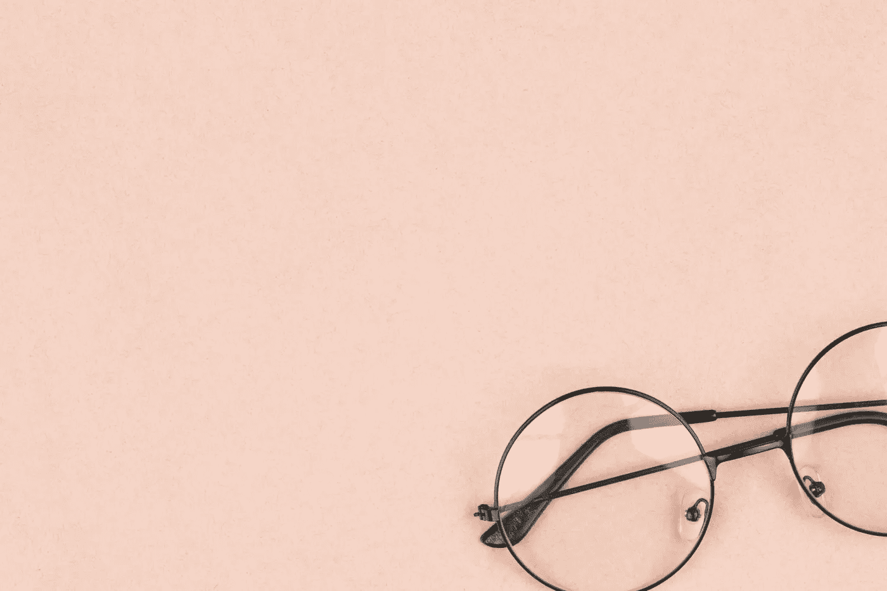
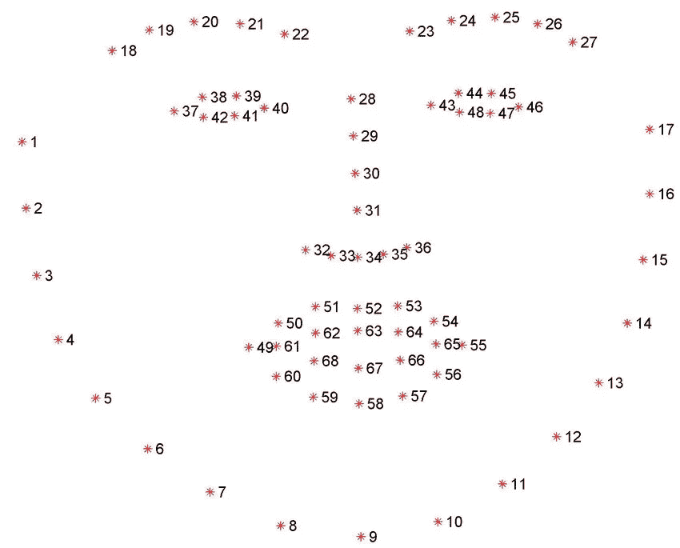
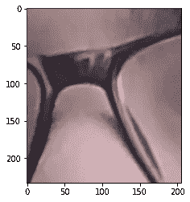
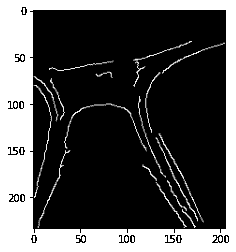
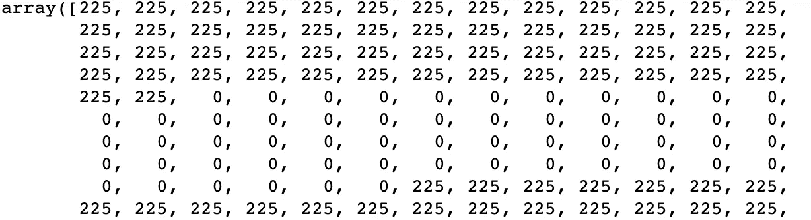
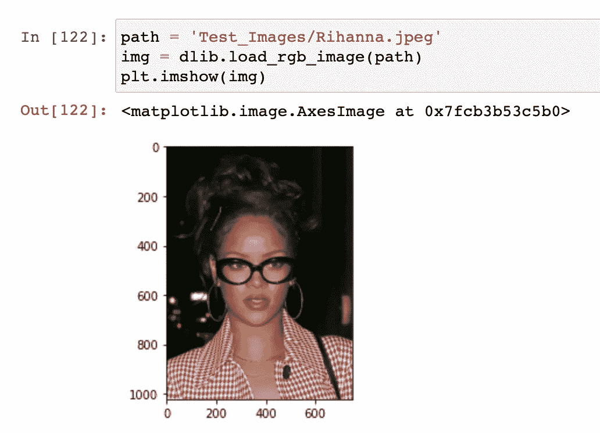
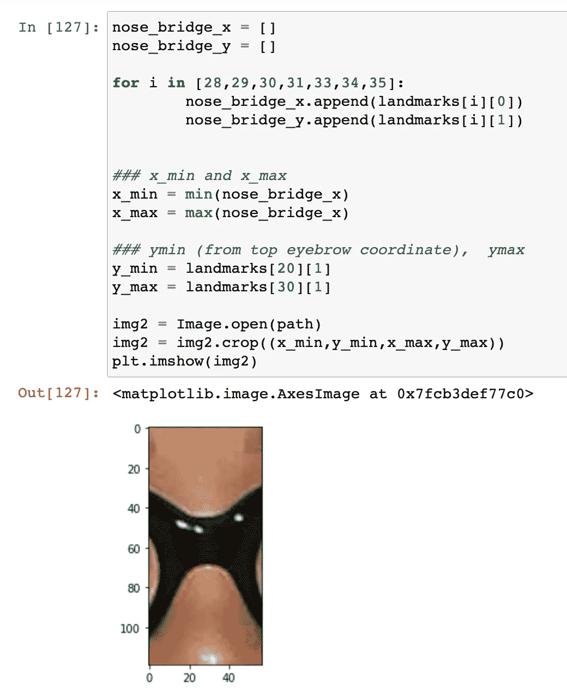
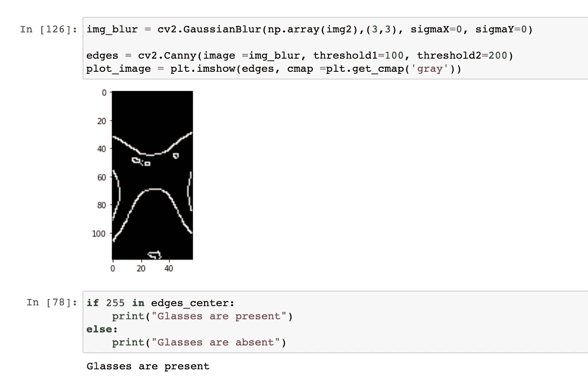
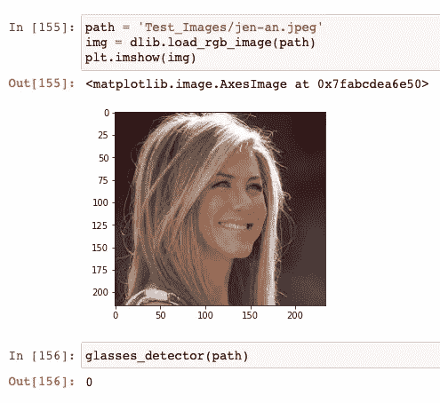
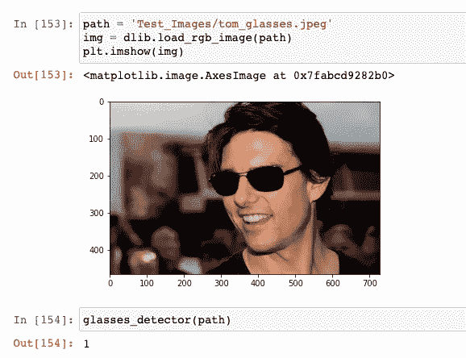

# 眼镜检测- OpenCV、DLIB 和边缘检测

> 原文：<https://medium.com/mlearning-ai/glasses-detection-opencv-dlib-bf4cd50856da?source=collection_archive---------1----------------------->

# 戴眼镜 AI 能检测到吗？让我们找出答案...



[https://unsplash.com/@lunarts](https://unsplash.com/@lunarts)

打印(' Hello World ')！这篇文章是关于使用 OpenCV 和 Dlib 检测用户是否戴了一副眼镜/墨镜。OpenCV 是 python 中一个流行的库/模块，用于图像处理和计算机视觉。Dlib 是 C++中另一个流行的库，用于执行不同的机器学习应用程序。除了这些库，下面是这个项目的要求。

1.  Python 3(最好是版本≥ 3.5+)
2.  Numpy
3.  Matplotlib
4.  统计数字
5.  枕头

# **1。理论方法**

一副眼镜总是由横跨鼻子的鼻梁连接(让我们称之为'**'镜架桥'**)，这将是我们检测的主要 ROI。如果我们能检测到这个桥的存在，我们就能有效地检测到眼镜的存在。因此，我们的方法将是使用 Dlib 来检测一个人的面部标志，然后使用这些标志将注意力集中在鼻子上，以使用边缘检测来检测鼻梁的存在。

# 2.编码

说够了！让我们开始编码…

*   让我们导入该项目所需的导入库

```
import numpy as np
import dlib
import cv2
import matplotlib.pyplot as plt
from PIL import Image
import statistics
```

*   我们还需要下载‘shape _ predictor _ 68 _ face _ landmarks . dat’。这是网上免费提供的，上面有关于不同面部标志的所有信息。一个人的脸上总共有 68 个这样的标志点。



Universal Facial Landmarks

我们对第 28、29、30 和 31 点感兴趣。每个点都会给我们一个 x 和 y 坐标。为了清晰的可视化，我们还将考虑 33、34 和 35。

*   让我们导入在上述地标上训练的 Dlib 人脸检测模型

```
detector = dlib.get_frontal_face_detector()
predictor = dlib.shape_predictor('shape_predictor_68_face_landmarks.dat')
```

让我们照张相让我照张相。


*   让我们得到所有 68 个面部标志。

```
img = dlib.load_rgb_image(path)
plt.imshow(img)

rect = detector(img)[0]
sp = predictor(img, rect)
landmarks = np.array([[p.x, p.y] for p in sp.parts()])
```

这段代码将帮助我们加载图像，获得矩形边界框，并为每个特征生成面部点。landmark 变量将生成 x，y 坐标。

*   现在我们想得到我的咳嗽对象的鼻子。

```
nose_bridge_x = []
nose_bridge_y = []for i in [28,29,30,31,33,34,35]:
        nose_bridge_x.append(landmarks[i][0])
        nose_bridge_y.append(landmarks[i][1])

### x_min and x_max
x_min = min(nose_bridge_x)
x_max = max(nose_bridge_x)### ymin (from top eyebrow coordinate),  ymax
y_min = landmarks[20][1]
y_max = landmarks[31][1]img2 = Image.open(path)
img2 = img2.crop((x_min,y_min,x_max,y_max))
plt.imshow(img2)
```

聚焦于上面提到的坐标，我们得到这个图像。



The nose section and the frame bridge

我们现在将使用著名的用于边缘检测的 Canny 滤波器来获得边缘(轮廓)。注意，为了准确检测，我们将首先使用高斯模糊来模糊图像。

```
img_blur = cv2.GaussianBlur(np.array(img2),(3,3), sigmaX=0, sigmaY=0)edges = cv2.Canny(image =img_blur, threshold1=100, threshold2=200)
plt.imshow(edges, cmap =plt.get_cmap('gray'))
```



The edges of the above image

请注意，我们可以将该帧视为一条白色像素带(大约在 y - 50 到 100 之间)。我们将使用沿着鼻子中心**的单个列向量来检测这些像素。**

```
#center strip
edges_center = edges.T[(int(len(edges.T)/2))]
```

*   **对图像进行转置以获得列向量，并沿着鼻子的中心取一个向量。**

****

**A strip of 0s between 255s**

```
if 255 in edges_center:
 print(“Glasses are present”)
else:
 print(“Glasses are absent”)
```

**正如你在上面看到的，我们在黑色(表示鼻子)之间有一条白色的像素带(表示鼻梁)。确认眼镜的存在。**

# **3.另一个例子**

**我们举个例子。这是蕾哈娜，让我们看看我们是否能检测出她是否戴着眼镜。**

*   **输入图像**

****

*   **庄稼**

****

*   **边缘和检测**

****

**因此，我们可以肯定蕾哈娜确实戴着眼镜。**

# **4.完整代码**

**[](https://github.com/siddh30/Glasses-Detection/blob/main/Glasses_detection.ipynb) [## Glasses-Detection/Glasses _ Detection . ipynb at main siddh 30/Glasses-Detection

### 使用- OpenCV 和 DLI b-Glasses-Detection/Glasses _ Detection . ipynb 在 main …

github.com](https://github.com/siddh30/Glasses-Detection/blob/main/Glasses_detection.ipynb) 

这是该项目的 GitHub repo，我也把所有东西放在一个可用的函数中——glasses _ detector。我还增加了实时检测功能。

# **5。结果**

这里有更多的结果，1，0 -玻璃存在/不存在



# 6.这种模式可能失败的地方

对于质量非常低的图像，如果帧非常薄且颜色较浅。

# 7.对于更多这样的项目

[](https://github.com/siddh30/) [## siddh30 -概述

### Cognizant 的数据科学家 Cognizant 的数据科学家欢迎您！这个投资组合有一个项目集在机器…

github.com](https://github.com/siddh30/) 

# 8.你也可以跟着我

[](https://www.linkedin.com/in/siddharthmandgi/) [## 西达尔特·曼奇——高级助理数据科学家——认知| LinkedIn

### 在世界上最大的职业社区 LinkedIn 上查看西达尔特·曼奇的个人资料。西达尔特有 2 份工作列在…

www.linkedin.com](https://www.linkedin.com/in/siddharthmandgi/)**