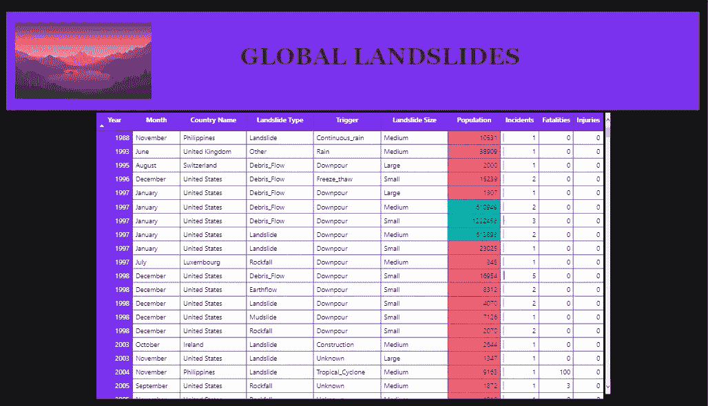
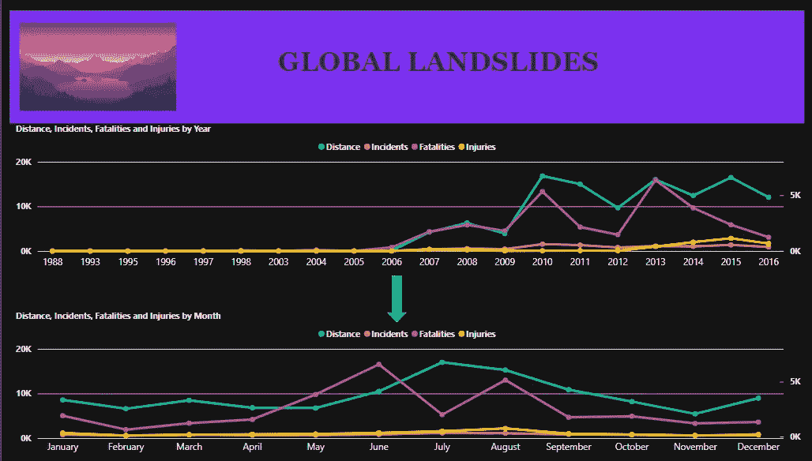
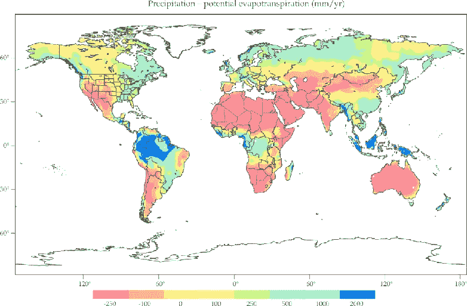
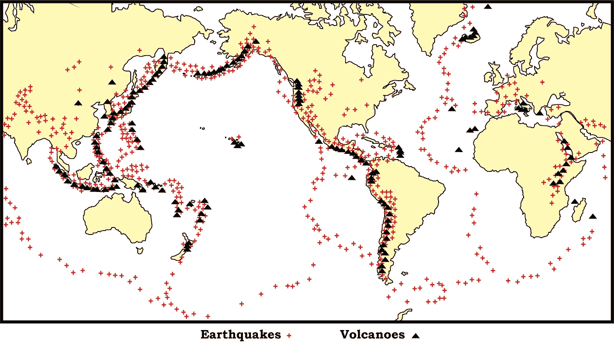
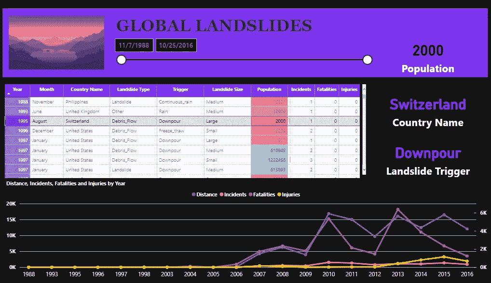
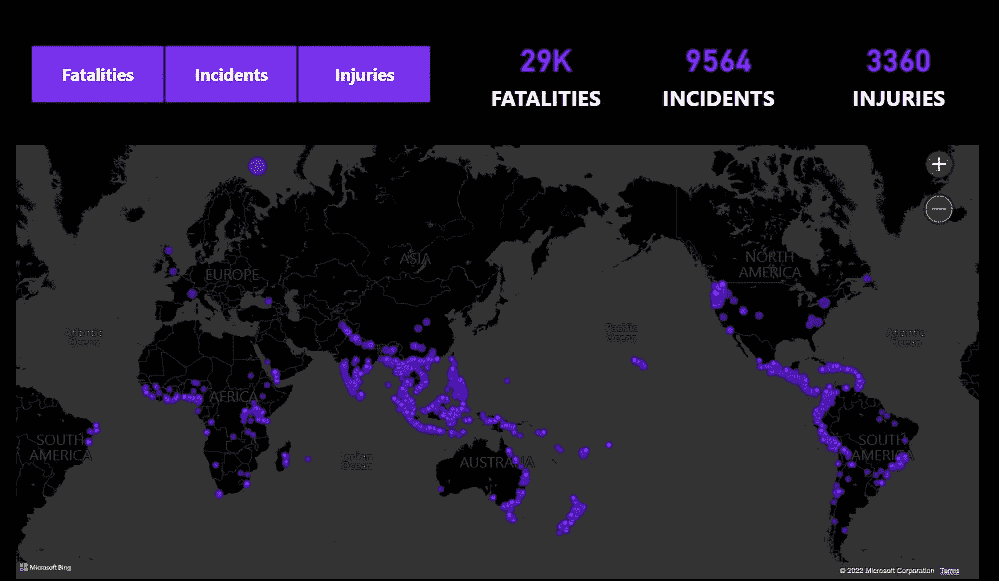

# 全球滑坡。解码。

> 原文：<https://medium.com/mlearning-ai/global-landslides-decoded-88cad535b52b?source=collection_archive---------4----------------------->

> 一个微弱的隆隆声，音量越来越大，这不是你邻居的孩子在大声放音乐，而是一场山崩向你家袭来。

滑坡可能会造成严重的破坏，影响个人和对社会至关重要的功能。今天，我们将看看全球山体滑坡的数据集，并尝试使用 Power Bi 对其进行分析。

首先，清理数据，删除所有不规则数据，删除空值，并将所有表分配到适当的数据类型，以避免任何错误，数据集已经非常干净，不需要任何大量的工作来清理数据。

因此，从可视化开始，让控制面板具有可读性和对可用数据有意义是非常重要的，以确保一切不只是塞在一个控制面板中，我们将在这里看到两个控制面板。

第一个仪表板主要有两个视觉效果，一个表格和一个图表。

FIG.1

正如你在上面看到的，可视化表格有 10 列，依次是*年、月、国家名称、滑坡类型、触发因素、滑坡规模、人口、事故、死亡人数、受伤人数*。如上所示的人口列是有条件地格式化的，按人口从最小(**红色**)到最大(**绿色**)排列。

继续，我们将看到图形视觉。

FIG.2

现在让我们弄清楚一些事情，最初控制面板中只有一个图表，您在上面看到的图表是供参考的，是从每年到每月的图表。

图表显示了按年度划分的*距离、事故、死亡和受伤情况，并向下钻取到月份。我们可以清楚地看到，无论距离多远，死亡率都会上升。*

稍后，当我们转到第二个仪表板时，这个仪表板更侧重于山体滑坡的位置，我们可以看到受影响最严重的地区是印度尼西亚、美国、南美和新西兰。

# **报表分析—**

我们的主要图像向我们展示了一幅清晰的画面，显示了哪里很有可能发生山体滑坡，以及该地区受滑坡影响的程度。虽然数据向我们展示了一切，但引起我注意的是热带气候或更温和气候的地区受影响最大。如果你看看像俄罗斯这样有极端气候条件的国家，就不会因为山体滑坡而遭受损失。

但是为什么呢？！答案是**降雨量**。我查了一下全世界的平均降雨量。看一看。

FIG.3

从上面，如果你看到突出显示的蓝色区域，并与我们的地图进行比较，你会得到为什么印度尼西亚和南美洲有滑坡群的答案，但不是这样。降雨是引发滑坡的首要原因，但另外两个原因是地震和火山。

下面的地图给出了一张非常清晰的图片，你可以看到南美海岸线周围的地带，日本周围的地区和新西兰周围的地区。

FIG.4

## **总结报告—**

FIG.5

FIG.6

将仪表盘和参考地图中的所有事实结合起来，有助于我们了解世界各地发生的山体滑坡，这些滑坡有一个强有力的原因和对*【为什么会发生】*的回答，以及支持我们答案的分析报告。

> 这就是这篇文章，我希望你喜欢它。如果您能分享这篇文章，并留下您的想法、建议和推荐，我将不胜感激，希望您能不断进步、学习和成长。
> 
> 直到下一次，

## 保持警惕。保持好奇。

## 再见

 [## Mlearning.ai 提交建议

### 如何成为 Mlearning.ai 上的作家

medium.com](/mlearning-ai/mlearning-ai-submission-suggestions-b51e2b130bfb)