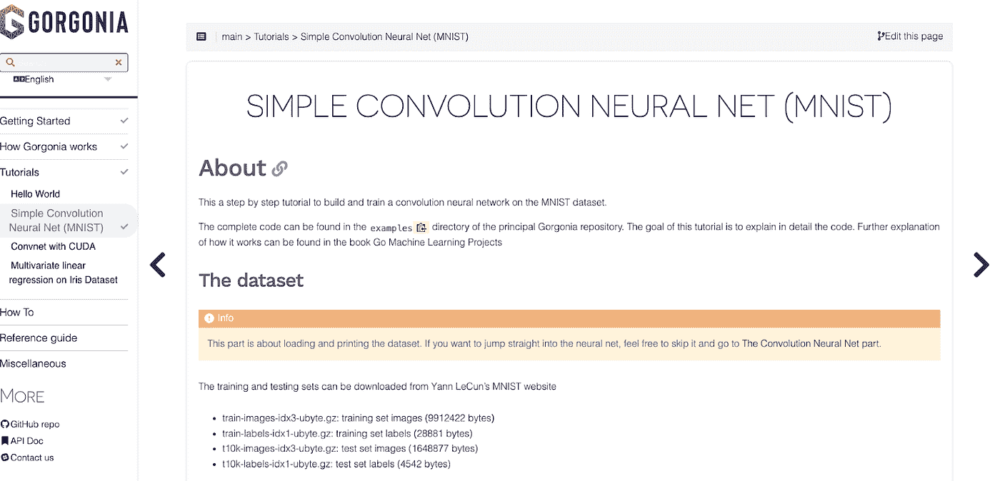

# go:2022 年对 AI 好？

> 原文：<https://medium.com/mlearning-ai/go-good-for-ai-in-2022-ad6bbd45afbd?source=collection_archive---------4----------------------->

编程语言 Go 近年来越来越受欢迎，这是由于它的简单性和对资源的有效利用，尤其是在 DevOps 社区中。但它的受欢迎程度是否使它成为未来几年人工智能(AI)发展的良好候选人？在这篇博客文章中，我们将分析使用 Go 进行人工智能开发的利弊，以帮助您为您的业务做出明智的决定。

# [围棋在 AI 方面的优势](https://amzn.to/3qcXSHI)

从好的方面来说，Go 是一种编译语言，这意味着它可以在多个平台上运行，而不需要特定于平台的编译器或解释器。对于希望开发可以在多种操作系统上运行的 AI 应用程序的企业来说，这是一大利好。此外，Go 是静态类型的，这使得向代码中引入错误更加困难。从长远来看，这可以节省你的时间和金钱，因为你不必花那么多时间调试你的代码。

在并行处理方面也有巨大的成功，因为 Go 的简单通道模型使得并行和并发执行工作变得容易。这转化为更有效的人工智能训练课程。

# [围棋人工智能的问题](https://amzn.to/3TGXJKl)

然而，不利的一面是， [Go](https://amzn.to/3TGXJKl) 是一种相对年轻的语言，它没有像 Python 这样的老语言那样得到 AI 社区的同等水平的支持，Python 有着非常受欢迎的 Tensorflow 库。这意味着你可能会更难找到在 Go 中开发 AI 应用的库和工具。此外，因为它是静态类型的，所以 Go 可能比 Python 之类的动态类型语言更冗长。这可能导致更长的开发时间和更大的代码库。

但是 Go 社区的情况正在发生变化，支持者也在增加。

# [柳珊瑚为围棋](https://github.com/gorgonia/gorgonia)

一个值得注意的项目是 Golang 的柳珊瑚。这个库有一个简单的界面，允许你轻松地开发和测试包。

它的工作方式类似于 Tensforflow 和 Theano(一个更老的前身)的[计算图模型。](https://gorgonia.org/about/computation-graph/)这允许您将方程表示为节点图，以便更容易地操作和可视化它们。

Gorgonia 的主要目标是在围棋社区使用机器学习时，比以往任何时候都更简单、更快。次要目标是什么？提供一个可探索的平台，不仅仅是简单地提供关于最佳实践如何在现代应用程序(如神经网络或深度信任算法)中工作的教程，还包括诸如使用 neo hebbian 估计值进行进化优化锁定权重等内容(等等)。

# [亲自尝试 Gogornia】](https://github.com/gorgonia/gorgonia)

目前在 github 仓库中有一个 bug 正在被追踪，但是一旦这个 bug 被修复，你应该可以在[的 Google CoLab 笔记本中运行 Gogornia。](https://colab.research.google.com/drive/1MmoQl5dsc39TSoNK3SM8iW_KEPOil23j?usp=sharing)

我将尝试简单的 [hello world 示例来开始。](https://github.com/gorgonia/gorgonia)

# 但这真的重要吗？

Photo by [Lala Azizli](https://unsplash.com/@lazizli?utm_source=medium&utm_medium=referral) on [Unsplash](https://unsplash.com?utm_source=medium&utm_medium=referral)

Tensorflow 已经用 C 编写，这意味着在训练模型和运行作业时，它不是一种快速的语言。然而，有很好的理由说明为什么人们希望他们的软件能够做两件事——从其他程序加载训练好的预测器，或者甚至只加载可视化权重而不将它们编译到程序本身中。

因此，相反，你应该在构建任何其他东西之前，集中精力确保无论什么解决方案适合这个法案，并且手头有所有相关的功能；比如有足够的内存管理能力，这样你就不会因为缺少内存而丢失任何数据。

我会继续关注问题列表和这个[子编辑，以了解更多关于 AI](https://www.reddit.com/r/golang/comments/anbjin/is_there_a_future_in_machine_learning_in_go/)Golang[的细节](https://amzn.to/3TGXJKl)。

并运行小实验来测量您的结果，以查看当使用 Golang 与 Python 训练您的模型时，您最终是否真的有所改进。[这本书有一些很棒的入门项目，可以帮助你进行测试。](https://amzn.to/3TGXJKl)

# 结论

那么，Go 是开发 AI 应用的好候选吗？看情况。如果你正在寻找一种具有跨平台支持和健壮类型系统的语言，那么 Go 可能是你的一个好选择。然而，如果您正在寻找一种具有更好的库支持和更快开发速度的语言，那么您可能想要考虑另一种语言，如 Python。最终，使用哪种语言的决定取决于您的特定需求和团队的需求。

这里有一个[很好的资源，可以帮助你在 GO](https://amzn.to/3TGXJKl) 中开始人工智能项目。

想要掌握 Golang 成为一个流行的人工智能工具吗？[点击这里查看这本伟大的书。](https://amzn.to/3qcXSHI)

 [## Mlearning.ai 提交建议

### 如何成为 Mlearning.ai 上的作家

medium.com](/mlearning-ai/mlearning-ai-submission-suggestions-b51e2b130bfb)