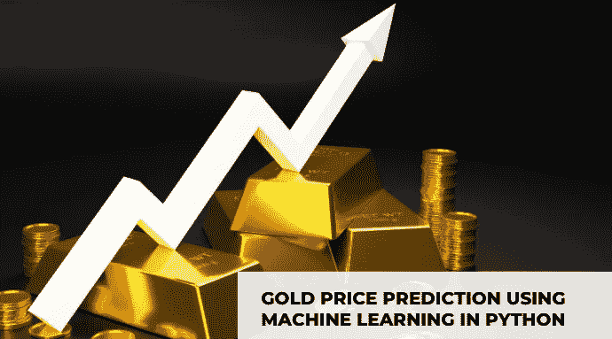
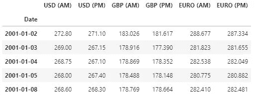
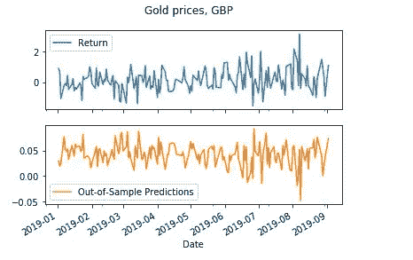
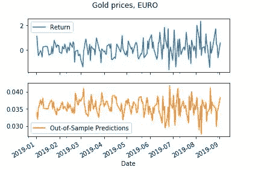

# 基于 Python 的机器学习的黄金价格预测

> 原文：<https://medium.com/mlearning-ai/gold-price-prediction-using-machine-learning-with-python-ec5c5e336713?source=collection_archive---------1----------------------->

老年人在每个国家的经济和人民中一直占有突出的地位。在这篇文章中，我将介绍用 Python 语言进行黄金价格预测的机器学习。

## 黄金价格预测

黄金价格历史性地飙升，在 2020 年达到 1800 美元的峰值。黄金面临的这些波动可以归因于在此期间发生的几个事件。股票价格与公共信息和世界事件密切相关，黄金也不例外。与其他金融资产不同，贵金属在危机时期表现积极。事实上，面对流行病、战争和经济混乱等事件，大多数资产都会经历价值下跌。然而，为了寻找掩护，投资者正把注意力转向黄金。因此，对黄色金属的需求增加，导致市场估值上升。当考虑投资组合多样化时，黄金往往被视为一种战略和战术投资资产。然而，经济和金融方面并不是影响黄金价格的唯一因素。地缘政治因素也可能影响黄金市场的估值。事实证明，面对地缘政治风险，黄金充当了避风港。事实上，在地缘政治和国际紧张局势造成威胁的时候，他会做出积极的反应。通过分析金融、地缘政治和全球自然灾害数据，可以预测黄金价格的未来波动，这将让投资者在面对意外波动时改善投资组合管理。的市场。

*在这一节，我将带你看一个用 Python 进行黄金价格预测的机器学习教程。我将通过导入必要的 Python 库和数据集来开始黄金价格预测的任务:*

现在做一些数据准备，使数据适合机器学习模型:

**线性回归算法:**

现在，我已经准备好了数据，以适应黄金价格预测任务的机器学习模型，下一步是选择机器学习算法。

然后把我从线性回归算法得到的金价预测结果画出来:

对于 ***、*** 欧元，我们可以按照下面的相同程序

**Gold price prediction of linear regression algorithm**

这篇文章是关于用 Python 进行黄金价格预测的机器学习。欢迎在评论区提出你有价值的问题。