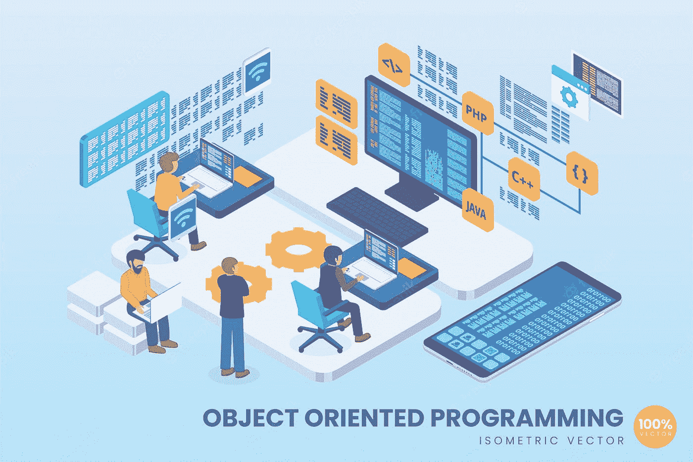

# 再见，面向对象编程:你好，函数式编程

> 原文：<https://medium.com/mlearning-ai/goodbye-object-oriented-programming-hello-functional-programming-b1e52bd75289?source=collection_archive---------4----------------------->

Image Source: FreeImages

在编程世界里，时尚来来去去。但是有些概念仍然存在——比如函数式编程。这是一种越来越受欢迎的编程范式，因为它能够减少错误，增加协作，并支持连续交付。

函数式编程已经存在了几十年。然而，直到最近…