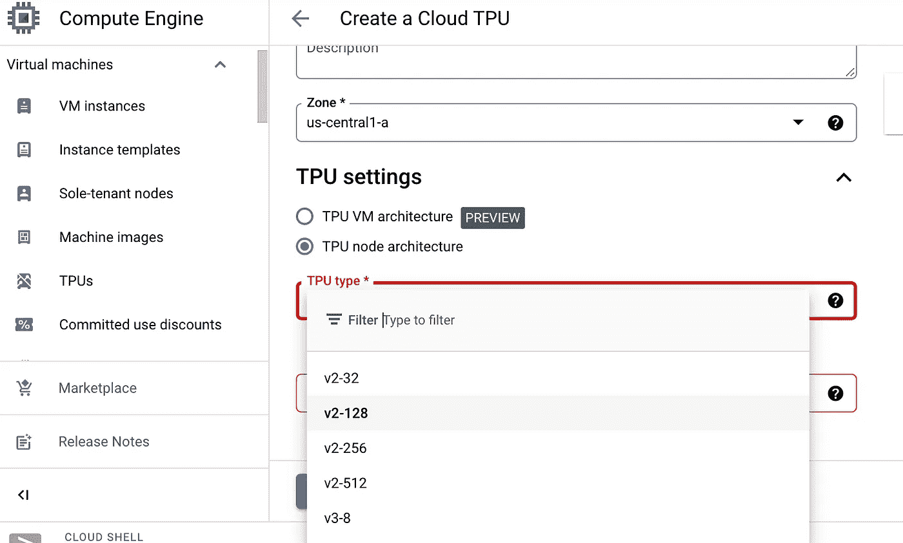
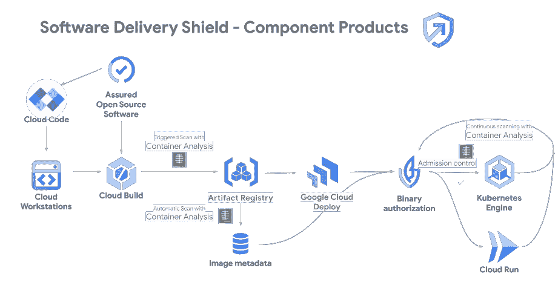

# 谷歌云下一个 2022 年摘要

> 原文：<https://medium.com/mlearning-ai/google-cloud-next-2022-digest-325db54680f7?source=collection_archive---------5----------------------->

## 新公告摘要

Google Cloud Next’22 于 10 月 11 日至 13 日举行。以下是我的摘要，其中包含背景信息，有助于理解(不包括 Google Docs、Meet、Chat 和 Voice 等协作云)已发布的内容。

 [## Google Cloud Next’22 总结| Google Cloud 博客

### 想更深入吗？以下是所有 123 个(！)我们本周发布的公告，都在一个地方。企业…

cloud.google.com](https://cloud.google.com/blog/topics/google-cloud-next/google-cloud-next22-wrap-up) 

# 计算

7. [TPU](https://cloud.google.com/tpu) ，是谷歌定制开发的硬件加速器，用于加速机器学习(尤其是深度学习)。启用“云 TPU API”后，您可以在“计算引擎”下创建 TPU

8.A100 GPU，A100 是新一代 nvidia GPU，甚至比 V100 性能更好，据 [nvidia 博客](https://developer.nvidia.com/blog/nvidia-ampere-architecture-in-depth/)和[对方](https://lambdalabs.com/blog/nvidia-a100-vs-v100-benchmarks/)

10.Google Batch，主要使用案例是[并行计算](https://www.youtube.com/watch?v=RS7UJhD4R48)，例如渲染、转码、基因组学&药物发现、风险建模

# 建立工作关系网

11–14.私人服务连接允许私人访问(使用内部 IP)Google API 和服务，或另一个 VPC 网络中的托管服务。更多的托管服务(Confluent、Databricks、Datastax、Grafana 和 Neo4J)正在启用“私有服务连接”(*需要消化或更多解释:私有服务通过互连连接(互连不是已经是私有访问了吗？)*)

15.C3 虚拟机系列采用 200 Gbps 网络，不支持 Azure VM 和 AWS EC2 的网络带宽

16.*网络功能优化器，需要消化或更多解释*

17–21.CDN ( [云 CDN](https://cloud.google.com/cdn) 和[媒体 CDN](https://cloud.google.com/media-cdn) 是为了让内容更贴近客户)，动态压缩以提高性能，支持主要视频流格式([DASH/HTT 动态自适应流& HLS/HTTP 直播流](https://blog.eleven-labs.com/en/video-live-dash-hls/))，[视频拼接 API](https://cloud.google.com/video-stitcher/docs) 以轻松将广告插入视频或直播流

22–23.[谷歌云防火墙](https://cloud.google.com/firewalls)是云原生防火墙服务，现在有两层:[云防火墙基础版和云防火墙标准版](https://cloud.google.com/firewalls#section-3)

24–27.[谷歌云盔甲](http://cloud.google.com/armor)是[谷歌云安全和身份](https://cloud.google.com/products/security-and-identity)解决方案的一部分，专注于保护应用程序和网站免受拒绝服务和网络攻击。[自适应保护](https://cloud.google.com/armor/docs/adaptive-protection-overview)动态检测异常活动，并使用机器学习模型生成签名，[行业趋势](https://www.ncbi.nlm.nih.gov/pmc/articles/PMC8791701/)

28–32.[网络情报中心](https://cloud.google.com/network-intelligence-center)是 Google Cloud 的网络可观察性、监控解决方案(*网络情报中心集成了推荐器 API 需要更多解释*)

# 混合和多云

33–35. [Anthos](https://cloud.google.com/anthos) 是管理 onprem、跨云(AWS、Azure)的混合多云解决方案。现在又在支持中加入虚拟机(像 [Azure arc](https://azure.microsoft.com/en-us/products/azure-arc/) )。[车队管理功能](https://cloud.google.com/anthos/fleet-management/docs)可用于不同的使用案例，例如生产/筹备/开发车队的分离，不同团队的车队

36.边缘计算是一个新的热门话题。[谷歌分布式云](https://cloud.google.com/distributed-cloud)是[谷歌云](https://medium.com/u/4f3f4ee0f977?source=post_page-----325db54680f7--------------------------------)对[这种需求的最新回答](https://cloud.google.com/blog/topics/hybrid-cloud/announcing-google-distributed-cloud-edge-and-hosted)，[计算在边缘但管理在云](https://www.forbes.com/sites/janakirammsv/2022/04/08/google-finally-gets-the-edge-computing-strategy-right-with-distributed-cloud-edge/?sh=57ba9e294a01)。

# 开发人员生产力

38–41.更多的原生容器应用程序开发是重点。[云运行](https://cloud.google.com/run)是一个[无服务器容器计算环境](https://cloud.google.com/blog/topics/developers-practitioners/cloud-run-story-serverless-containers)而不用担心底层机器。现在，它与[云部署](https://cloud.google.com/deploy)集成以实现持续部署，并支持与谷歌云服务的更多集成(例如，数据存储、身份、网络

# 开发者安全性

43–53.软件交付盾是伞式软件供应链安全解决方案，覆盖端到端软件开发生命周期，并与不同的谷歌云服务集成。组件包括:[云工作站](http://cloud.google.com/workstations)是 Google Cloud 上的全托管开发环境；为[云代码](https://cloud.google.com/code)(IDE 插件家族(如 VSCode、IntelliJ、PyCharm、GoLand))提供云代码源代码保护；在云工作站中支持多个[JetBrains IDE](https://assets.swoogo.com/uploads/2087860-633a59d5aedbf.pdf)；[保证 OSS](https://cloud.google.com/assured-open-source-software) 提供可信开源软件(OSS)包；[工件注册表](https://cloud.google.com/artifact-registry/docs/overview)使您能够存储、保护和管理您的构建工件，并且[容器分析](https://cloud.google.com/container-analysis/docs/container-analysis)主动检测工件注册表中工件的漏洞。它还增强了现有服务的安全性，如[云构建](https://cloud.google.com/software-supply-chain-security/docs/sds/build-view-security-insights)、[云运行](https://cloud.google.com/software-supply-chain-security/docs/sds/deploy-run-view-security-insights)、 [GKE](https://cloud.google.com/software-supply-chain-security/docs/sds/deploy-gke-view-security-insights) ，并将现有的([谷歌云部署](https://cloud.google.com/deploy/docs/overview)、[二进制授权](https://cloud.google.com/binary-authorization))谷歌云产品纳入旗下

# 管理和迁移工具

55.谷歌云提供[大型机现代化](https://cloud.google.com/solutions/mainframe-modernization)解决方案，包括[双运行](https://www.googlecloudpresscorner.com/2022-10-11-Google-Cloud-Launches-First-of-Its-Kind-Service-to-Simplify-Mainframe-Modernization-for-Customers-in-Financial-Services,-Retail,-Healthcare-and-Other-Industries)，支持在客户现有大型机和谷歌云上运行工作负载。一旦对两个系统的功能性能等效感到满意，新的谷歌云环境就可以成为客户的记录系统，而现有的大型机系统可以根据需要作为备份运行；[用于 BigQuery 和云存储的大型机连接器](https://cloud.google.com/blog/products/data-analytics/a-simple-way-to-migrate-mainframe-data-to-the-cloud)，帮助将数据从大型机轻松移动到 BigQuery 和云存储

56. [Workload Manager](https://cloud.google.com/workload-manager/docs/overview) ，在 Google Cloud 上提供企业系统的自动化分析，目前仅支持基于 SAP 的工作负载

57–58.[谷歌云碳足迹](https://cloud.google.com/carbon-footprint)，[碳排放量估算](https://cloud.google.com/blog/topics/sustainability/reduce-your-cloud-carbon-footprint-with-active-assist)两者透明以支持[可持续性](https://cloud.google.com/sustainability)

# AI 和 ML

59–61.围绕企业内容数字化的文档智能。[翻译中心](https://cloud.google.com/translation-hub/docs/overview)，这是一种自助式文档翻译服务，面向将大量文档翻译成多种不同语言的组织。它使用[云翻译 API](https://cloud.google.com/translate)；[文档人工智能](https://cloud.google.com/document-ai)解决方案套件包括用于数据提取的预训练模型，[文档人工智能工作台](https://cloud.google.com/document-ai-workbench)可以创建新的定制模型或升级现有模型；[文档人工智能仓库](https://cloud.google.com/document-warehouse/docs/overview)帮助企业存储、组织、搜索、治理和管理文档及其提取的数据和元数据

62. [Vertex AI Vision](https://cloud.google.com/vertex-ai-vision) 是一款低代码解决方案，用于构建具有拖放界面的计算机视觉应用

63. [OpenXLA 项目](https://github.com/openxla/xla)帮助[将](https://cloud.google.com/blog/products/ai-machine-learning/googles-open-source-momentum-openxla-new-partnerships)领先的机器学习框架(TensorFlow、PyTorch、JAX)连接到不同的硬件后端(GPU、CPU 和 ML 加速器)

# 数据分析

64–66.Lakehouse， [BigQuery](https://cloud.google.com/blog/products/data-analytics/building-most-open-data-cloud-all-data-all-source-any-platform) 支持分析非结构化和流数据，如原始文档和 pdf、视频和音频，甚至呼叫中心日志，使用 BigQuery 熟悉的 SQL 接口，轻松访问 Google Cloud 在 ML、语音识别、计算机视觉、翻译和文本处理方面的许多功能； [BigLake](https://cloud.google.com/biglake) 现在支持主要的数据格式:Apache Iceberg，Linux 基金会的 Delta Lake，以及即将推出的 Apache 胡迪；与 [BigQuery 和 Apache Spark](https://cloud.google.com/bigquery/docs/spark-procedures) 之间的集成覆盖了更多的场景，而 [SQL](https://airbyte.com/blog/sql-vs-python-data-analysis) 可能不是处理的最佳位置(像 [SnowPark](https://docs.snowflake.com/en/developer-guide/snowpark/index.html)

68. [Dataplex](https://cloud.google.com/dataplex) 是 Google 云数据目录解决方案，提供搜索和数据发现、数据质量和数据血统

# 商业智能

70–75.谷歌云的商业智能家族现在整合在 Looker 保护伞下， [Looker Studio](https://cloud.google.com/looker-studio) (以前的数据工作室)，支持 [Looker 数据模型](https://www.looker.com/platform/data-modeling/?_ga=2.16069808.-701115563.1666105241)， [Looker Studio Pro](https://cloud.google.com/looker-studio#section-5) ，[集成到谷歌工作空间](https://cloud.google.com/blog/products/data-analytics/looker-next-evolution-business-intelligence-data-studio)

# 数据库

77.随着我们从批处理过渡到流平台，CDC 是一个热门领域。事务性数据库正在增加更改流:例如，云 Bigtable 更改流、[云扳手更改流](https://cloud.google.com/spanner/docs/change-streams)、[数据流](https://cloud.google.com/datastream)用于访问来自 MySQL、PostgreSQL、AlloyDB 和 Oracle 数据库的流式低延迟数据

80.[将 Vertex AI 与 Spanner](https://cloud.google.com/spanner/docs/ml) 集成，使得 Spanner 中的 SQL 语句能够调用 Vertex AI 中的机器学习模型

81–83. [Firestore](https://firebase.google.com/docs/firestore) 改进，例如取消了对写入吞吐量和并发活动连接的限制；成本有效、可扩展、计数聚合；[Firestore 中用于自动删除过期文档的生存时间(TTL)](https://cloud.google.com/firestore/docs/ttl)

# 网络安全

84.[Chronicle Security Operations](https://cloud.google.com/blog/products/identity-security/introducing-chronicle-security-operations)(包含 [Chronicle SIEM](https://cloud.google.com/solutions/security-information-event-management) 、 [Chronicle SOAR](https://cloud.google.com/solutions/security-orchestration-automation-response) 和 Threat Intelligence)是一个现代化的云原生套件，可以更好地帮助网络安全团队检测、调查和应对威胁。

85.[机密空间](https://cloud.google.com/blog/products/identity-security/announcing-confidential-space)在[机密计算](https://cloud.google.com/confidential-computing)文件夹中(其他还有[机密虚拟机](https://cloud.google.com/compute/confidential-vm/docs/about-cvm)、[机密 GKE](https://cloud.google.com/blog/products/identity-security/announcing-general-availability-of-confidential-gke-nodes) 、[机密数据面板](https://cloud.google.com/dataproc/docs/concepts/configuring-clusters/confidential-compute))。组织可以从聚合和分析敏感数据中获得共同的价值，同时保持数据的机密性和对数据的完全控制。

87. [Foreseeti Security](https://foreseeti.com/) 集成到[安全指挥中心](https://cloud.google.com/security-command-center)有助于在攻击者利用高风险漏洞之前实施有针对性的补救措施

89–90.零信任。 [BeyondCorp Enterprise](https://cloud.google.com/beyondcorp-enterprise) 是 [Google Cloud](https://medium.com/u/4f3f4ee0f977?source=post_page-----325db54680f7--------------------------------) 对[零信任](https://cloud.google.com/blog/topics/developers-practitioners/zero-trust-and-beyondcorp-google-cloud)解决方案的实施，能够实现对应用和资源的安全访问，并提供集成的威胁和数据保护。[网络安全行动小组](https://cloud.google.com/security/gcat)和精选合作伙伴可以帮助引导您完成零信任之旅

 [## Mlearning.ai 提交建议

### 如何成为 Mlearning.ai 上的作家

medium.com](/mlearning-ai/mlearning-ai-submission-suggestions-b51e2b130bfb) 

# 低代码/无代码

有意思，这个热门区域没有公告。谷歌云确实有一个名为 [AppSheet](https://cloud.google.com/appsheet) 的解决方案。

# 附录

 [## 2022 年谷歌云的关键要点

### 随着重要产品的发布，Google Cloud Next 2022 展示了该公司不断扩大的客户群和…

medium.com](/vedcraft/key-takeaways-from-google-cloud-next-2022-cfed44f8e68b) 

主题:网络安全/安全解决方案、开发人员生产力、多重云、数据/人工智能/ML、可持续发展、Web 3.0