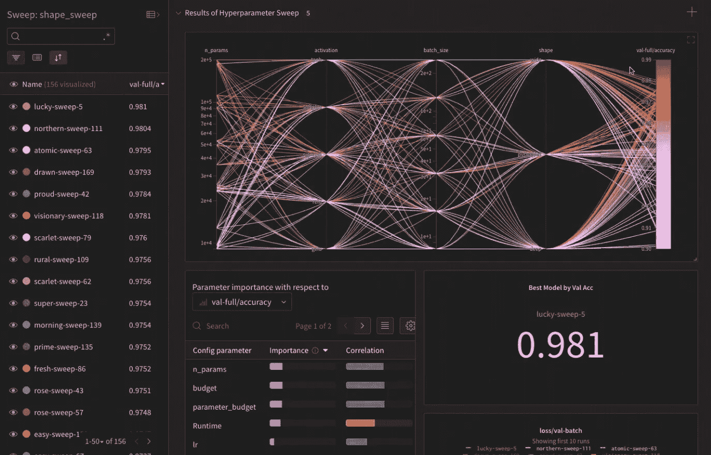

# Google Colab 安装 Google Drive 并连接重量和偏差，以跟踪模型训练进度(酷 TensorBoard 替代方案)

> 原文：<https://medium.com/mlearning-ai/google-colab-mount-google-drive-and-connect-with-weights-and-biases-to-track-model-training-79d2fb675ebe?source=collection_archive---------5----------------------->

我使用 Google Colab，因为它提供了一个免费的 GPU，而且它很容易连接到你的 google drive。感觉又多了一台电脑。但是当我打开 Jupyter 笔记本时，我的 TensorBoard 代码不起作用。这是因为 TensorBoard 在本地运行，而我的 Colab…