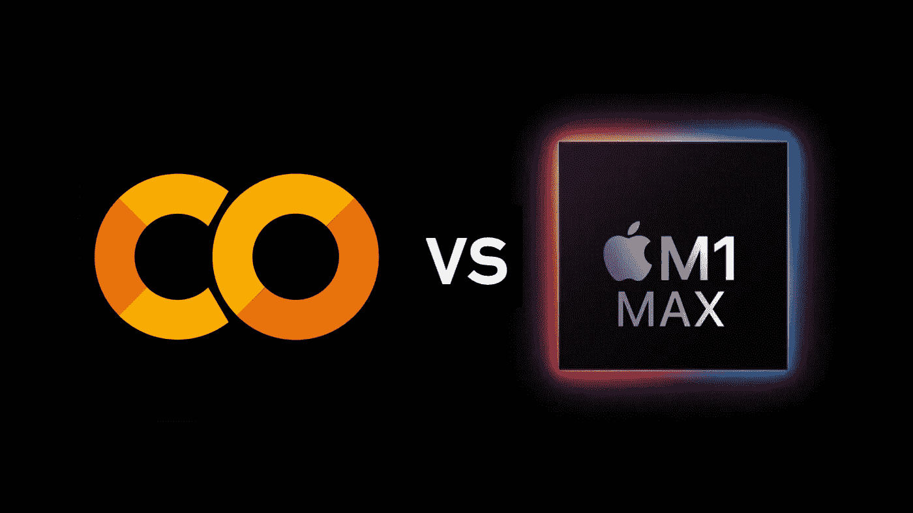

# 谷歌 Colab Pro Vs MacBook Pro M1 Max 24 核心

> 原文：<https://medium.com/mlearning-ai/google-colab-pro-vs-macbook-pro-m1-max-24-core-28a84553f512?source=collection_archive---------0----------------------->

## 比较 ML 任务的性能和易用性

新款 MacBook Pros 给人们带来了希望，特别是在机器学习社区，有时拥有大量数据的神经网络现在可以在笔记本电脑上进行本地训练。

他们一放出来，我就很好奇他们在铲球上的表现…